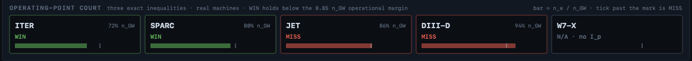

# Affine Fusion Control — the plasma operating-point verdict a safety authority can re-derive by hand

**Page class: PUBLIC CASE.** Every figure below is either printed by a program in `reproduce/` or stated on the linked study/results pages, and carries its grade inline per [the ontology](Ontology). Read the limits section first.

A float machine-learning surrogate returns a confident actuation for **any** plasma state — including the off-distribution states where disruptions actually live — and cannot tell you which of its answers it was entitled to give. Affine Fusion Control is a compiled Swift 6.4 macOS application that does the opposite: it returns an exact-integer verdict **only where it has one**, and names its refusal everywhere else. Point it at a currentless stellarator and it does not invent a density limit — it returns `NOT_APPLICABLE_NO_PLASMA_CURRENT`, because a machine with no plasma current has no Greenwald limit to place. That refusal is the product. The verdict is an integer a safety authority can re-derive after an incident, not a black box no one can audit — and the same input yields the same integer on every machine, forever.

---

## The thesis — an invariant, not a trained surrogate

The accepted instrument for real-time disruption avoidance is a float ML surrogate trained on offline supercomputer runs. It is confident everywhere. Ask it about a state it never saw and it extrapolates — smoothly, plausibly, and without a flag. Where a currentless machine's Greenwald denominator goes to zero, it divides and keeps going.

This law does not. It is an **invariant** approach:

- Where the inputs are admissible and in range, it returns an exact verdict — `WIN` or `MISS`, with the binding branch named.
- Where the physics has no answer to give (no plasma current → no Greenwald limit), it returns a **named refusal**, not a number.
- Where the answer sits closer to a threshold than π itself is known, it returns `NOT_MEASURED_PI_BRACKET` rather than picking a value.

That is the move the whole wiki argues, stated on [The full-grade replacement](The-Replacement-Grade) **REPORTED**:

> in each vertical the replacement moves the *authority over the verdict* from the vendor to the public. That is what "lasting benefit for the local population" means in practice — not a cheaper service, but a verdict their own regulator, their own engineer, their own researcher can re-derive without permission.

The argument's headline, the same page **REPORTED**: **"An industry whose verdicts cannot be re-derived by its consumers accumulates unreconcilable disagreement at the rate of its own growth."** Exactness is what makes re-derivation possible — exact integers and rationals, no float, are byte-identical across nine independent machines where IEEE-754 is not: the difference, as [Home](Home) puts it, "between evidence and testimony" **REPORTED**.

---

## What you can hold today

A five-panel court, both laws live, on one laptop **VERIFIED** (`FusionCourtView.swift`). The five panels are `LawPanel`, `VerdictWall`, `CadencePanel`, `OperatingPointPanel` and `ChannelScope`. The UI computes nothing it displays: it reads a published snapshot at 60 Hz, and every verdict shown was computed on the control thread **VERIFIED** (`FusionCourtView.swift`).


### Court 1 — the streaming disruption law

65,536 agents on a 1 kHz control tick (a 1,000,000 ns period), a 400 µs compute budget, a 256-sample window **VERIFIED** (`main.swift`). The law is the **only verdict function** in the streaming programme, using only integer `abs`, subtract, compare and a run counter — **no multiply, no divide, no allocation, no floating point** — and it returns one of four terminals, all proven reachable by a test asserting four distinct verdicts appear **VERIFIED** (`Law.swift`, `Verdict.swift`, `ConformanceVectors.swift`):

`NOMINAL` · `MITIGATE` · `REFUSED_OUT_OF_ENVELOPE` · `REFUSED_MALFORMED`


*The wall above is one illustrative frame of the moving demo (NOMINAL 54,272 · MITIGATE 8,192 · REFUSED-envelope 2,048 · REFUSED-malformed 1,024, summing to 65,536 — **MEASURED**, `Affine-Fusion-Control.md:22`). The bands are the demo's synthetic channel classes; a real feed produces whatever the sensors do. It is a screenshot, not a fixed reproduce output — there is no re-measure command for these four counts.*

### Court 2 — the operating-point court

Three exact integer inequalities — Greenwald density, Troyon β, q_min — with five terminals, all proven reachable **VERIFIED** (`FusionOperatingPointLaw.swift`, `CourtTerminals.swift`):

`WIN` · `MISS` · `NOT_APPLICABLE_NO_PLASMA_CURRENT` · `NOT_MEASURED_PI_BRACKET` · `REFUSED_NONPHYSICAL`



*This frame reads ITER 72% WIN · SPARC 80% WIN · JET 86% MISS · DIII-D 94% MISS · W7-X N/A (**MEASURED**, `Affine-Fusion-Control.md:27`). These percentages are the demo's channel classes on a single moving frame — a shared drift walks the machines across the 0.85 line — not a stable reproduce-script result, and carry no re-measure command. The **W7-X N/A tile carries the thesis**: a currentless stellarator returns `NOT_APPLICABLE_NO_PLASMA_CURRENT` permanently, no matter where the band drifts, because there is no Greenwald limit to place. That tile never moves — where a surrogate divides by ≈0 and extrapolates, this law names what it cannot determine. The durable, script-pinned machine result is the geometry table below.*

Unlike the streaming law, this court **multiplies** — the Greenwald cross-product — in Swift 6.4 native `Int128`. "No multiply, no divide" is scoped to the streaming disruption law alone, never to the whole system.

---

## The exact law

The streaming envelope is exact-integer and 14-bit-ADC-scoped; the disruption constants are illustrative and frozen for demonstration, and a real deployment re-freezes against its own device **VERIFIED** (`LawConstants.swift`):

| constant | value |
|---|---|
| ADC domain | `adcMin −8192 … adcMax 8191` |
| envelope (absolute) | `envelopeAbs 6000` |
| growth window / trigger / persist | `8 / 900 / 3` |

The operating-point court's three inequalities are exact **VERIFIED** (`FusionOperatingPointLaw.swift`):

| inequality | exact form |
|---|---|
| Greenwald density | `100·ne·a²·pi_num < 85·Ip·1e6·pi_den` |
| Troyon beta | `beta_N ×1000 ≤ 2380` (0.85 × 2.8) |
| q_min | `q_min ×1000 ≥ 2000` |

π is handled exactly by bracketing with two rationals, **333/106 (low) < π < 355/113 (high)**, ~2.7×10⁻⁷ wide; when both brackets agree the verdict is reported π-independent, and when a point sits on the Greenwald limit to within π itself (e.g. `ne=27057, Ip=400 kA, a=2000 mm`) the court returns `NOT_MEASURED_PI_BRACKET` rather than picking a value **VERIFIED**. The Greenwald product reaches ~1.42×10¹⁹ at a 20 m minor radius — past `Int64`, inside `Int128` (128 axis bits, 16 bytes, 1.8447×10¹⁹× the headroom of `Int64`) with room to spare — so there is no BigInt escalation; a genuine `Int128` overflow **refuses** rather than wrapping, via `multipliedReportingOverflow` **VERIFIED** (`FusionOperatingPointLaw.swift`, `LatticeCoordinate.swift`).

All five operating-point terminals are reachable, `COURT TERMINALS REACHED: 5 of 5` **VERIFIED**, over 11 tests **MEASURED** (`Affine-Fusion-Control.md:60-71`).

---

## The measured evidence

Every figure below is printed by a program in `reproduce/` and, where marked **VERIFIED**, pinned by digest in `reproduce/validate.sh`. The direction of flow is one-way: no number appears here that a program does not print. A number no program prints is not reproducible, and the harness says so.

### Real published machine geometries — graded from two public numbers each

The court places each Greenwald boundary on the machine's **published geometry**, using only the published plasma current and minor radius. It makes no claim about any machine's actual shot-specific operating density.

| Machine | Published Ip / minor radius (REPORTED) | Exact Greenwald limit, 1e14 units | Grade of the number |
|---|---|---|---|
| ITER | 15 MA / 2.0 m | `1193661` (= 1.19×10²⁰ m⁻³) | **VERIFIED** (harness-pinned) |
| SPARC | 8.7 MA / 0.57 m | `8523532` (= 8.52×10²⁰ m⁻³) | **MEASURED** |
| JET | 4.8 MA / 1.25 m | `977847` (= 0.98×10²⁰ m⁻³) | **MEASURED** |
| DIII-D | 2.0 MA / 0.67 m | `1418177` (= 1.42×10²⁰ m⁻³) | **MEASURED** |
| W7-X | currentless / 0.53 m | refused — no limit to place | **VERIFIED** |

Whole-table result: `REAL-MACHINE GEOMETRY GRADED: 4 WIN / 4 MISS-greenwald / 1 NOT_APPLICABLE` **VERIFIED**. The (Ip, a) pairs are **REPORTED** from iter.org, Creely et al. 2020, EUROfusion, General Atomics, and IPP Greifswald.

### The streaming disruption court

| Claim | Figure | Grade |
|---|---|---|
| First MITIGATE verdict returns before the envelope breach | `FIRST MITIGATE at sample 7016` (synthetic trace, shot = 12,000 samples at 2 MHz) | **VERIFIED** |
| Warning lead between MITIGATE and envelope breach | `warning lead 140 µs` | **VERIFIED** |
| Control-arm study, five arms over five inputs, four terminals | `5 of 5 arms hold` | **VERIFIED** |
| Growing-tearing-mode arm trips at the pinned index/peak | `idx=208 peak=960` | **VERIFIED** |
| Admissible-but-out-of-range point refuses | `REFUSED_OUT_OF_ENVELOPE` | **VERIFIED** |

The refusal ordering is itself a rule the court enforces: not-admissible-data (`REFUSED_MALFORMED`) dominates admissible-data-out-of-range (`REFUSED_OUT_OF_ENVELOPE`) **REPORTED** (`Fusion-Researchers-Guide.md:86`).

### Topology-agnostic — the verdict moves only on physics

The same operating envelope, graded across three genuinely different reactor mesh layouts, returns a byte-identical verdict signature. The layout differs; the verdict does not — until a physics input changes (Ip 15 MA → 0 flips `WIN` → `NOT_APPLICABLE`).

| Topology | periods | toroidal circuit | Nodes / edges (MEASURED) |
|---|---|---|---|
| Tokamak | 1 | yes | 512 / 1,504 |
| Stellarator | 5 | yes | 2,560 / 7,520 |
| Spheromak | 1 | no | 481 / 960 |

`all three signatures byte-identical: true` **VERIFIED**. Negative control: the simply-connected spheromak emits zero toroidal-closure edges — `spheromak toroidal-closure edges == 0: true` **VERIFIED** — and the check prints `FAIL` if that count is ever > 0.

### Determinism — the same bytes on every machine

A single sha256 over ~2,992 verdicts (400 streaming traces plus a 2,592-point operating-point grid — corpus size **MEASURED** at `fusion-determinism-digest.swift`; the digest itself is harness-pinned) is identical on every machine:

```
f49b576e073835bcab17bee10fe0eee1938774643d900b8ffe1a583b159ab3d7
```

**VERIFIED** (`reproduce/validate.sh:126`). Two harness-pinned booleans stand alongside it: `HEADROOM_EXCEEDS_50X TRUE` and `VERDICT_DETERMINISTIC_10K TRUE` **VERIFIED**.

### One law, one home

When Study 33 first shipped, the streaming verdict law existed in three separate Swift files that did not agree — `fusion-control-exact-law.swift`, `fusion-control-benchmark.swift`, and `fusion-verdict-stream.swift`. On an input window too short to carry the growth comparison, two copies returned `REFUSED_MALFORMED` and the third (`fusion-verdict-stream.swift`) returned `NOMINAL` — and that most-permissive copy was the one that had drawn the published verdict stream. A refusal had silently become a pass. A digest check would have caught none of it: each fork was a deliberate edit, not accidental drift. (The 140 µs warning lead, the 5-of-5 control arms, and every benchmark figure survived the repair unchanged, because the benchmarked trace held no short windows and no malformed values, so all three copies agreed on it.)

The law now has exactly one home — `app/FusionCourt/Sources/FusionLaw/` — and every program compiles against it multi-file rather than restating it. The frozen semantics take the strictest of the three prior behaviours: malformed scan over the whole window first; input shorter than the growth window is `REFUSED_MALFORMED`, never `NOMINAL`; both firstTrip and peakGrowth are returned. A gate, `one-law-one-home.sh`, refuses any law constant defined outside its home and carries a control arm proving it fires on a planted definition and stays silent on prose. It was red on all three files when written; it is green now **VERIFIED**.

### It holds its clock and cold-starts under budget

| Self-check | Result | Grade |
|---|---|---|
| Clock | 9,999 ticks in 10 s, 0 skipped, 0 gaps (refuses on any skipped tick) | **MEASURED** |
| Cold start | exec-to-exit well under 250 ms, timed by the app's own Swift clock, no python, no external timer | **MEASURED** |
| Lattice | 128-bit axis, 6 ingest lanes (magnetic_probe, ece, neutron_camera, interferometer, thomson_scattering, bolometer) | **MEASURED** |

### Grade a point by hand — all-integer in, exact-integer out

```
.build/release/FusionCourt --grade ne14=1000000 ipAmp=15000000 aMm=2000 betaNMilli=1800 qMinMilli=3000
  → verdict: WIN   pi-independent: true   exact path: int128
```

**MEASURED** (`Fusion-Researchers-Guide.md:44-49`). Encodings: `ne14` = n_e / 10¹⁴ m⁻³, `ipAmp` = amperes, `aMm` = minor radius in mm, `betaNMilli` = β_N ×1000, `qMinMilli` = q_min ×1000. Drop `ipAmp` to 0 and the same call returns `NOT_APPLICABLE_NO_PLASMA_CURRENT` — the thesis case in one command, where a surrogate would divide by ~0 and extrapolate. Pushing density up returns `MISS with binding branch: greenwald`.

---

## Zero float, zero heap, Int128 — how it stays exact

- **Zero float on the law path** **VERIFIED**: `no-float-outside-render.sh` scans the five exact-integer targets (FusionLaw, FusionLattice, FusionAffine, FusionClock, FusionOperatingPoint) for `Float`/`Double`/`CGFloat`. Only `FusionCourtApp` is exempt, one-way, at the SwiftUI/GPU drawing boundary — and that exemption is stated, not silently skipped.
- **Zero heap on the hot path** **VERIFIED**: an agent is a 32-byte `@frozen` struct in a buffer (not an actor), the scratch buffer is allocated once at init, and no per-tick allocation happens inside `tick()`; a test asserts the 32-byte layout.
- **Overflow traps are the safety property** **VERIFIED**: the manifest (`swift-tools-version: 6.4`, `platforms: [.macOS(.v26)]`) declares no `unsafeFlags` and no `-Ounchecked` — a genuine `Int128` overflow refuses rather than wrapping.
- **Six products, one shared law** **VERIFIED**: the package builds the FusionCourt executable plus five libraries; the `FusionLaw` target has zero dependencies so a substrate court can share it.
- **The browser client's palette is proven identical to the Swift RGB** every build by `palette-parity.sh` (`PALETTE_PARITY_PROVEN`): nominal `#3fb950`, mitigate `#e3b341`, refused `#f85149` **VERIFIED**.

---

## The published negative — the GPU loses on this law

On this branchy, no-multiply, exact-integer streaming law, a Metal GPU round-trip **never beats the CPU up to one million agents** — roughly **2× slower at every scale** — while staying **bit-for-bit correct the whole way**. Its loss is a speed result, never a correctness one, and this negative is published on purpose.

Measured 2026-09-02 on one M4 Max (40 GPU cores), one representative run — one thread, one channel, synthetic trace. The **~2× factor and "GPU never wins to 1M agents" are the durable claims**; the exact microseconds are machine-specific and vary run to run **MEASURED** (`CROSSOVER.md:5-24`):

| agents | CPU (12-core) | GPU round-trip | parity | winner |
|---:|---:|---:|:--:|:--:|
| 4,096 | 232 µs | 1,037 µs | BIT-EXACT | CPU |
| 16,384 | 541 µs | 1,641 µs | BIT-EXACT | CPU |
| 65,536 | 1,966 µs | 4,349 µs | BIT-EXACT | CPU |
| 262,144 | 7,479 µs | 15,072 µs | BIT-EXACT | CPU |
| 1,048,576 | 29,301 µs | 58,969 µs | BIT-EXACT | CPU |

The GPU loses because a kernel launch is a fixed ~1 ms of encode + dispatch + read-back, and the law has no multiply for float lanes to accelerate **REPORTED**. Parity is not merely measured — it is a build-time test (`FusionGPUTests`): the GPU verdict must equal the CPU golden bit-for-bit across a corpus reaching at least three terminals, or the build fails **VERIFIED** (`GPUParity.swift`).

Two earlier benchmark runs flattered the GPU and are kept in the record as the instrument-error story, not as results: Run 1 charged the CPU 72 ms against the law's real 128 µs at 65,536 agents (560× the law's cost, all of it allocation the GPU never paid) and wrongly said the GPU wins everywhere; Run 2 put the crossover at 16k because the CPU arm allocated a fresh `[Int32]` per agent. Only the instrument-corrected Run 3 — same flat input both sides, single law fed bit-exactly, one reused scratch buffer per slab (12 total, not N) — is the published result. The full account is in `app/FusionCourt/CROSSOVER.md`, and the incremental-vs-batch test that guards it already caught one precedence inversion where 64 of 64 agents disagreed.

---

## The limits — a court states its own

- **The GPU loses on this law** (~2× slower to 1M agents). A real, deliberately-published negative, scoped to this branchy exact-integer law — not a general claim that CPU beats GPU, and not a correctness knock: parity is bit-exact and build-enforced. **MEASURED**
- **τ_E (energy-confinement time) and fusion gain Q are `NOT_KNOWN` — by design.** IPB98 scaling carries fractional exponents that are not exactly representable, so nothing in this programme computes them. **The three inequalities — Greenwald density, Troyon beta, q_min — are a safety floor, never a performance or gain claim.** A headline "Q = 1.8" traces to an input fixture parameter (`beta_normalized=1.8`), not a computed output. **NOT_KNOWN**
- **This court operates no reactor.** Every streaming trace is synthetic; every operating point is presented. There is no actuation and no I/O to a machine. The only real numbers on the page are the five machines' **published** Ip and minor radius. The disruption thresholds are illustrative and frozen for demonstration. **REPORTED**
- **The verdict-wall counts and operating-point percentages are one demo frame**, not a stable reproduce-script output — a shared drift walks the machines across the line. No re-measure command is offered for them.
- **The study is `PENDING`.** The proven-marker reads `STUDY33_FUSION_CONTROL_VERDICT_PENDING` and the flourishing identity `entropy_bare − entropy_delta = entropy_resolved` does not yet resolve to `1/1` (only one of four verdict links is made exact). The comparator framework it is graded against has run on five real experiments; this programme on none. That losing row is stated, not hidden. **VERIFIED**
- **Mac-only, no LICENSE.** Requires Swift 6.4 (macOS 26+); no MCP, no network, nothing on the control hot path. No Python, no Node, no package manager, no GPU toolchain — the Metal library ships pre-compiled and sha256-digest-pinned (`bd055be2…`) with its `.metal` source alongside, and a GPU-less machine skips only the GPU-parity arm. The source is visible in the public studies repo with **no LICENSE** — source visible is not rights granted, and this local build is deliberately not the one that ships to the Affine.Earth cells. **REPORTED**

---

## Reproduce it yourself

No account. No key. No permission needed from anyone.

```bash
git clone https://github.com/gaiaftcl-sudo/uum8dSolarResearch.git
cd uum8dSolarResearch

# re-derive every published figure from source (from repo root)
bash reproduce/validate.sh

# build and run the app — five panels, both courts live at 65,536 agents / 1 kHz
cd app/FusionCourt
swift build -c release          # ~10 s cold, zero warnings; swift test = 27 tests across 4 suites
./verify-all.sh                 # clean build, tests, 7 self-testing gates, self-checks, figure harness → VERIFY_ALL_PROVEN
.build/release/FusionCourt

# grade a presented operating point — all-integer inputs, exact-integer verdict:
.build/release/FusionCourt --grade ne14=1000000 ipAmp=15000000 aMm=2000 betaNMilli=1800 qMinMilli=3000
#   → verdict: WIN   pi-independent: true   exact path: int128

# drive the refusal directly — a currentless machine has no Greenwald limit:
.build/release/FusionCourt --grade ne14=1000000 ipAmp=0 aMm=2000 betaNMilli=1800 qMinMilli=3000
#   → NOT_APPLICABLE_NO_PLASMA_CURRENT
```

The `verify-all.sh` command runs five steps in one pass and prints `VERIFY_ALL_PROVEN` only when all pass; it stops at the first failure. The app also self-checks with its own Swift clock — no Python, no external timer: `--selftest-clock` (9,999 ticks in 10 s, 0 skipped, 0 gaps), `--selftest-lattice` (128-bit axis, 6 ingest lanes), `--selftest-coldstart` (exec-to-exit under 250 ms), `--selftest-crossover` (4k–1M, bit-exact parity at each N, CPU wins throughout; skips gracefully with no Metal device).

---

## Related

- [Affine Fusion Control](Affine-Fusion-Control) — the study page
- [Fusion researcher's guide](Fusion-Researchers-Guide) — get it, run it, attack it
- [Study 33 — the fusion control verdict court](Study-33-Fusion-Control-Verdict-Court) — the charter, and the three-way fork it retired
- [The full-grade replacement](The-Replacement-Grade) — the vendor-to-public argument across 49 domains
- [Ontology](Ontology) — the evidence grades and the one-way-flow rule this page obeys