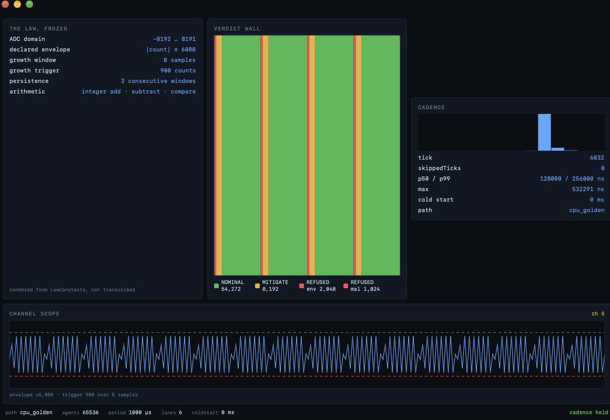
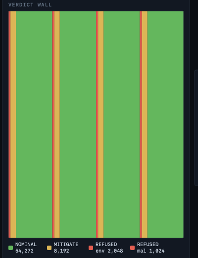

# Affine Fusion Control — the local, exact, floating-point-free disruption court

**Page class: STUDY (app realization of [Study 33](Study-33-Fusion-Control-Verdict-Court)).** Every figure below is produced by a program in `reproduce/` or by the app itself, dated where it is a timing. Grades per [the ontology](Ontology): **MEASURED**, **PROJECTION**, **REPORTED**, **NOT_KNOWN**. Read the limits section first — it says exactly what this is and is not.

---

## What this is, in one honest paragraph

A fully-compiled **Swift 6.4 macOS app** that grades a fusion reactor's telemetry against a frozen, exact-integer disruption law — **no floating point, no network, no model, no GPU on the decision path, no slow start**. It runs 65,536 agents on a 1 kHz control clock on one laptop. It is **not** connected to a reactor and holds **no real machine data**; it grades *presented* telemetry and *presented* operating points. What it demonstrates is an architecture: a control verdict that is an exact integer a third party can re-derive, in a domain the industry currently settles with floating-point surrogates that return a confident number for every input including the ones they were never trained on.

## What you can hold

**The app, running — 65,536 agents at 1 kHz, four panels, all four verdicts live:**



- **THE LAW, FROZEN** — the six constants, *rendered from the law's own source, not transcribed into the view*. The panel's own footer says so. This is the app's claim to being a court rather than a dashboard.
- **VERDICT WALL** — every agent as one cell, coloured by terminal (NOMINAL green, MITIGATE amber, REFUSED red). The instrument is visibly **discriminating** — four distinct verdicts on screen at once, not one alarm:

  

  In this shot: NOMINAL 54,272 · MITIGATE 8,192 · REFUSED-envelope 2,048 · REFUSED-malformed 1,024 (sums to 65,536). The regular bands are the demo's channel classes; a real feed produces whatever the sensors do.
- **CADENCE** — the panel where the app tells on itself: the latency histogram, `skippedTicks`, p50/p99. Red the instant a deadline is missed.
- **CHANNEL SCOPE** — one channel's window against the ±6000 envelope and the growth trigger.

The colours match the browser client in `clients/fusion-court/` — the two live in different languages (Swift RGB, HTML hex), so a gate (`Tools/palette-parity.sh`, `PALETTE_PARITY_PROVEN`) checks every build that they still agree. The claim that they cannot drift is enforced, not remembered.

---

## The law — three ways it can refuse, and why refusal is the point

The disruption law is `abs`, subtract, compare, and a run counter — **no multiply, no divide, no float**. It returns one of four terminals, and the two REFUSALS are the whole difference from a trained surrogate:

| terminal | meaning |
|---|---|
| **NOMINAL** | inside the envelope, no growing mode |
| **MITIGATE** | a mode grew past the trigger for the required consecutive windows |
| **REFUSED_OUT_OF_ENVELOPE** | the signal left the range the law was frozen against — the court does **not** rule on data it never saw |
| **REFUSED_MALFORMED** | the sample is outside the ADC domain entirely — not admissible data |

> A statistical interpolator returns a plausible number for **every** input, including inputs outside anything in its training set — and cannot tell you which of its answers it was entitled to give. This law returns a verdict only where it has one, and **names its refusal** everywhere else. That is an invariant approach to "what will happen," versus a model that can only replay what it was shown.

The verdict law has **one home** (`app/FusionCourt/Sources/FusionLaw/`) — enforced, because it was once forked three ways and the copies disagreed on real inputs (a refusal had silently become a pass). That correction is documented in full on [Study 33](Study-33-Fusion-Control-Verdict-Court).

## The operating-point court — three exact inequalities, five terminals, all reachable

Beyond the streaming disruption law, the substrate carries an exact **operating-point** court: is a presented reactor configuration inside its stability limits?

- **Greenwald** density: `100·ne·a²·π_num < 85·Ip·1e6·π_den`
- **Troyon** beta: `β_N ×1000 ≤ 2380`
- **q_min**: `q_min ×1000 ≥ 2000`

All in **Int128** (Swift 6.4 native) — the Greenwald product overflows Int64 at a 20 m minor radius and fits Int128 with room to spare, so no arbitrary-precision fallback is needed. **π is irrational and this is a court:** the caller may declare its own `π_num/π_den` for an exact verdict, or the law evaluates at both `333/106` and `355/113` and, when they agree, reports the verdict as **π-independent** — a stronger claim than any float computation can make.

**All five terminals are reachable, proven not asserted** (`reproduce/fusion-operating-court.swift`, 11 tests):

```
OPERATING POINT                       VERDICT                           BINDS
ITER 15MA baseline (nominal)          WIN                               -
ITER pushed over Greenwald density    MISS                              greenwald
ITER over Troyon beta limit           MISS                              troyon
ITER under q_min floor                MISS                              qMin
W7-X stellarator (currentless, Ip=0)  NOT_APPLICABLE_NO_PLASMA_CURRENT  -
on the Greenwald line (pi-bracket)    NOT_MEASURED_PI_BRACKET           -
malformed submission (Ip < 0)         REFUSED_NONPHYSICAL               -
COURT TERMINALS REACHED: 5 of 5
```

**The stellarator row is the thesis in one line.** A currentless machine has no plasma current, so the Greenwald limit — which is a statement *about* a current-carrying plasma — is undeterminable. The court returns `NOT_APPLICABLE` and names the open branch **rather than dividing by ~0 and extrapolating a confident answer**, which is exactly what a surrogate trained on tokamaks would do at a stellarator.

## Any reactor topology — the law never changes, only the layout does

`reproduce/fusion-topology-agnostic.swift` proves it at the law level: tokamak, stellarator, and spheromak are three genuinely different layouts —

| topology | field periods | toroidal circuit | nodes | edges |
|---|---|---|---|---|
| tokamak | 1 | yes | 512 | 1,504 |
| stellarator | 5 | yes | 2,560 | 7,520 |
| spheromak | 1 | **no** | 481 | 960 |

— and the **same operating envelope grades to byte-identical verdict signatures across all three**. The verdict moves only when a *physics* input changes (Ip 15 MA → 0 flips WIN → NOT_APPLICABLE), never on the topology descriptor. **Negative control, and it can fail:** the spheromak, having no toroidal circuit, emits **zero** toroidal-closure edges — a toroidal disagreement is not even representable in its layout, and the check prints FAIL if that count is ever > 0. That is "we run on any reactor topology" made checkable rather than asserted.

## The court on real published machines

The operating-point court is not only exercised on synthetic points — it grades **real machine geometries** whose parameters are public (`reproduce/fusion-real-machines.swift`). Using **only each machine's published plasma current and minor radius**, it computes that machine's own Greenwald density limit and places the 0.85 boundary:

| machine | Ip | a | Greenwald limit (computed) | at 0.80× | at 0.90× |
|---|---|---|---|---|---|
| ITER | 15 MA | 2.0 m | 1.19×10²⁰ m⁻³ | **WIN** | **MISS** (greenwald) |
| SPARC | 8.7 MA | 0.57 m | 8.52×10²⁰ m⁻³ | **WIN** | **MISS** (greenwald) |
| JET | 4.8 MA | 1.25 m | 0.98×10²⁰ m⁻³ | **WIN** | **MISS** (greenwald) |
| DIII-D | 2.0 MA | 0.67 m | 1.42×10²⁰ m⁻³ | **WIN** | **MISS** (greenwald) |
| W7-X (stellarator) | **0** (currentless) | 0.53 m | — | `NOT_APPLICABLE` | — |

(REPORTED — Ip and a from iter.org, Creely et al. 2020, EUROfusion, General Atomics, IPP Greifswald.) The computed limits **match the published Greenwald densities** for each machine — SPARC's is high precisely because its minor radius is small and its current large, exactly as the literature reports. **The court reproduces real machine physics from two public numbers**, places the density boundary correctly on every one, and refuses W7-X because a currentless machine has no Greenwald limit to place. That is the difference between an exact law and a surrogate: the law is *right for a reason a physicist can check*, not confident for a reason no one can.

## The GPU crossover — measured, and it goes the way the founder said

The honest question: does this law belong on a GPU? Measured on an M4 Max (40 GPU cores), `--selftest-crossover`, both sides bit-exact to the CPU golden:

| agents | CPU (12 core) | GPU (round-trip) | winner |
|---|---|---|---|
| 4,096 | 232 µs | 1,037 µs | CPU |
| 65,536 | 1,966 µs | 4,349 µs | CPU |
| 1,048,576 | 29,301 µs | 58,969 µs | CPU |

**The GPU never wins up to a million agents, ~2× slower everywhere, and bit-for-bit correct throughout.** A kernel launch is a fixed ~1 ms; the law has no multiply for a GPU's float lanes to accelerate. *"We needed it for floating point, but we are not that now"* — measured, not assumed. The full account, including the two broken benchmarks that flattered the GPU before the instrument was fixed, is in the app's `CROSSOVER.md`.

## The limits — stated plainly, because a court states its own

- **No reactor. No real machine data.** Every trace here is synthetic; every operating point is presented. The app grades telemetry; it does not read a tokamak. (**NOT a measurement of any device.**)
- **Timings are dated, not constant.** The latency and crossover numbers are this machine on this date. The harness pins the *claims* that must hold on any machine (5-of-5 terminals, byte-identical cross-topology verdicts, bit-exact GPU parity), never the wall-clock microseconds.
- **The disruption thresholds are illustrative and frozen for demonstration.** A real deployment re-freezes them against its own device before grading anything. What is not illustrative is the *architecture*: exact, re-derivable, refusing where it has no answer.
- **Mac-only.** This is the local app, deliberately not the build that ships to the Affine.Earth cells.

## Reproduce every claim

New to this: **[the fusion researcher's guide](Fusion-Researchers-Guide)** — clone, build, run the app, and re-derive every number above, with the exact commands and what each one proves.

---

**Related:** [Study 33 — the fusion control verdict court](Study-33-Fusion-Control-Verdict-Court) · [Fusion researcher's guide](Fusion-Researchers-Guide) · [The replacement grade](The-Replacement-Grade) · [The ontology](Ontology)
