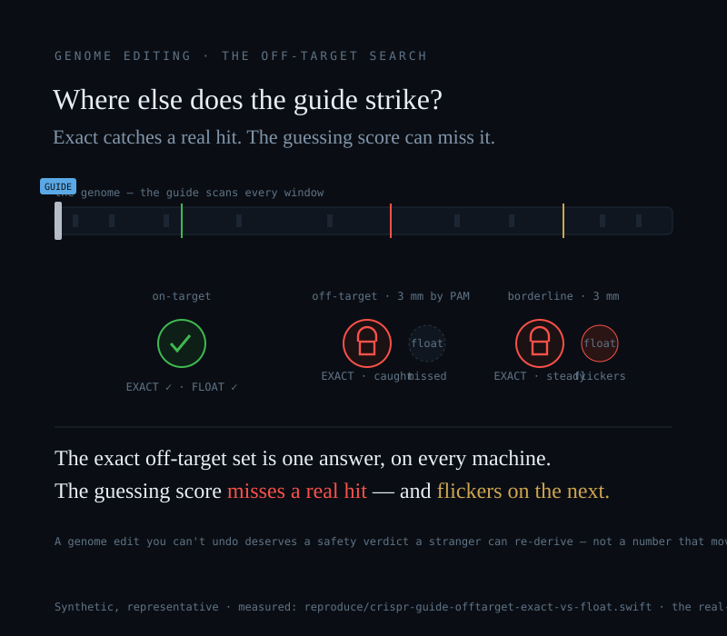

# Cures Without the Gatekeeper

*How the one safety question that gates a written medicine stopped being a guess and became a computation anyone can run, re-derive, and hand to a regulator — and why that opens the gate for cures that today have no home.*

## The gate

A new kind of medicine is being *written*. Not discovered in a plant, not screened out of a library of a million compounds — written, letter by letter, against the exact spelling mistake in one person's genome. An antisense oligonucleotide is a short strand of ~20 letters, complementary to a stretch of the patient's own RNA, that silences or re-splices a toxic message. A base editor changes a single letter of DNA and is gone. A prime editor writes a few letters back where they belong. These are not far-off promises: this year a child's blood was permanently corrected by a prime editor, a gene was switched off for life by a single infusion, and the first therapy ever approved for a fatal childhood brain disease was an oligonucleotide read straight off the broken gene.

Every one of these medicines carries the same shadow, and it is always the same question: **where else in the body does it strike?** A sequence written to bind one place will bind, a little, wherever the genome half-rhymes with it. For a drug you cannot take back — a permanent edit, a therapy given to one person who will never have a second chance — that question is the safety case.

Today, answering it is a gate only a large, funded institution can pass: a bespoke bioinformatics pipeline, heuristic scoring tools that disagree with each other, a validation lab, and eventually a trial. That gate is a real reason cures cluster inside big companies and elite centers — and it is the reason a disease with a population of one usually has nothing at all, because you cannot run a trial for a single patient, and the pipeline was priced for a blockbuster.

Here is what changes. **That one gating question is not a guess. It is counting.**

## The question that is really just counting

Whether two strands of nucleic acid bind is decided by Watson–Crick base pairing — A with T, G with C — and base pairing is a *discrete rule*: a position pairs or it does not. So "list every place in the genome or transcriptome where this sequence matches closely enough to matter" is not an estimate. It is integer combinatorics: slide the sequence along, count the matching positions in each window, and flag every window at or above a stated tolerance. That computation has **one answer, and the same answer on every machine**, and anyone can re-derive it byte-for-byte.

Compare that to how the field usually refines the list. The standard tools rank candidates by a floating-point score — a binding free energy (ΔG) for an oligo, a CFD- or MIT-style similarity score for a CRISPR guide. Those scores carry real information for *ranking* strong hits above weak ones. But every one of them rests on a chosen parameter table, and the published tables differ within their own stated uncertainty. So the score is the right tool for ordering candidates and the wrong tool for the *membership* verdict — because which sites cross the safety threshold then depends on which table you rounded to. We measured exactly this, on synthetic sequences, in two repository demos:

- **The float score misses a real hit.** In the CRISPR demo (`reproduce/crispr-guide-offtarget-exact-vs-float.swift`), the exact rule — three-or-fewer mismatches plus a real PAM — flags an off-target sitting right next to its PAM that *both* floating-point tables score too low to catch.
- **The float score can't agree with itself on the borderline.** On the next site, a borderline off-target, one defensible parameter table calls it dangerous and another equally defensible table clears it. The exact count returns the same verdict either way. The oligonucleotide demo (`reproduce/aso-offtarget-exact-vs-float.swift`) shows the same shear: a window matching 17 of 20 positions is flagged under one thermodynamic parameter set and cleared under another.

The difference isn't accuracy — a float can be perfectly precise and still shear. The difference is whether the safety map is the **same map** for everyone who looks. A genome edit you cannot undo deserves an off-target verdict a stranger can re-derive years later, on a machine you've never seen, without trusting the lab that produced it — not a number that moves with the tool that drew it. For a therapy given to a single patient, where the map can never be checked against a population, that re-derivability *is* the credibility.

## Six real, in-the-news medicines

We put that exact screen's argument against six real medicines — never to grade the drug, its makers, or any patient, only to grade the **safety instrument** that decides where the medicine strikes. Each one names, out loud, exactly where the exact method stops.

### Zilganersen — the first door that ever opened for Alexander disease

Alexander disease is an astrocytopathy: a single new mutation in *GFAP* makes a protein that doesn't merely fail but *poisons*, jamming the brain's support cells and unraveling white matter. Most children with it are the only person in their family who ever will be. Until this year, medicine could name it precisely and change its course not at all. On **3 September 2026 the FDA approved Zanvastro (zilganersen)** — the first disease-modifying therapy the disease has ever had. It is an antisense gapmer read as the reverse complement of *GFAP* messenger RNA; it pairs with that message and hands it to the cell's own RNase H1 to cut, lowering the toxic protein at its source. In the pivotal trial (~49–54 patients) it slowed the loss of walking speed — a 33.3% difference on the 10-Meter Walk Test, p = 0.041. Stabilization, honestly stated: it slows the decline, it does not give back what is gone. **What the exact screen does here is a seal** — the discrete off-target-complementarity question, answered in integers, is one re-derivable set a regulator can reproduce, where a floating-point screen reclassifies borderline sites on the constants it rounds to. **Where it stops:** the larger half of this drug's safety — the phosphorothioate chemistry, and the aseptic meningitis on its own label — is not a sequence match at all, and no base search predicts it.

### N-of-1 antisense — the only safety net that can exist for a disease of one

Some diseases have a population of one: a child born with a private spelling mistake in a single gene, for whom no approved therapy exists and no trial will ever be built, because a trial needs more than one patient and there is only this one. The first such drug, *milasen*, was written for a girl named Mila with a form of Batten disease; it reduced her seizures, though it could not stop the underlying disease, and the honest record keeps both halves of that sentence. The field has grown carefully from there — on the order of 27 individuals had received individualized oligonucleotides by early 2025, and one program reports more than 50 patients across more than 300 doses and 55 patient-years with no drug-related serious adverse events in its series. **For this class the exact off-target map is not a nice-to-have — it is the only safety instrument that can exist**, because when a drug will be given to exactly one person, no trial can ever prove it safe, and everything knowable before the first dose is either a wet-lab assay or a computation from the sequence. The complementarity map is the part of that computation that is genuinely exact and re-derivable. **Where it stops:** it says where a sequence *could* bind, never whether binding there causes harm — and it is silent on the risks that have actually hurt patients here, which are driven by dose, route, and chemistry, not by sequence. The screen in the patient's own cells stays necessary.

### VERVE-102 — turning off a gene for life, and the lattice a stranger can re-derive

Familial hypercholesterolemia is one of the most common serious inherited conditions in medicine — roughly one person in 250 to 313 — and one of the most treatable, if it is caught and if a person can take a pill every single day for life. That daily-adherence gap is exactly what a one-time treatment is built to close. VERVE-102 is an *in vivo* base editor: a lipid nanoparticle delivers the editor and a guide to liver cells in a single infusion, installs one permanent A•T → G•C letter change that switches off *PCSK9*, and is gone; LDL cholesterol falls and stays down. In its Phase 1b program, PCSK9 fell 51–88% and LDL up to 62%, durable through a year at the top dose. **The exact screen's contribution is the off-target lattice** — every genomic site within a stated mismatch distance of the 20-letter guide that *also* carries a real PAM. That set is finite and exhaustively listable, the PAM test is present-or-absent rather than a fuzzy score, and it is byte-identical on every machine — precisely the *nominate* step Verve does today, made re-derivable by a regulator who doesn't hold the sponsor's scoring table. **Where it stops — and this one is sharp:** the thing that actually bent this program was not an off-target sequence at all. The earlier VERVE-101 put patients in the hospital with liver-enzyme and platelet events tied to the nanoparticle and immune response, and that is what forced the redesign to VERVE-102. The lattice is silent on that entire column. A clean off-target set and a safe drug are two different claims.

### PM359 — prime editing, and why three matches make the danger set provably sparse

Chronic granulomatous disease leaves the immune cells that swallow bacteria and fungi unable to finish the kill; the p47phox form comes almost always from a single recurring two-letter "GT" deletion in *NCF1*. In **December 2025 the first clinical data from any prime-editing therapy in a human** were published — this one. It takes a patient's own blood stem cells, writes those two letters back, and returns them; in the two people treated (aged 18 and 57), corrected cells reached 68% and 91%, functional neutrophils came back to healthy-donor brightness and held for at least six months. The mechanism is what carries the safety argument: prime editing requires **three** independent sequence matches at a site — the spacer and PAM, the primer-binding site, and the reverse-transcriptase template — where an ordinary nuclease needs only the first. **So the off-target danger set is the *intersection* of three constraints, and an intersection can only be a subset of any one of them** — it is provably no larger than a nuclease's set, and in practice collapses far below it (in one genome-wide assay, of 16 sites a nuclease edited, the prime editor edited only 3, and just 1 above the one-percent level). That sparseness is exactly re-derivable, and *NCF1*'s near-identical pseudogene twins — the obvious worst-case off-targets — are precisely the loci an exact enumeration over the reference resolves rather than argues around. **Where it stops:** every toxicity actually seen in the two patients came from the busulfan used to condition the marrow, not from the edit — chemistry and conditioning the sequence screen never touches.

### Del-Zota — a third of normal dystrophin, and the seal that waits on one public sequence

Duchenne muscular dystrophy breaks the *DMD* reading frame; del-zota is built for the ~6% of boys whose mutation is amenable to skipping exon 44, and it is a clever piece of delivery — an antibody against a receptor abundant on muscle, carrying a morpholino oligonucleotide that hides exon 44 from the splicing machinery so the frame is restored and a shortened but working dystrophin is made. On the biomarker it lifted dystrophin from about 7% to about 32% of normal, an order of magnitude past the approved exon-skippers for other exons. Because a morpholino works by *steric block* and never cleaves RNA, its off-target consequence is off-target *splicing* — and that still begins at complementarity, which is where the exact instrument fits: enumerate every transcript site the payload can bind within a stated mismatch-and-bulge budget, exhaustively and re-derivably, in place of the floating-point free-energy heuristic the field itself distrusts (in one study, of 108 predicted partial-match sites, 17 produced real mis-splicing). **The honest verdict here is a seal that is not yet stamped:** del-zota's payload sequence is *not public*, so for the real molecule the screen is a charter, not a result — the local demo runs on synthetic sequences and shows only the *kind* of divergence. The seal becomes a live verdict the moment the sponsor or a regulator puts the sequence on the table. **Where it stops:** the delivery half — hypersensitivity, infusion reactions, the receptor's presence at the blood-brain barrier and on red-cell precursors — is biology and chemistry, not a base search.

### CAR-T, halted — the one whose safety question is not off-target at all

The other five are off-target-sequence questions. This one is deliberately the counterpoint, because honesty means showing where the off-target screen is *not* the tool. In August 2026 two of the world's largest drug companies paused their autoimmune CAR-T programs after three patients died — a cell therapy meant to heal expanded out of control and turned the immune system against the patient. The failure was not a mis-targeted sequence; it was an **unbounded expansion**, in cells engineered on fast-manufacturing platforms *specifically to expand harder and resist their own brakes* — a declared design choice, on the record before the first dose. No off-target map would have caught this, because the danger was not where the therapy struck but that it had no ceiling. **The instrument's honest answer to a system built without a bound is not a confident safety score — it is a refusal.** A safety verdict that carries a declared envelope can return "outside what I can certify — refused" instead of a reassuring number, and a therapy engineered to expand without a brake is exactly the case that belongs on the far side of that line. That is a different discipline from the off-target seal, and it is an argument carried in full on its own page — **[the case a regulator could re-derive →](The-Verdict-a-Regulator-Could-Re-Derive)** — not a molecular screen run on the therapy.

## What it unlocks

Put the three effects plainly:

- **Safer** — the exact screen catches the off-target a guessing score misses, and it can't be quietly reclassified by swapping a parameter table.
- **Cheaper** — the certificate is *computed*, not bought; the part of the safety case that used to require a bespoke pipeline becomes arithmetic that runs on a laptop.
- **Sooner** — it lands at the design stage, before an animal or a patient, where changing course is still cheap.

And then the gate opens. The part of the work that used to require a big lab's pipeline is arithmetic now; the certificate travels with the sequence; anyone can verify it without trusting whoever made it. A small company, a rare-disease foundation, or one determined scientist can pick a cure and carry it — and carry it *safer* than the old way, because the safety artifact is re-derivable rather than taken on faith. For a common disease, that is cheaper and more auditable. **For a disease of one, it is not merely cheaper — it is the only way there is.** The friction that kept written medicines inside large, funded institutions was never only the science. Part of it was a safety pipeline priced for scale, and that part is answerable now.

That is why we did this, and why it is in the open: so that the next family at the edge of medicine is met by a method they can use, not a gate they cannot pass.

## The honest edge, drawn as loudly as the claim

This is scoped to the **sequence-safety** question, and no wider — and every study above draws that line as loudly as its claim. The molecular court that would score a *real* drug's real sequence on this substrate is a charter to build, not a running product: **nothing here screened a real drug's real sequence**, and inventing a number would be fabrication. The exact-versus-float advantage is *measured* on the two synthetic off-target demos named above; its transfer to each specific drug is a reasoned argument, and every study labels it as one. And the chemistry, immune, delivery, and dosing risks that dominate several of these medicines — the very risks that actually halted VERVE-101 and the CAR-T programs — sit outside any sequence search; they still belong to the lab and the clinic. A clean off-target map is a *necessary* part of a safety case. It is never the whole of it, and a page that pretended otherwise would be selling, not helping.

## Rights — source-available, not open-source

This wiki, its programs, and the studies linked here are published **source-available**: the source is visible so anyone can inspect it and re-derive every figure. That visibility grants no rights. The repository carries no LICENSE, which under default copyright means **all rights are reserved**. No right is given or intended to use, run, or deploy any of it beyond re-deriving the published figures. **Any other use — including using the exact off-target method in drug development — requires a separate written licensing agreement with the authors.**
