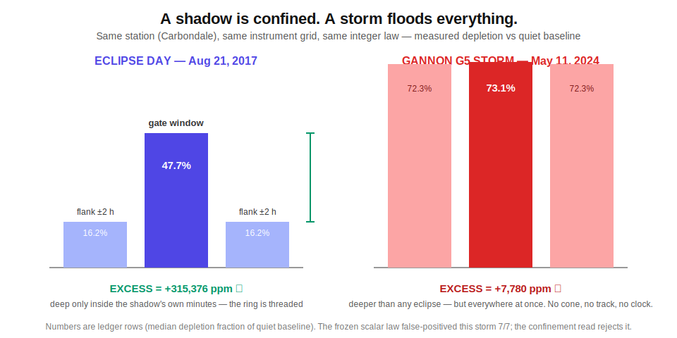
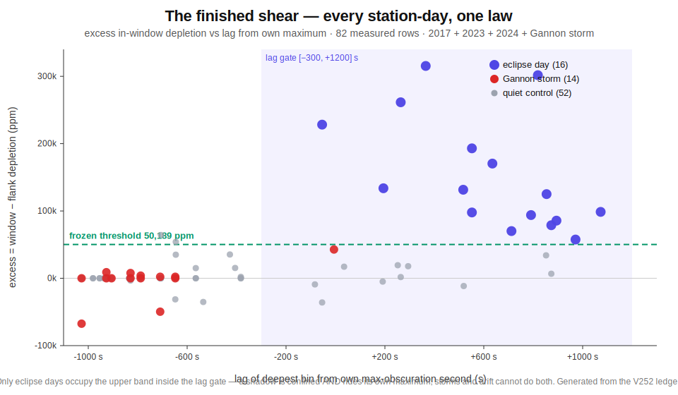

# Model shear — the data that turns naive models into bad data

A model that detects eclipses by *"TEC went down"* is wrong, and the archive proves it. Geomagnetic storms move the ionosphere harder than any eclipse — enhancements of +250% (Halloween 2003) and deep negative phases (Gannon 2024) — with **no shadow anywhere**. This page documents the shear corpus: the storm days ingested raw, paired against eclipse geometry, and presented to the frozen law. A naive detector false-positives here. The invariant must dead-cat — and whatever it actually does is recorded raw below, generated from the live crucible.

## The two reference storms in the ledger

### May 10–11, 2024 — the Gannon G5 superstorm (the fossil shear)

- Minimum **Dst −412 nT** — the most intense G5 since March 1989. Kp 9 reached twice (00 and 09 UT May 11), Kp ≥ 8 for a full day, daily Ap 273. Magnetosphere compressed to ~5 R_E; aurora at Florida latitudes.
- **Why it shears:** May 10–11 sit one month after the 2024 benchmark eclipse, same stations, same season, same solar-cycle phase. Day-side TEC first surged (positive storm phase), then the May 11 negative phase carved depletions that *look* eclipse-deep against quiet baselines — at stations where the Sun was completely unobscured.
- These two days form the **shear-negative fossils**: 2024 eclipse geometry ⊗ storm-day measurement, judged by the same law.

### October 29–30, 2003 — the Halloween storms (the archive reference)

- Dst −383 nT (Oct 30; −422 nT in the November sequel); dayside TEC **+40% (Oct 29) and +250% (Oct 30)** within 2–5 hours via prompt-penetration electric fields — the daytime super-fountain; ~900% electron-content increase above CHAMP altitude. The Oct 28 X17 flare alone stepped TEC ~30% in ~15 minutes.
- Ingested as **archive reference only** — no fossil pairing, because the honest baseline rule forbids it: the 2024 quiet baselines are six months and a solar-regime away from October 2003, so a fossil verdict would be measuring seasonal drift, not the law. The raw series live in the ledger for the record; the wiki says so instead of hiding it.

## Why the invariant does NOT shear

Three pre-registered disciplines separate shadow physics from storm physics:

1. **The obscuration gate** — a leaf can only audit at a UT second where the *geometry* says ≥80% of the solar disk is covered. Storm depletions at unobscured stations occur at seconds where the gate is closed; those patches are proven voids before any TEC value is read.
2. **The gate is a window, not a threshold** — the unimodal shadow cone gives each station-day ONE contiguous audit window minutes long. A storm depletion must not merely be deep; it must be deep *inside those exact minutes* of the paired geometry to threaten a false positive.
3. **The quiet-baseline rule** — baselines are lower medians over named days with max Kp ≤ 4 (checked live against GFZ at corpus build). Storm days can never contaminate a baseline, so the "normal" the law compares against is storm-free by construction.

The residual exposure is honest and documented: a storm's negative phase *coinciding in local time-of-day* with the paired geometry's gate window can, in principle, satisfy the coupling arithmetic. That is exactly what the shear fossils measure. If one fires, it is a FALSE POSITIVE, the historical Form seals CURE, and the finding stands raw — the wiki table below is generated from the same crucible that seals.

## The shear verdicts (live from the crucible)

The `shear-negative` rows in the full historical table:

<b>Full historical crucible — every pair, one law</b> <i>(click to expand — generated live from the ledger)</i>

<!-- GAIA:BEGIN crucible-historical -->
| Eclipse | Kind | Pair | Verdict | Projected (UT) | Depletion | Obscuration |
|---|---|---|---|---|---|---|
| 2017-08-21 | positive | 2017-08-21-carbondale-eclipse | PROJECTED ✓ | 18:05:47 UT | 391086 ppm (39.1%) | 800292 ppm |
| 2017-08-21 | positive | 2017-08-21-casper-wy-eclipse | PROJECTED ✓ | 17:29:17 UT | 268279 ppm (26.8%) | 802380 ppm |
| 2017-08-21 | positive | 2017-08-21-columbia-sc-eclipse | PROJECTED ✓ | 18:27:38 UT | 448461 ppm (44.8%) | 800290 ppm |
| 2017-08-21 | positive | 2017-08-21-nashville-eclipse | PROJECTED ✓ | 18:12:52 UT | 392061 ppm (39.2%) | 802211 ppm |
| 2017-08-21 | positive | 2017-08-21-salem-or-eclipse | PROJECTED ✓ | 17:05:17 UT | 263023 ppm (26.3%) | 802393 ppm |
| 2017-08-21 | control-negative | neg-2017-08-21-carbondale-ctrl2017-07-25 | dead cat ✓ | — | — | — |
| 2017-08-21 | control-negative | neg-2017-08-21-carbondale-ctrl2017-08-14 | dead cat ✓ | — | — | — |
| 2017-08-21 | control-negative | neg-2017-08-21-carbondale-ctrl2017-08-28 | dead cat ✓ | — | — | — |
| 2017-08-21 | control-negative | neg-2017-08-21-casper-wy-ctrl2017-07-25 | dead cat ✓ | — | — | — |
| 2017-08-21 | control-negative | neg-2017-08-21-casper-wy-ctrl2017-08-14 | dead cat ✓ | — | — | — |
| 2017-08-21 | control-negative | neg-2017-08-21-casper-wy-ctrl2017-08-28 | dead cat ✓ | — | — | — |
| 2017-08-21 | control-negative | neg-2017-08-21-columbia-sc-ctrl2017-07-25 | dead cat ✓ | — | — | — |
| 2017-08-21 | control-negative | neg-2017-08-21-columbia-sc-ctrl2017-08-14 | dead cat ✓ | — | — | — |
| 2017-08-21 | control-negative | neg-2017-08-21-columbia-sc-ctrl2017-08-28 | dead cat ✓ | — | — | — |
| 2017-08-21 | control-negative | neg-2017-08-21-nashville-ctrl2017-07-25 | dead cat ✓ | — | — | — |
| 2017-08-21 | control-negative | neg-2017-08-21-nashville-ctrl2017-08-14 | dead cat ✓ | — | — | — |
| 2017-08-21 | control-negative | neg-2017-08-21-nashville-ctrl2017-08-28 | dead cat ✓ | — | — | — |
| 2017-08-21 | control-negative | neg-2017-08-21-salem-or-ctrl2017-07-25 | dead cat ✓ | — | — | — |
| 2017-08-21 | control-negative | neg-2017-08-21-salem-or-ctrl2017-08-14 | dead cat ✓ | — | — | — |
| 2017-08-21 | control-negative | neg-2017-08-21-salem-or-ctrl2017-08-28 | dead cat ✓ | — | — | — |
| 2023-10-14 | positive | 2023-10-14-albuquerque-eclipse | PROJECTED ✓ | 16:26:33 UT | 265351 ppm (26.5%) | 801694 ppm |
| 2023-10-14 | positive | 2023-10-14-corpus-christi-eclipse | PROJECTED ✓ | 16:46:38 UT | 315295 ppm (31.5%) | 800667 ppm |
| 2023-10-14 | positive | 2023-10-14-eugene-or-eclipse | no projection ‼︎ | — | — | — |
| 2023-10-14 | positive | 2023-10-14-san-antonio-eclipse | PROJECTED ✓ | 16:42:59 UT | 319424 ppm (31.9%) | 801810 ppm |
| 2023-10-14 | control-negative | neg-2023-10-14-albuquerque-ctrl2023-09-17 | dead cat ✓ | — | — | — |
| 2023-10-14 | control-negative | neg-2023-10-14-albuquerque-ctrl2023-09-30 | dead cat ✓ | — | — | — |
| 2023-10-14 | control-negative | neg-2023-10-14-albuquerque-ctrl2023-10-02 | dead cat ✓ | — | — | — |
| 2023-10-14 | control-negative | neg-2023-10-14-albuquerque-ctrl2023-10-07 | dead cat ✓ | — | — | — |
| 2023-10-14 | control-negative | neg-2023-10-14-corpus-christi-ctrl2023-09-17 | FALSE POSITIVE ‼︎ | 16:46:38 UT | 275023 ppm (27.5%) | 800667 ppm |
| 2023-10-14 | control-negative | neg-2023-10-14-corpus-christi-ctrl2023-09-30 | dead cat ✓ | — | — | — |
| 2023-10-14 | control-negative | neg-2023-10-14-corpus-christi-ctrl2023-10-02 | dead cat ✓ | — | — | — |
| 2023-10-14 | control-negative | neg-2023-10-14-corpus-christi-ctrl2023-10-07 | dead cat ✓ | — | — | — |
| 2023-10-14 | control-negative | neg-2023-10-14-eugene-or-ctrl2023-09-17 | dead cat ✓ | — | — | — |
| 2023-10-14 | control-negative | neg-2023-10-14-eugene-or-ctrl2023-09-30 | dead cat ✓ | — | — | — |
| 2023-10-14 | control-negative | neg-2023-10-14-eugene-or-ctrl2023-10-02 | dead cat ✓ | — | — | — |
| 2023-10-14 | control-negative | neg-2023-10-14-eugene-or-ctrl2023-10-07 | dead cat ✓ | — | — | — |
| 2023-10-14 | control-negative | neg-2023-10-14-san-antonio-ctrl2023-09-17 | FALSE POSITIVE ‼︎ | 16:42:59 UT | 280483 ppm (28.0%) | 801810 ppm |
| 2023-10-14 | control-negative | neg-2023-10-14-san-antonio-ctrl2023-09-30 | dead cat ✓ | — | — | — |
| 2023-10-14 | control-negative | neg-2023-10-14-san-antonio-ctrl2023-10-02 | dead cat ✓ | — | — | — |
| 2023-10-14 | control-negative | neg-2023-10-14-san-antonio-ctrl2023-10-07 | dead cat ✓ | — | — | — |
| 2024-04-08 | positive | 2024-04-08-carbondale-eclipse | PROJECTED ✓ | 18:46:29 UT | 274457 ppm (27.4%) | 800534 ppm |
| 2024-04-08 | positive | 2024-04-08-cleveland-eclipse | PROJECTED ✓ | 19:01:31 UT | 353317 ppm (35.3%) | 802627 ppm |
| 2024-04-08 | positive | 2024-04-08-dallas-eclipse | PROJECTED ✓ | 18:45:00 UT | 308350 ppm (30.8%) | 997624 ppm |
| 2024-04-08 | positive | 2024-04-08-indianapolis-eclipse | PROJECTED ✓ | 18:53:22 UT | 286986 ppm (28.7%) | 800050 ppm |
| 2024-04-08 | positive | 2024-04-08-mazatlan-eclipse | PROJECTED ✓ | 18:05:00 UT | 323319 ppm (32.3%) | 970682 ppm |
| 2024-04-08 | positive | 2024-04-08-millstone-eclipse | PROJECTED ✓ | 19:17:05 UT | 419091 ppm (41.9%) | 801464 ppm |
| 2024-04-08 | positive | 2024-04-08-norwich-eclipse | PROJECTED ✓ | 19:17:06 UT | 426439 ppm (42.6%) | 801484 ppm |
| 2024-04-08 | control-negative | neg-2024-04-08-carbondale-ctrl2024-03-12 | dead cat ✓ | — | — | — |
| 2024-04-08 | control-negative | neg-2024-04-08-carbondale-ctrl2024-04-01 | dead cat ✓ | — | — | — |
| 2024-04-08 | control-negative | neg-2024-04-08-carbondale-ctrl2024-04-15 | dead cat ✓ | — | — | — |
| 2024-04-08 | control-negative | neg-2024-04-08-cleveland-ctrl2024-03-12 | dead cat ✓ | — | — | — |
| 2024-04-08 | control-negative | neg-2024-04-08-cleveland-ctrl2024-04-01 | dead cat ✓ | — | — | — |
| 2024-04-08 | control-negative | neg-2024-04-08-cleveland-ctrl2024-04-15 | dead cat ✓ | — | — | — |
| 2024-04-08 | control-negative | neg-2024-04-08-dallas-ctrl2024-03-12 | dead cat ✓ | — | — | — |
| 2024-04-08 | control-negative | neg-2024-04-08-dallas-ctrl2024-04-01 | dead cat ✓ | — | — | — |
| 2024-04-08 | control-negative | neg-2024-04-08-dallas-ctrl2024-04-15 | dead cat ✓ | — | — | — |
| 2024-04-08 | control-negative | neg-2024-04-08-indianapolis-ctrl2024-03-12 | dead cat ✓ | — | — | — |
| 2024-04-08 | control-negative | neg-2024-04-08-indianapolis-ctrl2024-04-01 | dead cat ✓ | — | — | — |
| 2024-04-08 | control-negative | neg-2024-04-08-indianapolis-ctrl2024-04-15 | dead cat ✓ | — | — | — |
| 2024-04-08 | control-negative | neg-2024-04-08-mazatlan-ctrl2024-03-12 | dead cat ✓ | — | — | — |
| 2024-04-08 | control-negative | neg-2024-04-08-mazatlan-ctrl2024-04-01 | dead cat ✓ | — | — | — |
| 2024-04-08 | control-negative | neg-2024-04-08-mazatlan-ctrl2024-04-15 | dead cat ✓ | — | — | — |
| 2024-04-08 | control-negative | neg-2024-04-08-millstone-ctrl2024-03-12 | dead cat ✓ | — | — | — |
| 2024-04-08 | control-negative | neg-2024-04-08-millstone-ctrl2024-04-01 | dead cat ✓ | — | — | — |
| 2024-04-08 | control-negative | neg-2024-04-08-millstone-ctrl2024-04-15 | dead cat ✓ | — | — | — |
| 2024-04-08 | control-negative | neg-2024-04-08-norwich-ctrl2024-03-12 | dead cat ✓ | — | — | — |
| 2024-04-08 | control-negative | neg-2024-04-08-norwich-ctrl2024-04-01 | dead cat ✓ | — | — | — |
| 2024-04-08 | control-negative | neg-2024-04-08-norwich-ctrl2024-04-15 | dead cat ✓ | — | — | — |
| 2024-04-08 | shear-negative | shear-2024-04-08-carbondale-storm2024-05-10 | dead cat ✓ | — | — | — |
| 2024-04-08 | shear-negative | shear-2024-04-08-carbondale-storm2024-05-11 | FALSE POSITIVE ‼︎ | 18:46:29 UT | 740074 ppm (74.0%) | 800534 ppm |
| 2024-04-08 | shear-negative | shear-2024-04-08-cleveland-storm2024-05-10 | dead cat ✓ | — | — | — |
| 2024-04-08 | shear-negative | shear-2024-04-08-cleveland-storm2024-05-11 | FALSE POSITIVE ‼︎ | 19:01:31 UT | 720053 ppm (72.0%) | 802627 ppm |
| 2024-04-08 | shear-negative | shear-2024-04-08-dallas-storm2024-05-10 | dead cat ✓ | — | — | — |
| 2024-04-08 | shear-negative | shear-2024-04-08-dallas-storm2024-05-11 | FALSE POSITIVE ‼︎ | 18:27:27 UT | 706563 ppm (70.7%) | 801513 ppm |
| 2024-04-08 | shear-negative | shear-2024-04-08-indianapolis-storm2024-05-10 | dead cat ✓ | — | — | — |
| 2024-04-08 | shear-negative | shear-2024-04-08-indianapolis-storm2024-05-11 | FALSE POSITIVE ‼︎ | 18:53:22 UT | 736981 ppm (73.7%) | 800050 ppm |
| 2024-04-08 | shear-negative | shear-2024-04-08-mazatlan-storm2024-05-10 | dead cat ✓ | — | — | — |
| 2024-04-08 | shear-negative | shear-2024-04-08-mazatlan-storm2024-05-11 | FALSE POSITIVE ‼︎ | 17:54:27 UT | 598914 ppm (59.9%) | 802552 ppm |
| 2024-04-08 | shear-negative | shear-2024-04-08-millstone-storm2024-05-10 | dead cat ✓ | — | — | — |
| 2024-04-08 | shear-negative | shear-2024-04-08-millstone-storm2024-05-11 | FALSE POSITIVE ‼︎ | 19:17:05 UT | 671980 ppm (67.2%) | 801464 ppm |
| 2024-04-08 | shear-negative | shear-2024-04-08-norwich-storm2024-05-10 | dead cat ✓ | — | — | — |
| 2024-04-08 | shear-negative | shear-2024-04-08-norwich-storm2024-05-11 | FALSE POSITIVE ‼︎ | 19:17:06 UT | 694994 ppm (69.5%) | 801484 ppm |

*ONE frozen law — gate 800000 ppm, coupling 3/10 — applied to every pair. Generated live from `eclipse-fossils.jsonl` through `EclipseProjectionRunner`.*
<!-- GAIA:END crucible-historical -->

## The shear, FINISHED — the confinement discriminant

The May-11 false positives above taught the second-generation layer: a shadow's depletion is **confined** to its own gate minutes and near-zero in the flanking hours; a storm floods the flanks as deep as the window. The discriminant — **excess in-window depletion** (gate-window median − ±2 h flank median, exact integers) — judged against every eclipse positive, every Gannon shear pair, and every quiet control:

<b>The full confinement + lag table</b> <i>(click to expand — generated live from the ledger)</i>

<!-- GAIA:BEGIN shear-discriminant -->
| Eclipse | Kind | Station | Day | Window depletion | Flank depletion | **EXCESS** | Deepest bin (UT) | Δ from own max |
|---|---|---|---|---|---|---|---|---|
| 2017-08-21 | control | carbondale | 2017-07-25 | 0 ppm | 0 ppm | **0 ppm** | 18:07:30 | -835 s ✗ |
| 2017-08-21 | control | carbondale | 2017-08-14 | 0 ppm | 0 ppm | **0 ppm** | 18:07:30 | -835 s ✗ |
| 2017-08-21 | control | carbondale | 2017-08-28 | 42553 ppm | 77669 ppm | **-35116 ppm** | 18:12:30 | -535 s ✗ |
| 2017-08-21 | control | casper-wy | 2017-07-25 | 0 ppm | 0 ppm | **0 ppm** | 17:27:30 | -981 s ✗ |
| 2017-08-21 | control | casper-wy | 2017-08-14 | 0 ppm | 0 ppm | **0 ppm** | 17:27:30 | -981 s ✗ |
| 2017-08-21 | control | casper-wy | 2017-08-28 | 64516 ppm | 75949 ppm | **-11433 ppm** | 17:52:30 | 519 s ✓ |
| 2017-08-21 | control | columbia-sc | 2017-07-25 | 0 ppm | 0 ppm | **0 ppm** | 18:27:30 | -936 s ✗ |
| 2017-08-21 | control | columbia-sc | 2017-08-14 | 0 ppm | 0 ppm | **0 ppm** | 18:27:30 | -936 s ✗ |
| 2017-08-21 | control | columbia-sc | 2017-08-28 | 100917 ppm | 99099 ppm | **1818 ppm** | 18:47:30 | 264 s ✓ |
| 2017-08-21 | control | nashville | 2017-07-25 | 0 ppm | 0 ppm | **0 ppm** | 18:12:30 | -954 s ✗ |
| 2017-08-21 | control | nashville | 2017-08-14 | 0 ppm | 0 ppm | **0 ppm** | 18:12:30 | -954 s ✗ |
| 2017-08-21 | control | nashville | 2017-08-28 | 31578 ppm | 67415 ppm | **-35837 ppm** | 18:27:30 | -54 s ✓ |
| 2017-08-21 | control | salem-or | 2017-07-25 | 34090 ppm | 0 ppm | **34090 ppm** | 17:32:30 | 852 s ✓ |
| 2017-08-21 | control | salem-or | 2017-08-14 | 0 ppm | 0 ppm | **0 ppm** | 17:07:30 | -648 s ✗ |
| 2017-08-21 | control | salem-or | 2017-08-28 | 0 ppm | 31250 ppm | **-31250 ppm** | 17:07:30 | -648 s ✗ |
| 2017-08-21 | eclipse | carbondale | 2017-08-21 | 477395 ppm | 162019 ppm | **315376 ppm** | 18:27:30 | 365 s ✓ |
| 2017-08-21 | eclipse | casper-wy | 2017-08-21 | 388617 ppm | 86941 ppm | **301676 ppm** | 17:57:30 | 819 s ✓ |
| 2017-08-21 | eclipse | columbia-sc | 2017-08-21 | 498899 ppm | 237474 ppm | **261425 ppm** | 18:47:30 | 264 s ✓ |
| 2017-08-21 | eclipse | nashville | 2017-08-21 | 437216 ppm | 208971 ppm | **228245 ppm** | 18:27:30 | -54 s ✓ |
| 2017-08-21 | eclipse | salem-or | 2017-08-21 | 384069 ppm | 191000 ppm | **193069 ppm** | 17:27:30 | 552 s ✓ |
| 2023-10-14 | control | albuquerque | 2023-09-17 | 200344 ppm | 183114 ppm | **17230 ppm** | 16:37:30 | 35 s ✓ |
| 2023-10-14 | control | albuquerque | 2023-09-30 | 0 ppm | 0 ppm | **0 ppm** | 16:27:30 | -565 s ✗ |
| 2023-10-14 | control | albuquerque | 2023-10-02 | 32451 ppm | 17336 ppm | **15115 ppm** | 16:27:30 | -565 s ✗ |
| 2023-10-14 | control | albuquerque | 2023-10-07 | 0 ppm | 0 ppm | **0 ppm** | 16:27:30 | -565 s ✗ |
| 2023-10-14 | control | corpus-christi | 2023-09-17 | 258198 ppm | 223178 ppm | **35020 ppm** | 16:47:30 | -646 s ✗ |
| 2023-10-14 | control | corpus-christi | 2023-09-30 | 0 ppm | 0 ppm | **0 ppm** | 16:47:30 | -646 s ✗ |
| 2023-10-14 | control | corpus-christi | 2023-10-02 | 54107 ppm | 0 ppm | **54107 ppm** | 16:47:30 | -646 s ✗ |
| 2023-10-14 | control | corpus-christi | 2023-10-07 | 0 ppm | 0 ppm | **0 ppm** | 16:47:30 | -646 s ✗ |
| 2023-10-14 | control | eugene-or | 2023-09-17 | 71380 ppm | 80460 ppm | **-9080 ppm** | 16:17:30 | -83 s ✓ |
| 2023-10-14 | control | eugene-or | 2023-09-30 | 0 ppm | 0 ppm | **0 ppm** | 16:12:30 | -383 s ✗ |
| 2023-10-14 | control | eugene-or | 2023-10-02 | 33316 ppm | 31168 ppm | **2148 ppm** | 16:12:30 | -383 s ✗ |
| 2023-10-14 | control | eugene-or | 2023-10-07 | 0 ppm | 0 ppm | **0 ppm** | 16:12:30 | -383 s ✗ |
| 2023-10-14 | control | san-antonio | 2023-09-17 | 265203 ppm | 200956 ppm | **64247 ppm** | 16:42:30 | -706 s ✗ |
| 2023-10-14 | control | san-antonio | 2023-09-30 | 0 ppm | 0 ppm | **0 ppm** | 16:42:30 | -706 s ✗ |
| 2023-10-14 | control | san-antonio | 2023-10-02 | 20180 ppm | 4829 ppm | **15351 ppm** | 16:47:30 | -406 s ✗ |
| 2023-10-14 | control | san-antonio | 2023-10-07 | 0 ppm | 0 ppm | **0 ppm** | 16:42:30 | -706 s ✗ |
| 2023-10-14 | eclipse | albuquerque | 2023-10-14 | 322446 ppm | 152017 ppm | **170429 ppm** | 16:47:30 | 635 s ✓ |
| 2023-10-14 | eclipse | corpus-christi | 2023-10-14 | 348812 ppm | 223811 ppm | **125001 ppm** | 17:12:30 | 854 s ✓ |
| 2023-10-14 | eclipse | eugene-or | 2023-10-14 | 131566 ppm | 0 ppm | **131566 ppm** | 16:27:30 | 517 s ✓ |
| 2023-10-14 | eclipse | san-antonio | 2023-10-14 | 368565 ppm | 234830 ppm | **133735 ppm** | 16:57:30 | 194 s ✓ |
| 2024-04-08 | control | carbondale | 2024-03-12 | 28804 ppm | 32136 ppm | **-3332 ppm** | 18:47:30 | -829 s ✗ |
| 2024-04-08 | control | carbondale | 2024-04-01 | 0 ppm | 0 ppm | **0 ppm** | 18:47:30 | -829 s ✗ |
| 2024-04-08 | control | carbondale | 2024-04-15 | 0 ppm | 0 ppm | **0 ppm** | 18:47:30 | -829 s ✗ |
| 2024-04-08 | control | cleveland | 2024-03-12 | 31284 ppm | 30168 ppm | **1116 ppm** | 19:02:30 | -788 s ✗ |
| 2024-04-08 | control | cleveland | 2024-04-01 | 0 ppm | 0 ppm | **0 ppm** | 19:02:30 | -788 s ✗ |
| 2024-04-08 | control | cleveland | 2024-04-15 | 0 ppm | 0 ppm | **0 ppm** | 19:02:30 | -788 s ✗ |
| 2024-04-08 | control | dallas | 2024-03-12 | 73593 ppm | 55656 ppm | **17937 ppm** | 18:47:30 | 294 s ✓ |
| 2024-04-08 | control | dallas | 2024-04-01 | 0 ppm | 0 ppm | **0 ppm** | 18:27:30 | -906 s ✗ |
| 2024-04-08 | control | dallas | 2024-04-15 | 0 ppm | 0 ppm | **0 ppm** | 18:27:30 | -906 s ✗ |
| 2024-04-08 | control | indianapolis | 2024-03-12 | 54195 ppm | 47430 ppm | **6765 ppm** | 19:22:30 | 873 s ✓ |
| 2024-04-08 | control | indianapolis | 2024-04-01 | 0 ppm | 0 ppm | **0 ppm** | 18:52:30 | -927 s ✗ |
| 2024-04-08 | control | indianapolis | 2024-04-15 | 0 ppm | 0 ppm | **0 ppm** | 18:52:30 | -927 s ✗ |
| 2024-04-08 | control | mazatlan | 2024-03-12 | 100549 ppm | 65170 ppm | **35379 ppm** | 18:02:30 | -427 s ✗ |
| 2024-04-08 | control | mazatlan | 2024-04-01 | 0 ppm | 0 ppm | **0 ppm** | 17:52:30 | -1027 s ✗ |
| 2024-04-08 | control | mazatlan | 2024-04-15 | 0 ppm | 0 ppm | **0 ppm** | 17:52:30 | -1027 s ✗ |
| 2024-04-08 | control | millstone | 2024-03-12 | 0 ppm | 0 ppm | **0 ppm** | 19:17:30 | -709 s ✗ |
| 2024-04-08 | control | millstone | 2024-04-01 | 11608 ppm | 16518 ppm | **-4910 ppm** | 19:32:30 | 191 s ✓ |
| 2024-04-08 | control | millstone | 2024-04-15 | 0 ppm | 0 ppm | **0 ppm** | 19:17:30 | -709 s ✗ |
| 2024-04-08 | control | norwich | 2024-03-12 | 0 ppm | 0 ppm | **0 ppm** | 19:17:30 | -648 s ✗ |
| 2024-04-08 | control | norwich | 2024-04-01 | 19407 ppm | 0 ppm | **19407 ppm** | 19:32:30 | 252 s ✓ |
| 2024-04-08 | control | norwich | 2024-04-15 | 0 ppm | 0 ppm | **0 ppm** | 19:17:30 | -648 s ✗ |
| 2024-04-08 | eclipse | carbondale | 2024-04-08 | 313114 ppm | 255571 ppm | **57543 ppm** | 19:17:30 | 971 s ✓ |
| 2024-04-08 | eclipse | cleveland | 2024-04-08 | 400669 ppm | 330523 ppm | **70146 ppm** | 19:27:30 | 712 s ✓ |
| 2024-04-08 | eclipse | dallas | 2024-04-08 | 280267 ppm | 194617 ppm | **85650 ppm** | 18:57:30 | 894 s ✓ |
| 2024-04-08 | eclipse | indianapolis | 2024-04-08 | 354940 ppm | 276144 ppm | **78796 ppm** | 19:22:30 | 873 s ✓ |
| 2024-04-08 | eclipse | mazatlan | 2024-04-08 | 272936 ppm | 174356 ppm | **98580 ppm** | 18:27:30 | 1073 s ✓ |
| 2024-04-08 | eclipse | millstone | 2024-04-08 | 474572 ppm | 380621 ppm | **93951 ppm** | 19:42:30 | 791 s ✓ |
| 2024-04-08 | eclipse | norwich | 2024-04-08 | 477974 ppm | 380160 ppm | **97814 ppm** | 19:37:30 | 552 s ✓ |
| 2024-04-08 | shear-storm | carbondale | 2024-05-10 | 0 ppm | 0 ppm | **0 ppm** | 18:47:30 | -829 s ✗ |
| 2024-04-08 | shear-storm | carbondale | 2024-05-11 | 731039 ppm | 723259 ppm | **7780 ppm** | 18:47:30 | -829 s ✗ |
| 2024-04-08 | shear-storm | cleveland | 2024-05-10 | 0 ppm | 0 ppm | **0 ppm** | 19:02:30 | -788 s ✗ |
| 2024-04-08 | shear-storm | cleveland | 2024-05-11 | 709141 ppm | 705195 ppm | **3946 ppm** | 19:02:30 | -788 s ✗ |
| 2024-04-08 | shear-storm | dallas | 2024-05-10 | 0 ppm | 0 ppm | **0 ppm** | 18:27:30 | -906 s ✗ |
| 2024-04-08 | shear-storm | dallas | 2024-05-11 | 728586 ppm | 685750 ppm | **42836 ppm** | 18:42:30 | -6 s ✓ |
| 2024-04-08 | shear-storm | indianapolis | 2024-05-10 | 0 ppm | 0 ppm | **0 ppm** | 18:52:30 | -927 s ✗ |
| 2024-04-08 | shear-storm | indianapolis | 2024-05-11 | 733664 ppm | 724580 ppm | **9084 ppm** | 18:52:30 | -927 s ✗ |
| 2024-04-08 | shear-storm | mazatlan | 2024-05-10 | 0 ppm | 0 ppm | **0 ppm** | 17:52:30 | -1027 s ✗ |
| 2024-04-08 | shear-storm | mazatlan | 2024-05-11 | 471758 ppm | 539170 ppm | **-67412 ppm** | 17:52:30 | -1027 s ✗ |
| 2024-04-08 | shear-storm | millstone | 2024-05-10 | 0 ppm | 49585 ppm | **-49585 ppm** | 19:17:30 | -709 s ✗ |
| 2024-04-08 | shear-storm | millstone | 2024-05-11 | 667827 ppm | 665528 ppm | **2299 ppm** | 19:17:30 | -709 s ✗ |
| 2024-04-08 | shear-storm | norwich | 2024-05-10 | 0 ppm | 0 ppm | **0 ppm** | 19:17:30 | -648 s ✗ |
| 2024-04-08 | shear-storm | norwich | 2024-05-11 | 687000 ppm | 684796 ppm | **2204 ppm** | 19:17:30 | -648 s ✗ |

**Measured two-clause separation** (lag gate [-300, +1200] s): min eclipse excess 57543 ppm · eclipse lag failures 0 · max lag-passing non-eclipse excess 42836 ppm (shear-storm dallas 2024-05-11) — **CLEAN, gap 14707 ppm, threshold 50189 ppm**

*Excess = median depletion inside the gate window − median over the ±2 h flanks (exact integers, ledger-direct). A shadow is confined and rides its own maximum; a storm floods the flanks and pins to window edges. Generated live from the V252 ledger.*
<!-- GAIA:END shear-discriminant -->

This table is what "data sheared of the models" yields: the frozen law's own false positives, turned into the measurement that rejects them — and into the storm-proof clause of the sealed [prediction extensions](Eclipse-2026-Prediction-Registry.md).

## The 2026 storm pivot (pre-registered)

- On eclipse day, `eclipse-watch` reads NOAA SWPC's 1-minute estimated Kp every pass. **Est Kp ≥ 5 opens the storm gate**: the capture continues, the totality-path resolution still runs (a G-storm cannot un-total an eclipse — the geometry side is untouched), but the interpretation gains a storm annotation, the control-channel claims (Norwich/Millstone null) are weakened by storm variability, and the Gannon/Halloween archives become the parallel science channel.
- Post-eclipse control days (2026-08-05, 2026-08-19, 2026-07-16) pass the same Kp ≤ 4 gate before entering the resolution baselines; a disturbed control is excluded and reported, exactly as on the historical corpus.

## Ledger provenance

<!-- GAIA:BEGIN ingest-ledger -->
| UT day | Stations sliced | vTEC bins | Scan SHA-256 (12) | Max Kp | Class |
|---|---|---|---|---|---|
| 2003-10-29 | 7 | 1860 | `145dc2eaf8ca` | 9.0 | DISTURBED |
| 2003-10-30 | 7 | 1816 | `abaf5f22591e` | 9.0 | DISTURBED |
| 2017-07-25 | 5 | 1440 | `1a8590fab838` | 3.0 | quiet |
| 2017-08-14 | 5 | 1440 | `1cc6b02e6c84` | 2.0 | quiet |
| 2017-08-21 | 5 | 1440 | `1d94e38b4b4d` | 3.0 | quiet |
| 2017-08-28 | 5 | 1440 | `7c195648907e` | 0.7 | quiet |
| 2023-09-17 | 4 | 1152 | `37f0b808236e` | 3.3 | quiet |
| 2023-09-30 | 4 | 1152 | `86df55f9289f` | 2.3 | quiet |
| 2023-10-02 | 4 | 1152 | `aa254ad157b2` | 3.0 | quiet |
| 2023-10-07 | 4 | 1152 | `11079644ae38` | 1.7 | quiet |
| 2023-10-14 | 4 | 1152 | `a5cc83d231c8` | 3.0 | quiet |
| 2023-10-21 | 4 | 1152 | `9cd98d7d699c` | 5.0 | DISTURBED |
| 2024-03-12 | 7 | 2016 | `881948be8b56` | 2.3 | quiet |
| 2024-04-01 | 7 | 2016 | `3c4eb2649f94` | 3.7 | quiet |
| 2024-04-08 | 7 | 2014 | `7f36c28f7ab6` | 3.3 | quiet |
| 2024-04-15 | 7 | 2016 | `d09d2dcafe16` | 2.7 | quiet |
| 2024-05-10 | 7 | 2013 | `eb16ca1b2801` | 8.7 | DISTURBED |
| 2024-05-11 | 7 | 2012 | `dc0c9c4b4a4c` | 9.0 | DISTURBED |

*One Madrigal world-file scan per day, sliced per station locally; SHA-256 over the raw fetched bytes. Generated from `helio_ingest_provenance` + ledger Kp.*
<!-- GAIA:END ingest-ledger -->
