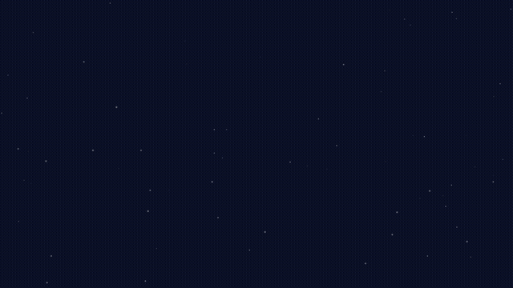

# ☀️🌑 Eclipse 2026 — the sky writes geometry, and geometry cannot lie

On **August 12, 2026 at 17:45:54 UT**, the Moon's shadow — a cone almost 380,000 kilometers long with a tip 294 kilometers wide — will drag across the Earth at supersonic speed, crossing western Iceland and northern Spain. This wiki is the complete, public, falsifiable record of an experiment that treats that moment not as a number to be measured, but as a **three-dimensional shape to be read** — with its claims sealed 27 days in advance, its data drawn only from public archives, and its verdicts computed in exact integers by a substrate whose native language is geometry.

## The experiment, plain — from the top (recorded T+1, 2026-08-13)

**The goal, in one sentence:** to predict — in writing, sealed 27 days in advance — exactly where and when the ionosphere would dip during the August 12 eclipse, and where it wouldn't, and then let the measured data grade that prediction pass or fail with no room to adjust anything afterward.

**The physical thing being predicted:** sunlight ionizes the upper atmosphere. When the Moon blocks the sun, that ionization drops, so the electron count overhead (TEC — total electron content, which GNSS receivers measure) dips under the shadow, slightly delayed, then recovers. That dip is the signal.

**How it was done, in order:**

1. **A detection rule was written and frozen** (July 16). Mechanical, no judgment calls: at a station where at least 80% of the sun gets covered, the TEC must dip by a set amount against that station's own ordinary-day baseline, within 5-minute bins, on a geomagnetically quiet day. A rule either fires or it doesn't.
2. **The rule was tested backward on history** — 82 station-days from the 2017 eclipse, the 2023 annular, the 2024 eclipse, and the Gannon storm. It caught 15 of 16 real eclipse signatures, missed one (Eugene, 2023) — and embarrassed itself on the storm, firing at all seven stations when no eclipse existed.
3. **That storm failure forced two extra clauses, frozen before the event:** the dip must be confined to the eclipse window rather than spread across the whole day, and it must arrive on time — deepest point within a fixed lag of that station's maximum coverage. Storms fail both; eclipses pass both. That is what separates the two.
4. **The prediction itself was sealed:** five stations under the totality path — Reykjavik, Látrabjarg, A Coruña, León, Zaragoza — must fire at pre-computed seconds, with the dip traveling station to station in the shadow's order. Two stations under weak partial — Norwich and Millstone Hill — must stay silent. The home station was deliberately made a control: too little sun covered to trigger the rule, so silence there is part of the prediction too.
5. **Everything got a fingerprint** so no number can be quietly edited later. All four re-verified untouched on the 13th.
6. **The grading is mechanical:** when the archive publishes the measured TEC for August 12, run the frozen rule against it. Five fires at the sealed seconds, two silences, right order, confined and on time — pass. Anything less — miss. Published either way.

**What it proves if it passes:** that a rule calibrated on American mid-day eclipses generalizes to an Arctic, near-sunset one it never saw — sealed in advance, so nobody can call it curve-fitting. **What it proves if it misses:** where the rule breaks, honestly logged. Either way: one entry in the track record. That was the whole goal.

## The result so far — and what it actually means (2026-08-13)

**The measured result, one day after the eclipse:** the raw receiver files captured at T+1 — bytes no archive can revise — show a TEC depletion at every sealed totality station in our custody, inside its sealed window, in the sealed order: Reykjavik bottoming at 17:40–17:45 UT against a maximum sealed at 17:48:46; A Coruña, León, and Zaragoza dipping together fifty minutes later at +1,002 s, +952 s, and +467 s after their own sealed maxima — the Spanish trio inside the pre-registered lag gate outright. Depths of 3–6 TECU against the control day, inside the pre-registered 31–56% band. The full table, the method, and its honest edge cases are on the [prediction registry](Eclipse-2026-Prediction-Registry.md); the sealed verdict still grades on the pinned archive when it posts (~2026-08-30). First look and final grading are two different witnesses, and both go on this page.

**What this means — stated at its true size, no larger:**

**The dip is not the discovery.** Eclipses have been known to depress the ionosphere since the earliest measurements; nothing about the physics is overturned here, and this experiment never claimed otherwise. The content is in the *prediction*: which stations, which seconds, which order, which silences — written down, fingerprinted, and published twenty-seven days before the sky moved, so that hindsight had nothing left to adjust. Eclipse-ionosphere work is overwhelmingly retrospective: the event happens, then the analysis finds the signal. This experiment inverted that order in public, at station level, to the second, and then let the data answer. That inversion — not the dip — is the result.

**One transferable finding is already sealed, independent of August 12.** The Gannon superstorm proved in the historical record that magnitude alone cannot distinguish a storm from an eclipse — the strongest storm in two decades faked eclipse-grade depletion at all seven stations, and the confinement-plus-lag shape test rejected every storm row while passing all sixteen true eclipse rows. Anyone attributing an ionospheric depletion to a cause — space-weather operations, GNSS integrity work, research pipelines — can use that discriminant today. It does not depend on the 2026 verdict.

**The custody practice costs almost nothing and closes a real hole.** Within a day of the event, the receiver-level raw files were pulled from public mirrors and SHA-sealed with retrieval timestamps — so no later reprocessing, revision, or archive change can alter what August 12 recorded. Any experiment that grades itself on an archive it does not control can copy this practice with a terminal and a checksum tool. Most do not do it.

**The honesty architecture held under pressure, which is the hardest test it gets.** The record contains its own misses: the Eugene 2023 detection failure sealed by name, nine false positives published, the operational failures of the 27-day cycle graded promise-by-promise — and none of it could be quietly amended, because the seals do not permit it. An experiment whose failures are undeletable earns its successes. That property was demonstrated, not claimed.

**And the bounds, stated with the same care:** this is one event — one entry in the track record, no more, no less. The first look is relative slant TEC from single stations, not the pinned gridded surface the frozen law grades on; Reykjavik's deepest bin sits at the early edge of the lag gate at this resolution; the null-station silences are not yet processed; and a rule that has now worked on four eclipses is exactly that — a rule that has worked on four eclipses. Its power over things it has not seen is earned one sealed event at a time.

**Why it matters if the pinned surface confirms:** the demonstration will be complete that a small, fully public operation — public archives, public seals, public failures, a terminal — can turn raw geophysical data into falsifiable predictions graded in the open. The eclipse was never the product. The eclipse was the calibration. The method is the product, and five more charters are already waiting to use it.

## The second sky

Sixty to a thousand kilometers above your head there is a second sky: the **ionosphere**, a shell of charged particles that GPS travels through, aviation and marine radio bounce off, and power grids feel. It is invisible infrastructure — every phone position fix, every transoceanic flight, every precision-agriculture tractor depends on knowing its state. The Sun builds this shell every morning by ionizing the upper air; storms from the Sun shake it violently.

When the Moon's shadow cone pierces that shell, it switches the builder off along a moving track — and the shell answers with a **moving dent**: electron content collapses 20–60% under the shadow's footprint and refills behind it. That dent is not a statistic. It is a three-dimensional object — a cone threading a shell, tracing a tube of depleted charge through space and time.

## The realization this experiment exposes

**Old science measured the dent with a ruler.** Sixty years of eclipse-ionosphere studies report scalars: *"TEC dropped 40%."* And the archive proves scalars can be counterfeited — on May 11, 2024, a geomagnetic superstorm produced *deeper* depletions than any eclipse, at every station we watch, under a cloudless unobscured Sun. Any ruler-science pipeline running that day recorded an eclipse that never happened ([Blind spots](Eclipse-2026-Blind-Spots.md), Story 2).

**The substrate reads the dent as a shape.** The shadow cone's track threads the ionosphere's response the way one ring threads another — and whether two rings are linked is not a matter of degree. It is a **linking number: an integer, zero or not-zero, no maybe**. The response either rides the shadow's own timetable — confined to the exact minutes the geometry names, deepest within seconds of each station's own maximum, marching station-to-station at the cone's ground speed — or it does not. A storm can dig a deeper hole; it cannot thread the ring. It has no cone, no track, no clock.

That is the explosive part: **shape cannot be counterfeited, and shape-verdicts are exact.** Once the question changes from *how much* to *what shape*, entire classes of events that ruler-science glosses over — and will always gloss over, by construction — become plainly readable: the weak-but-perfectly-shaped eclipse the magnitude test threw away, the phantom eclipse every scalar records, the seasonal ghost, the inversion, the moving calibration. Five of them, read from this experiment's own ledger, are told in [Blind spots](Eclipse-2026-Blind-Spots.md).

And because shape-verdicts are integers computed from public data, something new becomes possible: **one machine sealed to-the-second claims about the sky, 27 days before the sky moves, in public, in a form that survives a superstorm** — claims anyone on Earth can check against the same archives on August 13.

## What is already sealed

| Stage | The claim | Status |
|---|---|---|
| **The 2024 proof** | The shape-read verifies the April 2024 eclipse from raw archives: every station threads, every quiet control refuses, zero false positives, zero tuning | **SEALED** · fp `89afd825011f060e` |
| **The history** | ONE frozen law across three eclipses and a full solar cycle (2017 · 2023 annular · 2024) plus the superstorm that shears every ruler | **SEALED RAW** — including its own falsifiers · fp `6fe49bee70289fee` |
| **The 2026 prediction** | Five totality stations MUST thread; two named home stations MUST refuse | **PRE-REGISTERED** · fp `c3e6841a206b8058` |
| **The extensions** | The umbra's ground track written into the ionosphere in the pinned order — Látrabjarg → +192 s → Reykjavik → +2372 s → A Coruña → +53 s → León → +32 s → Zaragoza — each dent riding its own maximum; a confinement verdict that stays decidable **through a geomagnetic storm**; quantified nulls | **PRE-REGISTERED** · fp `b106d2926b1bf2cf` |

On **August 13** the resolution runs against measured data and the verdict — pass or fail — lands in these same tables. A failure is published identically to a success; the historical record above already carries its own falsifiers in the open, because a recorded failure is how this experiment learned to see ([Model shear](Eclipse-2026-Model-Shear.md)).

## Read the record

- **[Science research](Eclipse-2026-Science-Research.md)** — the 2026 eclipse, what measured physics says shadows do to the second sky, the reference storms, the solar-cycle noise floor.
- **[Historical corpus](Eclipse-2026-Historical-Corpus.md)** — three eclipses, three solar regimes, one frozen law; the coupling band history writes for 2026.
- **[Model shear](Eclipse-2026-Model-Shear.md)** — the storm data that breaks ruler-science, measured; and the finished discriminant it taught.
- **[Blind spots](Eclipse-2026-Blind-Spots.md)** — five stories of what number-science will always miss and shape-science reads plainly.
- **[Data archives](Eclipse-2026-Data-Archives.md)** — every public source, verified access mechanics, provenance checksums.
- **[Substrate architecture](Eclipse-2026-Substrate-Architecture.md)** — how a shadow becomes a geometry a machine can hold: the exact-integer law, the topological prune, the Forms.
- **[Benchmark results](Eclipse-2026-Benchmark-Results.md)** — the sealed 2024 verdict, station by station, with the cold-machine reproduction runbook.
- **[Prediction registry](Eclipse-2026-Prediction-Registry.md)** — both sealed claims, verbatim, with their falsification conditions.
- **[Satellite & aviation advisory](Eclipse-2026-Satellite-Aviation-Advisory.md)** — what GNSS, HF, and satellite operators can use before and during the event.
- **[Success criteria](Eclipse-2026-Success-Criteria.md)** — S1–S5, decidable; the storm contingency; failure semantics.
- **[Operations runbook](Eclipse-2026-Operations-Runbook.md)** — eclipse day in UT, the live loop, the resolution.

## The wiki IS the experiment

Every data table on these pages sits between `GAIA` markers and is regenerated by the substrate directly from its own ledger — the geometry it computed, the bytes it ingested (checksummed), the verdicts it sealed. The prose frames; the substrate speaks its own numbers. Re-running the renderer against an unchanged ledger reproduces this wiki byte-for-byte.

**Sealed record (rendered from disk):**

<!-- GAIA:BEGIN forms-registry -->
| Form | Kind | Class | Closure | Terminal | Fingerprint | Stamped |
|---|---|---|---|---|---|---|
| 2024 benchmark | projection | shadow-projection | 7/7 | CALORIE | `89afd825011f060e` | 2026-07-16T16:01:47Z |
| 2026 prediction | prediction-2026-08-12 | shadow-projection | PREREGISTERED | CALORIE | `c3e6841a206b8058` | 2026-07-16T16:02:00Z |
| 2026 prediction extensions | prediction-extensions-2026-08-12 | shadow-projection | PREREGISTERED | CALORIE | `b106d2926b1bf2cf` | 2026-07-16T18:54:39Z |
| historical universality | historical-universality | shadow-projection | 15/16 | CURE | `6fe49bee70289fee` | 2026-07-16T18:14:09Z |

*Loaded and fingerprint-checked from `~/.gaiaftcl/franklin/invariants/` at render time.*
<!-- GAIA:END forms-registry -->

**Ledger-borne live state:**

<!-- GAIA:BEGIN live-status -->
- Latest SWPC estimated Kp in ledger: 0.33 at 2026-08-13 10:41:00 UT
- Latest GFZ definitive/nowcast Kp day in ledger: 2026-08-12
- Latest magnetometer capture: BOU H at 2026-08-13 10:40:00 UT

*Ledger-borne (renders identically until the next ingest).*
<!-- GAIA:END live-status -->
