# We need fusion. Its safety verdict is computed in arithmetic that disagrees with itself — here is the exact one that every machine on Earth agrees on.

Not a slogan. A measurement, with integers.

A fusion reactor decides, thousands of times a second, whether its plasma is inside the density limit that separates a safe discharge from a **disruption** — the violent quench that can damage the machine. That verdict *is* the safety case: the thing a regulator has to be able to re-derive after an incident. Today it is carried by floating-point machine-learning surrogates. We took the same limit and computed it both ways.

> **On 142 operating points across ITER, SPARC, JET and DIII-D, the floating-point verdict contradicts itself** — it calls a plasma *safe* or *over the line* depending only on which value of π the program happened to round to. The exact vQbit court refuses every one of the 142, and reproduces its 2,992-verdict corpus byte-for-byte on every machine. **The numbers are in.**



**We need fusion, and this is the arithmetic its safety case has to be written in** — not a bigger computer, not more model, but an exact integer a stranger can re-derive. The full study is [Study 34 — The Observer-Invariant Verdict](Study-34-Observer-Invariant-Verdict); the app it runs in is [Affine Fusion Control](Affine-Fusion-Control).

---

## The proof, in full, because you should not take it from us

Two programs carry it, and both are replayable with no account, no key, and no trust in us.

**1 — One corpus, byte-identical on every machine.** `reproduce/fusion-determinism-digest.swift` grades a fixed corpus of **2,992 verdicts** (400 streaming traces plus a 2,592-point operating-point grid) and prints a single sha256 over all of them. It is the same string on any hardware, because every verdict is an exact integer comparison with no floating point anywhere:

```
f49b576e073835bcab17bee10fe0eee1938774643d900b8ffe1a583b159ab3d7
```

**VERIFIED** — pinned in `reproduce/validate.sh`. A different digest on your machine would mean the law diverged, which is the failure this architecture makes impossible.

**2 — The floating-point verdict of the *same* law is observer-dependent.** `reproduce/fusion-exact-vs-float.swift` grades the Greenwald density limit around the 0.85 safety threshold for four real published machines, the exact way and the floating-point way. π is irrational; the exact court commits to it only as an **interval**, `333/106 < π < 355/113`, and returns a verdict only when it holds across the whole interval — otherwise it returns `NOT_MEASURED_PI_BRACKET`, *the answer sits closer to the limit than π has been pinned*. A float implementation cannot do that: it must substitute one rounded π and return a confident answer.

| machine | operating points the exact court **refuses** | float32 verdicts that flip vs exact | two defensible rational π's that **contradict** |
|---|---:|---:|---:|
| ITER | 27 | 0 | 27 |
| SPARC | 61 | 0 | 61 |
| JET | 22 | 0 | 22 |
| DIII-D | 32 | 0 | 32 |
| **total** | **142** | **0** | **142** |

**MEASURED.** One operating point, three answers — **ITER, exactly at its 0.85 Greenwald safety threshold**:

```
   pi = 355/113  ->  MISS   (over the disruption limit)
   pi = 333/106  ->  WIN    (inside the limit)
   the exact vQbit court  ->  NOT_MEASURED_PI_BRACKET   (not to this precision)
```

Read the `float32 flips = 0` column precisely: **this is not a claim that floating point is imprecise.** Single precision resolves this clean inequality fine. The failure is deeper than accuracy — the float verdict is not *invariant*: two people, both computing the identical safety test with defensible constants, reach opposite conclusions about the same plasma, and neither can show the other why. The exact court declines to pick, on all 142, and names why.

---

## Why this is the whole game — for three different people

**ARGUMENT** — the three readings below interpret the measured rows above; they are not themselves measurements.

- **For a researcher:** a verdict that is byte-identical across machines is *composable*. Build a fleet, a cross-machine database, a decade of shots on it, and the conclusions still reconcile — because there is one answer, not one-per-platform. A floating-point verdict accumulates unreconcilable disagreement at the rate you scale it; no larger GPU cluster and no quantum sampler fixes that, because the problem is the *kind* of arithmetic, not the *amount* of it.
- **For a politician or a regulator:** a licensed fusion facility must put its machine-protection logic through a safety case. "The model was confident" is not a safety case; **"this verdict is an exact integer you can re-derive after an incident"** is. The exact court makes the safety authority — not the vendor — the party who can check the verdict. That is accountability that lives in the mathematics, not in a promise.
- **For anyone looking for hope:** the barrier here is not a missing machine and not a bigger budget — it is a control layer, and the exact one already exists and runs on a laptop, with no network and no accelerator, and **you can run it yourself** and get the same integer everyone else gets. Fusion being hard is not the same as fusion being out of reach. The part that was software is answerable, and here is the answer, in the open.

---

## This is not a fusion trick — it is a method, and it has already reached the sky

Fusion is the sharpest case, not the only one. Every study on this wiki does the same thing: **take a domain where a floating-point model is the accepted instrument, compute the same quantity in exact integers, and seal the cases where the two render opposite verdicts.** The subject under grading is always *the instrument*, never the phenomenon.

Eleven studies carry a live-court PROVEN marker on the nine cells at `affine.earth` — the black-hole image, an underground nuclear test, lattice-polytope volume, quantum parallel repetition, Connes rigidity, lethal humid heat, the stratosphere. You can grep them on the [index](Shear-Studies-Index). The difference the whole programme turns on:

> Floating-point arithmetic is not wrong — it is *approximate*, and the approximation depends on your hardware, your compiler, and the order the sum happened in. Two parties who disagree about a floating-point result have no procedure; there is only escalation, and **when instruments cannot be reconciled, the loudest institution wins by default.** Exact rational arithmetic removes that. A verdict is an integer over an integer: two machines produce the same one or they do not, and if they do not, exactly one is broken and it is findable. That is the difference between **evidence** and **testimony**.

The most urgent place that difference is already deciding something: the sky. A satellite and orbital-data-centre disposal rate already filed with regulators will inject metal into the stratosphere at **five to eleven times** the natural meteoric rate, graded by five peer-reviewed models that **disagree on the sign** of the consequence — with no instrument required to measure any of it. That case, in full, with its arithmetic and its own weaknesses named first, is **[Every season, fifty tonnes — the SpaceX biosphere-safety case](SpaceX-Biosphere-Safety)**.

---

## The limits — a court states its own

- **This court operates no reactor.** Every trace is synthetic and every operating point is presented; there is no actuation and no diagnostic feed. The only real numbers are the four machines' *published* current and minor radius. The fusion study, [Study 33](Study-33-Fusion-Control-Verdict-Court), is `PENDING`: a law graded on synthetic traces, with no device behind it, has not earned more. This proves a property of the *verdict*, not a fusion result. **REPORTED / VERIFIED.**
- **The π-bracket band is narrow** — 0.0007%–0.0023% of the Greenwald limit across the four machines — and sits below plasma-density measurement uncertainty (a few %). This is a demonstration of *kind*, not a claim that a real disruption turns on the sixth digit of π. The stakes are compositional: a verdict that is observer-dependent at any width cannot be the shared, auditable authority a planet-scale safety case needs. **ARGUMENT.**
- **We publish what cuts against us.** The whole method is falsifiable by a single reproduced counter-example, and the studies that failed are on this wiki under their own names, with their `OPEN` and `NOT_KNOWN` states stated. A page that only carries evidence for its own thesis has not looked.

---

## Rights — source-available, not open-source

This wiki, its programs, and the [Affine Fusion Control](Affine-Fusion-Control) app are published **source-available**: the source is visible so that anyone can inspect it and re-derive every figure. **That visibility grants no rights.** The repository carries no LICENSE, which under default copyright means **all rights are reserved**. No right is given or intended to use, run, or deploy any of it for any purpose other than re-deriving the published figures, nor to modify or build derivative works from it. **Any other use requires a separate written licensing agreement with the authors.**

---

## Check every number on this page

No account. No key. No dependency on us.

```bash
git clone https://github.com/gaiaftcl-sudo/uum8dSolarResearch.git
cd uum8dSolarResearch
bash reproduce/validate.sh                    # 143 checks, digest-pinned
```

The harness verifies that every figure quoted on these pages appears in the output of the program that claims to produce it, that the corpora match their published digests, and that no page cites a path you cannot reach. **If a check fails, we want the issue.** As we did the day we found a 300× error in our own π-bracket figure — `355/113 − 333/106 = 1/11978 ≈ 8.35×10⁻⁵`, not the `2.7×10⁻⁷` an earlier page claimed — the correction is published with a date on it.

---

## Start here

| page | what it is |
|---|---|
| [Study 34 — the observer-invariant verdict](Study-34-Observer-Invariant-Verdict) | the proof on this page, in full — why a fusion safety verdict must be exact |
| [Affine Fusion Control](Affine-Fusion-Control) | the local exact-integer fusion court — five panels, both laws live, 65,536 agents on one laptop |
| [Affine Fusion Control — public release](Affine-Fusion-Control-Release) | the measured, claim-graded public case for the app |
| [Study 33 — the fusion control verdict court](Study-33-Fusion-Control-Verdict-Court) | the charter, and the three-way fork it retired |
| [Every season, fifty tonnes](SpaceX-Biosphere-Safety) | the SpaceX / satellite biosphere-safety case — the same method, its most urgent application |
| [The full-grade replacement](The-Replacement-Grade) | the over-scaling law, and the vendor-to-public argument across 49 domains |
| [The ontology of this wiki](Ontology) | the type system — grades, terminals, controls, and what each page may say |
| [All studies](Shear-Studies-Index) | the programme index, every lifecycle state stated |

---

*Every figure on this page is produced by a program in `reproduce/` and, where marked VERIFIED, pinned by digest in `reproduce/validate.sh`. Projections are labelled as projections. Where we do not know, the page says we do not know. Where we were wrong, the correction is dated and the old number is named.*
