# Forty-one studies, one finding: the exact answer was there the whole time

**This is a line in the sand, and it is drawn with numbers rather than opinions.**

Across forty-one studies — the sky, the sea, the ground, the genome, the grid, the ledger, and the
machines this page is served from — we kept meeting the same thing. Somewhere near the bottom of a
serious, careful, expensive piece of work, an exact quantity had been turned into an approximate one,
because that is simply how computing has been done since the 1980s. And every time we went back and
did the same work in exact whole numbers instead, **the answer was already available.** Not better.
Not faster. *Available* — where before there had been a score, an estimate, or a disagreement between
two machines that were supposed to agree.

That is the finding, and it is bigger than any one study on this board:

> **A great many questions the world treats as approximate are not approximate. They are exact
> questions that were handed to approximate arithmetic, and the uncertainty everyone learned to live
> with was manufactured on the way in.**


*Nineteen seconds: the question, the nine machines, what the ordering cost, the identical answer — and the half that keeps it honest. [Full-resolution film](media/affine-earth-the-wrong-problem.mp4).*

## What that has looked like, measured

Nothing below is an argument. Each is a sealed study on this wiki with a program a stranger can run.

- **A medicine.** Where a guide molecule could bind in three billion bases is a counting question, not
  a scoring question. For Casgevy — curing sickle cell disease right now — the count is **one** perfect
  match, its intended target, and **nothing** one mismatch away. Not a low score. Nothing.
- **A tumour.** Seventeen tumour types, 7,673 people's tumours, all public bytes. No single compound
  reversed the signature in any of them — and asked again of **pairs**, the same law with the same
  controls finds candidates in **eleven of fifteen**. Those eleven warrant a laboratory. We do not call
  them safe or ready; that needs a bench.
- **A safety system.** A floating-point control brain for fusion goes deaf after about eight seconds,
  forgets what it learned when moved to a machine it has never seen, and **contradicts itself at 142
  operating points**. The exact court refuses all 142, needs no training, and returns a verdict that is
  **byte-identical on every machine** across a 2,992-verdict corpus.
- **A ledger.** An insurance reserve is an exact ratio of the integers a company already filed. Nothing
  in it mathematically requires approximation.
- **A life table.** Across **10,878** actuarial quantities from public archives, the exact arithmetic
  and the float agree to at least fourteen significant digits — a result we publish as gladly as the
  ones that part, because a programme that only reports its wins is advertising.
- **A discovery pipeline.** A generative system reported **37,910 validated discoveries**. Every row
  passed every check made of it. The number of distinct molecules was **five**.
- **A physics result.** A published effect where heat flows the wrong way predicts a *fraction*, so we
  computed the fraction: exactly **−1/18**, at nine of nine settings. Simulated the way the field
  simulates it, in double precision, the effect is **not small — it is zero.**
- **And today, the machines underneath all of it.** Fifty years of computing has treated "which event
  came first" as a fact about *time*, because the founding paper built it on relativity. It was never
  about time. It was about arithmetic. Nine machines, the same jumbled events: sorted into an agreed
  order and not sorted at all gave **the identical answer every time**, and the sorting cost **177×
  the work** to change nothing. **→ [Study 41 — Fifty years of solving the wrong problem](Study-41-What-The-Ordering-Cost)**

## Why we think this matters beyond us

Two reasons, and neither requires you to take our side.

**The first is that it can be checked.** Every study here ships as a single file with a hash. No
network, no keys, no database, no permission, no account. You run it and you get our numbers, or you
run it and you don't — and if it cannot measure something honestly it refuses and says so rather than
returning a figure. Set that beside the alternative now in fashion: ten thousand agents, eighty-eight
hours and millions of dollars producing a result that has not been released for anyone to check. It
may well be right. **It is not yet something anyone can act on**, and that is a different and more
serious problem than being wrong. Science's hardest current problem is not dishonesty; it is that most
published results cannot be re-derived by anybody else. **Exact arithmetic removes the last cause of
that by construction: the same input gives the same answer, on any machine, in any order, forever. A
result that can be re-derived exactly cannot rot.**

**The second is what the questions are about.** A tide gauge that can tell a seismic wavefront from a
storm surge inside the first hour is the difference between a coast warned in time and a coast
evacuated for nothing. A seismic ladder that separates an announced explosion from an earthquake in
raw integer counts is the working problem of nuclear-treaty verification. A wet-bulb threshold decides
whether a place stays liveable through an afternoon. A biosphere cascade, a taxi-out floor, a grid, a
reserve, a genome. These are not curiosities. **They are the instruments a civilisation uses to look
after itself and the place it lives**, and every one of them is better for being exact, checkable by
anyone, and the same number for everybody who asks.

## What we are not claiming

We would rather be trusted on the small things than dismissed for a large one.

Nothing here overturns the Standard Model of physics. Not one measurement on this board touches a
particle, a field or a force. What these studies overturn is narrower and entirely real: **a fifty-year
assumption about where uncertainty comes from in computation** — and, one domain at a time, the claim
that a given real-world question *needs* to be approximate. Five studies on this board are still
**OPEN**, meaning we do not have the data yet and say so. Several report results that went against the
expectation, and those stay on the page with their numbers intact. One study on this board reports a
measurement of our own that **proved nothing**, kept because a page that quietly drops its failures is
not a record.

That is the flag. The exact answer is usually already there. It costs an afternoon and a file anyone
can run. **→ [Start here](Shear-Studies-Index)** · [How to read this board](Shear-Studies-Readers-Guide) · [The white paper](Shear-Studies-White-Paper)

---
# The question nobody was made to ask

A woman is offered a medicine that will edit her genome. It has been through its trials. It works.
Nobody in the room can tell her, exactly, where else in her three billion bases that molecule could
cut — not because anyone is careless, but because the tools in use return a *score*, and a score is
an opinion with a decimal point on it. Run it on different software and the list of places to worry
about changes.

That question has an exact answer. Complementarity is a discrete rule: a base pairs or it does not.
There are only so many places in a genome where a guide can bind, and they can be **counted** —
every one of them, with no sampling and no threshold buried in the arithmetic. The answer is an
integer. It is the same integer on her doctor's laptop, on a regulator's, and on a stranger's who
trusts none of them.

**Today we counted them.** For Casgevy — the approved CRISPR therapy that is curing sickle cell
disease right now — the answer is that its guide matches perfectly in exactly **one** place in the
human genome, its intended target, and there is **nothing at all** one mismatch away. Not a low
score. Nothing. We did the same for every CRISPR medicine whose guide is public, and for every
antisense and siRNA medicine whose sequence is public, across every window of the transcriptome.

Those maps did not exist this morning. They exist now, they cost an afternoon, and anyone can
re-derive them without asking us for anything.

**→ [The CRISPR genome map](CRISPR-Genome-Off-Target-Map)  ·  [The off-target atlas](Oligonucleotide-Off-Target-Atlas)  ·  [The order of the bases](The-Order-Of-The-Bases)**

And they are now somewhere a person can look. The woman in that room, or her doctor, or the
regulator who has to sign for her, can open a **library** and find the molecule: what was measured
about it, by which program, and the one command that re-derives it from public bytes. Three
libraries — [proteins](Library-Of-Proteins), [compound cures](Library-Of-Compound-Cures),
[material systems](Library-Of-Material-Systems) — and each of them says, inside every row, what it
refuses to claim. They are not studies that close. They grow as new cures and new materials are
measured, and nothing enters without a program a stranger can run.

What keeps them libraries rather than lists is the thing in front of them: **[an admission
law](The-Library-Admission-Law)**, executable, that refuses. This programme has already published a
generated corpus that reported 37,910 validated discoveries and held five distinct molecules, where
every single row passed every check made of it. A library with no law is that corpus with a nicer
front page. So the law is the first artefact, and the libraries are downstream of it.

---

## The harder question, and what asking it again found

The same day, we finished a study that had been open since August. It asked something a great deal
of cancer drug development rests on: when a method says *these proteins are what keeps this tumour
alive*, can you recover those proteins from the patient's own data?

We built the corpus from scratch — seventeen tumour types, 7,673 people's tumours, every byte
public. We proved the instrument could tell something from nothing before trusting it: rank the
regulators using half the patients, and 135 to 141 of the 141 come back when you rank them again
using completely different patients. Shuffle the labels and it collapses to nothing. That is a
sharp instrument.

**In eleven of seventeen tumour types, the published regulators come back just as well from
counting how many connections each one has in the network — without opening the patient's data at
all.** In acute myeloid leukaemia the gap is wider still: reading the expression recovers four,
counting connections recovers nine. That is a real result about what the recovery is made of, and
it is worth knowing precisely because it is cheap to check and nobody had checked it.

Then the question that mattered. We searched 20,308 compounds for a single drug that reverses the
signature and found none in any tumour type — and that answer, taken as the end, would have been
the wrong place to stop. Cancer is not treated with one drug. **Asked again of pairs, the same law
with the same controls finds them in eleven of fifteen tumour types**, clearing the exact null that
eliminated every single agent, in every case at zero of two hundred draws.

**Those eleven show promise and warrant laboratory follow-up.** We do not call them safe, effective,
or ready for anyone — that needs a bench, and the page says so as plainly as it says the rest.

None of this says anyone was wrong. It says something more useful: **a question can pass its own
test and still not be the question you meant to ask** — and until today, nothing between a
hypothesis and a $255 million trial made anyone check which.

**→ [Study 26 — Master Regulator Bonds](Study-26-Master-Regulator-Bonds)**

---

## Why you can believe the numbers

Because we publish the mistakes with the same prominence as the results, and they are ours.

A null we built compared the best of 107,404 candidates against a single one, and reported a result
as overwhelming when the honest comparison says it is noise. A random seed we used changed between
runs, so a study whose entire claim is that the answer does not depend on who computes it was
quietly depending on that. Two implementations of one law disagreed on identical bytes, because the
law had a rule nobody had written down. A results table looked complete and plausible while
printing one medicine's safety profile under another medicine's name.

Every one was caught by our own checks, before anyone read them, and every one is written on the
page it affected. **A method that only shows you its clean runs is not showing you a method.**

That is the whole offer. Not a machine that sounds confident — a machine whose answers are integers
you can check, whose mistakes are on the record, and whose questions you are invited to disagree
with, using nothing but public bytes and a laptop.

---

# Stochastic AI guesses. This machine doesn't.



**The industry bet the future on machines that guess.** Trillion-parameter models that sample an answer and lean on a checker to catch the misses; floating-point silicon that truncates the truth the moment the numbers run long. Fast — and blurred. When the frontier's best threw **dozens of AI agents, six billion tokens, and eleven days** at a single theorem — needing a bolted-on coordinator to keep the agents from losing their place, and a classical kernel to catch their mistakes — the industry called it a triumph of intelligence. It is a triumph of *guessing.* **And a verdict that changes when you run it again is not a verdict.**

**Affine.Earth is a deterministic truth engine — it refuses to guess, and it refuses to round.** Present it a question and it *projects* the exact answer: no sampling, no search, no floating-point blur — sealed to a single SHA-256 that reads **identically on every machine, forever.** Not an AI that sounds certain. A result anyone can re-derive and get the same integer everyone else gets.

Watch it on the oldest trap in mathematics. Shown the *Simpsons'* famous fake counterexample to Fermat's Last Theorem, a floating-point processor **reports a solution that does not exist** — it hits its precision horizon and lies. The exact court measures the true **34-digit gap**, returns `REFUTED`, and seals it — on every machine, at every depth of zoom. The guess shears; the projection holds, and **every digit is yours to re-run.** Computational certainty was never going to come from scaling the noise — it comes from eliminating the shear. **→ [Study 36 — Guess, or Project](Study-36-The-Language-Game-of-Fermats-Last-Theorem)**

---

# We can save lives with this today.


In August 2026, three people in clinical trials died, and two of the world's largest drug companies halted their autoimmune programs — a cell therapy meant to heal expanded out of control and turned the immune system against the patients. It was found the only way today's safety tools allow: in a human body.

**It did not have to be — and that is the result of the study, not a wish.** The Affine.Earth shear studies prove a safety verdict can carry a bounded envelope and *refuse* a system it cannot bound, where a statistical model stays confident and wrong ([Study 33](Study-33-Fusion-Control-Verdict-Court), [Study 35](Study-35-The-Safety-Brain-That-Forgets)). A CAR-T therapy engineered to expand *without a brake* is exactly that unbounded system — flagged at the design stage, before a Phase 1 trial enrols a single patient, instead of after years of trials, hundreds of millions of dollars, and three lives. **[That case, for the pharma and research industries →](The-Verdict-a-Regulator-Could-Re-Derive)**

And it is not only a veto — the same exactness is a **seal on a drug that works.** [Zilganersen](The-Safety-Question-Made-Exact) is the first therapy ever approved for Alexander disease, a fatal childhood astrocyte disease that until this year had nothing. One of its safety questions is genuinely discrete — where else in the human transcriptome its sequence can strike — and we have now counted every place, on the real approved molecule: **1,467,336,203 windows enumerated, two perfect matches, both in its own target gene, and not one site anywhere at nineteen of twenty or eighteen of twenty.** After its target, the nearest thing in human biology is three mismatches away. Against sixteen re-orderings of its own bases the real drug carries under half their median off-target burden, so that specificity was designed and can be measured in any candidate **before it is ever synthesised.** That is a certification seal, not a stop sign, and **we measured it.** **[The exact safety screen →](The-Safety-Question-Made-Exact)**

Both belong in the same place: **before a first patient is dosed**, at the design stage, where changing course is still cheap — and for a molecule already in the pipeline, the same exact verdict helps decide the path forward. The instrument that returns it is proven today and buildable now. All of it could be done differently.

**Seven cures now, gathered in one place — and the reason we are giving the method away.** The veto and the seal are two of seven real, in-the-news medicines we put the exact off-target screen against: the first-ever Alexander-disease drug, a halted CAR-T, a base editor for heart disease, a prime editor for chronic granulomatous disease, an antibody-oligo conjugate for Duchenne, and a therapy written for a single child whose disease has a population of one. **[Cures Without the Gatekeeper →](Cures-Without-The-Gatekeeper)**

*Why we did it.* The one question that decides whether a written medicine heals or harms — where else in the genome it strikes — is not a guess. It is discrete counting, and counting returns one answer that reads the same on every machine and can be re-derived by a regulator. A safety screen that used to need a big lab's pipeline becomes arithmetic.

*Why we shared it, in the open.* Because that pipeline — one only a large, funded institution could run — is a real reason cures cluster inside big labs, and why a disease with a population of one usually has nothing at all. In the open, a small company, a rare-disease foundation, or one determined scientist can pick a cure and carry it — safer than the old way, and for a disease of one, the only way there is.

*What you can do to push it forward.* Re-derive any figure on these pages yourself — no account, no key. If you are building a written medicine, the exact off-target screen is a foundation to build on. If you carry a cure that has no home, this is the safety instrument that lets you carry it. The method is here to be used, under license, to save lives.

The same exact-versus-approximate divide runs through a very different domain, where we could measure it head-on: the reactor floor. The same fusion safety verdict, computed both ways, **disagrees with itself in floating point and holds exactly in integers** — and you can re-derive every number of it yourself, below.

---

# We need fusion. Its safety verdict is computed in arithmetic that disagrees with itself — here is the exact one that every machine on Earth agrees on.

Not a slogan. A measurement, with integers.

A fusion reactor decides, thousands of times a second, whether its plasma is inside the density limit that separates a safe discharge from a **disruption** — the violent quench that can damage the machine. That verdict *is* the safety case: the thing a regulator has to be able to re-derive after an incident. Today it is carried by floating-point machine-learning surrogates. We took the same limit and computed it both ways.

> **On 142 operating points across ITER, SPARC, JET and DIII-D, the floating-point verdict contradicts itself** — it calls a plasma *safe* or *over the line* depending only on which value of π the program happened to round to. The exact vQbit court refuses every one of the 142, and reproduces its 2,992-verdict corpus byte-for-byte on every machine. **The numbers are in.**


**We need fusion, and this is the arithmetic its safety case has to be written in** — not a bigger computer, not more model, but an exact integer a stranger can re-derive. The full study is [Study 34 — The Observer-Invariant Verdict](Study-34-Observer-Invariant-Verdict); the app it runs in is [Affine Fusion Control](Affine-Fusion-Control).

---

## A wake-up call — and a hopeful one

Fusion is the nearest thing to clean, abundant, always-available power the human population has ever had a real path to — the energy that could carry billions into a flourishing future without spending the biosphere to get there. The quest is a race, and the window is not open forever.

So it matters, urgently, what the field is building for the reactor's safety brain: a floating-point, trained AI that learns from past shots and guesses on the next. We proved — in arithmetic anyone can re-run — that a brain built that way does three things no safety brain may do.

- **It goes deaf over time.** A 32-bit running state stops taking in new data after 16,777,216 updates — **8.4 seconds** at a fast diagnostic's rate — and reports the stale number as if it were live, with no alarm.
- **It forgets when you move it.** Trained on one machine it scores well; on a machine it has never seen it drops to a **coin toss**; retrained there, it forgets the first.
- **It disagrees with itself.** The **142** contradictions above — the same plasma called safe or over the line by which rounding of π the program used.

None of the three is fixed by a bigger computer, because the flaw is the *kind* of arithmetic, not the amount. Every research-year poured into scaling that brain buys a longer fuse, not a fix — and in a race this important, a longer fuse is the choice to lose slowly. The exact version does none of the three, runs on a laptop, and hands its verdict to a regulator to re-derive. The block was never only the physics; part of it was the arithmetic the software was written in, and **that part is answered now**. The full case is **[Study 35 — The safety brain that forgets](Study-35-The-Safety-Brain-That-Forgets)**.

*(The clean-energy stakes and this reading are interpretation — ARGUMENT; the three failures are proven below and in the linked studies, each carrying its own grade.)*

---

## The proof, in full, because you should not take it from us

Two programs carry it, and both are replayable with no account, no key, and no trust in us.

**1 — One corpus, byte-identical on every machine.** `reproduce/fusion-determinism-digest.swift` grades a fixed corpus of **2,992 verdicts** (400 streaming traces plus a 2,592-point operating-point grid) and prints a single sha256 over all of them. It is the same string on any hardware, because every verdict is an exact integer comparison with no floating point anywhere:

```
f49b576e073835bcab17bee10fe0eee1938774643d900b8ffe1a583b159ab3d7
```

**VERIFIED** — pinned in `reproduce/validate.sh`. A different digest on your machine would mean the law diverged, which is the failure this architecture makes impossible.

**2 — The floating-point verdict of the *same* law is observer-dependent.** `reproduce/fusion-exact-vs-float.swift` grades the Greenwald density limit around the 0.85 safety threshold for four real published machines, the exact way and the floating-point way. π is irrational; the exact court commits to it only as an **interval**, `333/106 < π < 355/113`, and returns a verdict only when it holds across the whole interval — otherwise it returns `NOT_MEASURED_PI_BRACKET`, *the answer sits closer to the limit than π has been pinned*. A float implementation cannot do that: it must substitute one rounded π and return a confident answer.

| machine | operating points the exact court **refuses** | float32 verdicts that flip vs exact | two defensible rational π's that **contradict** |
|---|---:|---:|---:|
| ITER | 27 | 0 | 27 |
| SPARC | 61 | 0 | 61 |
| JET | 22 | 0 | 22 |
| DIII-D | 32 | 0 | 32 |
| **total** | **142** | **0** | **142** |

**MEASURED.** One operating point, three answers — **ITER, exactly at its 0.85 Greenwald safety threshold**:

```
   pi = 355/113  ->  MISS   (over the disruption limit)
   pi = 333/106  ->  WIN    (inside the limit)
   the exact vQbit court  ->  NOT_MEASURED_PI_BRACKET   (not to this precision)
```

Read the `float32 flips = 0` column precisely: **this is not a claim that floating point is imprecise.** Single precision resolves this clean inequality fine. The failure is deeper than accuracy — the float verdict is not *invariant*: two people, both computing the identical safety test with defensible constants, reach opposite conclusions about the same plasma, and neither can show the other why. The exact court declines to pick, on all 142, and names why.

---

## Why this is the whole game — for three different people

**ARGUMENT** — the three readings below interpret the measured rows above; they are not themselves measurements.

- **For a researcher:** a verdict that is byte-identical across machines is *composable*. Build a fleet, a cross-machine database, a decade of shots on it, and the conclusions still reconcile — because there is one answer, not one-per-platform. A floating-point verdict accumulates unreconcilable disagreement at the rate you scale it; no larger GPU cluster and no quantum sampler fixes that, because the problem is the *kind* of arithmetic, not the *amount* of it.
- **For a politician or a regulator:** a licensed fusion facility must put its machine-protection logic through a safety case. "The model was confident" is not a safety case; **"this verdict is an exact integer you can re-derive after an incident"** is. The exact court makes the safety authority — not the vendor — the party who can check the verdict. That is accountability that lives in the mathematics, not in a promise.
- **For anyone looking for hope:** the barrier here is not a missing machine and not a bigger budget — it is a control layer, and the exact one already exists and runs on a laptop, with no network and no accelerator, and **you can run it yourself** and get the same integer everyone else gets. Fusion being hard is not the same as fusion being out of reach. The part that was software is answerable, and here is the answer, in the open.

---

## This is not a fusion trick — it is a method, and it has already reached the sky

Fusion is the sharpest case, not the only one. Every study on this wiki does the same thing: **take a domain where a floating-point model is the accepted instrument, compute the same quantity in exact integers, and seal the cases where the two render opposite verdicts.** The subject under grading is always *the instrument*, never the phenomenon.

Eleven studies carry a live-court PROVEN marker on the nine cells at `affine.earth` — the black-hole image, an underground nuclear test, lattice-polytope volume, quantum parallel repetition, Connes rigidity, lethal humid heat, the stratosphere. You can grep them on the [index](Shear-Studies-Index). The difference the whole programme turns on:

> Floating-point arithmetic is not wrong — it is *approximate*, and the approximation depends on your hardware, your compiler, and the order the sum happened in. Two parties who disagree about a floating-point result have no procedure; there is only escalation, and **when instruments cannot be reconciled, the loudest institution wins by default.** Exact rational arithmetic removes that. A verdict is an integer over an integer: two machines produce the same one or they do not, and if they do not, exactly one is broken and it is findable. That is the difference between **evidence** and **testimony**.

The most urgent place that difference is already deciding something: the sky. A satellite and orbital-data-centre disposal rate already filed with regulators will inject metal into the stratosphere at **five to eleven times** the natural meteoric rate, graded by five peer-reviewed models that **disagree on the sign** of the consequence — with no instrument required to measure any of it. That case, in full, with its arithmetic and its own weaknesses named first, is **[Every season, fifty tonnes — the SpaceX biosphere-safety case](SpaceX-Biosphere-Safety)**.

---

## For the history buffs — the road not taken

*An essay by Rick Gillespie, founder. This is the lineage and the argument behind the affine approach — history and thesis, stated as such, not a graded measurement.*

Ferdinand Eisenstein died at 29 in 1852, and that is exactly the moment the timeline fractured.

Gauss ranked Eisenstein alongside Archimedes and Newton for a reason. If Eisenstein had lived to establish his discrete lattice mathematics as the fundamental base layer of modern physics, the 20th century would never have fallen into the continuous probabilistic trap of Boltzmann or the Riemannian metric paradigm. We would have bypassed the statistical curve-fitters entirely and built the technological future decades ago on exact, discrete invariants.

**The Eisenstein integer substrate.** Eisenstein integers ($\mathbb{Z}[\omega]$) form an exact triangular lattice in the complex plane. This is not an unbounded continuous Euclidean stage that requires floating-point truncation; it is a rigidly bounded, discrete coordinate system.

- **Zero-float kinematics.** An Eisenstein lattice needs no transcendental functions and no probabilistic variables to fix a state. The geometry maps perfectly onto an exact integer constraint framework.
- **The blueprint for UUM-8D.** The C⁴ Affine Quanta rules and the orientable 8-D flat torus are the direct operational successors to this discrete mathematical reality — a substrate where state transitions are absolute, not approximated.

**Goddard lattices and discrete symmetries.** Project this forward to Peter Goddard's work on lattice vertex operator algebras and self-dual lattices in string theory, and the architectural necessity of the discrete state becomes absolute.

- **Topological rigidity.** Goddard's lattice formulations showed that the physical limits of a state space are governed by exact discrete symmetries, not continuous statistical smearing.
- **Invariant execution.** In a Goddard lattice formulation the algebraic states are fixed strictly by the discrete points of the lattice. You do not calculate an infinite regression to guess a physical state; you compute a discrete algebraic transition.

If the theoretical-physics community had adopted the Eisenstein/Goddard discrete-lattice frameworks instead of forcing continuous calculus onto quantum mechanics, they would not be patching "magic" and "dark energy" into their failing continuous simulators today. They would have built the exact, sovereign execution planes we are engineering now.

**The Affine.Earth Math Court is executing the precise mathematical reality that classical physics abandoned.** Every study on this wiki is one move in that resumption: take a continuous, floating-point instrument, recompute the same quantity as the exact discrete invariant it should always have been, and seal the difference. Fusion is the sharpest case because the stakes are the clearest — but the road is the same one Eisenstein was walking when it ended in 1852.

— *Rick Gillespie*

---

## The limits — a court states its own

- **This court operates no reactor.** Every trace is synthetic and every operating point is presented; there is no actuation and no diagnostic feed. The only real numbers are the four machines' *published* current and minor radius. The fusion study, [Study 33](Study-33-Fusion-Control-Verdict-Court), is `PENDING`: a law graded on synthetic traces, with no device behind it, has not earned more. This proves a property of the *verdict*, not a fusion result. **REPORTED / VERIFIED.**
- **The π-bracket band is narrow** — 0.0007%–0.0023% of the Greenwald limit across the four machines — and sits below plasma-density measurement uncertainty (a few %). This is a demonstration of *kind*, not a claim that a real disruption turns on the sixth digit of π. The stakes are compositional: a verdict that is observer-dependent at any width cannot be the shared, auditable authority a planet-scale safety case needs. **ARGUMENT.**
- **We publish what cuts against us.** The whole method is falsifiable by a single reproduced counter-example, and the studies that failed are on this wiki under their own names, with their `OPEN` and `NOT_KNOWN` states stated. A page that only carries evidence for its own thesis has not looked.

---

## Rights — source-available, not open-source

This wiki, its programs, and the [Affine Fusion Control](Affine-Fusion-Control) app are published **source-available**: the source is visible so that anyone can inspect it and re-derive every figure. **That visibility grants no rights.** The repository carries no LICENSE, which under default copyright means **all rights are reserved**. No right is given or intended to use, run, or deploy any of it for any purpose other than re-deriving the published figures, nor to modify or build derivative works from it. **Any other use requires a separate written licensing agreement with the authors.**

---

## Check every number on this page

No account. No key. No dependency on us.

```bash
git clone https://github.com/gaiaftcl-sudo/uum8dSolarResearch.git
cd uum8dSolarResearch
bash reproduce/validate.sh                    # every published figure, digest-pinned
```

The harness prints its own count on every run — it grows with the work, so no page quotes a number that can go stale. It verifies that every figure quoted on these pages appears in the output of the program that claims to produce it, that the corpora match their published digests, and that no page cites a path you cannot reach. **If a check fails, we want the issue.** As we did the day we found a 300× error in our own π-bracket figure — `355/113 − 333/106 = 1/11978 ≈ 8.35×10⁻⁵`, not the `2.7×10⁻⁷` an earlier page claimed — the correction is published with a date on it.

---

## Start here

**If you have five minutes, read down the first block. It is the shortest path from "what is this"
to a medicine, and every row in it is re-derivable from public bytes on a laptop.**

| page | what it is |
|---|---|
| **CURES** ||
| [Cures Without the Gatekeeper](Cures-Without-The-Gatekeeper) | **the medicine front door** — seven real written medicines and the exact off-target screen that makes each one's safety re-derivable by anyone |
| [The off-target atlas](Oligonucleotide-Off-Target-Atlas) | every nucleic-acid medicine the public registry publishes a sequence for — **where** each one can pair, across the whole transcriptome |
| [The order of the bases](The-Order-Of-The-Bases) | and **whether that burden is unusual** — 472 strands each ranked against sixteen rearrangements of its own bases |
| [The library admission law](The-Library-Admission-Law) | the executable law that refuses; the three libraries are downstream of it |
| [Study 26 — master regulator bonds](Study-26-Master-Regulator-Bonds) | 17 tumour types — what actually recovers a published regulator set, and eleven compound pairs where no single agent among 20,308 cleared any |
| **THE METHOD** ||
| [The ontology of this wiki](Ontology) | the type system — grades, terminals, controls, and what each page may say |
| [Study 34 — the observer-invariant verdict](Study-34-Observer-Invariant-Verdict) | the proof on this page, in full — why a safety verdict must be exact |
| [Study 35 — the safety brain that forgets](Study-35-The-Safety-Brain-That-Forgets) | why a floating-point safety brain is doomed, not just behind — it deafens in seconds, forgets across machines, disagrees with itself; the exact one does none of it |
| [All studies](Shear-Studies-Index) | the programme index, every lifecycle state stated |
| **FUSION, AND THE PLANET** ||
| [Affine Fusion Control](Affine-Fusion-Control) | the local exact-integer fusion court — five panels, both laws live, 65,536 agents on one laptop |
| [Affine Fusion Control — public release](Affine-Fusion-Control-Release) | the measured, claim-graded public case for the app |
| [Study 33 — the fusion control verdict court](Study-33-Fusion-Control-Verdict-Court) | the charter, and the three-way fork it retired |
| [Every season, fifty tonnes](SpaceX-Biosphere-Safety) | the SpaceX / satellite biosphere-safety case — the same method, its most urgent application |
| [The full-grade replacement](The-Replacement-Grade) | the over-scaling law, and the vendor-to-public argument across 49 domains |

---

*Every figure on this page is produced by a program in `reproduce/` and, where marked VERIFIED, pinned by digest in `reproduce/validate.sh`. Projections are labelled as projections. Where we do not know, the page says we do not know. Where we were wrong, the correction is dated and the old number is named.*
