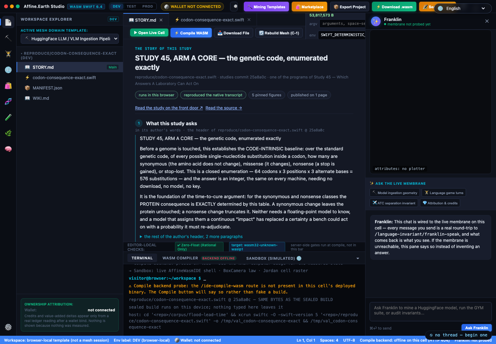
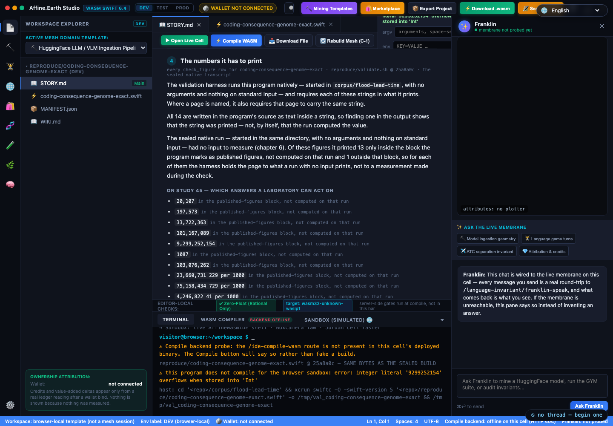
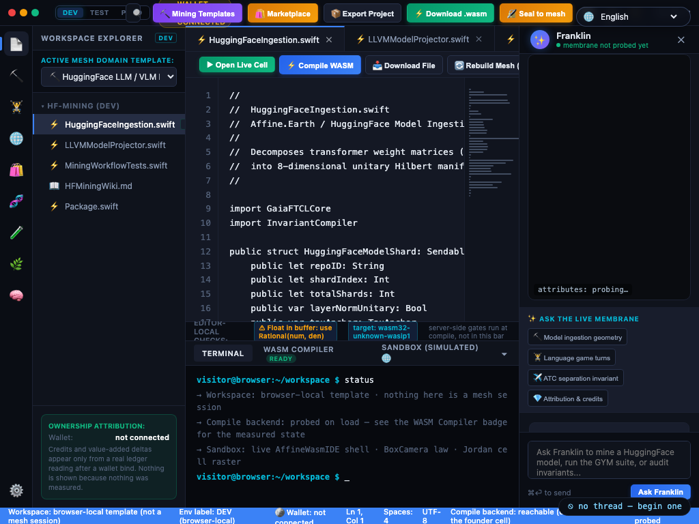

# Run any study in your browser

Every study on this wiki ends in a `reproduce/` program. Since 2026-09-11 the front door lets you run
those programs on your own device: the ▶ badge beside a program name opens it in the Affine.Earth
Studio, already built, already carrying its inputs, and runs it there — on your machine, in your
browser, with nothing sent back.


*The Studio, on the live site. Left: the study's own files. Centre: the source at the pinned commit,
with the editor-local checks strip underneath — it names the zero-float rule and the `wasm32-unknown-wasip1`
target rather than leaving them implied. Bottom: the terminal, which says plainly that the workspace
is browser-local and the sandbox is the real WASI shell. Right: a pane wired to the live membrane on
a cell, which says so when the membrane has not been probed instead of inventing an answer.*

**This is the door, and it is the reason the language work sits at the top of the front page.** A
person who can read the board in the language they think in, and then run the arithmetic behind it on
their own laptop without an account or a key, has been handed the whole thing — not a description of
it. Everything below is what that costs us to keep honest.

**And the door is on every page, not just this one.** A program named in a code span anywhere on this
wiki gets a ▶ badge beside it on the front door, resolved against the sealed manifest as the page
renders. Seven programs are named on this page and all seven are runnable, so seven of the badges
below are live links into the Studio. Nothing had to be registered for that; naming the program is
the registration.

## Every study opens on its story

A program is not a study until you know what it asks, where its numbers are published and what it
found. So a study now opens in the Studio on its story — a `STORY.md` tab, first and active, with the
source one tab to the right — told in seven chapters. **Every chapter is quoted from a source pinned at
the studies commit, and names that source on its face.** Nothing on it is written for the occasion.



| chapter | what it tells you | quoted from |
|---|---|---|
| 1 · what the study asks | the question, in its author's own words | the program's header comment, and the reproduce index where it has a row |
| 2 · where it is published | the page each of its figures is held to, then every other page that names it | `validate.sh` for the first; the live wiki, read on the spot, for the second |
| 3 · what it reads | the corpus files its code points at, each with its SHA-256 — by name, by a name pattern, or by a digest written into the code; files it names that the corpus does not carry; whether it reads standard input, its command line, the environment or the network | the program's own code, with its comments and quoted text set aside |
| 4 · the numbers it has to print | every figure the validation harness requires, and for each one whether the sealed run printed it, only quoted it as published, or printed it on a run that had no input — and whether the figure is simply written in the source as text | `validate.sh`, the source, and the sealed native transcript |
| 5 · whether it runs here | runs in the browser; compiles to wasm and then stops under the wasm runtime; or the compiler's own error | the build manifest |
| 6 · whether it reproduced | the browser build against the native build, the native line where they first part, and the line where the sealed run stood down if it had no input | the build manifest and the sealed native transcript |
| 7 · your run | after you press Run: each pinned figure, found or not found in what your device printed | this device |

**The stories were read against their sources, sentence by sentence, twice, and neither draft held.**

The first draft, read across sixty stories on 2026-09-13, carried 55 false sentences and 47 misleading
ones. Nearly all were inferred from a field that never measured the thing:

- *"This is an exact-against-float study, and the float arm is the control"* came from the build's count
  of floating-point sites — a count that takes in decimals inside comments, inside printed text and
  inside tuple accessors like `$0.1`. Most programs it appeared on declare no float at all. The sentence
  is gone, and nothing in a story is inferred from that count.
- *"It opens files"* matched `append(contentsOf:)` and writes to standard output, and missed programs
  that read standard input or their command line.
- A program that compiled to wasm and then stopped under the runtime was told it "does not build", and a
  program the build never ran was told where the build had run it.
- A sealed run that **refused** — `NO DRUG TABLE`, `REFUSE MISSING --receipts` — was reported only as
  "reproduced", beside a sentence saying a published number "cannot drift".

The second draft read the program's code instead, and was read again across all ninety: 7 false,
39 misleading and 40 missing. The misses taught the rest of what the code reader now does. A program's
own path, `CommandLine.arguments.first`, is not an argument. A file name on a line that also prints a
fallback message is still the file it reads. A directory listed and filtered by a name prefix reads the
files that match. A path joined onto a root the program walked up to find is a layout, not a relative
name. And the largest class: **a pinned figure written into the source as text proves only that the
text was printed.** Measured across the harness, 339 of its 563 pinned figures are
written into their program's source whole, inside a string. Each story now says so, figure by figure.



**A third of the studies had no sealed run at all.** The build ran a program natively only after it
compiled to wasm, so the 32 programs that do not compile for the sandbox had no sealed transcript,
and their stories could only guess from source what the harness run prints. The build now seals the
native run of every program — started where the validation harness starts it, with no arguments and
nothing on standard input — and all 90 are read. That settled the guesses: 25 of the
sealed runs had no input to measure and say so on a line the story quotes, and in 18 of them
some or all of the pinned figures appear only inside a block the program itself marks as *published,
not computed on this run*.

**Two things were broken underneath, and the stories are what found them.** The Studio's old Figures
panel read a manifest field that was empty for all 90 programs, so it told every visitor "no published
figure is pinned" while `validate.sh` pins 563 figures across 77 of them. And the manifest's list of
pages naming each program held 56 of the 84 programs the wiki actually names, because the build never
scanned the ones that do not compile for the sandbox. Both are fixed in the build. The story does not
wait for a build: chapter 2 reads the wiki as it stands, because a list of pages written into a pinned
build is out of date the day the wiki changes. Sealing every native run also showed one program writing
into the pinned corpus itself — the same bytes, this time — so the build now checks the corpus against
its own digests after every run, and refuses if a byte moved.

**Measured across all 90 stories, 2026-09-13**, by running the same story code under JavaScriptCore on
the Mac rather than a copy of it:

| | programs |
|---|---|
| a pinned figure in chapter 4 | 77 |
| a page those figures are held to, in chapter 2 | 65 |
| named somewhere on the wiki's site map, found by chapter 2's live read | 83 |
| named on no page at all — and the story says so in a sentence | 4 |
| runs in the browser · compiles, then stops under the wasm runtime · does not compile for it | 49 · 9 · 32 |
| a sealed native run that chapters 4 and 6 read | 90 |
| a sealed run that had no input to measure | 25 |
| pinned figures that appear in the sealed run only as quoted published figures | 18 |
| code that points at corpus files | 27 |
| code that names files the studies corpus does not carry | 16 |
| code that walks up the directory tree for its files | 26 |
| code that reads standard input · its command line · the environment | 9 · 31 · 3 |

The check that holds this is the story gate, `ide-tells-every-story.sh`. It builds all 90 stories
with the Studio's own code and refuses when a story cannot be built, quotes a source it could not read —
a sealed transcript included — has no words of its author, carries a machine-local path, shares its title
with another study, or disagrees with a plain `awk` over `validate.sh` about which figures a program must
print. Each refusal has a control arm that plants the defect, and the arm counts only when the refusal
names that defect.

A link can open a story at a chapter: `ide.html#reproduce/<program>.swift&chapter=2` lands on where it
is published, `&chapter=7` on your run.

## It has to fit the window you actually have

A Studio that only works on a wide desktop is a Studio most of the world cannot open, which would
undo the point of putting it on the front page at all. So the layout gives way in a stated order as
the window narrows, and the order is written down rather than left to chance.

**What was wrong, measured 2026-09-12.** The page carried 2,182 lines of CSS and **zero** media
queries, while `html` and `body` carry `overflow: hidden` — an application shell that clips rather
than scrolls. The fixed rails add up: a 48-pixel activity bar, a 310-pixel explorer, a 380-pixel
assistant pane and a 340-pixel preview feed is **1,078 pixels of furniture before the editor gets a
single pixel**. Below that width the editor was not narrow, it was cut off, and at 1,440 pixels the
titlebar's own controls were already clipped at the right edge.



*A 1,024-pixel window, before. The wallet badge is on top of the environment buttons and PROD is cut
off; the source lines end mid-word; the status bar has wrapped into three rows and is overlapping the
terminal. This is a laptop width, not an unusual one.*


*The same width, after — the live site, same afternoon. The titlebar is one row with all three
environment buttons readable and the wallet state capped rather than sitting on top of them. The
status bar is one row. The minimap and the assistant pane have stood down, and **every line of
source now reads to its end** rather than stopping mid-word: the comment that was cut at "manif" in
the frame above finishes as "into 8-dimensional unitary Hilbert manifolds with zero floating-point
drift." The explorer is the only rail left at this width.*

**What it does now**, in the order things stand down:

| width | what changes |
|---|---|
| above 1,280px | everything at full size |
| ≤ 1,280px | the three rails narrow — explorer 248px, assistant 300px, preview feed 280px |
| ≤ 1,120px | **the assistant pane, the preview feed and the minimap all stand down**, the explorer narrows to 224px, and the titlebar stops fighting itself — the brand text and badge go, the wallet badge is capped, the environment buttons compress. This is the breakpoint that gives the editor its width back |
| ≤ 900px | the explorer narrows to 196px, the command palette's box goes (⌘K still opens it), and the titlebar's five action buttons scroll sideways as a group instead of running off the right edge and taking the language selector with them — every one stays reachable and none is hidden |
| ≤ 720px | the chrome compresses — smaller titlebar, narrower activity bar, explorer at 168px, and the terminal takes a share of the height instead of a fixed 245px slab |
| ≤ 520px | the line-number gutter and the breadcrumbs stand down, the tab strip scrolls, and the editor gets every pixel that is not a control |
| any width | the status bar is one row that scrolls rather than three stacked rows that overlapped the terminal |
| a short window, any width | the terminal takes a proportion of the height rather than a fixed slab |
| a touch pointer | the activity items and titlebar buttons get a real touch target |

**One approach was tried, measured, and thrown away, which is worth recording.** The first version
turned the explorer and the assistant into overlays at 900px so the editor could keep the full width.
Captured at 768px it was **worse than what it replaced**: both panes default to open, so the two
overlays covered the editor from both sides and left a strip of code between them — and the
explorer's overlay sat on top of the activity bar that holds the button to close it. An overlay is
only right with a default-closed state, and that state lives in the page's JavaScript, which this
work deliberately does not touch. So the rails stay in the layout and narrow instead.

The load-bearing line is not a breakpoint at all. A flex child defaults to `min-width: auto`, so it
refuses to shrink below its content's own width — one long line of code was enough to push the whole
row wider than the window, and the shell then clipped it. Granting `min-width: 0` to the rails that
must give way is what makes `flex: 1` mean what it reads as. **900px and 720px are the front door's
own breakpoints**, carried in `home.html` since before this work, so the two surfaces change shape at
the same widths rather than at two sets of numbers.

Nothing above is new machinery. The collapse states (`.sidebar.collapsed`, `.ai-pane.collapsed`,
`.bottom-panel.collapsed`) and the three toggle buttons were already in the page; this only decides
when they should be used, in one stylesheet that names no selector the page did not already define.

## What you are running

- **The code at one commit.** The studies repository is pinned at `25a8a0c5e6f99903aeaf5bbcf1af5773483b4b9f`.
  The source the editor opens with is that commit's file, byte for byte: served beside the build,
  hashed in your browser, and labelled against the manifest's digest of that commit's file. The label
  is printed, not a gate — the sealed wasm is what runs, and on a device that already holds your edit
  the editor is refilled with your edit instead (the run then says so).
- **A sealed build, not a compile.** Each program was compiled once, on the founder's machine, to
  `wasm32-wasip1` with Swift 6.4, and its native transcript was sealed at the same time. The 49
  artifacts travel gzipped — 584,047,128 bytes on the wire, 1,670,622,786 unpacked — and each is
  content-addressed: the file name carries the SHA-256 of the unpacked wasm, and the browser holds the
  gzip it received to the byte count the manifest names, inflates it, and checks the inflated byte
  count and SHA-256 against the manifest before it instantiates anything.
- **A real WASI host, on your device.** The program runs in a Web Worker under a `wasi_snapshot_preview1`
  host written for this: its file system is the study's corpus (fetched from the pinned commit,
  verified per file), an overlay for your edits, and an in-memory `/tmp`. It prints to a terminal in
  the page.
- **Your session stays with you.** Edits, argv, env, stdin and the workspace live in the browser's
  origin-private file system. The session routes on the server answer `410 Gone`; the only bytes
  that leave your device are a court call you click. There is nothing to log in to and nothing to
  lose on our side — we hold no copy.

## What the transcript tells you

After a run the studio compares the SHA-256 of what your device printed on stdout with the transcript
sealed at build time. A run that finishes says one of three things:

| the line | what it means |
|---|---|
| **SAME TRANSCRIPT AS THE SEALED BUILD** | your device produced the identical bytes the founder's machine produced from the same commit |
| **INPUTS CHANGED: argv / env / stdin / corpus** | a run input differs from the sealed run's: you changed argv, env or stdin, or a file sits in this program's session overlay — your edit of any file, or a file the program itself wrote outside `/tmp` on an earlier run — or a corpus file the manifest names could not be read on this device |
| **DIFFERS … — A FINDING** | the same program and inputs printed different bytes on wasm32 than natively; the first differing line is named |

A run you stop reads **STOPPED**, and a module the host declines reads **HOST ERROR**. A run that
never starts says why instead: no artifact, the artifact unreachable, a byte count or digest that
does not match the manifest, or no corpus store on this device.

The third line is not an error page. It is what the whole programme is for: a place where an
arithmetic that should be exact is not, found by running it twice on two machines.

## The count, from the sealed manifest

| | programs |
|---|---|
| in `reproduce/` at the pin | 90 |
| run in the browser | 49 |
| of which print the sealed transcript exactly | 44 |
| of which differ from the native run — findings, first line named | 5 |
| not on the sandbox, each with the compiler's or the host's own line | 41 |

Those five are the builder's own comparison: the same program run natively on the founder's machine
and under a wasm runtime, differing at `taxiout-extract` line 2, `rate-of-rise-common-window` line 4,
`tnik-network-degree-exact` line 5, `corpus-distinct-count-exact` line 10 and
`genotype-score-ceiling-exact` line 46. What a browser makes of them is a separate measurement, and
it is below.

## Measured on every study, from a browser

On 2026-09-12 all ninety programs were put through the Studio from one machine, against the nine
cells, using the same functions the buttons call. It is repeatable: open the Studio and run
`AffineStudiesAllPass.run()`.

| | count |
|---|---|
| programs whose served source matched the manifest's digest of that commit's file | 90 of 90 |
| programs that ran | 49 |
| of those, printing the sealed transcript byte for byte | 45 |
| of those, differing from it | 3 |
| of those, withholding the comparison because a corpus file was not readable here | 1 |
| host errors, or programs that failed to open | 0 |
| programs that do not build for the sandbox, each with its compiler's line | 41 |

Total run time was 168 seconds of computation across the 49, and twelve minutes of wall clock
including every corpus fetch. The slowest three are `genotype-score-ceiling-exact` (35 s),
`af-conjunct-exact` (35 s) and `actuarial-domain-exact-vs-float` (28 s).

**The three differences are one cause, and it is not arithmetic.** Each of those programs prints the
directory its corpus came from, and the sealed transcript was taken on a machine whose absolute path
no other device can reproduce:

| program | the sealed line | what a browser prints |
|---|---|---|
| `corpus-distinct-count-exact` (line 10) | `corpus directory <builder home>/src/25a8a0c5…/corpus/eric` | `corpus directory /reproduce/../corpus/eric` |
| `taxiout-extract` (line 2) | `Derived corpus stands at ../study-32/taxiout.csv` | `Derived corpus stands at corpus/study-32/taxiout.csv` |
| `tnik-network-degree-exact` (line 5) | `corpus root (argv, not baked) : <builder home>/corpus/study-26-networks` | `corpus root (argv, not baked) : //corpus/study-26-networks` |

Every digit of those programs' arithmetic agrees. What differs is a path, which is a transcript
convention to fix upstream: a sealed transcript should not carry the absolute path of the machine
that sealed it. `corpus-distinct-count-exact` says as much in its own source, where the line is
marked as printed and not sealed.

**One program resolves the other way, and that is worth recording.**
`genotype-score-ceiling-exact` differs from the native run under the builder's wasm runtime at line
46, and in the browser it reproduces the native transcript exactly. The difference is therefore the
runtime's, not wasm32's. `rate-of-rise-common-window` reports `INPUTS CHANGED: corpus` here, because
a file the manifest names could not be read on this device, so no comparison is claimed.

Every one of the 41 still opens: the Studio shows its source at the pin and prints the compiler's own
line, and the front door carries a "◇ reads here" link beside its GitHub link. Until 2026-09-12 the
program list disabled them, so 41 of the 90 studies had no way in at all.

The 41 not on the sandbox: 17 use an integer literal or an arithmetic step that needs a 64-bit `Int`
(wasm32's `Int` is 32 bits); 9 compile but stop under the runner at run time — the builder attributes
each to the same 32-bit `Int`, and the manifest keeps the first 120 bytes of the runner's error, which
end before its stated cause — so their native transcript stays sealed and the browser is not asked to
reproduce it; 9 use Dispatch types the sandbox's Foundation does not provide (`DispatchTime` in six,
`DispatchQueue` in two, `DispatchSemaphore` in one); one each need `simd`, `CryptoKit`, `Darwin`,
`CLOCK_MONOTONIC`, `_NSGetExecutablePath`, and one does not type-check under the sandbox's compiler.
Each row carries the first line the compiler or the host printed. None of these is hidden from the
index; the ▶ badge simply does not appear for them.

## Measured on the public site

On 2026-09-11, from Safari against `https://affine.earth`, opening
`ide.html#reproduce/z8-vs-e8-lattice.swift&run=1` loaded the manifest (90 rows), the source (2,459
characters), opened the on-device session, ran the program in 1,173 ms, and reported

```
[studies] run exit 0 lines=12 ms=1173 sha=40cb714a90dc2b75 label=SAME TRANSCRIPT AS THE SEALED BUILD
```

`40cb714a90dc2b75` is the transcript digest sealed in the manifest for that program at the pin. The
same page reached the nine cells' studies tree with one manifest digest across all nine, verified
per cell by byte count and then SHA-256.

## What this does not do

- **Compile your edited Swift on affine.earth.** There is no Swift compiler in a browser and the nine
  cells carry no toolchain. Edit and run against the sealed build; a Compile request answers
  `HOST CANNOT COMPILE`.
- **Run the 41 programs above.** Explicit-width editions upstream would clear the first compiler error
  of the 17 integer-width programs; whether that brings them, or the 9 that stop at run time, across
  has not been measured. Either way it is a change to the studies, not to the sandbox.
- **Serve the corpora from the cells.** Corpus files come from the pinned commit on GitHub, per
  program, verified before the run; a mismatch labels the run `DIGEST MISMATCH` and seals nothing.
- **Replace `validate.sh`.** Chapter 7 of a study's story does run the first half of `check_figure` on
  your own transcript — it reports each figure pinned to the program as found or not found in what your
  device printed. It does not check that the page carries the figure; `validate.sh` does that, and it
  remains the instrument. A figure missing from a run whose inputs you changed was pinned for other
  inputs, and the chapter says so rather than reading the absence as a finding.
- **Store anything server-side.** Not sessions, not edits, not runs.
- Threads, `SharedArrayBuffer`, a run-time limit, cross-device sessions.

## Reproduce

The build is `scripts/build-studies-wasm.sh <commit>` run through the LAW 7 build lock; it compiles
every `reproduce/*.swift` at the commit, runs each under `wasmtime` with the study's corpus, compares
the transcript with the native run, and writes the manifest (`affine.earth.ide_studies.v1`) with
per-program source and wasm digests, the transcript digest and line count, the parity verdict and the
sandbox verdict. The study deploy script, `deploy-studies-wasm.sh <commit>`, ships the set to
the nine cells and verifies each cell by byte count then digest. Two gates stand over the result:
`studies-wasm-is-built-from-pin.sh` (every served artifact and source equals the sealed build and
`git show <commit>:<path>`, one manifest digest across the fleet; a one-byte tamper refuses) and
`ide-studies-posts-nothing.sh` (the five browser modules fetch sealed artifacts and pinned sources
and post nothing but a clicked court call; a planted beacon refuses).
