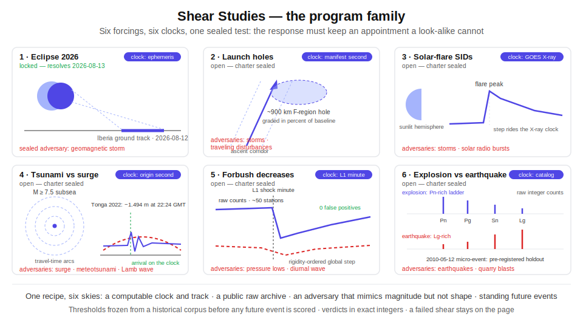

# Shear Studies — Program Index

The sky writes geometry, and geometry cannot lie. Every study on this wiki begins with a forcing that carries its own clock and its own track — a shadow cone sweeping a ground path, a rocket burn stamped to the manifest second, a flare peak on an X-ray clock, an earthquake origin time, a shock front crossing L1 — and asks whether a public raw archive answers at the place the track names and at the lag the travel time demands. The shear is the sealed, exact-integer test that the true forcing passes and its loudest look-alike fails: an adversary can mimic the *magnitude* of a response, but it cannot fake its *shape*.

*Six panels, one recipe: each study pairs a forcing that carries its own clock — ephemeris second, launch manifest, X-ray peak, origin second, L1 minute, catalog entry — and its own track with a public raw archive and a sealed look-alike adversary.*

> [!NOTE]
> One method, many skies. Study 1 (the 2026 total eclipse) is the reference implementation and is locked; the five charters below run the same recipe against different skies, seas, and ground.

## Program status

| # | Study | Status | The forcing and the shear |
|---|-------|--------|---------------------------|
| 1 | [Eclipse 2026 — Overview](Eclipse-2026-Overview.md) | **RESOLVING 2026-08-13** | The Moon's umbral cone crosses Iberia on 2026-08-12; the total-electron-content bite must ride the shadow's ground track on the ephemeris clock, with geomagnetic storms as the sealed adversary. |
| 2 | [Study 02 — Launch ionospheric holes](Study-02-Launch-Ionospheric-Holes.md) | OPEN — charter sealed | Rocket second-stage burns punch ~900 km holes in the ionospheric F-region on a manifest-published clock; the hole must confine to the ascent corridor, lag the burn second, and grade out in exact percent-of-baseline depletion — a shape that storms, Tonga-class traveling disturbances, and deorbit burns cannot fake — with an automated watch standing on future manifests. |
| 3 | [Study 03 — Solar-flare SIDs](Study-03-Solar-Flare-SIDs.md) | OPEN — charter sealed | A solar flare steps the entire sunlit hemisphere up in lockstep with the GOES X-ray clock — the eclipse geometry run in reverse — with a sealed flare-exclusion rule keeping the quiet-day windows clean, and geomagnetic storms and solar radio bursts as the sealed adversaries. |
| 4 | [Study 04 — Tsunami vs storm surge](Study-04-Tsunami-vs-Storm-Surge.md) | OPEN — charter sealed | A subsea earthquake's USGS origin second plus a Huygens travel-time chart over public tide-gauge archives separates seismic tsunamis from storm surge, meteotsunami, and Lamb-wave adversaries — anchored by live-pulled gauge records from the 2022 Tonga wave and Hurricane Sandy — and resolves as a standing law on the next M ≥ 7.5 subsea event. |
| 5 | [Study 05 — Forbush decreases](Study-05-Forbush-Decreases.md) | OPEN — charter sealed | An L1 shock minute strobes the ~50-station neutron-monitor network; a rigidity-ordered, longitude-flat global step must part — at zero false positives on raw uncorrected counts, replayed from archived snapshots against held-out negative days — from the pressure lows and the traveling diurnal wave that mimic its size but not its shape. |
| 6 | [Study 06 — Explosion vs earthquake](Study-06-Explosion-vs-Earthquake.md) | OPEN — charter sealed | A zero-free-parameter point track at Punggye-ri and a deterministic Pn/Pg/Sn/Lg arrival ladder under a catalog clock separate announced explosions from earthquakes in raw integer seismic counts, with near-site earthquakes reaching mb ≥ 4.3 and ripple-fired quarry blasts as adversaries and the contested 2010-05-12 micro-event pre-registered as a scored holdout. |

## What this program protects

These are not laboratory curiosities. A tide gauge that can tell a seismic wavefront from a storm surge inside the first hour is the difference between a timely tsunami warning and a coastline evacuated for nothing — or not evacuated at all. A flare shear that reads the sunlit hemisphere on the X-ray clock speaks to the same physics that blacks out polar aviation radio and raises crew radiation dose on high-latitude routes. A seismic ladder that separates an announced explosion from an earthquake in raw integer counts is the working problem of nuclear-treaty verification. And a launch-hole shear that confines each ~900 km ionospheric hole to its ascent corridor gives the launch industry a public, checkable ledger of its atmospheric footprint. In every case the protection comes from the same place: a frozen, exact-integer law that anyone can re-run on the raw archive.

## The shear recipe

Every charter on this wiki must instantiate all four pieces before its status line may advance. A study missing any one of them is not a shear study; it is a correlation hunt.

1. **A forcing with a computable clock and track.** The cause must announce itself in public numbers before the response is examined: an ephemeris, a launch manifest, an X-ray flux time series, a seismic catalog origin, an L1 plasma record. The clock gives the second (or minute) the response must lag from; the track gives the cone, corridor, hemisphere, chart, or point the response must confine to.
2. **A public raw response archive.** Exact URLs, file formats, cadence, and any authentication named in the charter. Raw means raw: uncorrected counts, unfiltered gauge levels, gridded values as served. Anyone with the charter and a terminal can pull the same bytes.
3. **A sealed adversary.** A named confounder that reaches the same magnitude as the true response but wears a different shape — a storm instead of a shadow, a surge instead of a wavefront, a pressure low instead of a shock. The shear must separate forcing from adversary on shape alone; separating on size is forbidden.
4. **Standing future events for pre-registration.** The forcing must recur on a schedule or a statistical drumbeat (launch manifests, flare watches, subsea seismicity, L1 monitors) so the frozen law can be tested on events that had not happened when the thresholds were sealed.

**Verdict rules, common to all studies:** verdicts are exact integers — no floating point crosses a seal. Every shear has a confinement analog (the response lives inside the track) and a traveling-lag analog (the response arrives on the clock, offset by a physical travel time). Thresholds are derived from a historical corpus, then frozen and sealed before any future event is scored. Falsifiers are recorded raw: a recorded failure is a finding, never renamed, never smoothed, never retro-fitted.

## How a result gets sealed

Every study walks the same five-stage road, in order, with no stage revisited.

1. **Charter.** The forcing, track, clock, archives, adversaries, and success criteria are written down and sealed. Status: OPEN — charter sealed, corpus not yet ingested.
2. **Corpus.** Historical events are pulled raw from the named archives — every event the archives hold, not a curated subset. The corpus page records exact pulls, byte counts, and gaps.
3. **Frozen law.** Thresholds and the shear discriminant are derived from the corpus, stated as exact integers, and sealed. From this moment the law does not move; only events move through it.
4. **Pre-registration.** Each qualifying future event is registered before it happens (or before its response data is examined), with the predicted confinement and lag written into the registry page in advance.
5. **Public resolution.** The event occurs, the archives fill, the frozen law scores the raw data, and the verdict — pass or fail, integer by integer — is published as-is. A failed shear stays on the page with its numbers intact.

Why shape and not size

Size is cheap in geophysics: storms, surges, pressure systems, and radio bursts routinely match or exceed the amplitude of the signals studied here. What none of them can do is keep an appointment — arrive inside a moving cone, lag a published second by a fixed travel time, step fifty stations in the same minute, or climb a deterministic arrival ladder. The appointment is geometry, and geometry cannot lie.

