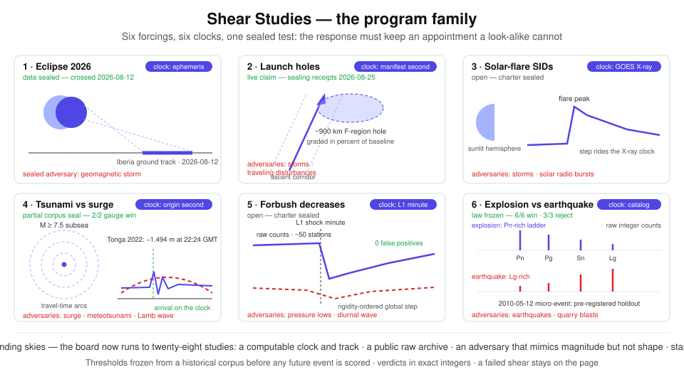

# Shear Studies — Program Index

> **Start here:** [**Zero Float · Zero Shear**](Zero-Float-Zero-Shear-Paradigm.md) · [Readers’ guide](Shear-Studies-Readers-Guide.md) · [**UUM-8D vs IUT — WIN**](UUM8D-vs-IUT-Topological-Projection.md) · [White paper](Shear-Studies-White-Paper.md) · Study 11 Ehrhart **LAW FROZEN**; Study 07 + Study 06 **LAW FROZEN**; Study 10 Fermi/DM **CHARTER SEALED**; eclipse crossed 2026-08-12 — pinned-archive verdict ~2026-08-30.

The sky writes geometry, and geometry cannot lie. Every study on this wiki begins with a forcing that carries its own clock and its own track — a shadow cone sweeping a ground path, a rocket burn stamped to the manifest second, a flare peak on an X-ray clock, an earthquake origin time, a shock front crossing L1 — and asks whether a public raw archive answers at the place the track names and at the lag the travel time demands. The shear is the sealed, exact-integer test that the true forcing passes and its loudest look-alike fails: an adversary can mimic the *magnitude* of a response, but it cannot fake its *shape*.

*Eight panels, one recipe: each study pairs a forcing that carries its own clock — ephemeris second, launch manifest, X-ray peak, origin second, L1 minute, catalog entry, Earth-rotation VLBI track, Gaia sampling clock — and its own track with a public raw archive and a sealed look-alike adversary.*

> [!NOTE]
> One method, many skies. **Zero float · zero shear** is the program doctrine. `OPEN` means we do **not** have the data — **03, 05, 08, 26, 27, 29, 30** (28 sealed its Act 1 gate 2026-08-27). 01 / 06 / 07 carry PROVEN markers on the live courts table (`STUDY01_ECLIPSE_CONE_PROVEN` · `STUDY06_EXPLOSION_LADDER_PROVEN` · `STUDY07_EHT_CSV_PROVEN`); 04 is PARTIAL_CORPUS_SEAL. 10 is CHARTER WITH ARCHIVE, not OPEN. 02 / 09 are LIVE CLAIM — 02 is sealing receipts on Starlink 10-49; 11 / 12 / 13 are LAW FROZEN + LIVE CLAIM with PROVEN markers. **Studies 22–25 are live on Glama** — [user guide](Math-Court-User-Guide.md) · [example app](Math-Court-Example-App.md) · [Math Court](Affine-Math-Court-Glama.md).

## Program status

| # | Study | Status | The forcing and the shear |
|---|-------|--------|---------------------------|
| 1 | [Eclipse 2026 — Overview](Eclipse-2026-Overview.md) | **DATA SEALED** — live court **`STUDY01_ECLIPSE_CONE_PROVEN`** · first look 2026-08-12 matched; frozen integers + 82-row corpus. | The Moon's umbral cone crossed Iberia on 2026-08-12 on a verified-quiet day; the raw first look shows the total-electron-content bite riding the shadow's ground track at all four custody stations, with geomagnetic storms as the sealed adversary. The sealed verdict grades on the pinned archive (~2026-08-30). |
| 2 | [Study 02 — Launch ionospheric holes](Study-02-Launch-Ionospheric-Holes.md) · [Regulatory alarm](Study-02-Regulatory-Alarm.md) | **LIVE CLAIM** — sealing receipts on Starlink 10-49 **2026-08-25T09:33:38Z** · physics `clock=1 track=1 table_counts=70` + `rinex_n=21` window 935–1130 `constrained=1` · Health 70/100 · Fluids Φ 4=4 | Rocket second-stage burns punch F-region holes on a manifest-published clock. This morning’s Cape jellyfish is the weekly clock; 900 km stays **cited / not measured** until Madrigal TEC posts. Hole is terrestrial de-bias vs Study 07 — not a 2D DM verdict. Edge: *not known*. Alarm package ready; no agency receipt id. |
| 3 | [Study 03 — Solar-flare SIDs](Study-03-Solar-Flare-SIDs.md) · [Predictions & validations](Study-03-Predictions-and-Validations.md) | **OPEN** — archive measured 2026-08-27: GOES X-ray SERVED anonymously; Stanford SID endpoints ABSENT (empty index / dead host) — SID leg needs a replacement source before it can run | Layer A: sunlit TEC step on GOES clock vs storms/radio bursts. Layer B: SHARP signed crossing-count helicity (exact integer, not float ∫A·B) vs large-flux quiet ARs + SWAN-SF baseline — Moffatt linking on the Sun; torsion≠linking spelled out. |
| 4 | [Study 04 — Tsunami vs storm surge](Study-04-Tsunami-vs-Storm-Surge.md) · [Results (partial)](Study-04-Tsunami-vs-Storm-Surge-Results.md) | **PARTIAL_CORPUS_SEAL** — 2/2 tsunami gauge WIN; Sandy adversary WIN; Tonga VOID_NEED_PRESSURE. Data is sealed. Claim on apex is not served yet. | Integer-mm first-onset vs chart minutes on CO-OPS pulls. Full multi-gauge Form + pressure branch still unsealed. |
| 5 | [Study 05 — Forbush decreases](Study-05-Forbush-Decreases.md) | **OPEN** — NMDB measured SERVED 2026-08-27 (anonymous ASCII lane, 1-min resolution, data 2 days fresh); ingest unblocked | An L1 shock minute strobes the ~50-station neutron-monitor network; a rigidity-ordered, longitude-flat global step must part — at zero false positives on raw uncorrected counts, replayed from archived snapshots against held-out negative days — from the pressure lows and the traveling diurnal wave that mimic its size but not its shape. |
| 6 | [Study 06 — Explosion vs earthquake](Study-06-Explosion-vs-Earthquake.md) · [Corpus](Study-06-Explosion-vs-Earthquake-Corpus.md) · [Results](Study-06-Explosion-vs-Earthquake-Results.md) · [Registry](Study-06-Explosion-vs-Earthquake-Registry.md) | **LAW FROZEN** — live court **`STUDY06_EXPLOSION_LADDER_PROVEN`** · IC.MDJ 6/6 explosion WIN; 3/3 adversary reject. Data is sealed. | Catalog clock + 53±2 s travel + SNR ≥ 20,000 ppt on raw integer counts; near-site/collapse miss the appointment. IU.INCN VOID this seal. |
| 7 | [Study 07 — Sgr A\* Milky Way raw visibilities](Study-07-SgrA-Milky-Way-Raw-Visibilities.md) · [Corpus](Study-07-SgrA-Milky-Way-Corpus.md) · [Results](Study-07-SgrA-Milky-Way-Results.md) · [Registry](Study-07-SgrA-Milky-Way-Registry.md) | **LAW FROZEN** — live court **`STUDY07_EHT_CSV_PROVEN`** · primary `csv/` 8/8 WIN; `csv_norm/` adversary 8/8 MISS. Data is sealed. | Earth-rotation `(u,v)` tracks on Sgr A\* grade public EHT Stokes-I CSV rows (closures + radial ladder + arc order). Frozen integers: short ≥ 1.5 Jy, long ≤ 0.4 Jy, ratio ≥ ×5, closure concentration ≥ 200 ppt beating scramble null. Next portal product is a registry slot, not an open study. |
| 8 | [Study 08 — Gaia BH1 astrometric shear](Study-08-Gaia-BH1-Astrometric-Shear.md) | **STANDING CHARTER, NO RUNNABLE CORPUS** — measured 2026-08-27: ESA archive serves the mean-RV row but epoch RVs are ABSENT (has_epoch_rv=false, zero rows in both epoch tables) and DR4 is unpublished (tap_schema); nothing can ingest until DR4 (announced 2026-12-02) | Raw Gaia / RV vectors for the luminous star (integer µas, m·s⁻¹) vs the published *N* M☉ dark-companion fit as adversary — pipeline 1 of the three cosmology black-hole paths; ingest = dedicated corpus only, never float-thrash into core OS or NATS. |
| 9 | Study 09 — Global Convective Bond (Affine.Earth OS press / `Study-09-Global-Convective-Bond.md`) | **LIVE CLAIM** | Traffic + atmosphere + solar; frozen Int64 thresholds; REFUSED ≠ clear sky. |
| 10 | [Study 10 — Fermi gamma shear / dark matter](Study-10-Fermi-Gamma-Shear-Dark-Matter.md) | **CHARTER WITH ARCHIVE** — HEASARC measured SERVED 2026-08-27 (943 weekly FITS, newest complete week 238 MB, range requests honored); no keV ingest yet. Not OPEN. Edge word: *not known*. | ~43.2 GeV stacked cluster line vs **Inner Galaxy null**. Continuous stack = adversary. This row does not say dark matter is disproved. |
| 11 | [Study 11 — Ehrhart volume shear](Study-11-Ehrhart-Volume-Shear.md) · [Corpus](Study-11-Ehrhart-Volume-Corpus.md) · [Results](Study-11-Ehrhart-Volume-Results.md) | **LAW FROZEN** + **LIVE CLAIM** — live court **`STUDY11_EHRHART_VOLUME_PROVEN`** · 5/5 WIN · 5/5 float adversary MISS | Integer lattice counts in dilated polytopes recover exact Ehrhart volume; float triangulation shear-fails at \(t=12\). Replaces Hohenberg–Kohn \(\int\rho\). [Conjecture map](Conjecture-Alignment-UUM8D.md) · [Fourier Phantom](Impact-Study-Fourier-Phantom.md). |
| 12 | [Study 12 — Quantum parallel repetition](Study-12-Quantum-Parallel-Repetition-Shear.md) | **LAW FROZEN** + **LIVE CLAIM** — live court **`STUDY12_QPR_PROVEN`** · 4/4 WIN · 4/4 adversary MISS | vQbit + Jordan bonds vs float amplitude tensor — discrete repetition bounds. Replaces many-electron \(\psi\). [Fourier Phantom](Impact-Study-Fourier-Phantom.md). |
| 13 | [Study 13 — Connes rigidity](Study-13-Connes-Rigidity-Shear.md) | **LAW FROZEN** + **LIVE CLAIM** — live court **`STUDY13_CONNES_RIGIDITY_PROVEN`** · 5/5 WIN · 5/5 adversary MISS | Group rigidity via integer linking invariants vs float spectral adversary. Replaces KS potential. [Fourier Phantom](Impact-Study-Fourier-Phantom.md). |
| 14 | [Study 14 — Protein lattice / PDB play](Study-14-Protein-Lattice-Manifold.md) · [Known molecular discoveries](Known-Molecular-Discoveries.md) | **LAW FROZEN** + **LIVE CLAIM** — live court **`STUDY14_PDB_HOLDINGS_PROVEN`** | 4-char PDB id from hosted holdings N=258616. IDE `#pdb-holdings`. Occupancy stays DARK. |
| 15 | [Study 15 — Skala DFT shear](Study-15-Skala-DFT-Shear.md) | **CITED** — GMTKN55 **2.72 / 2.8** kcal/mol fetched 2026-08-24. Court DARK. Not OPEN. | Contrast methods. Affine refuses the float or seals the integer. Do not call Skala useless. Same continuum court as Anima FNO ([Fourier Phantom](Impact-Study-Fourier-Phantom.md)). Family ledger: [Known discoveries](Known-Discoveries-Index.md). |
| 16 | [Study 16 — Disease type](Study-16-Disease-Type.md) | **LAW FROZEN** + **LIVE CLAIM** — live court **`STUDY16_DISEASE_ICD_PROVEN`** | ICD/DOID industry key. Generated labels do not WIN. |
| 17 | [Study 17 — Chemistry InChIKey](Study-17-Chemistry-InChIKey.md) | **LAW FROZEN** + **LIVE CLAIM** — live court **`STUDY17_CHEMISTRY_INCHI_PROVEN`** | InChIKey/CID. SMILES and float MW/logP are not the court. |
| 18 | [Study 18 — Material STD](Study-18-Material-STD.md) | **LAW FROZEN** + **LIVE CLAIM** — live court **`STUDY18_MATERIAL_STD_PROVEN`** | COD / mp-id / space-group. No minted ids. |
| 19 | [Study 19 — Go First Dice](Study-19-Go-First-Dice.md) | **LAW FROZEN** + **LIVE CLAIM** — live court **`STUDY19_GOFIRST_CITED_TUPLE_PROVEN`** | Cited Meyer 2023 5×d60. Exact `1/120`. |
| 20 | [Study 20 — Rife frequency](Study-20-Rife-Frequency.md) | **LAW FROZEN** + **LIVE CLAIM** — live court **`STUDY20_RIFE_INTEGER_FREQUENCY_CLAIM`** (claim marker, not PROVEN) | Integer Hz/nm test claim. Not efficacy. |
| 21 | [Study 21 — Stellar dynamo](Study-21-Stellar-Dynamo-Shear.md) · [kill shot](Impact-Study-Stellar-Dynamo-Kill-Shot.md) | **LAW FROZEN** + **LIVE CLAIM** — live court **`STUDY21_DYNAMO_INTEGER_STEP`** (step marker, not PROVEN) | Integer `(q,r)` + `n/d` vs continuous MHD / gyrochronology. van Saders 2016 is **their** WMB patch. No Kepler/TESS B. Not Study 09. |
| 22 | [Study 22 — The ground state is a coordinate](Study-22-QMA-2-Local-Hamiltonian.md) · [Math Court](Affine-Math-Court-Glama.md) | **LIVE ON GLAMA** — energy −1/1 · court `AFFINE_QMA_2LOCAL` | VQE sells a statistical ground energy. Affine prints the exact rational. Public tool: `execute_2local_hamiltonian`. [Example app](Math-Court-Example-App.md). |
| 23 | [Study 23 — A spin glass does not need a freezer](Study-23-QMA-Spin-Glass.md) | **LIVE ON GLAMA** — energy −1 · court `AFFINE_QMA_SPIN_GLASS` | D-Wave anneals with temperature. Affine grades a ±1 string and prints the integer. Public tool: `route_spin_glass_manifold`. |
| 24 | [Study 24 — A molecule is consistent, or it is not](Study-24-QMA-N-Representability.md) | **LIVE ON GLAMA** — WIN · court `AFFINE_QMA_NREP` | Float SDPs invent false-positive geometries. Affine cross-multiplies a rational 2-RDM. Public tool: `verify_n_representability`. |
| 25 | [Study 25 — Supremacy is often a rounding error](Study-25-Exact-Permanent.md) | **LIVE ON GLAMA** — permanent 6 · court `AFFINE_QMA_PERMANENT` | Boson-sampling floats cancel the integer. Affine prints **6** for the 3×3 all-ones matrix. Public tool: `execute_exact_permanent`. |
| 26 | [Study 26 — Master regulator bonds](Study-26-Master-Regulator-Bonds.md) | **OPEN** — charter only; archives measured SERVED 2026-08-27 (GDC open API anonymous; LINCS via GEO GSE92742 — clue.io is key-gated, routed around); regulon corpus not yet ingested; gate not run | Load-bearing regulator sets as bonds — network shape vs mutation magnitude on public TCGA/LINCS keys; test claim, not efficacy. |
| 27 | [Study 27 — Exact nuclear scattering](Study-27-Exact-Nuclear-Scattering.md) | **OPEN** — charter only; archives measured SERVED 2026-08-27 (EXFOR x4get API + AME2020, both anonymous); configuration corpus not yet ingested; gate not run | Glauber all-orders vs optical-limit smear on public EXFOR/AME2020 keys — the field's own 30–50 mb divergence replayed in exact integers; test claim, not efficacy. |
| 28 | [Study 28 — Wet-bulb threshold court](Study-28-Wet-Bulb-Threshold-Court.md) | **ACT 1 SEALED** — gate GREEN 2026-08-27; **17 flips sealed** at the 611/20 survivability line on the pinned 2025 Gulf slice (S2 23,620/23,741; zero far-field breaches); Act 2 gated on `access/2026/` | exact psychrometric key vs the float regressions on NOAA ISD integer station-hours; the fitted surface flips one-sided at the line while the same identity iterated in float never flips; verdict about the instrument, never the physiology. |
| 29 | [Study 29 — The continuous-model shear](Study-29-Continuous-Model-Shear.md) | **OPEN** — charter frozen 2026-08-31 on the 26/27 precedent (archives measured served on both sides, response corpus not ingested, gate not run); descriptive corpus census run and published, **no flip census and no confinement census scored**; all four recipe pieces instantiated — 1, 3 and 4 executable today, 2 at archive level with its grading thresholds at corpus stage over a frozen derivation window; four losses each with a scored form, **fourteen control arms** (eleven tabled plus I, J, K) and five halt conditions frozen before scoring | The field's continuous chemistry-transport models disagree on the sign of the ozone response to reentry alumina and on the species they attribute it to; the counting half is re-executed in exact integers from one anonymous CC-BY-4.0 catalogue. Forcing: GCAT `satcat.tsv`, 19,293,257 B, sha256 not yet pinned (owed) — 1,907 calendar-2025 reentry rows, dry mass gram-exact on 1,907/1,907 by string-regex census, inclination exact in centi-degrees on 1,907/1,907 with zero quality flags, 461,213,509 g total, 76.79% of it in three of nineteen 5° turning-latitude band slots. Measured ledger arithmetic, published as arithmetic: 30 kg per 250 kg is the exact rational 3/25, and Maloney's own >60,000-on-orbit case at a five-year life gives 12,000 reentries/yr → 374.4 t/yr alumina at 260 kg and 1,152 t/yr at 800 kg, so "10 Gg/yr" and "over 360 t/yr" are different quantities and the circulating ~28× is the ratio between them — alumina against alumina is exactly 16/5 and exactly 26/25 (4%). Adversary sealed: Hunga 2022-01-15 (~9-year residence time), two live shape separators, the composition separator excluded as a closed campaign archive; second arm the 2019/20 Australian smoke on front direction. Confinement threshold frozen at n/d = 1/5; Crossing R declares the read-once floor quantiser at the float-served response archives. Nineteen complete months, minimum 97 events. Verdict about the instrument, never the atmosphere. |
| 30 | [Study 30 — The sovereign edge pod](Study-30-Sovereign-Edge-Pod.md) | **OPEN** — hardware and protocol validation charter, frozen 2026-08-31; no pod built, no tier run; OPEN in this board's own sense — gate integers frozen, no corpus ingested. Four tiers with per-tier failing observations and control arms: T2/T4 runnable against a built pod, T3 runnable on its inbound-frame and 42-byte-length arms with its subject allow-list unfrozen, T1 not runnable (cell and enclosure ΔK unpinned). Gate 1 resolved by specification: PMIC input pinned at 510 mW (TI SLUSBH2G) against a ~400 mW nominal panel, 481 mW worst case at −20 °C. Geometry and mesh spine shipped and measured. | **Not a shear study and says so** — one of the recipe's four pieces (a sealed adversary) with the three it lacks named. The constructive architecture: the shipped three-axis spatial quotient map with an explicit winding, replacing a ±4 clamp; a det = 1 unimodular 8×8 mapping 4,000 distinct Z⁸ points to 4,000 distinct integral images, with reachability and not image count as the discriminating arm; the erasure located in the R → Z⁸ ingest, never in the transform; a 42-byte wire frame with N = 65,536 fixed by the int16 axis width; the binding 60 tx/hr rate at 3.240 J/hour against a 125 tx/hr regulatory ceiling the frozen cadence never reaches, and an 83.1 mJ/hour quiet floor. The mesh spine pinned at 24,996 B, sha256 b46bb35b…0261c — 48 domains, 88 role entries, 122 may_ingest fields, no_float on 48/48 — so a pod is a role in a domain and a new sensing capability is a published law, not a hardware refresh. Applications for land, water, farming and predator early warning state what would become measurable and no outcome. No cost advantage is claimed. |

Generated-candidate hashes (not a new study number): [protein-material-aggregates.json](https://affine.earth/language-game/discoveries/protein-material-aggregates.json) — Look only, N=125302. Play proteins on `#pdb-holdings`. OPEN (no corpus ingested) is 03 / 05 / 08 / 26 / 27 / 29 / 30 — Study 28 sealed its Act 1 gate 2026-08-27.

## What this program protects

These are not laboratory curiosities. A tide gauge that can tell a seismic wavefront from a storm surge inside the first hour is the difference between a timely tsunami warning and a coastline evacuated for nothing — or not evacuated at all. A flare shear that reads the sunlit hemisphere on the X-ray clock speaks to the same physics that blacks out polar aviation radio and raises crew radiation dose on high-latitude routes. A seismic ladder that separates an announced explosion from an earthquake in raw integer counts is the working problem of nuclear-treaty verification. A launch-hole shear that confines each ~900 km ionospheric hole to its ascent corridor gives the launch industry a public, checkable ledger of its atmospheric footprint. And a galactic-center visibility shear that grades the public Sgr A\* CSV before any ring PNG keeps the Milky Way's most famous image honest to the bytes anyone can download. In every case the protection comes from the same place: a frozen, exact-integer law that anyone can re-run on the raw archive.

## The shear recipe

Every charter on this wiki must instantiate all four pieces before its status line may advance. A study missing any one of them is not a shear study; it is a correlation hunt.

1. **A forcing with a computable clock and track.** The cause must announce itself in public numbers before the response is examined: an ephemeris, a launch manifest, an X-ray flux time series, a seismic catalog origin, an L1 plasma record. The clock gives the second (or minute) the response must lag from; the track gives the cone, corridor, hemisphere, chart, or point the response must confine to.
2. **A public raw response archive.** Exact URLs, file formats, cadence, and any authentication named in the charter. Raw means raw: uncorrected counts, unfiltered gauge levels, gridded values as served. Anyone with the charter and a terminal can pull the same bytes.
3. **A sealed adversary.** A named confounder that reaches the same magnitude as the true response but wears a different shape — a storm instead of a shadow, a surge instead of a wavefront, a pressure low instead of a shock. The shear must separate forcing from adversary on shape alone; separating on size is forbidden.
4. **Standing future events for pre-registration.** The forcing must recur on a schedule or a statistical drumbeat (launch manifests, flare watches, subsea seismicity, L1 monitors) so the frozen law can be tested on events that had not happened when the thresholds were sealed.

**Verdict rules, common to all studies:** verdicts are exact integers — no floating point crosses a seal. Every shear has a confinement analog (the response lives inside the track) and a traveling-lag analog (the response arrives on the clock, offset by a physical travel time). Thresholds are derived from a historical corpus, then frozen and sealed before any future event is scored. Falsifiers are recorded raw: a recorded failure is a finding, never renamed, never smoothed, never retro-fitted.

## How a result gets sealed

Every study walks the same five-stage road, in order, with no stage revisited. Studies that reach the live path add a standing sixth surface: a live court served on the OS (the `lattice_courts` table at `/language-invariant/games`), whose PROVEN or claim marker — `STUDY11_EHRHART_VOLUME_PROVEN`, `STUDY20_RIFE_INTEGER_FREQUENCY_CLAIM` — is the ledger-borne form of the verdict, sealing a receipt for every presented claim.

1. **Charter.** The forcing, track, clock, archives, adversaries, and success criteria are written down and sealed. `OPEN` is reserved for the next stage: we do **not** yet have ingested data / frozen integers. A named archive in the charter is not OPEN if the stronger term (`CHARTER WITH ARCHIVE`, `DATA SEALED`, `LAW FROZEN`) already applies.
2. **Corpus.** Historical events are pulled raw from the named archives — every event the archives hold, not a curated subset. The corpus page records exact pulls, byte counts, and gaps.
3. **Frozen law.** Thresholds and the shear discriminant are derived from the corpus, stated as exact integers, and sealed. From this moment the law does not move; only events move through it.
4. **Pre-registration.** Each qualifying future event is registered before it happens (or before its response data is examined), with the predicted confinement and lag written into the registry page in advance.
5. **Public resolution.** The event occurs, the archives fill, the frozen law scores the raw data, and the verdict — pass or fail, integer by integer — is published as-is. A failed shear stays on the page with its numbers intact.

Why shape and not size

Size is cheap in geophysics: storms, surges, pressure systems, and radio bursts routinely match or exceed the amplitude of the signals studied here. What none of them can do is keep an appointment — arrive inside a moving cone, lag a published second by a fixed travel time, step fifty stations in the same minute, or climb a deterministic arrival ladder. The appointment is geometry, and geometry cannot lie.

