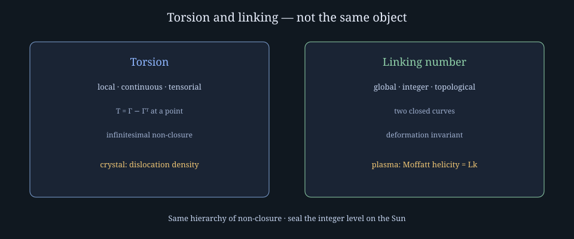
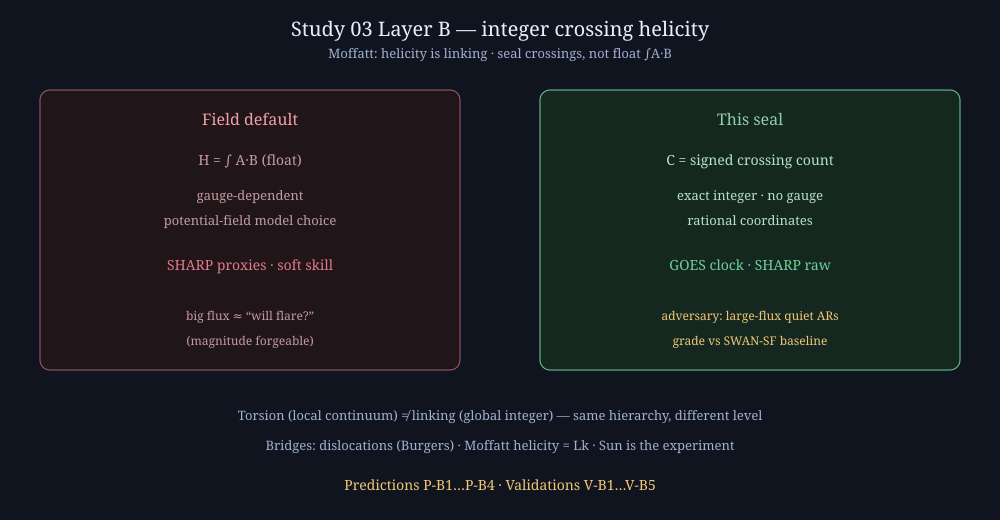

# Study 03 — Predictions and validations (both layers)

This page is the **decidable checklist** for Study 03. Nothing here is scored by narrative. Each row is WIN / MISS / VOID from named public archives and sealed integers.

**Parent charter:** [Study 03 — Solar-flare SIDs](Study-03-Solar-Flare-SIDs.md)  
**Status:** OPEN — charter + Layer B sealed in prose; TEC corpus and SHARP corpus not yet ingested; thresholds not frozen until corpus runs.

---

## Vocabulary correction (read before any torsion language)

| Object | What it is | What it is not |
|---|---|---|
| **Torsion** (affine) | Local, continuous, tensorial: \(T^\lambda{}_{\mu\nu}=\Gamma^\lambda{}_{\mu\nu}-\Gamma^\lambda{}_{\nu\mu}\) at a point — infinitesimal parallelogram non-closure | Not a linking number; not “the Jordan bond” |
| **Linking number** | Global, **integer**, topological — property of two disjoint closed curves, deformation-invariant | Not a continuum torsion tensor |
| **Program stance** | Our sealed invariants sit **where torsion sits in the affine hierarchy** (non-closure), realized as **integer linking / crossing counts** in the analogs where physics already equates them | We do **not** claim Einstein–Cartan torsion is measurable in this study |

**Bridge 1 (citation, not this study’s experiment):** crystal dislocations — Kondo (1952), Bilby–Bullough–Smith (1955), Kröner: torsion ↔ dislocation density; Burgers-circuit closure failure ↔ **lattice (integer) Burgers vector**; dislocation lines link in 3D.

**Bridge 2 (this study’s working physics):** magnetic helicity — Moffatt (1969): \(H=\int\mathbf{A}\cdot\mathbf{B}\) **is** the linking of magnetic field lines; for two flux tubes \(H=2\Phi_1\Phi_2\,\mathrm{Lk}\) (identity, not analogy). Berger & Field: open fields. Modern winding / pairwise-crossing formulations on SHARP magnetograms are the computational door to an **exact integer** on rationalized coordinates.

**Not attempted:** Einstein–Cartan torsion coupled to intrinsic spin (effects negligible except at extreme densities ~10⁵⁴ g/cm³). No accessible experiment. Testable torsion–linking physics lives in dislocations, superfluids, knotted optics, and **solar magnetic helicity**.

---

## Layer A — Ionospheric SID (GOES × Madrigal TEC)

### Recipe

| Piece | Instantiation |
|---|---|
| Clock + track | GOES XRS peak minute; sunlit cap by solar zenith angle χ |
| Raw archive | NCEI/SWPC GOES + Madrigal TEC 5-min grids |
| Adversary | Geomagnetic storms (Gannon, Halloween); radio-burst lock-loss |
| Integer seals | TECU×100 band steps; first-epoch onset; SZA order; night floor |

### Predictions (pre-register before freeze)

| ID | Prediction | Falsifier |
|---|---|---|
| **P-A1** | On a qualifying ≥X1 disk-center flare (≤60° from disk center, coverage gates N,M met), sunlit bands (χ&lt;80°) show positive **onset** in the first 5-min Madrigal epoch at/after peak T and **magnitude** step ≥ sealed threshold, SZA-ordered | Onset missing, magnitude below threshold, or SZA order broken → **MISS** |
| **P-A2** | Night band (χ&gt;100°) \|magnitude step\| ≤ sealed negative floor on that same event | Night exceeds floor → **MISS** |
| **P-A3** | During Gannon / Halloween main phase **outside** flare-exclusion windows, detector fires **zero** flare-detections | Any detection outside exclusion → **MISS** (adversary win) |
| **P-A4** | 2006-12-06 radio burst scores as **data-quality** (dropout ≥ sealed) not as SZA-ordered TEC step | Coherent SZA step without dropout signature → **MISS** |

### Validations (decidable)

| ID | Validation | Pass rule |
|---|---|---|
| **V-A1** | S1 crucible | 2003 X17, 2017 X2.2, 2017 X9.3 band-median steps inside sealed acceptance intervals; coverage gate or VOID-by-coverage recorded raw |
| **V-A2** | S2 adversary silence | Zero detections in Gannon/Halloween outside exclusion; 2006 as dropout event |
| **V-A3** | S3 freeze | Detection threshold = max cleaned negative-window sunlit step; night floor = max \|night\|; both published with derivation **before** first 2026 score |
| **V-A4** | S4 live | Next qualifying flare graded under frozen law; result published raw |

Full metric text: parent charter §§ shear metric, success criteria.

---

## Layer B — SHARP integer crossing-count helicity (flare forecast shear)

Extends Study 03 — **same GOES clock**, solar magnetic topology as the pre-flare shape, not a new program domain.

### Recipe

| Piece | Instantiation |
|---|---|
| Clock | GOES flare begin/peak/class (same catalogs as Layer A) |
| Raw archive | SDO/HMI **SHARP** vector magnetograms via JSOC Stanford (public; campaign from 2010-05); SWAN-SF benchmark time series for community baseline |
| Adversary | **Large-flux active regions that do not flare** — magnitude forgeable; topology may not be. Same epistemic role as Gannon for eclipses |
| Integer seal | Field-line **signed crossing count** (combinatorial linking / winding proxy) on rationalized coordinates — **exact integer**, no ∫A·B float, no gauge choice, byte-stable across machines |

### Why this is the contribution

| Field default | This study |
|---|---|
| Helicity as float ∫A·B (gauge-dependent, model-sensitive) | Signed crossings summed → **exact integer** |
| SHARP parameters as helicity **proxies** | Direct combinatorial winding on traced lines |
| Free-energy proxies depend on potential-field model | Crossing count has **no potential-field model** in the seal |
| Forecast skill scored on size of AR | Skill scored on **matched-magnitude nulls** (big quiet ARs) |

Paper claim (when corpus freezes): *exact integer crossing-count helicity vs float-integral / proxy baselines; does it separate flaring vs matched-flux quiet ARs better than SWAN-SF baselines?*

### Predictions (pre-register before freeze)

| ID | Prediction | Falsifier |
|---|---|---|
| **P-B1** | For sealed lookback window W before GOES ≥M-class (threshold class sealed with Form) on disk ARs with SHARP coverage, integer crossing-count \(C\) meets \(C \ge T_C\) more often on flaring ARs than on flux-matched quiet controls at sealed false-positive budget | Equal or worse separation than chance at that budget → **MISS** |
| **P-B2** | On the sealed **matched-magnitude adversary set** (high total unsigned flux, no flare in sealed forward window), false-positive rate of \(C \ge T_C\) ≤ sealed integer bound F | Exceeds F → **MISS** |
| **P-B3** | Integer \(C\) is **byte-identical** on three independent machines from the same SHARP patch bytes and sealed tracer settings | Any mismatch → **MISS** (reproducibility fail) |
| **P-B4** | Against **SWAN-SF** published baseline metrics on the same AR/time splits, sealed \(C\)-based rule improves at least one sealed skill integer (e.g. TSS×1000 or precision×1000) without raising false positives above F | No improvement on any sealed skill integer → **MISS** (no methodological gain) |

### Validations (decidable)

| ID | Validation | Pass rule |
|---|---|---|
| **V-B1** | Corpus inventory | SHA-256 of every SHARP series + GOES event list used; AR count and patch count published (target: full public SHARP span available at ingest — literature cites ~2,071 ARs / ~1.5×10⁶ patches in early years as scale reference, REPORTED) |
| **V-B2** | Quantizer freeze | Tracer, grid rationalization, crossing-sign rule, and \(T_C\), F, W, class floor sealed with derivation from train split **before** test split is opened |
| **V-B3** | Adversary grade | Matched-flux quiet AR set graded; FP count published raw |
| **V-B4** | Baseline grade | SWAN-SF comparison table published with identical splits |
| **V-B5** | Live / holdout | Sealed holdout years or next N flares after freeze graded; results append-only |

### Explicit non-goals (Layer B)

- Not a proof of Einstein–Cartan torsion in the solar interior.
- Not “torsion = Jordan bond.”
- Not a float ∫A·B competition on gauge choices — the seal **refuses** float helicity as the graded primitive.
- Not Layer A replacement: SID law still grades the ionosphere after the flare; Layer B grades **pre-flare** magnetic topology.

---

## Joint success — when Study 03 may advance status lines

| Gate | Requirement |
|---|---|
| Charter | Done (Layer A + Layer B on this page + parent) |
| Corpus A | Madrigal + GOES fossils ingested |
| Corpus B | SHARP + GOES + SWAN-SF splits ingested |
| Frozen law A | TEC thresholds sealed |
| Frozen law B | \(T_C\), F, W, class floor sealed |
| Pre-registration | Next flares listed before score |
| Public resolution | WIN/MISS rows on both layers published raw |

**Study status advances only when the corresponding layer’s freeze exists.** Layer A can freeze before Layer B; neither silently inherits the other’s thresholds.

---

## Archive pointers (Layer B)

| Archive | Access | Role |
|---|---|---|
| JSOC Stanford — SDO/HMI SHARP | http://jsoc.stanford.edu/ (series e.g. `hmi.sharp_*`) | Vector magnetogram patches, ~12 min cadence |
| GOES X-ray event lists | Same as Layer A (NCEI / SWPC) | Flare clock |
| SWAN-SF | Community flare-forecast benchmark on SHARP time series (REPORTED — cite exact DOI/repo at corpus ingest) | Baseline to beat or match under sealed skill integers |

---

**Document control:** Version 1.0 · 2026-07-25 · predictions P-A*/P-B* and validations V-A*/V-B* are the only scoring contracts for Study 03 until a later version appends rows (append-only).
