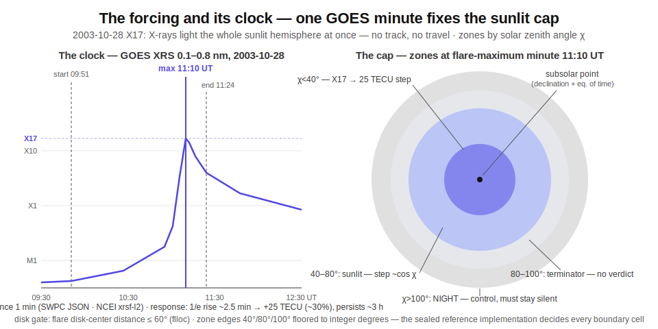
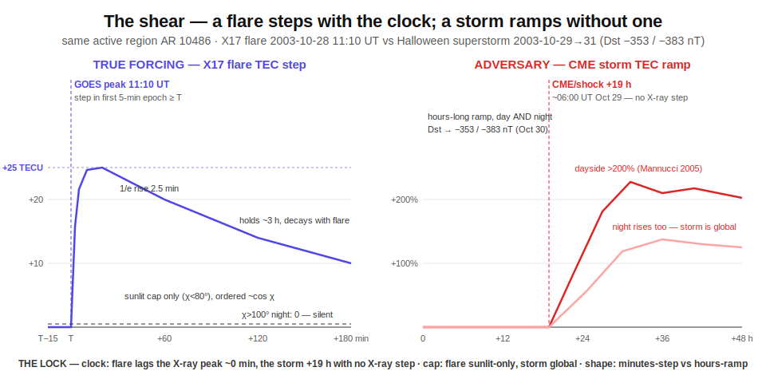
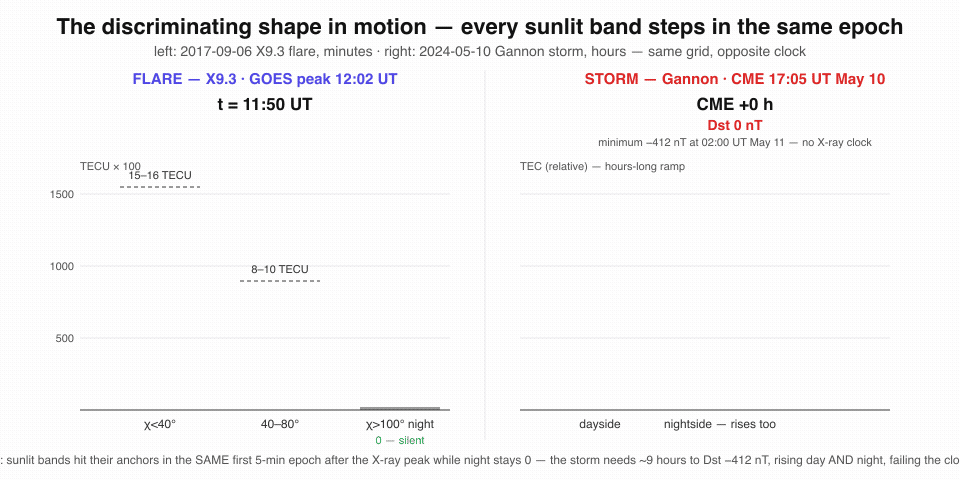

# Study 03 — Half the Sky Steps Up at Once: Solar-Flare Sudden Ionospheric Disturbances

On 2003-10-28, the GOES X-ray sensor watched a flare at the center of the solar disk climb to X17, peaking at 11:10 UT. Within about 2.5 minutes, the total electron content of the sunlit ionosphere stepped up by roughly 25 TECU — about 30% above background — and held the disturbance for some three hours (Tsurutani et al. 2005; flare timing VERIFIED against the NGDC X-ray report — see corpus below). Not in one place: everywhere the Sun was up, at once.

The eclipse study ([Eclipse 2026 — Overview](Eclipse-2026-Overview.md)) watched a small shadow travel across the ground and carve the ionosphere **down** along a track computable to the minute. This study is its exact mirror. When a solar flare erupts, X-rays and extreme ultraviolet arrive at light speed and light the **entire sunlit hemisphere simultaneously** — no track, no travel, no waiting. The ionosphere over half the planet steps **up** within minutes, in lockstep with an X-ray clock a satellite reads once per minute. And the response is ordered by a single geometric quantity: how high the Sun stands in each patch of sky.

Same grid. Same integer quantizer. Opposite sign. Complementary geometry. The sky writes geometry, and geometry cannot lie.

---

## The forcing and its clock

**The clock** is the GOES XRS 0.1–0.8 nm soft X-ray channel — the instrument whose scale defines flare classes (an "X9" is a reading of the 0.1–0.8 nm flux). It is public in two forms:

- **Live**, 1-minute cadence: NOAA SWPC JSON at `services.swpc.noaa.gov/json/goes/primary/xrays-*.json` (fields `time_tag`/`satellite`/`flux`/`energy`; **VERIFIED by fetch 2026-07-16**, currently GOES-18 primary).
- **Archival, science-quality**: NCEI GOES-R XRS Level-2 netCDF (`xrsf-l2-avg1m_science`, 2017–present) and the GOES 1–15 XRS science archive (goes08–goes15 present, 1995–2020). Flare begin/max/end times to the minute come from SWPC edited event lists (XRA rows) and the `xrsf-l2-flsum_science` flare-summary netCDF (**VERIFIED**: the GOES-18 summary file runs through 2026-07-15). For events before mid-2015 — the floor of the SWPC FTP events archive — they come from the NGDC GOES XRS flare reports (`ngdc.noaa.gov/stp/space-weather/solar-data/solar-features/solar-flares/x-rays/goes/xrs/`; **VERIFIED by fetch 2026-07-16**: the yearly report file contains the 2003-10-28 row).

**Clock precision**: 1 minute, with a 1-second science product (`xrsf-l2-flx1s_science`, **VERIFIED** in the NCEI directory) if finer timing is ever needed. The published 1/e rise time of the ionospheric response is ~2.5 minutes (Tsurutani et al. 2005), so a 1-minute clock resolves the onset.

**The track** is not a moving curve — it is a cap. At flare-maximum minute *t*, compute the subsolar point (solar declination from the date, equation of time for the subsolar longitude), then the solar zenith angle χ for every cell of the global TEC grid:

| Zone | Definition | Role |
|---|---|---|
| **SUNLIT** | χ < 80° | where the step must appear, ordered ~cos χ (Chapman geometry) |
| **TERMINATOR** | 80° ≤ χ ≤ 100° | excluded band — grazing geometry, no verdict taken here |
| **NIGHT** | χ > 100° | control — must stay silent |

None of this geometry is left to the reader's almanac: the solar-declination and equation-of-time formulas for the subsolar point, the formula for χ per grid cell, the disk-center-distance computation from the `flloc` latitude/longitude, and the float→integer-degree rounding rule (floor to whole degrees) are sealed as one named reference implementation alongside the thresholds. Published almanac formulas disagree by up to ~0.5° — enough to flip integer-degree membership at the 40°/80°/100° band edges and the 60° disk gate — so the sealed implementation, not a judgment call, decides every boundary cell.

The eclipse program's obscuration track asked *where the shadow is now*. This study asks *where the Sun is up right now* — a computation of the same kind, run in reverse: flares step total electron content **up** across the whole instantaneous sunlit cap at once; eclipses carve it **down** inside a small traveling shadow.


*The forcing and its clock: one GOES X-ray minute and one subsolar point fix the entire scoring geometry — sunlit cap, terminator band, night control.*

---

## The response archive

Raw, public, named to the URL. Nothing scored here comes from a private feed.

| Archive | URL | Format | Cadence | Auth | Sourcing |
|---|---|---|---|---|---|
| NCEI GOES-R XRS L2 1-min irradiance (GOES-16/18) | `https://data.ngdc.noaa.gov/platforms/solar-space-observing-satellites/goes/goes16/l2/data/xrsf-l2-avg1m_science/` (GOES-18 under `.../goes18/...`) | netCDF-4, yearly files + full-mission file; XRS-A (0.05–0.4 nm) and XRS-B (0.1–0.8 nm) in W/m² | 1 min; GOES-16 2017-02-07 → 2025-04-06, GOES-18 continues | none (open HTTPS directory) | **VERIFIED by fetch 2026-07-16**; sibling products `flsum` (flare class/begin/peak), `flloc` (disk location), `flx1s` (1-s flux) also VERIFIED |
| NOAA SWPC real-time GOES X-ray JSON | `https://services.swpc.noaa.gov/json/goes/primary/xrays-6-hour.json` | JSON array `{time_tag, satellite, flux, observed_flux, electron_correction, energy}` | 1 min, rolling 6-h/1-d/3-d/7-d windows, updated ~every minute | none | **VERIFIED by fetch 2026-07-16** (live GOES-18 records) |
| NOAA SWPC edited event reports | `https://services.swpc.noaa.gov/text/solar-geophysical-event-reports.txt` (daily files at `ftp://ftp.swpc.noaa.gov/pub/indices/events/`) | fixed-width text; XRA rows carry Begin/Max/End to the minute, class, active region | updated every 5 min; FTP archive reaches back to 2015-06-29 | none | **VERIFIED by fetch 2026-07-16** (live and FTP) |
| NCEI GOES 1–15 XRS science archive (pre-GOES-R) | `https://www.ncei.noaa.gov/data/goes-space-environment-monitor/access/science/xrs/` | netCDF per satellite (goes08…goes15) + 2025-reprocessing readme PDF | 1-min averages + high-cadence, 1995–2020 | none | **VERIFIED by fetch 2026-07-16**; needed for the 2003-10-28 fossil |
| Madrigal gridded GNSS TEC (MIT Haystack, CEDAR) | `http://cedar.openmadrigal.org` | HDF5/netCDF vertical TEC, 1°×1° grid, TECU, via madrigalWeb API | 5 min, global, 1998–present, few-day latency | identification only (name/email/affiliation, no password) | already ingested by this program's pipeline (the eclipse study's Madrigal client); same integer-TECU quantizer reused |
| WDC for Geomagnetism Kyoto Dst index (storm-interval clock) | `https://wdc.kugi.kyoto-u.ac.jp/dstdir/` | hourly Dst in integer nT, final/provisional/real-time text tables | 1 h, 1957–present | none | REPORTED — named here as the storm-interval clock for the converse leg and the negative windows; to be VERIFIED by fetch before corpus ingestion |
| Stanford SuperSID VLF network (secondary, D-region) | `https://solar-center.stanford.edu/SID/sidmonitor/` | CSV per station, VLF signal strength vs UT, ~5-s sampling | continuous daily files, hundreds of stations | none for program page | program page **VERIFIED** (HTTP 200); central browser **REPORTED-degraded** (TLS error + 403 on 2026-07-16) — secondary corroboration only, e.g. via the DIAS Dunsink archive (`dunsink.dias.ie/supersid`); prospective-only for this study — network deployment began ~2008 (REPORTED), postdating the 2003 and 2006 fossils |

> [!NOTE]
> The live SWPC JSON is the watch clock; the NCEI science files are the crucible archive. They are independent copies of the same instrument, which is itself independent of every response-side archive above.

---

## The adversary

Every study in this program must name the thing that **mimics magnitude but not shape** — the adversary that fools any model scoring only on "how big." Here there are two.

**The primary adversary: CME-driven geomagnetic storms.** Storms produce large positive dayside TEC excursions — storm-enhanced density, prompt-penetration electric fields — and they arrive *within a day of the very flares this study scores*, because the same active region that flares also launches the CME. The 2017-09-06 X9.3 flare was followed by the Sep 7–8 storm; the 2003-10-28 X17 was followed by the Halloween superstorm (Dst −383 nT). Any pipeline that attributes TEC excursions by geomagnetic index cannot tell them apart. This is the same adversary class that defeated magnitude-models in the eclipse study — the Gannon shear, measured raw in [Eclipse 2026 — Model shear](Eclipse-2026-Model-Shear.md) — now attacking from the opposite side of the geometry.

**The second-order adversary: solar radio bursts that fake the measurement itself.** On 2006-12-06, a burst reaching ~1,000,000 SFU at the GPS L1 frequency put 25 dB fades on sunlit receivers, dropping many below 4 tracked satellites (Cerruti et al. 2008, doi:10.1029/2007SW000375). That disturbance is sunlit-confined and simultaneous with the flare — the one adversary that shares the cap.

**Why shape defeats both.** Three geometric discriminants, none of them a magnitude:

1. **Clock.** The flare TEC step follows the GOES X-ray peak with near-zero lag (~2.5 min 1/e rise — Tsurutani 2005). Storm TEC lags CME arrival by hours and has **no X-ray clock at all**.
2. **Confinement.** The flare response is physically confined to the sunlit hemisphere (χ < 90°) and ordered by cos χ; it is scored only at χ < 80°, per the zone table. Storm response is global — night and day — and organizes by magnetic latitude and local time, not solar zenith angle.
3. **Shape.** A flare is an impulsive step-and-decay lasting roughly the flare duration up to ~3 h. A storm is a slow multi-hour ramp. And the radio-burst artifact does not produce a coherent SZA-ordered TEC step — it produces loss-of-lock and data gaps, a *negative-quality* signature. On any live 2026 event the VLF SuperSID witness (which never touches L-band) records the real D-region disturbance in parallel; the SuperSID network postdates the 2003 and 2006 fossils (deployment began ~2008), so the witness is prospective-only, and historical D-region corroboration, where used, must come from era-appropriate archives.


*Same size on a ruler, different geometry: the flare steps with the X-ray clock inside the sunlit cap; the storm ramps for hours, day and night, with no X-ray clock; the radio burst leaves gaps, not a step.*

The adversary matches the number. It cannot match the cone, the clock, and the cap at once.

---

## The blind spots this study targets

Five failure modes, each documented in the published record, each one this charter is built to close.

**The indices are flare-blind.** Kp is a 3-hour number; Dst is a 1-hour number. Apart from the small magnetic crochet, neither registers a flare at all — so index-driven space-weather pipelines file every TEC excursion under "storm" (REPORTED — Tsurutani et al. 2009, Radio Science, doi:10.1029/2008RS004029). Flare-vs-storm attribution requires the X-ray clock cross-reference this study formalizes.

**The biggest flare on record produced the smaller response.** The 2003-11-04 X28 — the largest soft-X-ray flare ever measured — struck at the limb and moved the ionosphere *less* than the 2003-10-28 X17 at disk center (25 TECU), because the EUV that actually ionizes the E/F region is attenuated toward the limb while X-rays are not (Tsurutani et al. 2005, doi:10.1029/2004GL021475). Class alone is a magnitude, not a geometry. Every threshold in this study is gated on flare disk position (the `flloc` product, **VERIFIED** to exist).

**The measurement dies exactly when the signal peaks.** The 2006 radio burst put receivers below 4 satellites; the 2017 X9.3 tripled precise-positioning error from ~0.15–0.2 m to ~0.57 m (Yasyukevich et al. 2018, doi:10.1029/2018SW001932). GNSS-TEC archives carry a built-in selection bias *against the largest events*. Here, sunlit-cell dropout-rate is itself a scored channel, and the VLF witness stands outside L-band entirely (live events only — the network postdates the 2003/2006 fossils).

**The standard maps smear the signal into invisibility.** Global ionosphere maps run at 2-hour cadence — 15 minutes for the rapid product (REPORTED — IGS ionosphere working group product specifications) — and a ~2.5-minute rise (Tsurutani et al. 2005) cannot survive either average. This study scores raw 5-minute Madrigal grids only.

**The clock changed its own calibration.** GOES-R-era science fluxes run ~1.4× higher than the historical SWPC-scaled GOES 1–15 values (the scaling factor was dropped in 2020, per the NCEI GOES 1–15 readme — archive **VERIFIED**). A 2003 "X17" and a 2024 "X9.0" are not directly commensurable. Thresholds are sealed per calibration era.

---

## The shear metric

**Confinement analog** — the reciprocal of the eclipse obscuration gate. The flare step must be confined to the sunlit cap and ordered by cos χ, as exact integer inequalities in TECU × 100:

```
band(χ<40°)  >  band(40–80°)  >  0    AND    |band(χ>100°)| ≤ sealed negative floor
```

All four quantities are exact integers (TECU × 100); each band( ) is that band's magnitude step, and the negative floor is the sealed night-side integer, both defined in the derivation below. Eclipse: down, inside a small moving shadow. Flare: up, across the entire instantaneous sunlit cap. Same grid, same quantizer, opposite sign.

**Traveling-lag analog** — an *anti*-traveling signature. In the eclipse study the response traveled with the umbra, lag ordered by ground-track arrival time. Here the response must be **simultaneous at the archive's cadence**: the onset step is present in the first 5-minute Madrigal epoch at or after the GOES peak minute, in every sunlit band, regardless of longitude, with no propagation ordering. The discriminant is onset-epoch uniformity. Eclipse: onset ordered by ground-track arrival. Flare: the same first epoch everywhere sunlit. Storm: incoherent — hours of lag from the X-ray clock *and* traveling structure (SED plumes, TIDs). Storms fail the clock twice.

**Quantization** — exact integers only, in the eclipse study's own quantizer: TEC as TECU × 100 exact-integer strings; X-ray flux as a log-class integer (flare class × 10 — X9.3 → 93, from the `flsum` netCDF class field); solar zenith angle in integer degrees; onset as an integer Madrigal epoch index (5-min epochs). No floating point touches anything sealed.

**Threshold derivation plan** — frozen from the historical corpus, then sealed before any 2026 event is scored:

1. Ingest Madrigal 5-min TEC for the 5 fossil flare days and the 3 adversary windows below.
2. Per event, compute the step per SZA band, with every choice fixed here and sealed with the threshold: baseline = integer mean (floor division) of the three 5-min epochs ending at T−5 (T = the GOES peak minute); **onset step** = the band statistic at the first 5-min epoch at or after T, minus the baseline — the integer that decides the clock gate in the standing law, S1, and S4; **magnitude step** = the maximum of the three epochs T…T+10, minus the baseline — the integer compared against the sealed detection threshold, the negative floor, and the S1 acceptance intervals; band membership frozen at minute T; band statistic = the integer median of cell values (lower median when the cell count is even), in TECU × 100. Data-quality channel, same rules: dropout = (integer mean, floor division, of the count of valid χ<80° cells over the three baseline epochs) − (count of valid χ<80° cells at the first epoch at or after T); a data-quality event fires when dropout ≥ its sealed integer threshold, derived from this corpus and sealed with the rest.
3. Anchor the class-response curve on the published points (X2.2 → 2–4 TECU; X9.3 → 8–16 TECU; X17 → 25 TECU). First clean the negative windows with the sealed flare-exclusion rule: discard every epoch from T−15 min to T+180 min around any GOES X-ray peak of class ≥ X1 (the sealed exclusion class integer, class × 10 = 10) — the negative windows contain their own qualifying flares (the disk-center X10 of 2003-10-29, ~20:49 UT, and AR 13664's X-flares inside the Gannon main phase, including the X5.8 at 2024-05-11 01:23 UT), and an uncleaned floor would absorb genuine flare steps and inflate the threshold. Set the detection threshold as the **largest magnitude step observed in any sunlit band on the cleaned storm-only negative windows** — the false-positive floor — and the night-side negative floor as the **largest |χ>100° band magnitude step| on the same cleaned windows**, each an exact integer published raw with its derivation before any interpretation. Pre-registered: in-storm qualifying flares are excluded, not scoreable — their epochs are masked from both the floor and detection scoring, and their band steps are recorded raw as exploratory rows only. Pre-registered branch: if the cleaned negative-window floor exceeds any published anchor, that outcome is itself the recorded finding, published raw, and the confinement and clock gates alone carry the discrimination. A flare detection must exceed the floor *and* pass the SZA-ordering and first-epoch clock gates.
4. Seal the threshold — together with the baseline/onset/magnitude/band definitions above, the flare-exclusion rule, the night-side negative floor, the dropout threshold, the geometry reference implementation and rounding rule, the S1 band-median acceptance intervals, and the coverage-gate integers N and M from the pre-registration — before the first pre-registered flare is scored. The standing X-flare watch is the falsification arm.

A recorded failure at any of these gates is a finding. It is written raw and never renamed.

---

## Historical corpus

Five flares (the crucible) and three adversary windows (the negative floor). All times UT.

### Flare fossils

| Event | Date | Clock (GOES XRS) | Published response | Citation | Sourcing |
|---|---|---|---|---|---|
| X17.2, AR 10486 — largest disk-center TEC event on record | 2003-10-28 | start 09:51 (impulsive stage ~11:01), max **11:10**, end 11:24 | ~25 TECU (~30% above background) subsolar step, ~2.5 min 1/e rise, ~3 h persistence; larger than the limb X28's response | Tsurutani et al. 2005, GRL 32, L03S09, doi:10.1029/2004GL021475; peak corroborated by Simnett 2005, doi:10.1029/2004JA010789 | VERIFIED via abstract text; begin/max/end **VERIFIED** against the NGDC goes-xrs-report yearly file (fetched 2026-07-16) |
| X9.3, AR 12673 — largest of Solar Cycle 24 | 2017-09-06 | peak **12:02** | ~8–10 TECU midlatitude / 15–16 TECU low-latitude step; GPS PPP error 0.15–0.2 m → 0.57 m (~3×); dayside HF fadeout | Yasyukevich et al. 2018, Space Weather 16, doi:10.1029/2018SW001932 | **VERIFIED by full-text fetch 2026-07-16** |
| X2.2, AR 12673 — same-day class-scaling control | 2017-09-06 | peak **09:10** | 2–4 TECU dayside; no significant positioning degradation — a built-in calibration pair three hours before the X9.3 | Yasyukevich et al. 2018, doi:10.1029/2018SW001932 | **VERIFIED by full-text fetch** |
| X8.7, AR 13664 — limb flare on a storm-recovery background (control) | 2024-05-14 | start 16:46, peak **16:51**, end 17:02 | strongest flare since 2017 at the time; American-sector dayside SID/HF blackout; 3.5 days *after* the Gannon superstorm from the same region, which by then had rotated to the west limb (~W89 — REPORTED; to be confirmed against `flloc`) — outside the 60° disk-position gate, scored as a limb/EUV-attenuation control, not a required detection; no published TEC anchor — exploratory row, not S1-scored | NOAA SWPC news; The Watchers 2024-05-14; NASA SVS 14592 | REPORTED (times consistent across three sources) |
| X9.0, AR 13842 — largest flare of Solar Cycle 25 | 2024-10-03 | start 12:08, peak **12:18**, end 12:27 | subsolar point over Africa/Atlantic; dense European/African Madrigal coverage — the primary modern crucible fossil; no published TEC anchor — exploratory row, not S1-scored | SIDC "Strongest solar flare of SC25"; NASA SVS 14701; The Watchers 2024-10-03 | REPORTED (times consistent across sources) |

### Adversary windows

| Event | Date | Why it attacks this study | Sourcing |
|---|---|---|---|
| Gannon (Mother's Day) superstorm, G5 | 2024-05-10 → 05-12 | Peak Dst **−412 nT** at 02:00 UT May 11, strongest storm since 1989/2003. Global TEC restructuring, day *and* night, hours-long ramps, no X-ray step at onset (CME arrival ~17:05 UT May 10). The detector must return **zero** flare-detections through the main phase outside the sealed flare-exclusion zones — the window contains AR 13664's own qualifying X-flares (e.g. the X5.8 at 01:23 UT May 11, ~1 h before the Dst minimum), excluded per the pre-registration; the X8.7 of May 14 from the same active region — by then at the west limb, outside the disk-position gate — serves as a limb control, not a required detection. | Dst −412 nT at 02:00 UT **VERIFIED** (published Gannon-storm analysis, gc.copernicus.org 2024); CME arrival time REPORTED; in-window X-flare times REPORTED (SWPC event lists) |
| Halloween storms after the X17 | 2003-10-29 → 10-31 | CME/shock arrival ~19 h after the flare (~06:00–06:30 UT Oct 29); the twin Dst minima of −353 nT and −383 nT followed on Oct 30. The storm raised dayside TEC >200% in places (Mannucci et al. 2005, doi:10.1029/2004GL021467). Flare step (minutes, 25 TECU) and storm enhancement (hours, larger) sit adjacent in time — the canonical case where index-based attribution smears them into one. The SZA-lock plus the X-ray-clock lag must cut them apart. The window also contains its own qualifying flare — the disk-center X10 of 2003-10-29 (~20:49 UT, AR 10486) — excluded from the floor and from scoring per the sealed flare-exclusion rule. | Storm timing and Dst minima REPORTED (published Dst/SYM-H records); TEC enhancement REPORTED via Mannucci et al. 2005 citation; X10 timing REPORTED (NGDC flare reports) |
| Extreme radio burst with X6.5 flare | 2006-12-06 | ~1,000,000 SFU at GPS L1, 25 dB fades, sunlit receivers <4 satellites (Cerruti et al. 2008, doi:10.1029/2007SW000375). The one adversary sharing the sunlit-cap confinement — defeated by data-quality shape on the sealed dropout channel (lock-loss and gaps, not a coherent SZA-ordered step); the VLF witness is prospective-only and does not reach this 2006 fossil. | REPORTED via Cerruti et al. 2008 citation |

---

## Pre-registration

**Target.** The next GOES XRS flare of class ≥ X1.0 (science-flux basis) with disk position within 60° of disk center, occurring while Madrigal coverage passes a sealed integer gate: at minute T, ≥ N cells with valid TEC in the χ<40° band and ≥ M cells in the 40–80° band, with N and M sealed alongside the detection threshold before the first event. Solar Cycle 25 remains capable in its declining phase — the 2024–2025 maximum produced repeated X-class flares, including two of this study's own fossils (SWPC/NCEI event lists) — so the expectation horizon is weeks-to-months, not years.

**Cadence.** Live watch polls the SWPC 1-minute JSON on a 5-minute heartbeat, mirroring the eclipse-watch daemon. A flare is confirmed against the SWPC edited-events XRA row — ground truth independent of our own peak detection. TEC scoring runs automatically when the Madrigal window lands (few-day latency).

**The standing law**, sealed before scoring:

> [!NOTE]
> **IF** GOES XRS 0.1–0.8 nm flux peaks ≥ 1×10⁻⁴ W/m² (X1) at minute T, with disk-center distance ≤ 60°, **THEN** gridded TEC at cells with χ < 80° shows a positive onset step in the first 5-min Madrigal epoch at or after minute T and a magnitude step (max over epochs T…T+10, minus baseline) ≥ the sealed detection threshold (a single exact integer, TECU × 100), SZA-ordered (band medians monotonic in cos χ), **AND** cells with χ > 100° show |magnitude step| ≤ the sealed negative floor. **CONVERSELY**, on any storm interval (Dst < −100 nT, WDC Kyoto hourly), the detector stays silent at every epoch outside the sealed flare-exclusion zones (T−15 min to T+180 min around any GOES X-ray peak ≥ X1); in-storm qualifying flares are excluded, not scoreable, per the pre-registration. Either failed leg falsifies the law — the same two-sided structure as the eclipse 2026-08-12 pre-registration.

<details>
<summary>Why the law is two-sided</summary>

A one-sided detector that only ever *finds* flares can never lose to the adversary — it just files storm days under "noise." The converse leg makes the storm windows scoring events in their own right: a single flare-detection fired during the Gannon or Halloween main phase — outside the sealed flare-exclusion zones — falsifies the law exactly as loudly as a missed qualifying X-flare. Both legs are decidable from public archives by anyone.

</details>

---

## Success criteria

Each criterion is decidable from the named public archives and the sealed integer thresholds — yes or no, no adjudication.

1. **S1 — Crucible replication.** The three anchored fossil flares (2017 X2.2, 2017 X9.3, 2003 X17), ingested from raw Madrigal 5-min TEC, produce exact-integer magnitude steps inside explicit acceptance intervals sealed before ingestion, keyed to the two sealed scoring bands and nothing else: the published anchors map as X2.2 "dayside" [200, 400] → χ<40° band median; X9.3 "midlatitude" [800, 1000] → 40–80° band median and "low-latitude" [1500, 1600] → χ<40° band median; X17 "subsolar" [2000, 3000] → χ<40° band median (all TECU × 100). Because each published anchor is a near-point peak value while the sealed statistic is a band median — systematically lower — the pass/fail intervals are re-derived for band medians from these anchors, published with their derivation, and sealed with the thresholds before ingestion; the bracketed values above are the recorded peak anchors, not the final intervals. Each event must show a positive onset step in the first 5-min epoch at or after the GOES peak minute in the flare-report/event-list clock, SZA-ordered. The sealed N/M coverage gate extends to S1: a fossil is scored only if ≥ N valid cells populate the χ<40° band and ≥ M the 40–80° band at minute T — a live risk for the 2003-10-28 row, whose 11:10 UT subsolar band falls over central/southern Africa and the South Atlantic where 2003 Madrigal coverage may be thin — and a fossil failing coverage is recorded raw as an insufficient-coverage outcome, pre-registered here, neither a pass nor a falsification. The two 2024 fossils have no published TEC anchors and are ingested as exploratory rows, not S1-scored.
2. **S2 — Adversary silence.** Zero flare-detections during the Gannon main phase (2024-05-10→12) and the Halloween storm days (2003-10-29→31) at every epoch **outside** the sealed flare-exclusion zones (T−15 min to T+180 min around any GOES X-ray peak ≥ X1) — both windows contain their own qualifying flares (the disk-center X10 of 2003-10-29, ~20:49 UT; AR 13664's X-flares in the Gannon main phase, e.g. the X5.8 at 2024-05-11 01:23 UT), which are excluded per the pre-registration, masked from scoring, and recorded raw as exploratory rows. The 2006-12-06 radio burst scores as a data-quality event on the sealed dropout channel — the valid-cell drop at χ<80° meets or exceeds its sealed integer threshold — not as a TEC step. The 2024-05-14 X8.7 — at the west limb, outside the 60° disk-position gate per its `flloc` record — is scored as a limb/EUV-attenuation control on its storm-recovery background: its sunlit-band steps are recorded raw, a reduced or absent step is the expected outcome, and no detection is required.
3. **S3 — Threshold sealed before scoring.** The detection threshold equals the largest sunlit-band magnitude step on the cleaned negative windows (flare-exclusion zones discarded per the derivation plan), the night-side negative floor equals the largest |χ>100° band magnitude step| on the same cleaned windows, and the dropout threshold is derived from the same corpus; each is recorded as an exact integer with its derivation and frozen before any 2026 flare is scored. Any post-hoc adjustment voids the study.
4. **S4 — Pre-registered live event.** The next qualifying ≥X1 disk-center flare passes both legs of the standing law: positive onset step in the first 5-min epoch at or after the peak minute, sunlit magnitude step ≥ the sealed threshold, SZA-ordered, night control silent. If either leg fails, the failure is published raw as the study's finding.


*The discriminating shape in motion — every sunlit band steps in the same five-minute epoch, the night side stays silent, and the storm fails the clock twice.*

---

## What this protects — people, ecology, and the planet

A sudden ionospheric disturbance is not an abstraction. The D-region electrons this study scores are the same electrons that decide whether a pilot over the mid-ocean can talk to anyone at all, whether a flight crew's radiation warning arrives in time, and whether a tractor's guidance holds its line. A false alarm erodes the trust the next true warning needs.

**HF radio is the lifeline beyond the shoreline.** Aircraft on polar and oceanic routes spend hours beyond VHF range; high-frequency radio, refracted by the ionosphere, is the primary voice link out there. A large flare thickens the absorbing D-region across the whole sunlit hemisphere within minutes — the same step this study measures — and dayside HF goes quiet exactly where the Sun is up. On 2017-09-06, this study's own X9.3 fossil blacked out HF for up to eight hours across the Caribbean while Category 5 Hurricane Irma was crossing the Leeward Islands: amateur operators relaying survival traffic for the Hurricane Watch Net heard the bands die, and French civil aviation lost contact with a cargo aircraft for 90 minutes (Redmon et al. 2018, Space Weather, doi:10.1029/2018SW001897; **VERIFIED via the AGU release, fetched 2026-07-16**). The October–November 2003 storm period forced airlines off polar tracks: after the 2003-10-19 X1 (R3) flare opened the period with more than two hours of HF degradation, a major carrier rerouted three polar New York–Hong Kong flights, burning an extra 26,600 lb of fuel and giving up more than 16,500 lb of payload across the three, and radiation advisories went out for flights above 35° latitude (REPORTED — NOAA Service Assessment, Intense Space Weather Storms October 19 – November 07, 2003). Replaying a Halloween-class disruption against modern (2019) flight schedules puts the direct airline cost in the millions of dollars (REPORTED — Xue et al. 2023, Space Weather, doi:10.1029/2022SW003381).

**The SID is the opening minute of the radiation-warning chain.** Flare X-rays arrive at light speed, 8.3 minutes from the Sun. The energetic protons that raise crew dose on high-latitude flights follow behind: scatter-free ≥1 GeV protons need about 11 minutes, and observed proton onsets typically run ~20 minutes and later, with the main flux building over hours (REPORTED — published solar-energetic-particle onset studies). Those minutes are the decision window for rerouting and descent, and the X-ray step with its sudden ionospheric disturbance is the earliest ground-truth in the chain. During the Halloween storms, astronauts aboard the International Space Station took shelter from the radiation — something that had happened only twice before in the station's history (**VERIFIED via NCEI news page, fetched 2026-07-16**).

**GNSS bends where people are working.** During the same 2017-09-06 X9.3, precise positioning error tripled, from ~0.15–0.2 m to ~0.57 m (Yasyukevich et al. 2018 — **VERIFIED by full-text fetch**, per the corpus table above). Single-frequency receivers — most agricultural guidance, small drones, small vessels — see the flare's added ionospheric delay directly, with no second frequency to cancel it. A validated shape-read tells those users, within one 5-minute epoch, which disturbance they are inside: a flare (sunlit-only, clocked to the X-ray peak, over in minutes to hours) or a storm (global, day and night, lasting a day or more).

**And the ruler's blind spot cuts the other way.** The largest soft-X-ray flare ever measured — the 2003-11-04 X28 — moved the ionosphere *less* than the disk-center X17 a week earlier, because it struck at the limb (Tsurutani et al. 2005, per the blind-spots section above). A magnitude-only alert ranks 2003-11-04 as the bigger ionospheric event; the geometry says otherwise. And index-driven pipelines that file every disturbance under "storm" (Tsurutani et al. 2009, cited above) mislabel in both directions — a flare alarm raised during a storm, silence kept during a flare. Every false alarm spends credibility that a real warning will need. Separating flare from storm on shape protects both channels at once: the flare warning that reroutes an aircraft and shields a crew, and the storm warning that guards the power grids, pipelines, and high-latitude infrastructure that communities and the ecosystems around them depend on. The sky writes geometry; an instrument that reads the geometry earns the right to be believed.

---

## Limits

- **This is not a flare forecaster.** Nothing here predicts *when* a flare erupts — only what the ionosphere must do in the minutes after one, and what it must not do when there is none.
- **This is not a storm model.** Storms appear here only as the adversary. Their inner structure (SED plumes, penetration fields) is out of scope beyond "the detector stays silent."
- **Cross-era classes are not commensurable.** GOES-R science fluxes run ~1.4× the pre-2020 SWPC-scaled values; thresholds are sealed per calibration era, and 2003-vs-2024 class comparisons are never made on a single scale.
- **The measurement can die at the peak.** An extreme flare or radio burst may leave gaps instead of a step. Dropout-rate is a co-detection channel and the VLF witness stands by on live events, but a false negative from receiver blinding remains possible and would be recorded as such.
- **A limb X-flare may legitimately under-shoot.** EUV center-to-limb attenuation means the 60° disk-position gate excludes some real flares from scoring — a narrower target set, accepted openly.
- **The wait may be long.** SC25 is past its maximum interval; the standing law persists until the target arrives. It does not expire and it is not relaxed.

**Status: OPEN — charter published, corpus not yet ingested. Nothing here is sealed until the corpus runs.**
