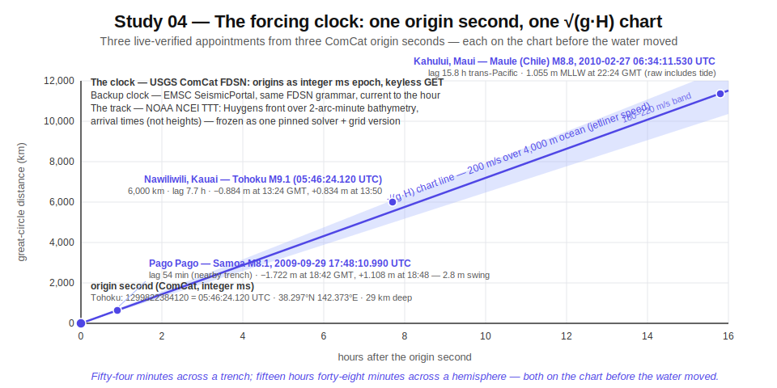
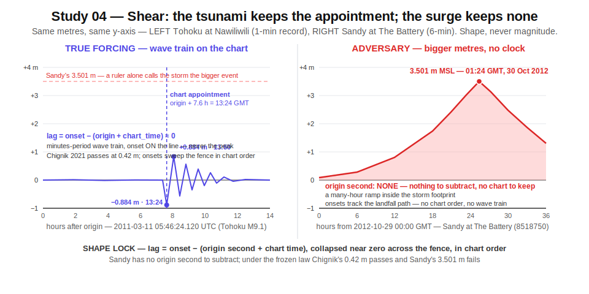
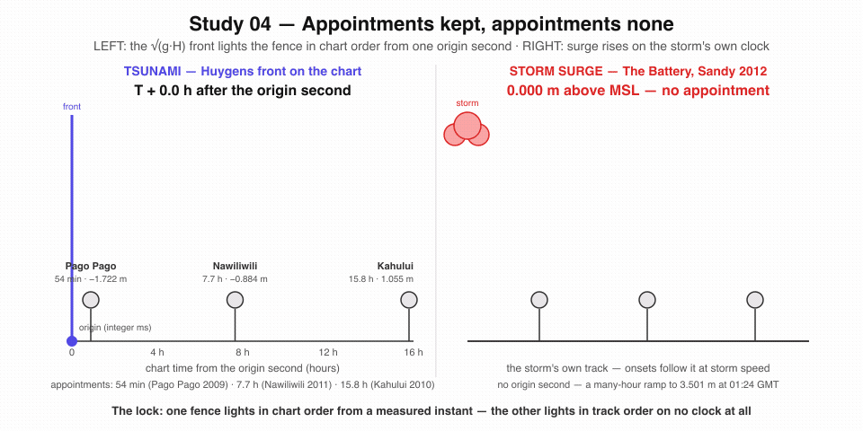

# Study 04 — Tsunami vs storm surge: the sea writes geometry, and geometry cannot lie

At **05:46:24.120 UTC on 11 March 2011**, the seafloor east of Honshu jumped. That instant is not folklore — it is a database row anyone can fetch: the USGS earthquake catalog serves the Tohoku origin as `1299822384120` milliseconds of epoch time, magnitude 9.1, at 38.297°N 142.373°E, 29 km deep (VERIFIED — live ComCat fetch, 2026-07-16).

Seven point seven hours later and six thousand kilometres away, the tide gauge at Nawiliwili, on the Hawaiian island of Kauai, kept an appointment. Its one-minute record for that day — 1,440 rows, also fetchable by anyone — falls to **−0.884 m at 13:24 GMT** and rises to **+0.834 m at 13:50** (VERIFIED — live NOAA CO-OPS pull). The appointment was computable *before the wave arrived*, because a tsunami travels at a speed set by nothing but gravity and water depth. One origin second, one chart of the ocean floor, one arrival time at every gauge on Earth.

Nineteen months later, Hurricane Sandy pushed the gauge at The Battery, New York, to **3.501 m above mean sea level** at 01:24 GMT on 30 October 2012 (VERIFIED — live CO-OPS pull, station 8518750). That is a larger water-level excursion than any far-travelled tsunami produced at a US gauge in this study's entire corpus. Same instrument, same units, bigger number — and no appointment. The storm has no origin second. Its water piles up over many hours, inside the storm's own footprint, following the storm at storm speed.

A detector that reads only the ruler is already defeated. This charter freezes a law that reads the *shape*: does the basin-wide set of first arrivals collapse onto a travel-time chart anchored to one measured instant, or doesn't it? The sea writes geometry, and geometry cannot lie — but you have to ask the sea about geometry, not about height.

This is the ocean sibling of the method sealed on the sky in [Eclipse 2026 — Model shear](Eclipse-2026-Model-Shear.md) and [Eclipse 2026 — Overview](Eclipse-2026-Overview.md): a second-precision forcing clock, a computable track, public raw archives anyone can pull with a GET request, and adversaries that match the magnitude while owning none of the shape.

---

## The forcing and its clock

**The clock.** Earthquake origin times come from the USGS ComCat FDSN event service (`earthquake.usgs.gov/fdsnws/event/1/query`, GeoJSON, no key, no account). VERIFIED live 2026-07-16: the single-event query for `official20110311054624120_30` returned Tohoku's reviewed solution — magnitude 9.1 (Mww), origin `1299822384120` ms epoch, hypocenter 38.297°N 142.373°E at 29 km. Eight further window queries (2004, 2006, 2009, 2010, 2014, 2015, 2021, 2024, plus the 2022 Tonga eruption) each returned the exact event. Nine queries in one session drew no throttling.

**The backup clock.** The EMSC SeismicPortal in Europe mirrors the same FDSN query grammar independently (`seismicportal.eu/fdsnws/event/1/query`). VERIFIED live 2026-07-16: a `limit=1` query returned a fresh magnitude-2.8 event near Antofagasta, Chile, timestamped 22:58:08 UTC *the same day* — the mirror is current to the hour. Two independent catalogs, cross-checkable to the second, means the study clock never hangs on one host.

**The track.** The Tsunami Travel Time (TTT) charts published by NOAA's NCEI propagate a first-arrival front from any epicenter using Huygens' principle over the NCEI 2-arc-minute gridded bathymetry, at the shallow-water speed √(g·H) (VERIFIED — live fetch of the NCEI travel-time-maps product page, 2026-07-16; the legacy ngdc.noaa.gov URL now redirects there). Where the Pacific is 4,000 m deep the front runs at roughly 200 m/s — jetliner speed; over a shelf it slows to highway speed. The page states plainly that these charts give arrival *times*, not wave heights: the chart is a clock-and-track instrument, which is exactly what this study needs. The TTT software itself is licensed (Wessel / Geoware), but the physics is open — a Huygens fast-marching solver over public bathymetry reproduces the chart to hour-scale accuracy, not to the integer minute; different solvers differ within the chart's own error bar. The frozen record therefore pins one specific solver implementation (or a published lookup table) plus the exact NCEI bathymetry grid version, so every replayer computes byte-identical integer minutes for `chart_time(epicenter → g)`.

The three-dimensional picture: one point in space-time, one front expanding over the real seafloor, and a fence of gauges standing in its path. Every gauge holds a pre-computable appointment. The adversary keeps no appointments.


*One origin second, one Huygens front over the real seafloor, and a fence of gauges — each with an appointment computable before the wave arrives.*

Two live-verified appointments, as ground truth for the whole idea:

- **Near field.** Samoa, 29 September 2009: origin 17:48:10.990 UTC (VERIFIED — ComCat live). The Pago Pago gauge drew down to **−1.722 m at 18:42 GMT** and rebounded to **+1.108 m at 18:48** — a violent 2.8-metre swing **54 minutes after origin**, exactly on the short travel-time lag for a source on the nearby trench (VERIFIED — live CO-OPS pull, station 1770000).
- **Far field.** Maule, Chile, 27 February 2010: origin 06:34:11.530 UTC (VERIFIED — ComCat live). The Kahului, Maui gauge peaked at **1.055 m (MLLW datum) at 22:24 GMT** — a 15.8-hour lag matching the Chile-to-Hawaii travel-time chart (VERIFIED — live CO-OPS pull; raw value includes tide).

Fifty-four minutes across a trench; fifteen hours and forty-eight minutes across a hemisphere. Both numbers were on the chart before the water moved.

---

## The response archive

Six public archives carry the response side. Every one of them was live-verified end-to-end — dates per row — including the primary clock, which an earlier draft of this page could not reach from its build environment. All are keyless.

| Archive | What it serves | URL grammar | Format · cadence · limits | Auth | Sourcing |
|---|---|---|---|---|---|
| **USGS ComCat** (FDSN event service) — primary clock | Origin times (ms epoch), magnitudes, hypocenters, reviewed solutions | `earthquake.usgs.gov/fdsnws/event/1/query?format=geojson&eventid=<id>` or `&starttime=…&endtime=…&minmagnitude=…` | GeoJSON; static reviewed catalog | None | VERIFIED live 2026-07-16 (Tohoku eventid + 9 window queries, exact values quoted above) |
| **EMSC SeismicPortal** — backup clock | Independent European mirror of the seismic clock | `seismicportal.eu/fdsnws/event/1/query?format=json&limit=1` (same FDSN grammar) | JSON/GeoJSON; current to the hour | None | VERIFIED live 2026-07-16 (fresh M2.8 Chile event returned) |
| **NOAA CO-OPS, 6-minute water level** | US coastal gauge series, decades deep | `api.tidesandcurrents.noaa.gov/api/prod/datagetter?product=water_level&begin_date=…&end_date=…&datum=MSL&station=<7-digit>&time_zone=GMT&units=metric&format=json` | JSON; 288 records/day; request window ~31 days; datum availability varies per station and era | None (`application=` courtesy tag) | VERIFIED live 2026-07-16 — six historical pulls (Nawiliwili 2011, Pago Pago 2009, Crescent City 2006, Sand Point 2021, Kahului 2010, The Battery 2012) |
| **NOAA CO-OPS, 1-minute water level** | The cadence that resolves tsunami wave shape at US gauges | same grammar, `product=one_minute_water_level` | JSON; 1,440 records/day; shorter max window (single-day pulls verified) | None | VERIFIED live 2026-07-16 — Nawiliwili full Tohoku day; Atlantic City full 2013-06-13 meteotsunami day |
| **NOAA CO-OPS, barometric pressure** | Co-located air pressure at US gauges — the dual-speed branch discriminant | same grammar, `product=air_pressure` (no datum; millibars) | JSON; 240 six-min records/day; availability station- and era-specific — the pressure-capable roster subset is pinned like datums | None | VERIFIED live 2026-07-17 — Port San Luis, full Tonga day 2022-01-15: 240 records, day range 1019.2–1023.8 mb |
| **NOAA CO-OPS, tide predictions** | Predicted astronomical tide per station — the frozen detiding reference for US gauges | same grammar, `product=predictions&datum=…` | JSON; 240 six-min records/day; same per-station datum caveats as water level | None | VERIFIED live 2026-07-17 — Nawiliwili, full Tohoku day 2011-03-11: 240 records on MSL |
| **IOC/VLIZ Sea Level Station Monitoring Facility** | The global (non-US) gauge network: hundreds of stations, 1–15 min cadence | `www.ioc-sealevelmonitoring.org/service.php?query=stationlist&showall=a&format=json`; data: `service.php?query=data&code=<code>&format=json&timestart=…&timestop=…` | JSON; fields `slevel` (metres), `stime`, `sensor`; archive depth varies, most stations start ~2008+ | None | VERIFIED live 2026-07-16 — station list + a 361-record 1-min pull from Abashiri, Japan for the 2024 Noto morning |
| **NDBC DART buoys** | Open-ocean bottom-pressure water-column height — the mid-ocean witness between epicenter and coast | realtime: `ndbc.noaa.gov/data/realtime2/<station>.dart`; historical: `ndbc.noaa.gov/download_data.php?filename=<station>t<YYYY>.txt.gz&dir=data/historical/dart/` | Fixed-width text; 15-min standard mode (VERIFIED); 15-s/1-min event-mode bursts during triggers (REPORTED — NOAA DART documentation); yearly files 2007–2025 for station 21418 (VERIFIED) | None | VERIFIED live 2026-07-16 — buoy 21418 off Japan returned current data, water column ~5,694 m |
| **NCEI/WDS Global Historical Tsunami Database** ("hazel" API) | Ground-truth labels: which earthquakes made tsunamis, max water heights, deaths, runup counts | `ngdc.noaa.gov/hazel/hazard-service/api/v1/tsunamis/events?minYear=…&maxYear=…&minEqMagnitude=…`; runups at `…/tsunamis/runups` | JSON, paginated; 35,014 runup observations total (VERIFIED) | None | VERIFIED live 2026-07-16 — seven event queries returned exact records (e.g. Tohoku: max water height 39.26 m, deaths 18,423) |

> [!NOTE]
> Raw gauge values on storm and tide days are tide-dominated. The study detides first — one-minute or six-minute residuals against the gauge's own predicted tide — before any amplitude enters the law. The prediction source is itself frozen per network: CO-OPS `product=predictions` per station and datum for US gauges (VERIFIED live — see table); IOC serves no tide predictions, so every non-US gauge gets a frozen harmonic fit — named constituent set, fit window, and solver — pinned in the standing record alongside the other constants. Onsets, and therefore every `lag_g`, move with the detiding spec, so it freezes with everything else. The verified pulls above quote raw values deliberately, so the detiding step has fixed ground truth to replay against.

<details>
<summary>Corrections logged during live verification (so no replayer repeats them)</summary>

- The IOC sea-level host is `www.ioc-sealevelmonitoring.org`. An earlier draft carried a wrong hostname; the `service.php` grammar is now verified for both the station list and data pulls.
- IOC sensor code `rad` means a **radar water-level sensor**. It is not radiation. `slevel` is sea level in metres.
- IOC sensor code `prs` is a **water-level pressure transducer** reporting metres of sea level — it is not barometric air pressure. The barometric channel on the IOC feed is sensor `atm`; a live scan of the full station list (1,954 sensor rows, 2026-07-17) found it served at effectively one station (Taranto, Italy).
- An earlier draft quoted 721 six-minute records for the Sandy pull at The Battery. The GMT-bounded pull returns 480 records for a 29–30 Oct window and 720 for 29–31 Oct (re-pulled live 2026-07-17); the max — 3.501 m MSL at 01:24 GMT on 30 Oct — reproduces exactly either way.
- An earlier draft quoted −1.493 m at 23:30 GMT as the Port San Luis minimum for the Tonga day. That is a real but secondary trough; the day's minimum is −1.494 m at 22:24 GMT (re-pulled live 2026-07-17).
- `ncei.noaa.gov` fetches can fail a transient domain-safety check; an immediate retry succeeded. Legacy `ngdc.noaa.gov` travel-time URLs 301-redirect there.
- The hazel **runups** endpoint silently ignored an `?eventId=` query parameter — the full database came back instead of one event's runups. Resolve an event's runups through the event record's own linkage or filter client-side; re-derive the correct parameter before automating. The **events** endpoint filters (`minYear`/`maxYear`/`minEqMagnitude`) work exactly.
- CO-OPS datum availability is station- and era-specific: Hilo (1617760) refused the MSL datum for 2010; Kahului worked on MLLW. The gauge roster must pin a working datum per station per era.
- The 2004 Indian Ocean event predates the IOC live archive. Its gauge record lives in the literature and national archives, not behind the GET request.

</details>

---

## The adversary

The adversary is every large sea-level excursion in the very same raw gauge records that owns the magnitude but not the shape: storm surge, meteotsunamis driven by moving pressure jumps, resonating harbors — and one volcanic hybrid that is both a genuine tsunami and the sharpest shape-adversary in the corpus.


*The true forcing keeps appointments drawn from one measured instant; the adversary's water follows the storm at storm speed and keeps none.*

| Window (UTC) | Adversary | Why it mimics | Why shape defeats it | Sourcing |
|---|---|---|---|---|
| 2012-10-29/30 | **Hurricane Sandy surge**, The Battery NY | 3.501 m above MSL — larger than almost any US far-field tsunami reading; a pure-amplitude detector fires unconditionally | No origin second exists; the rise is a many-hour ramp locked to wind and pressure, not a minutes-period wave train; multi-gauge onsets track the storm's landfall path, not concentric chart lags from any point source | VERIFIED — live CO-OPS pull, 720 six-min records for the 29–31 Oct GMT window (re-pulled 2026-07-17), max 3.501 m MSL at 01:24 GMT 2012-10-30 |
| 2010-02-27/28 | **Storm Xynthia**, Bay of Biscay, France | ~1.5 m surge near La Rochelle with 7.5 m waves overtopping sea walls; 29 drowned in one town, 47–53 dead — and it struck the **same weekend as the Maule M8.8 tsunami**, so the world's gauges carried both signals at once | Biscay gauges peaked at local high tide hours before any Maule arrival could reach the Atlantic, and Maule's chart never predicts a Biscay arrival of that size at that lag; the surge onset is tide-phase-locked, not origin-clock-locked. The coincidence makes it the cleanest paired positive/negative in the corpus | REPORTED (Wikipedia; Springer *J. Coastal Conservation*; Wiley *JFR3*) for deaths, surge, and geography; Biscay gauge-level series REPORTED (French SHOM archive not pulled) |
| 2013-11-08 | **Typhoon Haiyan surge**, Tacloban, Philippines | Surge of 5–7 m (instrument-adjacent estimate 6.5 m at Tacloban airport; eyewitness accounts to ~9 m) — fully tsunami-scale height and destruction, arriving fast in a funnel-shaped bay | Propagates along the typhoon track at storm translation speed (~10 m/s), not radially at ~200 m/s; no origin second; gauges order by track distance, not chart radius; barometric and wind records co-move at every gauge that floods | REPORTED — search-verified (NASA Earth Observatory; AMS conference paper; Masters analysis); Philippine gauge records not pulled |
| 2013-06-13 | **US East Coast meteotsunami** (derecho) | Genuinely tsunami-like waves at 30+ NOAA gauges and one DART buoy, over 0.5 m peak-to-trough at several stations; people swept off the Barnegat Light breakwater — the tsunami frequency band, under clear skies, hours after the storm exited | No seismic origin; the forcing is a 3.0 mb pressure jump in 6 minutes (Ship John Shoal, 14:12–14:18 UTC) moving with the squall line; arrivals order along the storm path plus a shelf-break reflection returning ~20:20 UTC — a two-bounce geometry no point-source chart reproduces; the co-located barograph jump is the tell | REPORTED (NOAA NOS CO-OPS 079 technical report; NCTR event page; tsunami.gov archive); 1-min CO-OPS availability for the day VERIFIED live at Atlantic City (1,440 records) |
| 1954-06-26 | **Lake Michigan meteotsunami/seiche**, Chicago | An 8–10 ft wave swept eight fishermen off Montrose pier to their deaths — lethal, tsunami-scale, from a squall line crossing the lake at over 55 mph | Enclosed basin: there is *no* oceanic travel-time solution to any seismic source; the wave speed is locked to the storm's translation speed (Proudman resonance) and the after-ringing is the lake's own eigenmode. An origin-clock lock returns null — which is the correct verdict | REPORTED — search-verified (Chicago Tribune retrospective; WGN; Illinois history journal); 1954 gauge digitizations not pulled |
| any harbor, any day | **Harbor and basin seiche ringing** | Resonant basins amplify any long-wave input and ring for hours at fixed periods. Crescent City's largest 2006 excursion — 1.76 m peak-to-trough — was the **sixth** cycle, more than two hours after first arrival; peak amplitude wildly mis-times the origin if used directly | The lock keys on first-motion **onset** across many gauges, never on peak time. Seiche energy is monochromatic at the basin's own period regardless of source direction; a true tsunami's onsets sweep the network in chart order. Onset-lag coherence across independent stations is unforgeable by any single resonating harbor | VERIFIED for the 2006 Crescent City pull (live CO-OPS pull of the day, min −1.248 m MSL at 22:12 GMT); sixth-cycle finding REPORTED (Kowalik 2008 *JGR*); general eigenperiod behavior REPORTED (standard literature) |

### The sharpest adversary — the 2022 Hunga Tonga Lamb wave

On 15 January 2022 the Hunga Tonga–Hunga Ha'apai volcano erupted at **04:14:45 UTC** — a real origin second, in the catalog, fetchable: ComCat event `us7000gc8r`, event type "volcanic eruption" (VERIFIED — live ComCat fetch). Real destructive waves followed; runups of roughly 15–20 m struck Tonga (REPORTED — hazel/USGS). Half a world away, the Port San Luis, California gauge swung to **+1.815 m above MSL at 17:18 GMT** and down to **−1.494 m at 22:24** — hours of large oscillation, with a further trough of −1.493 m at 23:30 (VERIFIED — live CO-OPS pull; re-pulled 2026-07-17).

And yet a naive origin-clock lock **rejects this genuine tsunami**. Across the globe, sea-level oscillations arrived *hours ahead* of the water-wave travel-time chart, and appeared in basins — the Atlantic, the Mediterranean, the Caribbean — that the chart says the water wave cannot reach. The reason: the eruption launched an atmospheric Lamb wave circling the planet at **~315 m/s**, faster than the ~200–220 m/s deep-ocean water wave, pumping the sea surface as it passed (REPORTED — *Science* abo4364, "Global fast-traveling tsunamis driven by atmospheric Lamb waves"; Yamada 2022 *GRL*).

The seismic channel fails in the other direction at the same moment: the catalog's surface-wave magnitude for the eruption is **5.8** — a number that wildly understates a source which put metre-scale water on a California gauge (VERIFIED — live ComCat fetch). Clock-plus-magnitude alone fails in *both* directions on this one event.

Only a dual-branch shape lock survives Tonga:

- **Branch 1 — the water wave:** √(g·H) over the ocean travel-time chart, arriving with no pressure signature.
- **Branch 2 — the Lamb wave:** ~315 m/s along atmospheric great circles, with a barograph pressure pulse **co-timed at every gauge it excites**.

The discriminant is the co-located pressure channel. Lamb-driven arrivals carry the pressure jump; gravity-wave arrivals do not. Tonga is therefore dual-listed in this study: it is a corpus positive (a real tsunami happened) *and* the pre-registered probe that any single-chart law must fail — which is exactly why the law below carries two charts.

---

## The historical corpus

Ten events, ten clocks. Every origin time below was fetched live from ComCat this session; every ground-truth label was fetched live from the NCEI tsunami database. The gauge witnesses are live CO-OPS/IOC pulls where the archive reaches, literature where it does not — each tagged.

| Date (UTC) | Event · origin clock | Ground truth (NCEI hazel) | Gauge witness | Sourcing |
|---|---|---|---|---|
| 2004-12-26 00:58:53.450 | **Sumatra–Andaman, M9.1** (`official20041226005853450_30`) | Max water height 50.9 m; **227,899 deaths**; 2,176 runups; ~$10,000M damage | Colombo, Sri Lanka gauge recorded 3.87 m before failing 20 minutes into the wave train | Origin/magnitude VERIFIED (ComCat live); 50.9 m / 227,899 / 2,176 / ~$10B VERIFIED (hazel live); Colombo 3.87 m + gauge failure REPORTED (Merrifield et al. 2005 *GRL*, search-verified) |
| 2006-11-15 11:14:13.570 | **Central Kuril Islands, M8.3** (`usp000exfn`) | Max water height 21.9 m (uninhabited Kurils); 261 runups | Crescent City CA: drawdown to −1.248 m MSL at 22:12 GMT; the largest excursion, 1.76 m peak-to-trough, came on the sixth resonance cycle, over 2 h after first arrival; $9.7M dock damage — first significant US tsunami loss since 1964 | ComCat live, hazel live, CO-OPS pull live — all VERIFIED; sixth-cycle / $9.7M REPORTED (Kowalik 2008 *JGR*; USGS/Dengler publications, search-verified) |
| 2009-09-29 17:48:10.990 | **Samoa–Tonga trench, M8.1** (`usp000h1ys`) | Max water height 22.35 m; 192 deaths; 618 runups; $285M | Pago Pago: −1.722 m MSL at 18:42 GMT, +1.108 m at 18:48 — a 2.8 m swing 54–60 minutes after origin, on the near-field chart lag | VERIFIED — ComCat live, hazel live, CO-OPS pull live |
| 2010-02-27 06:34:11.530 | **Maule, Chile, M8.8** (`official20100227063411530_30`) | Max water height 29 m; 156 tsunami deaths (558 total); 692 runups | Kahului, Maui: 1.055 m MLLW at 22:24 GMT — 15.8 h trans-Pacific lag on the chart (raw value includes tide) | VERIFIED — ComCat live, hazel live, CO-OPS pull live |
| 2011-03-11 05:46:24.120 | **Tohoku, Japan, M9.1** (`official20110311054624120_30`) | Max water height **39.26 m**; **18,423 deaths**; largest runup ever gauged in Japan at Miyako | Nawiliwili, Kauai 1-min record: −0.884 m at 13:24 GMT, +0.834 m at 13:50 — 7.6–7.7 h lag on the Pacific chart | VERIFIED — ComCat live, hazel live, CO-OPS 1-min and 6-min pulls live |
| 2014-04-01 23:46:47.260 | **Iquique, Chile, M8.2** (`usc000nzvd`) | Max water height 4.63 m; 7 deaths; 205 runups | Local Iquique/Pisagua gauges ~2 m amplitude | ComCat live, hazel live — VERIFIED; local ~2 m REPORTED |
| 2015-09-16 22:54:32.860 | **Illapel, Chile, M8.3** (`us20003k7a`) | Max water height 13.6 m; 8 deaths; 1,263 runups | Coquimbo gauge ~4.5–4.7 m in the survey literature | ComCat live, hazel live — VERIFIED; Coquimbo value REPORTED (literature, not re-fetched) |
| 2021-07-29 06:15:49.188 | **Chignik, Alaska, M8.2** (`ak0219neiszm`) — largest US quake since 1965 | Max water height **0.42 m**; 63 runups; no deaths | Sand Point gauge window pulled live (raw record tide-dominated; the tsunami rides in the residual) | VERIFIED — ComCat live, hazel live, CO-OPS pull live |
| 2022-01-15 04:14:45.000 | **Hunga Tonga–Hunga Ha'apai eruption** (`us7000gc8r`, volcanic, ms 5.8) | Tonga runups ~15–20 m | Port San Luis CA: +1.815 m MSL at 17:18 GMT, −1.494 m at 22:24 — hours of oscillation; global arrivals ahead of the water-wave chart | ComCat live + Port San Luis CO-OPS pull live — VERIFIED; Tonga runups REPORTED (hazel/USGS) |
| 2024-01-01 07:10:09.476 | **Noto Peninsula, Japan, M7.5** (`us6000m0xl`) | Max water height 11.34 m; 2 tsunami deaths (549 total); 528 runups | Waves over 1.2 m at Wajima before the gauge stopped transmitting (several peninsula gauges failed); Toyama saw 0.8 m only ~3 minutes after origin — a nonseismic submarine-landslide component that amplified Toyama Bay heights ~30%. IOC 1-min radar record for the day pulled live from Abashiri | ComCat live, hazel live, IOC pull live — VERIFIED; Wajima / Toyama landslide component REPORTED (*Sci. Rep.* s41598-024-69097-w; post-event surveys, search-verified) |

> [!WARNING]
> Two corpus rows bracket every magnitude-only detector from both sides. **Chignik 2021**: the largest US earthquake in 56 years produced a 0.42 m tsunami — a huge clock signal and a tiny gauge signal. **Tonga 2022**: a catalog magnitude of 5.8 produced a global tsunami — a tiny clock signal and a huge gauge signal. A law keyed to magnitude misfires on both. A law keyed to shape — onsets on the chart, in chart order, anchored to the measured instant — passes Chignik and routes Tonga to its pre-registered second branch. And **Xynthia shared a weekend with Maule**: the same global gauge network carried a true trans-ocean tsunami and a lethal European storm surge simultaneously, giving the corpus a natural same-network positive/negative pair.

---

## The frozen law

Two analogs, one dual-speed branch rule, everything counted in exact integers, everything frozen before the next qualifying event. Adversaries are separated on **shape, never on magnitude** — Sandy's 3.501 m must lose to Chignik's 0.42 m under this law, because Chignik keeps the appointments and Sandy keeps none.

### Confinement analog

For each event window, count gauges with a significant detided residual excursion, binned by great-circle distance from the candidate source. A true tsunami excites a basin-wide, directionally broad set — Tohoku rang gauges from Japan to Chile. Surge stays inside the storm footprint; a meteotsunami stays on one shelf sector; a seiche stays in one basin. **Metric:** integer inequalities with frozen constants — the count of responding gauges beyond 3,000 km must satisfy `count_beyond_3000km ≥ K × count_within_1000km` (K a frozen integer) **and** meet a frozen minimum far-field count across at least 3 azimuthal quadrants. When zero gauges respond within 1,000 km (Noto destroyed its near-field witnesses; open-ocean epicenters may have none), the near-field term is 0 and the far-field minimum alone decides. Integer counts, integer constants, no division, no floats.

### Traveling-lag analog

Per gauge *g*:

```
lag_g = observed_first_onset(g) − (origin_time + chart_time(epicenter → g))
```

where the observed first onset is the first detided residual excursion above that gauge's frozen threshold — **onset, never peak** (the Crescent City sixth-cycle rule). A genuine tsunami collapses every `lag_g` near zero with a distance-scaled tolerance, and the arrival *order* across the network matches the chart's order — an integer rank comparison. The adversaries fail in distinct, checkable ways: surge has no origin instant to subtract; the meteotsunami's lags key to a squall line plus a shelf reflection; the seiche's energy sits at one basin period regardless of source direction.

### The dual-speed branch (the Tonga rule)

Every candidate coherent march is scored against **two charts**: the ocean water-wave chart (√(g·H) over bathymetry) and the atmospheric chart (great-circle distance at a frozen integer speed of 315 m/s). A water-branch verdict additionally requires the co-located pressure channel **silent** at onset; a Lamb-branch verdict requires the pressure jump **co-timed** at every responding gauge. The pressure channel is a named archive, not an assumption: CO-OPS serves per-station barometric pressure through the same datagetter grammar with `product=air_pressure` (VERIFIED live 2026-07-17 — Port San Luis returned the full Tonga day, 240 six-min records in millibars, day range 1019.2–1023.8 mb); on the IOC feed the barometric channel is sensor `atm`, served at almost no stations (live station-list scan, 2026-07-17), and `prs` there is a water-level pressure transducer in metres, not a barometer. Not every roster gauge carries a barometer, so the pressure-capable subset of the roster is pinned in the frozen record alongside datums, and both pressure tests — water-branch silence and Lamb-branch co-timing — bind on that subset. A coherent march on the wrong chart, or on the right chart with the wrong pressure signature, seals as what it is. This is the clause Tonga forces: without it, the law rejects a real tsunami; with it, the law names the mechanism.

### Quantization

Integer milliseconds for the origin clock as served by ComCat; integer seconds for predicted and observed onsets; residual water levels in integer millimetres (CO-OPS and IOC both report to the millimetre); lags binned in integer minutes; chart times in integer minutes; rank order as integer permutation comparison. Every sealed row is exact-integer.

### Threshold derivation — derive from the corpus, then freeze

1. **Excursion threshold, per gauge:** from each gauge's own pre-event 48 h detided residual, an integer-millimetre threshold — calibrated so every corpus positive with pullable data detects at its published responding gauges while the Sandy and 2013 meteotsunami windows, and the Tonga water-branch window scoped to the far-field roster where the Lamb wave dominates, produce no qualifying coherent set. The scoping is load-bearing: Tonga's eruption also drove a genuine water wave — the 15–20 m Tonga runups are water-wave — so Pacific mid-field gauges may legitimately march on the water chart, and demanding zero coherent sets globally could be unsatisfiable simultaneously with detecting Chignik's 0.42 m far field.
2. **Lag tolerance:** the minimal integer pair (a, b) such that every corpus `|lag_g| ≤ a + b·d`, with a in integer minutes, b in integer minutes per 1,000 km, and d rounded up to integer thousands of km.
3. **Coherence gate:** minimum N gauges across at least 3 azimuthal quadrants whose onset order matches chart order.
4. **Branch constants:** the 315 m/s Lamb speed and the pressure-channel co-timing window, in integer seconds.
5. **Detiding spec:** per network — CO-OPS `product=predictions` (station and datum pinned per era) for US gauges; IOC serves no predictions, so non-US gauges get a frozen harmonic fit with a named constituent set, fit window, and solver. Onsets, and therefore every `lag_g`, are defined against this spec.
6. **Validity quorum:** the integer minimum count of reporting roster gauges across quadrants below which the event seals VOID.

All constants — including the pinned chart artifact (one named solver implementation or published lookup table, plus the exact NCEI bathymetry grid version) and the pinned pressure-capable roster subset — freeze in the standing record **before** the next qualifying event. Nothing tunes after the fact. A threshold that moves after seeing the data is not a law; it is a story. And if no integer constant set satisfies steps 1–3 at once, that outcome is not tuned away — it seals under its own name, **calibration-infeasible**, as the charter's recorded result.

### The standing trigger

The law resolves on the **next magnitude ≥ 7.5 subsea earthquake** in ComCat (depth < 100 km, epicenter oceanic or within 50 km of the coast, the offshore rule decided on the same frozen bathymetry grid). The 2011–2024 corpus produced qualifying events roughly yearly, so the trigger resolves on a roughly one-year horizon. On trigger: pull the pre-named CO-OPS + IOC gauge roster and the DART records, compute integer lags against the frozen chart, seal the verdict within 72 hours of origin — pass or fail, exactly as computed.


*The discriminating shape in motion: a true tsunami's onsets sweep the gauge fence in chart order from one measured instant; every adversary's onsets scatter, follow a storm track, or ride the wrong chart.*

### Success criteria

- **S1 — Corpus lock (calibration sanity check).** With all constants frozen from the corpus, every seismic positive with live-verified gauge pulls (2006, 2009, 2010, 2011, 2021, 2024) passes the full gate — coherent far-field set, integer lags within tolerance, chart-order onsets across ≥ 3 quadrants — replayed from the public archives by GET request. This verifies the frozen pipeline replays its own calibration; it is not evidence for the law. Decidable: integer pass/fail per event. (2004 predates the pullable archive and is logged from literature, outside S1. 2014 Iquique and 2015 Illapel carry only REPORTED gauge witnesses so far — each enters S1 only when a live far-field pull lands in the corpus before the freeze; until then both sit outside S1 with 2004, so the S1 event set cannot shrink after the fact.)
- **S2 — Adversary lock (calibration sanity check).** The identical frozen pipeline over the pullable adversary windows — Sandy 2012, the 2013-06-13 meteotsunami, and the Tonga 2022 **water-branch** (scoped to the far-field roster where the Lamb wave dominates) — produces zero qualifying coherent sets. Decidable: 0 false gates out of 3, sealed raw.
- **S3 — The bracket seals.** Chignik 2021 (M8.2 → 0.42 m) passes on shape despite its tiny amplitude, and Tonga 2022 (ms 5.8 → global waves) is rejected by the water branch and classified by the pre-registered Lamb branch with its co-timed pressure discriminant — one sealed row each, demonstrating in integers that magnitude alone fails in both directions while shape does not. Decidable: two integer verdict rows.
- **S4 — The standing law resolves live.** On the next qualifying ComCat event, the prediction sealed before first far-field arrival (per-gauge integer-minute onsets + the coherence gate) is verdicted from raw archive pulls within 72 hours of origin, and the verdict — PASS, FAIL, or VOID (quorum failure: fewer reporting roster gauges across quadrants than the frozen integer minimum, itself among the constants frozen before the trigger) — seals exactly as computed. Decidable: one event, one integer verdict row.
- **S5 — Quarterly adversary audits stay clean.** Each quarter, the identical pipeline runs over every adversary window enumerated mechanically from the named archives — any detided residual ≥ 1000 mm at a named US roster gauge; any detided band-filtered excursion ≥ 300 mm peak-to-trough at a named East Coast roster gauge; pure gauge conditions, so a script and not a referee draws the audit set — and seals the required non-detections. Any detection in an adversary window seals raw as a falsifier — never reprocessed, never renamed. Decidable: audit rows each quarter, each 0 or 1.

A recorded failure is a finding, sealed under its own name — exactly as the storm shear was on the eclipse pages.

---

## What this protects — people, ecology, and the planet

An honest instrument protects people. A false alarm erodes the trust that protection depends on. Both halves of that sentence are measured history, not rhetoric.

**What no instrument cost.** On 26 December 2004 the Sumatra–Andaman earthquake killed **227,899 people** (VERIFIED — live NCEI hazel fetch), with runups to 50.9 m across fourteen countries and roughly $10 billion in damage (VERIFIED — hazel live). The Indian Ocean had **no basin tsunami warning system at all** that morning; the Indian Ocean Tsunami Warning and Mitigation System was established only afterward, in 2005, under UNESCO-IOC (REPORTED — UNESCO-IOC records). The wave took two hours to reach Sri Lanka — two hours in which a chart-and-clock read of the kind this study formalizes had physics on its side and no institution to run it. The Colombo gauge caught 3.87 m of it before failing twenty minutes into the wave train (REPORTED — Merrifield et al. 2005 *GRL*).

**What a magnitude-first read cost.** On 11 March 2011 the Japan Meteorological Agency issued its first warning three minutes after origin — built on an initial magnitude estimate of **7.9** for what was a 9.1 event. The first height forecasts said 3 m for Iwate, 6 m for Miyagi, 3 m for Fukushima. The actual maximum water height was **39.26 m** (VERIFIED — hazel live; forecast history REPORTED: JMA lessons-learned brochure, *JDR* paper). Residents behind 10-metre seawalls, told to expect 3 metres, had a numerically reasonable case for staying — and 18,423 people died (VERIFIED — hazel live). The failure was not the clock; the clock was perfect. It was the ruler: an early magnitude read, standing alone, understated the source. A shape read across the gauge and pressure network is exactly the kind of independent confirmation channel that does not inherit a single instrument's early error.

**What a false alarm costs.** On 7 May 1986 an Aleutian earthquake near Adak triggered a full evacuation of coastal Hawaii — more than 8,000 people in Oahu shelters, hours of gridlock. The wave arrived on schedule and was tiny. The state's cost was contemporaneously estimated at ~$30–40M; a modern account puts it at ~A$63M (≈US$40M), corroborating the same figure (REPORTED — Honolulu Star-Advertiser retrospective for the evacuation and gridlock; The Conversation for the cost). The deeper cost is not the money: every empty evacuation teaches some fraction of a coastline to ignore the next siren. A law that can seal, in integers, *this excursion keeps no appointments* is a law that lets warning centers stand down honestly — and be believed when they do not.

**Both failure directions, in one corpus.** Chignik 2021 — the largest US earthquake since 1965 — moved the ocean 0.42 m (VERIFIED — hazel live): the magnitude channel screamed and the sea barely answered. Tonga 2022 — catalog magnitude 5.8 — put +1.815 m on a California gauge (both VERIFIED live): the magnitude channel whispered and the sea answered globally. Any protector relying on the ruler alone over-warns one year and under-warns the next, and each error feeds the other's cost.

**The climate-era ledger.** The same gauges that witness tsunamis are the instruments of record for coastal flooding in a warming century. Sandy's 3.501 m at The Battery (VERIFIED — live pull) and Xynthia's sea-wall overtopping that drowned 29 people in a single French town (REPORTED — Wikipedia; Springer *J. Coastal Conservation*; Wiley *JFR3*) are storm records; Tohoku's Nawiliwili swing is a tsunami record — and coastal-risk attribution, defense engineering, and insurance pricing all depend on those causes staying correctly labeled in the archive. Roughly 25 meteotsunamis a year brush the US East Coast at amplitudes that overlap small genuine tsunamis; the 2013 event was initially worked as a possible seismic source (REPORTED — NOAA CO-OPS 079, which also carries the ~25-a-year figure). A frozen, replayable shape discriminant is how a public archive keeps its causes honest at exactly the amplitudes where a ruler cannot tell them apart. The ground writes the clock, the sea writes the arrivals, and an honest chart between them is infrastructure — for evacuation decisions, for the ecology of coastlines that get engineered based on what the record says attacked them, and for every premium and levee height derived downstream.

---

## Honest limits

- **This is not a warning system.** Verdicts seal within 72 hours of origin — long after any evacuation decision. The study tests whether the shape discriminant is *sound*, not whether it is fast. Warning centers with dedicated infrastructure act in minutes; this charter measures whether the geometry they could lean on actually separates, on the public record, under a frozen law.
- **The trigger is seismic; not every tsunami is.** The standing law keys to a ComCat magnitude ≥ 7.5 earthquake. Tonga 2022 is a real tsunami that trigger never fires on — which is why it enters as the pre-registered dual-branch probe rather than a triggered event. The Noto 2024 record likewise carries a nonseismic submarine-landslide component (Toyama's 0.8 m only ~3 minutes after origin — REPORTED, *Sci. Rep.* 2024) that the seismic chart alone does not predict. Volcanic and landslide sources are logged as the documented extension path, not claimed as covered.
- **Gauges die exactly when needed.** Colombo failed 20 minutes into the 2004 wave train (REPORTED); several Noto peninsula gauges stopped transmitting mid-event (REPORTED). The law is scoped to resolve from mid- and far-field gauges, with a validity quorum: below a frozen minimum of reporting roster gauges across quadrants, the event seals VOID rather than binding a verdict.
- **Raw pulls are tide-dominated.** Every raw min/max quoted on this page contains the tide. The pipeline detides against the frozen per-network spec — CO-OPS `product=predictions` for US gauges, the pinned harmonic fit for IOC — before any amplitude enters the law; the raw values are quoted deliberately so the detiding step has fixed ground truth.
- **The pressure discriminant binds only where a public barometer exists.** CO-OPS `air_pressure` is per-station and era-specific like datums; the IOC barometric channel (`atm`) is nearly absent from the live station list, and IOC `prs` is water level, not air pressure. Both branch pressure tests are scoped to the pinned pressure-capable subset of the roster — at gauges outside it, the branch verdict leans on the subset, not on data that does not exist.
- **Float-free proof, not float-free physics.** The travel-time solver computes in floating point; everything *sealed* — clocks, lags, thresholds, ranks — is quantized to exact integers first.
- **Archive mechanics constrain the pipeline.** CO-OPS 1-minute pulls verified for single days; 6-minute windows cap near 31 days; datum availability is station- and era-specific (Hilo had no MSL for 2010). The IOC archive mostly begins ~2008 — 2004 is literature-only. DART's fine-grained event-mode records are confirmation, not the primary gate (event-mode cadence REPORTED). The hazel runups endpoint ignored an `?eventId=` filter silently — that parameter is not trusted until re-derived. `ncei.noaa.gov` fetches can fail transiently and succeed on retry.
- **The chart has its own error bar.** Published travel-time accuracy is typically within an hour trans-ocean. The lag tolerance is derived from the corpus and distance-scaled — a naive tight gate would falsely reject genuine tsunamis, and a fixed loose gate would let adversaries coast. The tolerance freezes with everything else, and the chart itself is pinned as one artifact — a named solver implementation or published lookup table plus the exact NCEI grid version — so replay is byte-identical in integer minutes even though physical accuracy is hour-scale.

**Status: OPEN — charter published, corpus not yet ingested. Nothing here is sealed until the corpus runs.**
