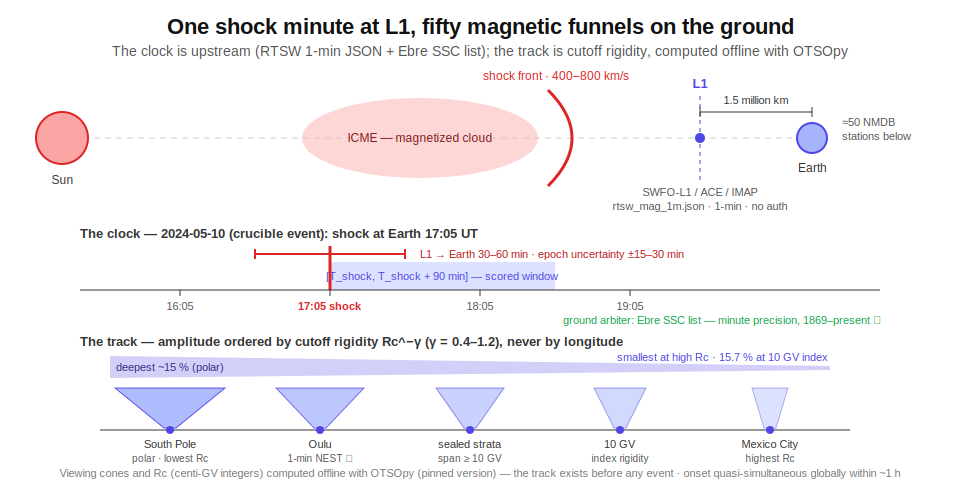
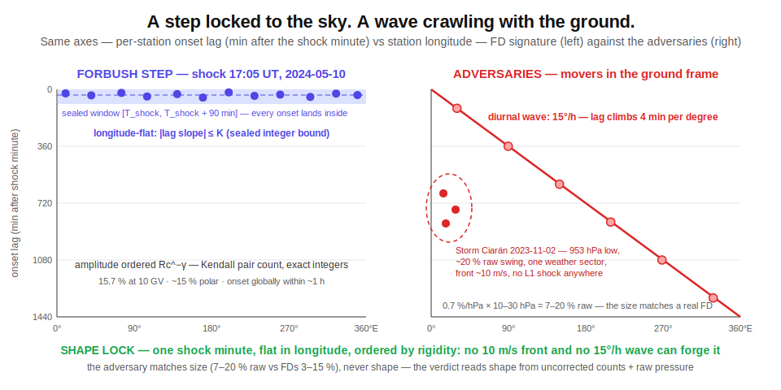
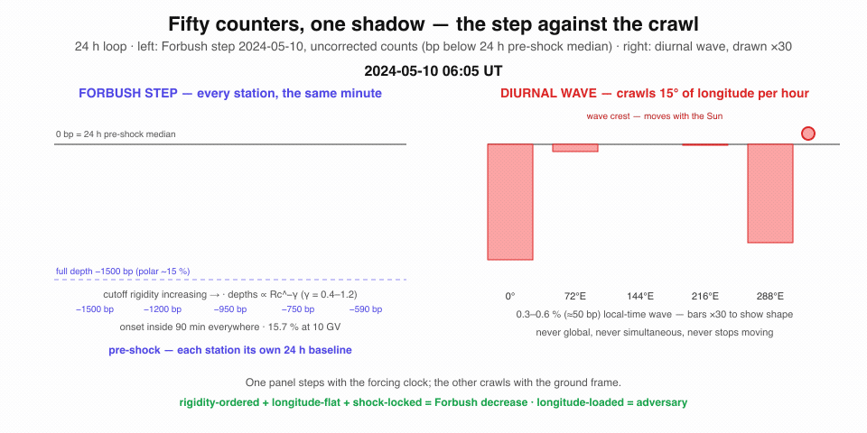

# Study 05 — Fifty counters, one shadow: Forbush decreases in the neutron-monitor network

On 2024-05-10 at 17:05 UT, the shock front of a solar magnetic cloud swept past Earth (REPORTED — MDPI Atmosphere 15(9):1033). Within hours, every neutron monitor on the planet dimmed at once: 15.7 % at 10 GV, one of the most significant Forbush effects of the entire observation period (VERIFIED — arXiv:2501.08029 abstract fetch; the dip re-found first-hand this session in Oulu station data pulled through the public archive).

That is a Forbush decrease. When the Sun throws off a magnetic cloud, the cloud is a real object — a curved shock front with a magnetized bubble behind it, plowing outward through the solar wind. When it sweeps past Earth it brushes galactic cosmic rays aside, and for a few hours to a few days the whole planet sits inside a cosmic-ray shadow. Every neutron monitor on Earth — the polar stations, the mountain stations, the equatorial stations — dims together.

A weather front can dim one counter. A sunny afternoon can put a daily ripple on a whole time zone of counters. Only the Sun can dim **all** of them in the same hour, in an order set not by geography but by geometry: how stiff a cosmic ray must be to thread each station's magnetic viewing cone. The sky writes geometry, and geometry cannot lie.

This study extends the shear method validated by the eclipse study (Study 1) — see [Eclipse 2026 — Overview](Eclipse-2026-Overview.md) and [Eclipse 2026 — Model shear](Eclipse-2026-Model-Shear.md) — to a new domain. The forcing has a minute-precise clock. The raw archive is public. The adversary matches the signal's size but not its shape. And standing future events arrive on their own schedule for the rest of the solar cycle.

---

## The forcing and its clock

The forcing is the arrival of a CME/ICME shock at the L1 point, 1.5 million km sunward of Earth, where spacecraft stand watch upstream.

**The clock.** Real-time solar wind from NOAA's L1 monitors (SWFO-L1/ACE) stamps the shock passage to the minute:

- `https://services.swpc.noaa.gov/json/rtsw/rtsw_mag_1m.json` and `rtsw_wind_1m.json` — 1-minute cadence, static JSON, no auth. **VERIFIED live in-session** (source spacecraft was ACE at fetch time; RTSW switches among NOAA's available L1 spacecraft — SWFO-L1/"SOLAR1", ACE, and IMAP in the current window).
- Full-mission DSCOVR NetCDF archive at `https://www.ngdc.noaa.gov/dscovr/` (NCEI, no auth). **VERIFIED index.**
- Independent ground cross-check: the Sudden Storm Commencement (SC/SSC) lists of the International Service on Rapid Magnetic Variations, Observatori de l'Ebre / ISGI — `https://obsebre.es/en/variations/rapid`, minute precision, 1869–present (free TXT 1968–present; HTML 1869–1967), CC BY-NC 4.0. **VERIFIED page fetch.** This gives the shock minute from the ground, with no spacecraft in the loop.

L1-to-magnetopause propagation adds ~30–60 min depending on shock speed (generic solar-wind kinematics: 1.5 million km at 400–800 km/s), so the effective forcing epoch at Earth carries ±15–30 min of uncertainty. That is still one to two orders of magnitude sharper than the hours-scale main phase of the response it strobes.

**The track.** Each of the ~50 stations in the NMDB network is not a point on a map — it is the mouth of a magnetic funnel. A cosmic ray reaching Oulu or the South Pole or Mexico City had to thread that station's **asymptotic viewing cone** through Earth's field, and only particles above the station's **geomagnetic cutoff rigidity** R꜀ get through. Both the cone and R꜀ are computable offline, before any event, with OTSO (the Oulu open-source magnetosphere propagation tool — `https://github.com/NLarsen15/OTSO`, Larsen et al. 2023, JGR Space Physics doi:10.1029/2022JA031061, validated against MAGNETOCOSMICS). **VERIFIED repo.** The NLarsen15/OTSO repository now declares itself deprecated in favor of the OTSOpy pip package; this study pins **OTSOpy** as the variant of record, with the exact package version recorded in the sealed Form beside the per-station R꜀ values (centi-GV) it produces.

Published Forbush-decrease physics predicts the response is ordered along exactly this track: magnitude falling as R꜀^−γ (rigidity spectrum, γ roughly 0.4–1.2, event-dependent), onset quasi-simultaneous globally within about an hour — ordered by rigidity and viewing cone, **not** by station longitude and **not** by local weather. Each station's own pre-shock 24 h is its own baseline. The cross-station rigidity ordering is the computable track; the L1 shock minute is the clock that strobes it.

*One shock minute at L1, fifty magnetic funnels on the ground: the clock is upstream, and the track is ordered by rigidity, not by longitude.*

---

## The response archive

All raw. All public. No registration anywhere in the load-bearing path.

| Archive | URL | Format | Cadence | Auth | Sourcing |
|---|---|---|---|---|---|
| NMDB / NEST (historical tap) | `https://www.nmdb.eu/nest/` | ASCII `timestamp;value` or PNG via `draw_graph.php` URL API — parameters `wget=1` (or `formchk=1`), `stations[]=CODE` or `allstations=1`, `dtype=corr_for_efficiency\|corr_for_pressure\|uncorrected\|pressure_mbar`, `date_choice=bydate\|byforbush\|bygle`, `tresolution=best..1440` min, `yunits=0\|1` | 1-min native since ~2008, >50 stations, real-time ingestion by station PIs | None. Free for non-commercial use; acknowledgment sentence required (data remain property of station PIs) | VERIFIED end-to-end in-session (Oulu pull — see note below) |
| NMDB real-time feed (live tap) | `https://www.nmdb.eu/rt/` (`rt.nmdb.eu` redirects there) | Aggregate real-time text files (`realtime.txt` / `realtime_sort.txt`) in an Apache index, curl/wget-able | 1-min, latest window, real-time | None | VERIFIED (directory index fetched in-session) |
| NOAA SWPC RTSW (the clock) | `https://services.swpc.noaa.gov/json/rtsw/rtsw_mag_1m.json` (+ `rtsw_wind_1m.json`, `rtsw_ephemerides_1h.json`) | Static JSON: `time_tag`, source spacecraft, bt/bx/by/bz GSE+GSM, speed/density/temperature | 1-min, rolling recent window (~days) | None | VERIFIED (live JSON sample fetched in-session) |
| Ebre/ISGI SC/SSC lists (ground clock) | `https://obsebre.es/en/variations/rapid` | Per-year TXT (1968–present; HTML 1869–1967); date + UT minute; preliminary (p) vs definitive (d) from 2015 on | Definitive through 2022, preliminary 2023–2026 | None; CC BY-NC 4.0, attribution | VERIFIED (page fetch) |
| GOES integral proton flux (SEP/GLE flag source) | `https://services.swpc.noaa.gov/json/goes/primary/integral-protons-1-day.json` | Static JSON: `time_tag`, `satellite`, `flux`, `energy` — channels ">=1 MeV" through ">=500 MeV"; the sealed flag reads ">=10 MeV" | 5-min | None | VERIFIED (live JSON fetched in-session) |
| GFZ Kp index (quiet-day panel source) | `https://kp.gfz.de/app/json/?start=<ISO>&end=<ISO>&index=Kp` | Static JSON: `datetime`, `Kp` in exact thirds, `status` preliminary/definitive; CC BY 4.0 | 3-hourly | None | VERIFIED (live JSON fetched in-session) |
| IZMIRAN FEID (cross-check only) | `https://tools.izmiran.ru/feid` | Interactive JS web app; hourly FD parameters: magnitude at 10 GV, onset, solar-wind and geomagnetic context | Hourly catalogue, 1957–present | None reported | REPORTED (arXiv:2501.08029; fragilities in the warning below) |

> [!NOTE]
> **VERIFIED end-to-end in-session:** Oulu 2024-05-10..12 hourly percent data pulled through the NEST wget API — the Gannon Forbush decrease is visible in the returned values. The NMDB real-time directory index (`www.nmdb.eu/rt/`) and a live RTSW JSON sample were also fetched. NMDB's help page (**VERIFIED** `https://www.nmdb.eu/nest/help.php`) directs users to `www.nmdb.eu/nest` rather than the older `nest.nmdb.eu` endpoint as of the in-session fetch (2026-07).

> [!WARNING]
> Two archive fragilities, recorded up front. The old `services.swpc.noaa.gov/products/solar-wind/*.json` paths are **gone** (404, **VERIFIED**) — `/json/rtsw/` is the current mechanism. FEID presents an incomplete TLS chain and is a JavaScript single-page app; the literature calls it the only comprehensive up-to-date FD catalogue (Abunina et al., arXiv:2501.08029), so it is used as a magnitude cross-check, never as a load-bearing pipeline dependency.

The decisive access detail: `dtype=uncorrected` and `dtype=pressure_mbar` expose **raw counts and raw station pressure**. This study re-derives the pressure story itself instead of inheriting anyone's correction — that choice is the whole adversary section.

---

## The adversary

The adversary is the atmosphere, compounded by the daily breathing of the cosmic-ray sky.

**Why it mimics the magnitude.** A neutron monitor's raw count rate falls roughly 0.7 %/hPa (NM64; the coefficient itself depends on cutoff rigidity). A synoptic weather system swings station pressure by 10–30 hPa — a 7–20 % raw count excursion, the same order as a large Forbush decrease (typical FDs are 3–15 %; the 2024 record was 15.7 % at 10 GV). On top of that, the cosmic-ray diurnal anisotropy adds a ~0.3–0.6 % daily wave phased to local time, enhanced to several times that around disturbed periods. A deep pressure low plus a strong diurnal wave produces a multi-percent, hours-long count depression at a station — station by station, indistinguishable from an FD onset.

**Why the standard defense is the blindness this program targets.** Conventional analysis "corrects" pressure with a single per-station barometric coefficient fitted on quiet-time baselines — a drifting baseline dressed up as a constant. The published cracks: (a) the coefficient depends on cutoff rigidity **and** on the primary spectrum, which is unknown and time-varying during the event itself — the 2025-06-01 multi-energy study (arXiv:2510.25046) re-fit coefficients per dataset for precisely this reason; (b) a British-Isles ground-survey study reported that **no** standard correction approach fully removed the FD-period signal from their neutron channels (ResearchGate 387345897); (c) the enhanced diurnal anisotropy measurably changes FD magnitude, timing, and even the **ranking** of events in catalogues (Okike (2021, ApJ 915, 60, doi:10.3847/1538-4357/abfe60); arXiv:2406.05160), and almost no publications adjust for it.

**Why shape defeats it.** The adversary has the wrong shape in the station graph:

- **Pressure is local and travels with weather.** Synoptic fronts move at ~10 m/s; the depression lives only in weather-connected stations and moves with the front.
- **The diurnal wave is a traveling wave in universal time.** Its deviation peak advances 15° of longitude per hour — a signature that crawls around the planet with the Sun overhead.
- **The Forbush decrease is a step locked to the forcing clock.** Onset within ~1 h at every station simultaneously, keyed to the L1 shock minute; amplitude ordered by cutoff rigidity (R꜀^−γ); flat in longitude; uncorrelated with any station's local pressure tendency.

Regress per-station onset lag and amplitude jointly on longitude/local-time phase, local pressure tendency, and cutoff rigidity: the FD loads on rigidity with near-zero longitude-lag slope; every adversary loads on longitude or pressure. No weather system and no diurnal wave can produce a rigidity-ordered, longitude-flat, shock-minute-locked global step. And the study computes this from **uncorrected** counts plus the raw `pressure_mbar` channel — refusing the baked-in correction entirely, so the adversary is faced raw, not pre-subtracted by the very assumption under test.

*The true forcing shape against the adversary shapes: the signal steps with the forcing clock, while every impostor moves with the ground frame.*

This is the same shear geometry the eclipse study proved out against its superstorm adversary ([Eclipse 2026 — Model shear](Eclipse-2026-Model-Shear.md)): the adversary is a wave that moves with the ground frame; the signal is a step that moves with the forcing clock.

**The adversary panel** (negatives and in-family confounds, to be run raw through the same pipeline):

| Date (UTC) | Event | Why it is adversarial | Sourcing |
|---|---|---|---|
| 2023-11-02 | Storm Ciarán record pressure low over NW Europe (~953 hPa) | 30+ hPa excursion over the Kiel/Oulu/Jungfraujoch sector drives a raw count swing of order 20 % with **no** L1 shock and **no** global signature — the canonical false-positive test; the pipeline on `dtype=uncorrected` must NOT fire (weather-connected, front-traveling, not rigidity-ordered) | REPORTED (met-service record; pressure trace independently checkable in the NMDB `pressure_mbar` channel) |
| 2024-05-11 | GLE-74 (02–10 UT) superposed on the Gannon FD trough | A ground-level enhancement is a count **increase** riding inside the FD, itself rigidity-ordered — the hardest in-family confound; the metric must window or flag SEP contamination rather than let it cancel FD depth | REPORTED (IOPscience doi:10.3847/1538-4357/ad9335; MDPI Atmosphere 15(9):1033) |
| 2024-05-10 | Magnetospheric cutoff-suppression effect during the Gannon storm | Storm ring current lowers effective cutoff rigidity, **raising** mid-latitude counts ~4 % exactly while the FD lowers them — clock-coincident but rigidity-anomalous; can fake structure in the rigidity ordering; Abunina et al. explicitly separate it | VERIFIED (arXiv:2501.08029, abstract fetched) |
| 2026-01-05 (representative) | Quiet-day diurnal anisotropy wave (quiet interval before the 19–20 Jan storm; specific quiet days drawn at pipeline-build time from the GFZ Kp archive in the response-archive table, a day qualifying iff every one of its eight Kp values, scored in exact integer thirds, satisfies 3·Kp < 6 — i.e. Kp < 2) | The everyday ~0.3–0.6 % local-time wave produces small per-station "onsets" phased by longitude — the exact traveling-lag negative the shear discriminant rejects | REPORTED (Okike (2021, ApJ 915, 60, doi:10.3847/1538-4357/abfe60); arXiv:2406.05160) |

---

## The blind spots this study targets

Five published cracks in the standard pipeline, each one an opening the shear metric walks through.

**The field has no algorithm-independent ground truth.** Okike et al. (2021), MNRAS 503, 5675 (doi:10.1093/mnras/stab680) showed that FD catalogues built from individual stations versus the network disagree on event identification, timing, and magnitude. Detection is baseline-definition-dependent — which means a frozen, replayable, pre-registered detection law is not a refinement of current practice; it is something current practice does not have. REPORTED (abstract not fetched this session).

**A traveling wave is being treated as noise around a static baseline.** Okike (2021, ApJ 915, 60, doi:10.3847/1538-4357/abfe60) and arXiv:2406.05160 demonstrated that the enhanced diurnal anisotropy changes measured FD magnitude, onset timing, and even event ranking — and noted "a paucity of publications" adjusting for it. The standard pipeline averages over a wave that has a direction and a speed. VERIFIED (abstract fetched).

**The pressure correction is frozen on quiet days and then trusted inside the storm.** The barometric coefficient depends on cutoff rigidity and on the primary spectrum — which is unknown and changing during the very event being measured. The 2025-06-01 multi-energy study re-derived coefficients per dataset for exactly this reason (arXiv:2510.25046); a British-Isles ground survey found no standard correction removed the FD-period signal (ResearchGate 387345897). Most FD studies consume NMDB's pre-corrected channel and inherit the quiet-time coefficient blindly. This study takes `uncorrected` + `pressure_mbar` and refuses the inheritance. Status per source: arXiv:2510.25046 VERIFIED (abstract fetched); the coefficient-dependence claim and ResearchGate 387345897 REPORTED.

**Two clock-coincident responses are routinely conflated.** The magnetospheric cutoff suppression put ~4 % of count **increase** on mid-latitude monitors during the Gannon storm, at the same clock time the FD was pulling counts down; only catalogue-grade analyses separate them (arXiv:2501.08029). VERIFIED (abstract fetched).

**Global simultaneity is asserted more than measured.** arXiv:2406.05160 had to build new FFT/filtering machinery to test global FD onset simultaneity at all. Per-station onset-lag structure ordered by rigidity versus longitude is essentially unpublished — which is exactly the shear observable this study pre-registers. VERIFIED (abstract fetched).

---

## The shear metric

**Confinement analog — shock-locked epoch confinement.** For each station, compute the deviation of uncorrected counts from that station's own 24 h pre-shock median, quantized in basis points (raw `pressure_mbar` enters the sealed traveling-lag regression below as the deci-hPa pressure-tendency regressor — never a baked-in correction). **Onset rule (sealed):** a station's onset is the first minute at which this deviation is a count **deficit** exceeding N_on basis points — negative deviations only, the sign sealed into the rule, so a count increase (a GLE) can never satisfy onset — for M_on consecutive minutes on the uncorrected 1-min channel; N_on and M_on are integers sealed in the Form from the historical crucible before any live run. **Amplitude rule (sealed):** a station's amplitude is the maximum count deficit of the M_amp-minute running median of the uncorrected 1-min channel within [T_shock, T_shock + 90 min], in integer basis points of the 24 h pre-shock median; M_amp is an integer sealed in the Form. This integer is the amplitude that feeds the Kendall statistic, the γ pair test, and the standing prediction rows. **SEP flag rule (sealed):** a minute is SEP-flagged iff the GOES ≥10 MeV integral proton flux (archive table above), quantized to integer milli-pfu by truncation, is at or above 10,000 milli-pfu — the 10 pfu S1 threshold — and for W_SEP further minutes after it last falls below; W_SEP is an integer sealed in the Form. SEP-flagged minutes are excluded from the onset and amplitude windows: this is how the GLE-74 increase is windowed out rather than left to cancel FD depth. **Missing-data rule (sealed):** a station with fewer than X_min of the 90 epoch-window minutes present (X_min an integer sealed in the Form) is excluded from the event roster; every longitude and rigidity stratum must still clear S_min from the stations that remain, and a stratum that cannot is recorded as a no-verdict, never back-filled. **Confinement rule (sealed):** per station, deviation power is the sum of squared basis-point deviations over 1-min samples. The numerator is that statistic over the epoch window [T_shock, T_shock + 90 min]; the denominator is the same statistic over the 24 h pre-shock baseline, normalized per-minute and scaled to 90 min. The station participates when the exact-integer ratio (numerator × 10⁴ / denominator, integer arithmetic) exceeds the sealed confinement threshold. The FD verdict requires participation by at least S_min stations in each of the sealed longitude strata spanning ≥6 h of longitude and each of the sealed rigidity strata spanning ≥10 GV of cutoff-rigidity range (S_min and the strata boundaries sealed in the Form), with amplitude ordered as R꜀^−γ. That ordering is decided by a sealed integer statistic: the Kendall concordant-minus-discordant pair count between amplitude in basis points and cutoff rigidity in centi-GV, computed in exact arithmetic, must clear a sealed integer threshold. The γ band (published spectra give roughly 0.4–1.2) is sealed as exact rational bounds p_lo/q_lo ≤ γ ≤ p_hi/q_hi from the crucible positives, and band membership is decided without logarithms or floats: for each station pair with R꜀,i < R꜀,j (amplitudes A in integer basis points, rigidities in integer centi-GV), the pair respects the lower bound iff A_i^q_lo · R꜀,i^p_lo ≥ A_j^q_lo · R꜀,j^p_lo and the upper bound iff A_i^q_hi · R꜀,i^p_hi ≤ A_j^q_hi · R꜀,j^p_hi — pure integer cross-multiplication — and the sealed verdict requires the count of conforming pairs to clear a sealed integer threshold. The band's generalization beyond the crucible events is tested only out-of-sample (S3 and the 2026-01-19 promotion). Pressure lows and diurnal waves concentrate power in weather-connected or local-time-connected station subsets — never in a rigidity-ordered global cut.

**Traveling-lag analog — the longitude-lag slope.** Regress per-station onset lag (whole minutes after the L1 shock, from the sealed onset rule above) jointly on station longitude (local-time phase, deci-degrees), local pressure tendency (integer deci-hPa per hour from the raw `pressure_mbar` channel — this is the sealed decision rule the pressure regressor enters), and cutoff rigidity (centi-GV) — a least-squares fit computed in exact integer/rational arithmetic on the quantized tuples. The diurnal anisotropy is a traveling wave: its lag advances ~4 min per degree of longitude (15°/h). Synoptic pressure systems travel with fronts and load on longitude and pressure tendency. A true Forbush decrease is longitude-**flat** — |lag slope| ≤ K, where K is a sealed integer bound in minutes per 10 deci-degrees derived from the crucible, the slope read from the joint fit so the pressure term is controlled inside the rule, not narrated beside it — and rigidity-loaded. Adversary = a wave that moves with the ground frame; signal = a step that moves with the forcing clock — the same discriminant shape the eclipse study sealed.

**Integer quantization — replay-exact, no floats in the sealed tuple.** Native neutron-monitor counts are integers. Deviations are quantized in basis points (10⁻⁴) of the pre-shock baseline median; onset lags in whole minutes from the L1 shock `time_tag`; cutoff rigidity in centi-GV integers (OTSO output rounded); pressure in deci-hPa integers (the NMDB `pressure_mbar` channel); longitude in deci-degrees; RTSW speed in deci-km/s and |B| in deci-nT integers as published. Same input, same verdict, on any machine, forever.

**Threshold derivation plan — historical crucible, zero-false-positive floor.** Run the five vetted positives (2003-10-29, 2015-06-22, 2017-09-07, 2024-05-10, 2025-06-01) and the adversary panel (Storm Ciarán pressure low, quiet-day diurnal panels, the GLE-74 window, the Gannon magnetospheric mid-latitude subset) through the confinement + longitude-lag metric on NEST uncorrected data. The SEP flag rule is fixed before threshold derivation — the GLE-74 panel window cannot be scored without it. 2026-01-19 is excluded from threshold derivation; it is promoted into the corpus only after its >20 % magnitude is re-derived from NEST/FEID and its SSC minute pulled from the Ebre preliminary list, recorded as a dated amendment — and it is then scored out-of-sample against the already-sealed thresholds. Cadence caveat: NMDB 1-min data begins ~2008, so 2003-10-29 cannot be scored at minute resolution as written. It is scored under a separately sealed hourly-resolution variant of the rule (onset in whole hours, windows scaled accordingly) if the roster's 2003 hourly data exist in NEST, or dropped from the crucible and recorded as such — decided and recorded before sealing. Seal the confinement threshold and the lag-slope bound at the maximum-margin separator with **zero false positives** on the negative panel — the same discipline as the eclipse shear Form. A second, held-out negative panel — additional pressure-storm and quiet days never used in derivation, enumerated in the sealed Form — is reserved as S2's genuine false-positive test. Thresholds are sealed **before** the next live CME; verification replays them from disk, unchanged.

---

## Historical corpus

Five vetted positives plus one pending promotion (2026-01-19), spanning a 28 % record and a two-decade range of solar-cycle conditions. Clock times to the minute where the literature gives them.

| Date (UTC) | Event | Clock | Response | Sourcing |
|---|---|---|---|---|
| 2003-10-29 | Halloween storm FD — largest on record in the IZMIRAN 10 GV series | SSC / sudden impulse 06:13 UT (L1 shock ~05:58 UT); driver X17 flare 09:51 UT 2003-10-28, ~19 h Sun–Earth transit | ~28 % at 10 GV (record since 1957); 23 % at Aragats; ~12-day suppressed recovery | Belov (2009), spaceweather.izmiran.ru/papers/belov2009.pdf; Wu et al. (2005) JGR doi:10.1029/2005JA011011. REPORTED |
| 2015-06-22 | June 2015 multi-CME FD | SSC = ICME shock arrival 18:33 UT | 8.4 % at polar neutron monitors; five Earth-directed CMEs June 18–25, compound event | arXiv:1710.00945; Samara et al., helas.gr/conf/2017/posters/S_1/esamara.pdf. REPORTED |
| 2017-09-07 | September 2017 FD (GLE-72 followed on Sep 10) | L1 shock ~22:48 UT (Wind; Luhmann et al. 2018, Space Weather doi:10.1029/2018SW001860), SSC 23:00 UT; preceding SSC 23:43 UT Sep 6; SYM-H −146 nT at 01:08 UT and −115 nT at 13:56 UT Sep 8 | ~7–9 % network-wide, up to ~15 % in the South Pole cusp; two-step structure resolved by wavelet analysis (peak period ~2.1 h) | Annales Geophysicae 38, 359–372 (2020); J. Phys. Conf. Ser. 1181, 012070 (2019). SSC times and SYM-H VERIFIED from angeo full text; L1 shock time REPORTED (Luhmann et al. 2018); magnitude REPORTED |
| 2024-05-10 | Gannon superstorm FD (G5, Dst −412 nT) — ties to this program's existing storm corpus | Shock arrival 17:05 UT (AR13664 CME train); GLE-74 confound 02–10 UT May 11 | 15.7 % at 10 GV plus ~4 % magnetospheric cutoff effect; ~15 % at polar stations; one of the most significant Forbush effects of the entire observation period | arXiv:2501.08029 — magnitude VERIFIED from abstract fetch; shock time + Kp=9/Dst=−412 nT: MDPI Atmosphere 15(9):1033, REPORTED. **FD VERIFIED first-hand in Oulu NEST data this session** |
| 2025-06-01 | June 2025 FD — largest of SC25, deepest in two decades | Two-phase onsets 05:22 UTC Jun 1 and 10:19 UTC Jun 2, from CMEs launched May 30 and May 31 | Largest FD of SC25 / largest in 20 years; measurable GeV to mid-TeV; two distinct minima, ~7-day recovery with significant network anisotropies | SEVAN: arXiv:2506.17917 (onsets VERIFIED from abstract); multi-energy muon study arXiv:2510.25046 (VERIFIED abstract); Tien Shan: MDPI Atmosphere 16(12):1349, REPORTED |
| 2026-01-19 | January 2026 FD during one of the most intense storms of SC25 (GLE-77 2025-11-11 in the same active period, after an X5.1 flare) — **pending promotion; excluded from threshold derivation** | FD spans 19–20 Jan 2026; exact SSC minute to be pulled from the Ebre preliminary 2026 list at pipeline-build time | Reported drop just over 20 % — strongest of SC25 if confirmed; recorded coherently by the global NM network and SEVAN detectors at multiple altitudes | arXiv:2601.19289 (FD dates + GLE-77 VERIFIED from abstract); >20 % from aijfr.com/papers/2026/1/3481.pdf — REPORTED, minor journal, **must be re-derived from FEID/NEST before this event is promoted into the corpus** |

SC25 Forbush-decrease ledger 2023–2026 (context, REPORTED)

2023-04-23 — 4.9 % · 2024-05-10 — 15.7 % · 2024-10-07 — 6.1 % · 2025-03-18 — 5.4 % · 2025-06-01 — largest in 20 years · 2026-01-19 — reported >20 % (needs NEST re-derivation before sealing). Sources: ResearchGate 401675673; aijfr.com/papers/2026/1/3481.pdf; arXiv:2601.19289. Near solar maximum, FDs ≥3 % arrive roughly monthly.

---

## Pre-registration

**Target: the next Earth-directed ICME shock at L1.** Trigger definition: a speed step ≥50 km/s plus a |B| step ≥5 nT in `rtsw_mag_1m.json` / `rtsw_wind_1m.json`, sealed integer-exact: speed is read as deci-km/s integers and |B| as deci-nT integers exactly as published; each step is the difference between consecutive 10-minute medians of the 1-min samples, and the even-count median — the mean of the 5th and 6th order statistics — is never materialized as a half-integer: the comparison doubles both sides, the difference of summed order-statistic pairs against twice the threshold. The two steps must complete within 10 minutes of each other — confirmed within days by the Ebre preliminary SSC list.

**Standing prediction:** within T_shock + 90 min, the NMDB network shows a rigidity-ordered (R꜀^−γ, γ within the sealed rational band by the integer pair test), longitude-flat, globally confined count decrease exceeding the sealed confinement threshold — computed from **uncorrected** counts with raw pressure as regressor. And the negative half of the law: absence of an L1 shock predicts absence of any such pattern, scored on quiet days and pressure-storm days alike.

**Cadence.** SC25 is past maximum but the declining phase remains active: 2023–2026 delivered at least six FDs ≥5 %, with FDs ≥3 % roughly monthly near maximum. Expected scoreable event within weeks to ~2 months of registration. Declining-phase risk: ≥10 % events thin out through 2027, so the standing law must hold its margin on smaller (3–6 %) events too.

**The standing Form** (same ledger discipline as the eclipse Form). Its inputs: the L1 shock minute — the SWPC RTSW JSON serves as the live trigger only, while the sealed, replayable clock input comes from the permanent archives: the Ebre SC/SSC list minute is the arbiter, scored against the list as snapshotted on the sealed snapshot date (a later preliminary→definitive revision is recorded as a dated amendment, never a silent re-label), cross-checked against the NCEI L1 NetCDF archive, and where the two disagree the Ebre minute governs. Alongside the clock: a fixed, pre-registered station roster (NEST codes); OTSO-computed per-station cutoff rigidities and asymptotic cones (OTSOpy, pinned version); sealed thresholds (confinement, γ band as exact rational bounds, longitude-lag bound, onset rule N_on/M_on, amplitude rule M_amp, SEP flag threshold and window W_SEP, missing-data minimum X_min); and the URL of the public git repository whose push timestamps arbitrate S3 and whose committed snapshots — raw NEST pulls, RTSW windows, the Ebre list at the sealed snapshot date — are the replay inputs for S1 and S4. The law maps the shock minute to per-station predictions — onset lag in [0, L(R꜀)] minutes, amplitude in basis points (sealed amplitude rule) ∝ R꜀^−γ, longitude-lag slope within the sealed bound — evaluated by a replayable integer pipeline on public NEST pulls. Scored publicly: anyone can re-pull the same NEST URL and re-run the verdict. The Form is set from the historical crucible; the prediction step emits the standing rows; the live watch consumes `www.nmdb.eu/rt/` plus the RTSW JSON, snapshotting every RTSW pull into the repository at fetch time.

---

## Success criteria

Each criterion is decidable — a yes/no readable by anyone re-running the public pipeline, with an exact-integer decision rule.

1. **S1 — Crucible replay (regression check, not a detection test).** Because the thresholds are sealed at the maximum-margin separator on the crucible events themselves, the law firing on the crucible positives is true by construction; S1 therefore claims only byte-identity — every crucible verdict, positive and negative panel alike, is replay-exact on re-run from the archived raw NEST pull snapshotted into the public repository at ingestion (commit timestamp as arbiter). A fresh NEST pull that diverges from the snapshot — a PI-side station revision, the `REV EQ. ORI` flag flipping — is recorded as a dated data-revision finding, not an S1 failure. Integer decision rule: exactly 0 differing bytes between any two re-runs from the same committed snapshot. The genuine positive-detection tests are S3 and the out-of-sample scoring of 2026-01-19 after its promotion.
2. **S2 — Adversary panel: derivation replay plus held-out negatives.** Because the thresholds are sealed at the maximum-margin separator with zero false positives on the derivation panel itself, a zero false-positive count on that panel is true by construction — the same circularity S1 discloses for the positives. S2 therefore splits in two. (a) Derivation-panel replay (regression check): the frozen law, run raw on the derivation negatives — Storm Ciarán 2023-11-02, the derivation quiet-day diurnal panels, the GLE-74 window 2024-05-11, the Gannon magnetospheric mid-latitude subset — reproduces zero false positives replay-exactly. (b) Held-out negatives (the genuine false-positive test): additional pressure-storm days and quiet days, excluded from threshold derivation and enumerated in the sealed Form before scoring — quiet days drawn from the GFZ Kp archive by the same exact-thirds rule — are run through the same frozen law. Integer decision rule: false-positive count on the held-out panel equals exactly 0. One held-out false positive kills the threshold and forces re-derivation, recorded raw.
3. **S3 — Live pre-registered strike.** For the next qualifying L1 shock after sealing (speed step ≥50 km/s plus |B| step ≥5 nT, each measured as the difference between consecutive 10-minute medians of the 1-min RTSW samples under the sealed integer arithmetic above, the two steps completing within 10 minutes of each other; Ebre-confirmed), the standing prediction rows are pushed to the study's public git repository (URL sealed in the Form; the push timestamp is the arbiter) **before** the deadline. Two clocks, stated explicitly: the **deadline clock** is the live RTSW trigger minute T_RTSW — decidable at push time — and the push must land before T_RTSW + 90 min; the **scored response window** is [T_shock, T_shock + 90 min] keyed to the Ebre SSC minute, which arrives days later and governs scoring only, never the deadline. The verdict — fire or no-fire — is computed from the same public NEST URLs anyone can pull. Integer decision rule: push timestamp in whole UTC seconds strictly less than T_RTSW + 90 min in whole UTC seconds, and the verdict bit computed by the sealed pipeline over the Ebre-keyed window.
4. **S4 — Negative half of the law.** Across the sealed scoring window (explicit start date and duration sealed in the Form at registration), partitioned into UTC days: a day is labeled no-shock iff the Ebre SC/SSC list carries no entry for it and the S3 RTSW trigger does not fire on it. Replay rule (sealed): the RTSW JSON is a rolling ~days window with no permanent archive, so the live watch snapshots every RTSW pull verbatim into the public repository at fetch time (commit timestamp as arbiter); S4's trigger labels replay from those committed snapshots, cross-checked against the archived NCEI L1 NetCDF. Version rule (sealed): no-shock labels are scored against the Ebre list as snapshotted on the sealed snapshot date; a later definitive list that flips a day (preliminary p → definitive d) is recorded as a dated amendment with both labels shown — never a silent re-label. Every no-shock day (quiet days and pressure-storm days alike) yields no verdict; every verdict traces to an Ebre-confirmable shock. Integer decision rule: the count of no-shock days with a verdict and the count of verdicts without an Ebre-confirmable shock both equal exactly 0. Any miss in either direction is recorded raw as a finding, with the full integer tuple attached — never renamed, never re-thresholded after the fact.

*The discriminant in motion: real Forbush decreases load on rigidity and stay flat in longitude; every adversary drifts with the ground frame — the verdict separates on shape, never on size.*

---

## What this protects — people, ecology, and the planet

The neutron-monitor network is not only a physics instrument. It is the planet's ground-truth dosimetry network, and the people standing behind its readings are specific and countable.

**The counters are the dosimeters of record.** The radiation dose models that aviation actually uses take neutron-monitor count rates as input. The FAA's CARI-6 model derives its heliocentric potential — the knob that sets how much galactic radiation reaches flight altitudes — by optimizing against historical Deep River neutron-monitor count rates (REPORTED — FAA CARI-6 documentation). NASA's NAIRAS nowcast adapts its cosmic-ray model in real time by cross-correlating the solar modulation potential with four real-time, high-latitude, ground-based neutron-monitor count rates (VERIFIED — NAIRAS overview page fetched in-session). During ground-level enhancements, the neutron-monitor count-rate increase is the published proxy for dose rates at aviation altitudes (REPORTED — J. Space Weather Space Clim. 8, A46, 2018). When this study asks whether a global count depression is real or a pressure artifact, it is interrogating the very input those dose models consume.

**Aircrew are radiation workers in law.** Under EU Council Directive 2013/59/Euratom, aircrew are treated as occupationally exposed: exposure assessment is mandatory wherever the annual dose may exceed 1 mSv, monthly doses are reported to national dose registers, and the occupational effective-dose limit is 20 mSv in any single year (VERIFIED — aircrew-dosimetry.eu regulations page and a published summary of the Directive, both fetched in-session). The stakes are not hypothetical. During the 2003 Halloween storms — the same event that tops this study's crucible at ~28 % — the FAA issued radiation advisories on 28–29 October, polar flights detoured to lower latitudes at costs reported up to $100,000 per flight, and the total dose at 35,000 ft in the polar regions more than doubled over the event sequence (REPORTED — Xue et al. 2023, Space Weather doi:10.1029/2022SW003381; Larsen et al. 2025, Space Weather doi:10.1029/2024SW004199).

**For astronauts, the Forbush decrease is a natural radiation shield.** The magnetized cloud that dims the counters is the same structure that partly shields a crew in orbit from galactic cosmic rays: ground-level decreases run about 3–20 %, and reductions of 30 % or more have been recorded aboard the ISS (VERIFIED — en.wikipedia.org Forbush-decrease article, fetched in-session; the 15.7 % Gannon figure in this study's corpus is the ground-level view of the same shielding). But the same clock minute can deliver the opposite: a solar-proton enhancement — GLE-74 rode inside the Gannon FD trough on 2024-05-11 — is a dose increase disguised inside the decrease. An instrument that separates a rigidity-ordered global step from its clock-coincident confounds is reading the difference between shelter and hazard on the same trace.

Both directions of the ledger matter.

**What a validated shape-read gives the protectors.** A verdict that fires only on rigidity-ordered, longitude-flat, shock-locked steps — and stays silent through record pressure lows — is a verdict a flight-operations desk or a crew scheduler can trust without a specialist on call. Every false alarm avoided keeps a polar route open, keeps a $100,000-class detour unburned, and preserves the trust the next true warning needs. An honest instrument protects people; a false alarm erodes the trust that protection runs on.

**What the magnitude-only blind spot costs.** A ruler-read — a threshold on count depth against a drifting baseline — would have fired on Storm Ciarán's 2023-11-02 pressure low (~953 hPa, a raw count swing of order 20 % with no shock anywhere in the solar wind; REPORTED, met-service record). And the historical record shows the ruler already misleading in practice: FD catalogues built magnitude-first disagree on event identification, timing, magnitude, and even the ranking of events, because the diurnal wave and the pressure correction are folded into the baseline unexamined (REPORTED — Okike et al. 2021, MNRAS 503, 5675; Okike 2021, ApJ 915, 60). The cosmic-ray/cloud question — whether Forbush decreases measurably change Earth's cloud cover, with all its ecological weight — has been contested for over fifteen years precisely on these grounds: Svensmark et al. (2009, Geophys. Res. Lett.) reported a cloud response to FDs, Čalogović et al. (2010, Geophys. Res. Lett.) found no cloud-cover response at any altitude or latitude, and an earlier cosmic-ray/cloud correlation trend was later attributed to a satellite viewing-geometry artifact (REPORTED — AMS Journal of Climate 25(3), 2012 review). A dispute like that cannot settle while the event catalogue itself is baseline-dependent. A frozen, pre-registered, shape-tested detection law is the prerequisite an honest answer needs — whichever way the answer falls. The sky writes geometry, and geometry cannot lie; this study's job is to make sure the reading of it cannot lie either.

---

## Honest limits

- **This is not a space-weather forecast.** The study says nothing about when the Sun will launch a CME. It answers one question only: given a shock minute at L1, does the planet-wide counter network respond with the pre-registered shape, and with no shock, does it stay silent.
- **This is not new Forbush-decrease physics.** Rigidity ordering and quasi-simultaneous onset are published physics. What is new is the discipline: a frozen, integer-exact, adversary-tested detection law, pre-registered against future events — which the catalogue-disagreement literature shows the field does not currently have.
- **The forcing epoch carries ±15–30 min** of L1-to-Earth propagation uncertainty, and the RTSW feed switches source spacecraft among NOAA's available L1 monitors (SWFO-L1/"SOLAR1", ACE, and IMAP in the current window); the Ebre ground clock is the arbiter, scored as snapshotted on the sealed date — its 2023–2026 lists are still preliminary, and later definitive-list changes are recorded as dated amendments (S4), never silent re-labels.
- **In-family confounds are flagged, not solved.** GLE/SEP count increases and storm-time magnetospheric cutoff suppression are clock-coincident with real FDs; the pipeline windows or excludes (SEP flag keyed to the GOES integral proton feed in the archive table, exact integer rule sealed in the shear metric; mid-latitude storm-time cutoff handling), and those windows are part of the sealed Form, not post-hoc edits.
- **One crucible number is not yet trustworthy.** The January 2026 >20 % figure traces to a minor journal; it must be re-derived from NEST/FEID before that event is promoted into the corpus — it is excluded from threshold derivation until then.
- **Archive terms and fragility.** NMDB data are the property of individual station PIs, free for non-commercial use with a mandatory acknowledgment; station dropouts and revised-vs-original divergence (the `REV EQ. ORI` flag in every NEST reply) are handled by roster redundancy. FEID is cross-check only.
- **The event supply is not guaranteed.** Past 2026 the deep (≥10 %) events thin out; smaller events sit closer to the adversary's 7–20 % raw-excursion band and stress the zero-false-positive margin. If the margin does not hold on 3–6 % events, that result is published as the finding it is.

---

**Status: OPEN — charter published, corpus not yet ingested. Nothing here is sealed until the corpus runs.**
