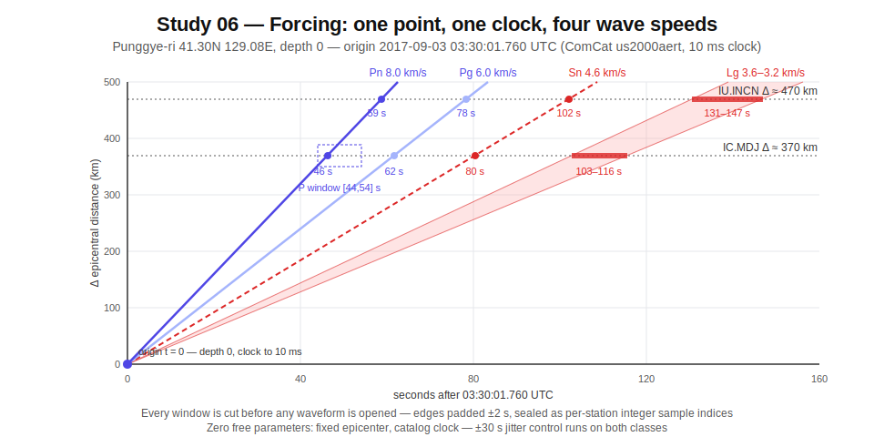
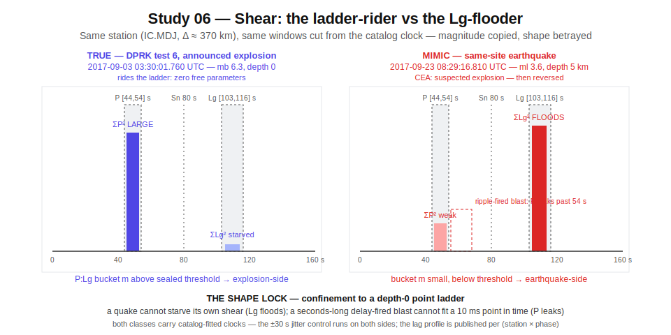
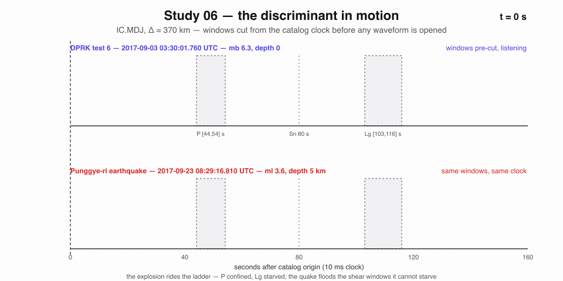

# Study 06 — Explosion vs Earthquake: shape against a point track

On 2017-09-03 at 03:30:01.760 UTC, seismometers across East Asia recorded an mb 6.3 event at Punggye-ri, North Korea — depth 0, origin time published to 10 milliseconds (VERIFIED via live ComCat query, 2026-07-16). Eight minutes and thirty seconds later, the ground at nearly the same spot moved again: an ml 4.1 cavity collapse with earthquake-like radiation (VERIFIED). Same mountain, same clock window, wildly different physics. Telling those two kinds of ground truth apart — by shape, not by size — is this study's whole subject.

An announced explosion is a point in space-time: one mountain, depth zero, one catalog instant. From that point a deterministic ladder of arrivals travels outward through the crust — Pn first, then Pg, then Sn, then the slow Lg train — and every rung of the ladder is computable before any waveform is opened. The explosion must ride its ladder. An earthquake sheared onto the same point track floods the windows the track says should stay starved. The ground writes geometry, and geometry cannot lie.

One correction to the obvious framing, made up front because the sealed Form depends on it: the clock is **not** external to the waveform. ComCat origin times — for the six announced DPRK tests exactly as for earthquakes — are seismically determined, fitted from the waveform by the catalog agency. No listed archive carries a pre-detonation announced time for any test. What is external is the point **track** (one epicenter, depth 0, zero free parameters) and the analyst class **label**. The discriminant is therefore confinement shape given a catalog clock, not clock externality — and the ±30 s clock-jitter control runs on both classes symmetrically.

This study extends the shear method validated by the eclipse study (Study 1) — a frozen exact-integer law, an adversary that mimics magnitude but not shape, predictions sealed before the event — from the sky to the ground. See [Eclipse 2026 — Overview](Eclipse-2026-Overview.md) for the sealed method and [Eclipse 2026 — Model shear](Eclipse-2026-Model-Shear.md) for what happened when a magnitude-mimic met a shape test.

> [!NOTE]
> Sourcing convention, carried over from Study 1: **VERIFIED** means fetched live from the named service on 2026-07-16 by this program; **REPORTED** means taken from the published literature or contemporaneous agency statements at abstract/press level, not independently re-derived. Both are marked inline throughout.

---

## The forcing and its clock

The forcing is a zero-free-parameter point track under a fixed catalog clock: **USGS-NEIC ComCat origin times for the announced explosion-class events** — waveform-fitted like every catalog time (see the clock note below), but pinned to a track with nothing left to fit.

- **The clock.** All six announced DPRK nuclear tests carry seismically-determined ComCat origin times published to 10 ms — e.g. `2017-09-03T03:30:01.760Z` for the sixth test (event id us2000aert, 41.3324N 129.0297E, depth 0; VERIFIED via live fdsnws-event query). ComCat quarry and industrial blasts (`eventtype='quarry blast'`, reviewed status) carry 10 ms clocks of the same kind. **All of these clocks are waveform-fitted by the catalog analyst — none is external.** What is external for the explosion classes is the analyst label and, for the DPRK tests, the fixed point track. The clock circularity is the same on both sides, so the ±30 s jitter control applies to positives and negatives alike.
- **The track.** A POINT track with zero free parameters: fixed epicenter (Punggye-ri, ~41.30N 129.08E, depth 0 in all six USGS solutions — VERIFIED) plus the catalog clock. From the point, per-station epicentral distance Δ gives a deterministic regional arrival ladder:
  - Pn onset at Δ / 7.9–8.1 km/s
  - Pg at Δ / 6.0 km/s
  - Sn at Δ / 4.6 km/s
  - Lg group window from Δ / 3.6 to Δ / 3.2 km/s
- **The stations.** IC.MDJ (Mudanjiang, 44.618N 129.593E, Δ ≈ 370 km — coordinates VERIFIED via fdsnws-station) and IU.INCN (Incheon, Δ ≈ 470 km — waveform retrieval VERIFIED for the 2017 test window only; the INCN 00.BHZ station epoch was closed 2012-10-16 → 2013-11-21, so INCN has no data for the 2013-02-12 test — availability VERIFIED).
- **Clock precision vs window width.** Predicted arrival windows at regional distance are good to ~1–2 s (velocity-model limited), so window edges are padded ±2 s. The ladder is the derivation, not the law: Δ is a floating-point geodesic divided by real-valued velocities, and two implementations can cut a sample apart — so the Form seals the resulting window edges as per-station integer sample indices, verbatim. The discriminant rides inside windows tens of seconds long; against those, a 10 ms clock is effectively noise-free forcing.

The three-dimensional picture: a single fixed point at the surface of the crust, an instant fixed by the catalog before any window is cut, and cones of compressional and shear energy expanding through known rock at known speeds toward fixed stations. Every window is cut before any waveform is opened. That is the whole track. Nothing is fitted by this program — the only fitted quantity, the catalog clock, is inherited from the agency and jitter-controlled on both classes.


*One fixed point, one catalog clock, four wave speeds — every window is cut before any waveform is opened.*

---

## The response archive

Raw, public, integer-native, no authentication. Every claim below was exercised end-to-end on 2026-07-16.

| Archive | URL | Format | Cadence | Auth | Sourcing |
|---|---|---|---|---|---|
| **EarthScope (IRIS DMC) FDSN dataselect** — raw waveforms | `https://service.iris.edu/fdsnws/dataselect/1/query?net=IU&sta=INCN&loc=00&cha=BHZ&starttime=2017-09-03T03:30:00&endtime=2017-09-03T03:40:00` | miniSEED (STEIM-compressed **integer counts** — natively integer, no float ingestion needed) | Continuous archive, seconds-to-URL for any historical window; near-real-time for current data | None for open networks (IC, IU are OPEN — availability service confirms `restriction=OPEN`). `service.iris.edu` 307-redirects to `service.earthscope.org`; use `curl -L`. | VERIFIED — fetched end-to-end 2026-07-16 (see record below) |
| **USGS ComCat FDSN event service** — ground-truth catalog with analyst event-type labels | `https://earthquake.usgs.gov/fdsnws/event/1/query?format=text&starttime=2017-09-03&endtime=2017-09-04&minmagnitude=5&latitude=41.3&longitude=129.0&maxradiuskm=300` | text / geojson / QuakeML; geojson carries a `type` field (`earthquake`, `quarry blast`, `explosion`, `nuclear explosion`, and related labels) | Static for historical events; minutes-latency for new events | None | VERIFIED — all six tests and quarry-blast labels returned live 2026-07-16 |
| **FDSN web services specification registry** — protocol reference + other data centers | `https://www.fdsn.org/webservices/` | Specification pages: fdsnws-dataselect v1.1 (miniSEED), fdsnws-event v1.2 (QuakeML), data-center registry | Static reference | None | VERIFIED — registry fetched 2026-07-16 |

<details>
<summary>End-to-end verification record (2026-07-16)</summary>

- **Waveforms:** fetched 36,864 bytes of real miniSEED (IU.INCN 00.BHZ) spanning the 2017 DPRK test in one URL. Companion services verified: fdsnws-station (channel epochs + instrument responses for IC.MDJ back to 1996-11-09) and fdsnws-availability (IC.MDJ 00.BHZ OPEN, 1999 → 2026-07-15, covering all six tests; location code 60 at 40 sps since 2016). IC.MDJ 00.BHZ open miniSEED spans 1999-05-18 → present, plus a 1996–1999 no-location-code epoch — one station covering every test.
- **Catalog:** all six DPRK tests returned with exact origin times, plus the 2017 post-test collapse and the ambiguous 2017-09-23 / 2017-10-12 near-site events. `eventtype='quarry blast'` queries verified (e.g. nc73854040, M2.6, 2023-03-07T21:50:38.300Z, `type:'quarry blast'`, status reviewed) — an effectively unlimited **label-only** ground-truth corpus of industrial blasts: the analyst class label is external, but the 10 ms clocks are waveform-fitted like earthquake clocks, so any test using those clocks inherits the same circularity (jitter control required there too).
- **Registry:** confirms the same query grammar works at any registered FDSN center (NCEDC, SCEDC for quarry-blast-dense California networks) if EarthScope lacks a channel.

</details>

---

## The adversary

The adversary here is two-sided, and both sides are real events, not simulations.

**Side (a): shallow small earthquakes at the test site itself.** On 2017-09-23 at 08:29:16.810 UTC, an ml 3.6 event occurred at Punggye-ri, depth 5 km (VERIFIED in ComCat). The China Earthquake Administration announced a "suspected explosion" — then reversed to non-nuclear. USGS stated it could not conclusively confirm natural vs man-made. CTBTO called it "unlikely man-made", collapse-like (REPORTED, contemporaneous agency statements). Three weeks later, 2017-10-12 at 16:41:08.670 UTC, an mb_lg 2.9 at depth 5 km arrived from the same relaxation sequence (VERIFIED). Both are tectonic-class radiation from within ~2 km of the shot points — same path, same site, same geology as every positive.

**Side (b): ripple-fired industrial blasts.** Real chemical explosions at depth ~0 — but detonated as second-scale delay-fired sub-charges. The smeared source time function injects spurious spectral modulation that pushes scalar P/S discriminants earthquake-ward. ComCat's reviewed `quarry blast` corpus (e.g. nc73854040, VERIFIED) supplies thousands of them.

And one event mimics both classes at once: the **2017-09-03T03:38:31.810Z ml 4.1 cavity collapse**, 8 min 30 s after test 6 (VERIFIED) — explosion-adjacent location *and* clock, earthquake-like radiation.

**Why the mimicry works on magnitude-rulers.** All of these share the scalar fingerprints classical rulers measure: shallow depth, similar mb, emergent regional codas. A shallow low-magnitude earthquake produces weak surface waves, so its mb/Ms goes explosion-like — the published failure mode. A ripple-fired blast produces Rg and spectral banding that drags P/S scalars the other way. Any single number can be faked.

**Why shape defeats it — the shear.** The shape test never asks "what is the scalar amplitude ratio of this waveform in isolation." It asks: *does energy sit confined inside the arrival ladder predicted from a FIXED catalog clock and a POINT depth-0 track?* An announced explosion has zero free parameters — clock fixed, epicenter known, depth 0, compressional-first everywhere — so integer energy must land inside the predicted Pn/Pg windows while the Sn/Lg windows stay starved. An earthquake's clock is fitted the same way (both classes' clocks are catalog products — which is why the jitter control runs on both sides), but it radiates shear with directivity (the Lg and Sn windows flood), and it sits at nonzero depth. A ripple-fired blast violates confinement **in time**: its source function is seconds long, so P-window energy leaks past the point-source window edge. The mimic can fake any single scalar; it cannot fake confinement to a point track it does not share. This is the same shear geometry that separated the superstorm from the eclipse in [Eclipse 2026 — Model shear](Eclipse-2026-Model-Shear.md): magnitude copied, shape betrayed.


*The mimic copies the magnitude; the ladder exposes the shape — flooded shear windows on one side, leaked P-window time on the other.*

---

## The blind spots this study targets

Four documented failures of the existing toolkit, each one a place where a scalar ruler broke and shape was never asked.

**1. The flagship ruler failed at small magnitude.** mb/Ms — the classical teleseismic discriminant — is reported to have shown poor discrimination for the DPRK tests, starting with the 2006 mb 4.3 event, too small for reliable Ms measurement at teleseismic distance. The field's move to regional P/Lg ratios is documented in the Sandia/OSTI study "Discrimination of Seismic Events (2006–2020) in North Korea Using P/Lg Amplitude Ratios" (Tibi, Seismol. Res. Lett. 2021; osti.gov/biblio/1781542) — but the fetched abstract discusses only the P/Lg discriminant and the 2019/2020 mb 3.6–3.8 events, not the mb/Ms failure. (REPORTED — the mb/Ms failure is standard-literature motivation, not stated in the fetched abstract; not independently re-derived)

**2. The best regional ruler admits it does not transport.** Kitov & Rozhkov (arXiv:1712.01819) achieve Mahalanobis D² > 100 above 4 Hz — yet state their results "cannot be directly extrapolated to the population of tectonic earthquakes in the same area." (VERIFIED from fetched abstract) P/S discrimination degrades below ~2 Hz and is path-dependent: thresholds trained on one region do not travel. A discriminant demonstrated only against aftershocks has never met the open population.

**3. Below the floor, the experts disagree with each other.** The 2010-05-12 micro-event (Lg magnitude 1.44 per Zhang & Wen 2015), located within ~2 km of the 2009 test site, has been classified oppositely by expert groups across a decade: Zhang & Wen 2015 said "explosion"; Ford & Walter and Kim et al. (BSSA 2017, Lamont) said "earthquake/no-test"; a 2024 reexamination (Earthq. Res. Adv.) again argues explosion. Below roughly mL 2 the published toolkit yields no consensus verdict at all. (REPORTED)

**4. The confusion runs live, in both directions.** CEA called the 2017-09-23 tectonic/collapse event a "suspected explosion" before reversing; USGS "cannot conclusively confirm" its type. Conversely, ripple-fired industrial blasts are routinely flagged earthquake-ward by scalar discriminants — which is why ComCat carries a dedicated *analyst* "quarry blast" label rather than an automated one. (REPORTED, contemporaneous agency statements)

---

## The shear metric

Same three-part construction as Study 1: a confinement integer, a traveling-lag signature, exact integers end-to-end, threshold frozen on history then sealed.

### Confinement analog — energy inside the predicted window

From the catalog clock and the point track, cut fixed windows on the raw integer counts: **[Pn_pred − 2 s, Pn_pred + 8 s]** for P, and the **Lg group window [Δ/3.6, Δ/3.2 km/s]**. Those formulas are the derivation, not the law: Δ is a floating-point geodesic divided by real-valued velocities, and two implementations can cut a sample apart — so the Form seals every window's boundaries as per-station integer sample indices, verbatim, and the sealed integers are what cut the record. miniSEED is STEIM integer natively — no float ever enters. The confinement integer is the ratio of summed squared counts (exact big-int) P-window : Lg-window, after the sealed integer-coefficient difference high-pass filter: a 4th-order first-difference cascade, coefficients (1, −1) applied four times. The filter runs over the cut window, not the continuous record, with the window extended four samples at the head; the first four output samples — the cascade's warm-up transient — are discarded, so the big-int energy sum covers exactly the sealed window. Because a fixed difference operator's response moves with sample rate, the Form seals both per-sample-rate variants (20 sps and 40 sps) verbatim. The emphasized band above ~4 Hz at 40 sps is the band where Kitov & Rozhkov report D² > 100.

- Explosion → P-confined (ratio large).
- Earthquake → Lg-flooded (ratio small).
- Collapse → both windows starved of high-frequency P.

This is the seismic twin of the eclipse study's confinement discriminant: energy stays inside the predicted window, or the event is not the announced class.

### Traveling-lag analog — riding the ladder

The catalog clock plus the point track predicts absolute onset times at every station with zero parameters fitted by this program. Measure the integer sample-index lag between predicted Pn onset and the observed onset in the raw counts — per station, per phase — using an exact integer STA/LTA detector whose parameters are sealed Form fields: short and long window lengths in samples, trigger threshold expressed as a shift comparison (STA·2^a > LTA·2^b), and first-crossing tie-break (earliest sample index wins). An announced explosion **rides the ladder**: lags ≈ 0 within model error, coherent across stations and phases. An earthquake sheared onto the point track **shears**: its P and Lg lags disagree across (station × phase), because its depth and phase geometry do not fit a depth-0 ladder. Both classes' clocks are catalog-fitted, so the ±30 s jitter control runs on both classes — demonstrating that the lag profile, not clock provenance, does the separating. The lag profile across (station × phase) is the traveling signature. The lag profile is diagnostic-only: no sealed threshold anywhere in S1–S4 gates (station × phase) lag disagreement — lags are published per event, and every gate rides the confinement bucket alone.

### Integer quantization

Exact integers end-to-end, per program law:

- Raw miniSEED counts are integers.
- Window energies are exact big-int sums of squared counts.
- The confinement discriminant is the 1/64-bit quantized log2 of the P:Lg energy ratio, computed exactly with no division and no floats: the bucket index is the unique integer m with (ΣLg²)⁶⁴ · 2^m ≤ (ΣP²)⁶⁴ < (ΣLg²)⁶⁴ · 2^(m+1) — exact big-int powers, shifts, and comparisons only.
- Lags are integer sample indices at the native 20/40 sps.
- Instrument-response epochs (IC.MDJ responses changed 2013-05-05 and 2016-04-12 — VERIFIED via fdsnws-station) never enter the metric, because both windows of a ratio come from the same record.

### Threshold derivation plan — derive on history, freeze, then face the future

- **Positives:** the six announced DPRK tests at IC.MDJ 00.BHZ (single station covering 2006–2017 continuously — availability VERIFIED) and IU.INCN (five of six tests — INCN was offline 2012-10-16 → 2013-11-21 and has no data for the 2013-02-12 test; availability VERIFIED).
- **Negatives:** the 2017-09-03 collapse, the 2017-09-23 and 2017-10-12 near-site events, plus matched-magnitude regional earthquakes from ComCat within 500 km, selected by an exact query sealed verbatim into the Form (magnitude type, tolerance, depth ceiling, time span — no post-hoc selection freedom). The sealed query must span the positives' magnitude range — earthquakes at mb ≥ 4.3 within 500 km must be present — because every near-site negative (ml 2.9–4.1) is smaller than every positive (mb 4.3–6.3), on different magnitude scales: a threshold that is secretly a magnitude/SNR proxy can pass S1, and only a magnitude-spanning S2 corpus makes that transfer failure detectable.
- **Adversary-direction check (published finding, not a gate):** the ComCat `quarry blast` corpus, scored under the per-region annex Form (see S2 — the sealed IC.MDJ/IU.INCN stations cannot observe California-scale blasts). The sealed metric — confinement bucket plus onset lag — carries no source-duration or window-edge-leakage term, so the time-smearing of ripple-fired blasts is not measured by anything in the Form; their bucket values and lag profiles are published raw, with no pass bound claimed.
- **Threshold:** the integer bucket boundary maximizing separation on positives-vs-near-site-negatives only, under a sealed tie-break — when several integer boundaries separate equally, as whenever the classes separate perfectly and every integer m in the gap qualifies, the smallest such m is the threshold. Thresholds are sealed per sample-rate regime — one integer for the 20 sps epoch, one for the 40 sps epoch; the positives straddle the IC.MDJ 20→40 sps change and the filter's response moves with sample rate, so no single threshold spans both regimes. Sealed into the Form **before** evaluation on the wider earthquake population and before the ambiguous 2010-05-12 event — which is scored, never trained on. Because these boundaries are optimized on the same nine events, the in-sample fit is not itself evidence; the gate is S1's leave-one-event-out protocol below.

> [!WARNING]
> Clock circularity is symmetric, and the Form must say so. Origin times for **both** classes — announced tests and earthquakes alike — are fitted from the waveform by the catalog agency, so feeding any catalog origin time to the ladder is partially circular. The control therefore uses deliberately perturbed clocks (±30 s jitter) on **both** classes, and this control is stated inside the sealed Form itself.

---

## Historical corpus

### Positives — six announced tests, one mountain, one rising ladder of magnitude

All origin times and coordinates VERIFIED by live USGS ComCat fdsnws-event fetch, 2026-07-16. All depth 0.

| Date (UTC) | Clock (UTC) | Event | Response | Source |
|---|---|---|---|---|
| 2006-10-09 | 01:35:28.020 | DPRK test 1 (announced) — Punggye-ri | mb 4.3, 41.294N 129.094E; smallest in corpus | VERIFIED: ComCat usp000eurb; yield class REPORTED (sub-kiloton to ~1–2 kt range per literature estimates) |
| 2009-05-25 | 00:54:43.120 | DPRK test 2 (announced) | mb 4.7, 41.303N 129.037E | VERIFIED: ComCat; regional analysis REPORTED: Geophys. J. Int. 180:243 (2010) |
| 2013-02-12 | 02:57:51.490 | DPRK test 3 (announced) | mb 5.1, 41.299N 129.004E | VERIFIED: ComCat |
| 2016-01-06 | 01:30:01.480 | DPRK test 4 (announced, "H-bomb" claim) | mb 5.1, 41.2996N 129.0467E | VERIFIED: ComCat; REPORTED: Geophys. J. Int. 206:1487 (2016) |
| 2016-09-09 | 00:30:01.440 | DPRK test 5 (announced) | mb 5.3, 41.2869N 129.0783E | VERIFIED: ComCat us10006n8a |
| 2017-09-03 | 03:30:01.760 | DPRK test 6 (announced, thermonuclear) | mb 6.3, 41.3324N 129.0297E; yield 250 kt (NORSAR; JGR Solid Earth 2019: 250 kt, bounds 148–328 kt) — an order of magnitude above all prior tests | VERIFIED: ComCat; yield REPORTED: NORSAR + AGU JGR 2019 |

### Negatives and adversaries — the mimics, recorded raw

| Date (UTC) | Clock (UTC) | Event | Why adversarial | Source |
|---|---|---|---|---|
| 2017-09-03 | 03:38:31.810 | Post-test cavity collapse, ml 4.1, depth 0 — 8 min 30 s after test 6 | Explosion-adjacent location AND clock, earthquake-like radiation; CTBTO characterized the class as "collapse" | VERIFIED: ComCat |
| 2017-09-23 | 08:29:16.810 | Punggye-ri ml 3.6, depth 5 km | CEA announced "suspected explosion", then reversed; USGS could not conclusively confirm type; CTBTO: "unlikely man-made". A live institutional misclassification at the exact test site — the sharpest available negative | VERIFIED: ComCat (parameters); REPORTED: CEA reversal via CNBC/NPR 2017-09-23 |
| 2017-10-12 | 16:41:08.670 | Punggye-ri mb_lg 2.9, depth 5 km | Post-test relaxation sequence (Lamont-Doherty: the bomb "set off later earthquakes"); tectonic-class radiation within ~2 km of the shot points, sharing path and site with all positives — defeats any discriminant that secretly learned path geology | VERIFIED: ComCat |
| 2010-05-12 | per Zhang & Wen 2015 (waveform-fitted → jittered like earthquake clocks) | Contested micro-event near the 2009 site, Lg magnitude 1.44 (Zhang & Wen 2015) | The standing stalemate: "explosion" (2015), "earthquake" (BSSA 2017), "explosion" again (2024 reexamination). Ground truth unresolved — defines the floor below which no published method separates the classes | REPORTED: literature citations, not directly fetched |
| 2023-03-07 | 21:50:38.300 | California quarry blast nc73854040, M2.6, reviewed | Representative of the ripple-fired corpus: a true chemical explosion whose delay-fired source function violates the point-in-time assumption; thousands of reviewed labels available for the confusion-direction test | VERIFIED: ComCat geojson `type:'quarry blast'` |

---

## Pre-registration

### Target

A sealed integer confinement threshold plus arrival-ladder window definition — station list, phase velocities, window offsets, exact filter, onset detector, 1/64-bit bucket boundary — that classifies any **future** qualifying event entering ComCat — qualifying sealed as a ComCat `type` string in the verbatim Form list `nuclear explosion`, `explosion`; catalog type is the entire trigger, and no external notion of "announced" enters it — explosion-side at IC.MDJ/IU.INCN, **using only the catalog clock and raw counts**, and that classifies fresh shallow regional earthquakes earthquake-side. (The next DPRK test is the anticipated qualifying event; no eventtype-labeled blast within the standing-law radius has been verified to exist, so no fallback class is claimed.) The 2010-05-12 contested event is pre-registered as a **scored holdout** with its verdict published either way; before it is scored, its usable waveforms at the sealed stations must be verified present in the FDSN archive.

### Cadence — standing law, event-driven

- Re-verify the sealed Form against **every new ComCat event within 300 km of 41.3N 129.0E at magnitude 2.5 or above**, the magnitude taken by the sealed precedence rule: mb_lg if present, else mb, else ml; an event carrying none of the three does not trigger the standing law.
- **Monthly**, re-verify against a deterministic draw of 10 fresh reviewed `quarry blast` events + 10 matched shallow-earthquake events from ComCat, scored under the per-region annex Form (the sealed IC.MDJ/IU.INCN stations cannot observe California-scale blasts). The draw is sealed verbatim: seed = the low 64 bits of SHA-256 of the UTF-8 month string `YYYY-MM`, read big-endian; selection = sort the query's returned events ascending by ComCat event id, then draw without replacement with index_i = seed_i mod remaining-count and seed_{i+1} = the low 64 bits of SHA-256 of seed_i rendered as 8 big-endian bytes; ComCat query URL sealed verbatim; matching rule (magnitude type, tolerance, depth ceiling, distance band) sealed alongside — any re-runner draws the same 10+10 events.
- Each pass re-fetches raw miniSEED from the FDSN archive and re-proves from disk. No cached verdicts.

### The standing-law Form

Sealed into the program's invariant ledger with the same seal/re-verify machinery Study 1 uses. Drift in any field = refuse.

```
{
  sealed_at:    <required ISO8601 seal timestamp — S3 is not live until this field exists>,
  stations:     [IC.MDJ.00.BHZ, IU.INCN.00.BHZ],
  track:        point(41.30N, 129.08E, depth 0),
  ladder:       { Pn: 8.0, Pg: 6.0, Sn: 4.6, Lg: [3.6, 3.2] } km/s — derivation only,
  windows:      [−2 s, +8 s] P  /  group Lg — sealed as <per-station integer sample-index
                boundaries, verbatim>; the ladder derives them, the integers are the law,
  filter:       first-difference cascade, coefficients (1, −1) applied 4×, integer-only;
                both per-sample-rate variants (20 sps, 40 sps) stated verbatim;
                runs over the cut window extended 4 samples at the head — the 4 warm-up
                output samples are discarded before the energy sum,
  onset:        { sta: <sealed samples>, lta: <sealed samples>,
                  trigger: STA·2^a > LTA·2^b with <sealed a, b>,
                  tie_break: first crossing },
  discriminant: unique m with (ΣLg²)^64·2^m ≤ (ΣP²)^64 < (ΣLg²)^64·2^(m+1)
                (1/64-bit log2 buckets; big-int powers, shifts, comparisons only),
  threshold:    <sealed integer per sample-rate regime — one for 20 sps, one for 40 sps>;
                tie_break: smallest separating m,
  qualifying_types: [nuclear explosion, explosion] — ComCat type strings, sealed verbatim,
  magnitude_rule: mb_lg if present, else mb, else ml — standing-law trigger at ≥ 2.5,
  jitter:       ±30 s, applied to BOTH classes,
  negatives:    <sealed ComCat query URL — magnitude type, tolerance, depth ceiling, time span;
                must span the positives' magnitude range: earthquakes at mb ≥ 4.3
                within 500 km present>,
  s2_bound:     <sealed integer count of negatives that must fall non-explosion-side>,
  annex:        per-region quarry-blast Form (NCEDC stations + their own ladder), sealed
                separately; published finding, not a gate,
  monthly_draw: { seed: low 64 bits of SHA-256 of UTF-8 "YYYY-MM",
                  selection: sort ascending by event id; index_i = seed_i mod remaining,
                  seed_{i+1} = low 64 bits of SHA-256(seed_i as 8 big-endian bytes),
                  query: <sealed URL>, match_rule: <sealed> },
  holdout:      2010-05-12 (clock: <verbatim numeric origin time transcribed from
                Zhang & Wen 2015 — required in this field before scoring; a citation
                is not a clock>, waveform-fitted → jittered;
                waveform presence at sealed stations VERIFIED before scoring;
                NO-SIGNAL rule: sealed STA/LTA fails to trigger inside both predicted
                windows, OR any miniSEED gap intersects a window — recorded raw)
}
```

---

## Success criteria

The four items are not all gates. **S1 and S2 are gates** with sealed decision rules (S1's leave-one-event-out protocol; S2's sealed acceptance bound). **S3 is a gate contingent on a future event** that may never occur, kept decidable by an annual attestation. **S4 is a published finding, not a gate.** Every outcome is recorded raw; a recorded failure is a finding, never renamed.

- **S1 — Historical separation, leave-one-out.** With the ladder, windows, filter, onset detector, and 1/64-bit bucketing fixed as above, run nine leave-one-event-out folds: refit the integer threshold on the remaining eight events (five positives + three near-site negatives, or six + two, depending on the held-out class) under the same sealed maximize-separation rule and smallest-m tie-break, then score the held-out event at IC.MDJ 00.BHZ from raw archived counts, exact integers only. S1 passes only if all nine held-out events land on their correct side. The in-sample fit of the sealed threshold on all 6 + 3 is additionally published as a fit report, not a gate — a free integer boundary optimized on nine events can separate them by construction. Any misplacement is recorded raw.
- **S2 — Open-population transfer.** The per-regime thresholds sealed under S1 — untouched — are then run against regional earthquakes within 500 km selected by the Form's sealed negative-corpus query (a literal ComCat URL fixing magnitude type, tolerance, depth ceiling, and time span before the run); the sealed query must span the positives' magnitude range — earthquakes at mb ≥ 4.3 within 500 km must be present — so a threshold that passed S1 as a magnitude/SNR proxy (every near-site training negative, ml 2.9–4.1, is smaller than every positive, mb 4.3–6.3, on different scales) fails detectably here rather than invisibly. Acceptance bound, sealed with the thresholds: at least `<sealed integer count of negatives>` of the pre-specified negatives must fall non-explosion-side. The reviewed `quarry blast` corpus, scored under the per-region annex Form (NCEDC stations — the exhibited corpus is Californian and unobservable at IC.MDJ/IU.INCN; no reviewed `quarry blast` labels within regional distance of the sealed stations were verified in ComCat), is a published finding, not part of this gate: the sealed metric — confinement bucket plus onset lag — carries no source-duration or window-edge-leakage term, so the time-smearing of ripple-fired blasts is not measured by anything in the Form, and their bucket values are published raw with no pass bound claimed. Every verdict, pass or fail, is recorded raw with its integer bucket value; both classes run the ±30 s clock-jitter control and the (station × phase) lag shear is published per event (diagnostic-only — no lag threshold is sealed).
- **S3 — Future event, pre-committed.** For the next event to enter ComCat within the standing-law radius whose `type` string is in the sealed qualifying list (`nuclear explosion`, `explosion` — catalog type is the entire trigger; no external notion of "announced" enters it; a future DPRK test is the anticipated case, and the quarry-blast fallback clause is removed, since no eventtype-labeled blast within the radius has been verified to exist), the sealed Form issues its verdict from the catalog clock and raw counts alone, with the Form's `sealed_at` timestamp — a required field; S3 is not live until it exists — preceding the event's origin time. Verdict published either way. There has been no DPRK test since 2017-09-03 and the event may never occur, so S3 carries a decidable standing check: an annual attestation, recorded raw, that the Form still re-verifies and that zero qualifying events entered ComCat that year.
- **S4 — The contested holdout (published finding, not a gate).** The 2010-05-12 event is scored by the sealed Form — never trained on — using the Zhang & Wen 2015 origin time as its clock, transcribed as a verbatim numeric origin time into the Form's holdout field before scoring (the paper is REPORTED, not fetched; a citation is not a clock), waveform-fitted, hence jittered exactly like the earthquake-side clocks — and its integer verdict published, alongside the note that expert ground truth there is itself unresolved. Before scoring, usable waveforms at the sealed stations must be verified present in the FDSN archive; an Lg-1.44 event sits at or below the single-station noise floor at Δ ≈ 370 km, so `NO-SIGNAL` is decided by a sealed integer rule, not a judgment call: the verdict is `NO-SIGNAL` when the sealed STA/LTA detector fails to trigger inside both predicted windows, or when any miniSEED gap intersects either window — an incomplete window maps to `NO-SIGNAL`, never to a spuriously small sum — with its raw bucket values recorded, not renamed.


*The discriminant in motion — confinement inside the predicted windows is the explosion's signature; flooding is the earthquake's.*

---

## What this protects — people, ecology, and the planet

Explosion-versus-earthquake discrimination is the sensory floor of the Comprehensive Nuclear-Test-Ban Treaty. The treaty's International Monitoring System runs 321 monitoring stations and 16 laboratories hosted by 89 countries — 337 facilities, around 90 percent up and running — and 170 of those stations (50 primary, 120 auxiliary) listen through the ground (VERIFIED — ctbto.org, live fetch 2026-07-16). More than 2,000 nuclear tests were detonated between 1945 and 1996; the monitoring network exists so that era stays closed (REPORTED — CTBTO). A network like that earns its keep twice per event: once by catching what must be caught, and once by not flagging what must be left alone.

**The false alarm is not free.** The 2017-09-23 episode in the adversary table above is what crying wolf looks like at the most closely watched test site on Earth: the China Earthquake Administration announced a "suspected explosion", then reversed; USGS could not conclusively confirm the type (REPORTED, contemporaneous agency statements) — hours of contradictory bulletins, three weeks after the largest test in the corpus, with the world already at full alert. Every reversal like it spends down the trust the next true alarm will need. A shape verdict sealed before the event — windows cut from the catalog clock, threshold frozen on history — is the instrument that can say "earthquake-side" while the scalar reads are still arguing, and can show its integer work afterward.

**The ruler-read has misled before, at treaty scale.** On 1997-08-16, an mb ≈ 3.6 event (REPORTED — Seismol. Res. Lett. 69:206, 1998) registered near the Russian test site at Novaya Zemlya, and within days U.S. officials were investigating a possible clandestine nuclear test. It took until 1997-11-04 for a CIA panel to conclude the event was almost certainly not nuclear — and even then the panel could not, from its own tools, call earthquake versus explosion (VERIFIED — armscontrol.org, live fetch 2026-07-16). Independent seismologists could: the event sat 130 km from the test site, beneath the Kara Sea (VERIFIED — armscontrol.org), and its Pn/Sn ratios above 4 Hz — the same band this study's sealed filter emphasizes — placed it squarely inside the regional earthquake population, distinctly separated from the Novaya Zemlya explosion population (REPORTED — Seismol. Res. Lett. 69:206, 1998). Proximity plus magnitude — the ruler-read — said "suspicious" for two and a half months. Shape said "earthquake" from the start, and shape was right.

**The miss is not free either.** On 1966-12-03, the Sterling test fired a 380-ton nuclear device inside the cavity left by the earlier Salmon shot in a Mississippi salt dome, and the cavity muffled the seismic amplitude by a factor of about 70 (published estimate 72 ± 8) (REPORTED — decoupling literature). A factor-70 muffle drops a deliberately hidden test into the micro-event regime — exactly the regime where the published toolkit deadlocks (the 2010-05-12 stalemate above). Honest micro-event discrimination is what stands between the treaty and a decoupled test; the same honesty is what keeps an innocent micro-earthquake from being branded one.

**Quarry and blasting regions live inside this problem every day.** ComCat carries thousands of reviewed quarry-blast labels (nc73854040 above — VERIFIED) because industrial blasts and small earthquakes cross-contaminate every scalar ruler. Two things depend on those labels being right. Communities near quarries and blasting operations depend on their routine blasts not being miscalled as covert tests. And the natural-seismicity record — the corpus under every seismic-hazard map that building codes and land-use planning stand on — depends on blasts not polluting the earthquake catalog.

**And shape has already settled a question with nine deaths attached.** On 2007-08-06 at 08:48:40 UTC, a magnitude 3.9 seismic event registered inside the boundary of the Crandall Canyon coal workings in Utah; six miners died in the collapse, and three rescuers died ten days later (REPORTED). The operator maintained that a natural earthquake had triggered the collapse (REPORTED — contemporaneous press). Moment-tensor analysis showed a radiation pattern contrary to a tectonic earthquake, dominated by an implosive component: the seismic event was the collapse itself, not its cause (REPORTED — Dreger et al., Science 2008; Pechmann et al., Seismol. Res. Lett. 2008). Magnitude could not answer a question with deaths and accountability attached. Shape did.

The ground writes; the failures above are all failures of reading, not of writing. A pre-registered shape-read — frozen before the event, published either way, wrong in public when it is wrong — is how the reading earns the same trust as the writing. That trust is what this study protects: the treaty's ear, the innocent earthquake's record, and the communities whose ordinary blasts must never be mistaken for something else.

---

## Honest limits

What this study is **not**:

- **Not a multi-site law.** Six positives, one site, one geology. The discriminant can silently learn the Punggye-ri path instead of explosion physics. The near-site negatives (same path: 2017-09-23, 2017-10-12, the collapse) are the built-in control, but transportability to any other test site is unproven and is not claimed here.
- **Not treaty monitoring.** This program is not CTBTO. No IMS arrays — the KSRS and USRK stations behind the published D² > 21,000 array results are IMS assets, absent from the open FDSN archive (REPORTED; the single-station high-band figure verified from the fetched abstract is D² > 100) — no beamforming, no radionuclide channel. The scope is single-station regional discrimination, and verdicts read "consistent / inconsistent with announced-explosion shape at these stations" — never "confirmed nuclear".
- **Not a verdict machine below the floor.** Below ~mL 2, the expert literature disagrees with itself (the 2010-05-12 stalemate). A "failure" there falsifies nothing; the event stays a scored holdout.
- **Not a cross-epoch amplitude study.** IC.MDJ instrument responses swapped in 2013 and 2016, with sample-rate/location-code changes in 2016 (VERIFIED). Absolute count magnitudes are not comparable across years; only within-record ratios are admissible, and any metric that accidentally compares raw counts across epochs is invalid.
- **Not blind to its own circularity.** Catalog origin times for **both classes** are fitted from the waveform — the positives' clocks are not external either, and no listed archive carries a pre-detonation announced time. The ±30 s jitter control exists exactly because feeding a catalog clock to the ladder is partially circular; it runs on both classes, and the control is written into the sealed Form.

---

**Status: OPEN — charter published, corpus not yet ingested. Nothing here is sealed until the corpus runs.**
