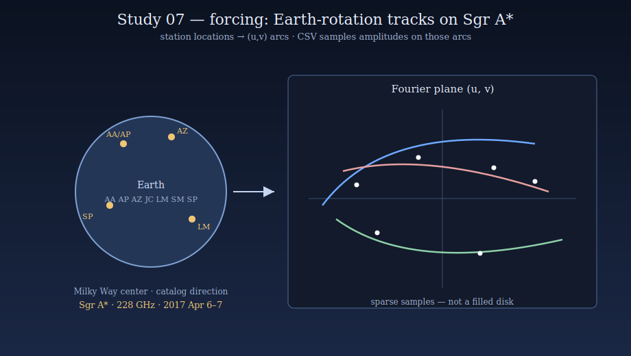
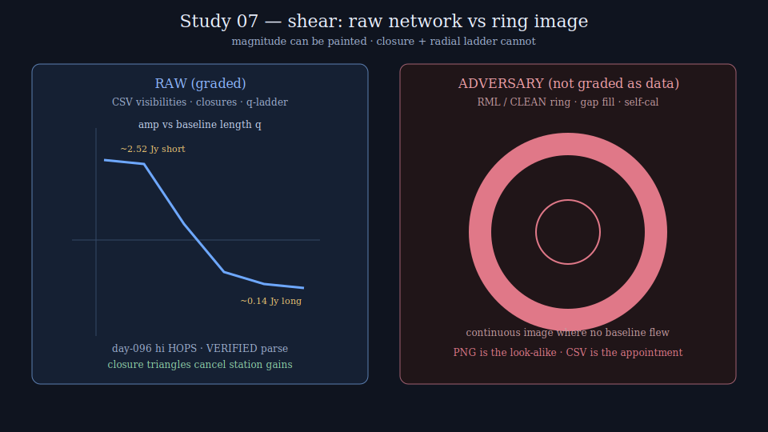

# Study 07 — Sagittarius A*: what the Milky Way's center writes in raw visibilities

On 2017 April 6 and 7 (MJD 57849–57850), eight millimeter telescopes from Chile to the South Pole stared at the radio source at the center of the Milky Way — **Sagittarius A\*** — at 1.3 mm (≈228 GHz). What they recorded is not a photograph. Each pair of telescopes wrote a complex visibility: amplitude in janskys and phase in degrees, at a point `(u, v)` in spatial-frequency space fixed by the two stations' Earth locations and the source's sky coordinates. Earth's rotation dragged those points into arcs. The public release that accompanies the First Sgr A\* Results (data product **2022-D02-01**) puts those rows in plain CSV — time, station codes, `U(lambda)`, `V(lambda)`, Stokes-I amplitude, phase, and error — so anyone with a terminal can read the same bytes the imaging pipelines started from.

The sky writes geometry, and geometry cannot lie. The eclipse study (Study 1 — see [Eclipse 2026 — Overview](Eclipse-2026-Overview.md)) proved the shear method on a Moon-driven clock: a frozen exact-integer law, an adversary that mimics magnitude but not shape, predictions sealed before the event. This study runs the same recipe on the galactic-center VLBI archive. The **forcing** is Earth-rotation geometry on a fixed source ephemeris. The **response** is the public visibility table. The **adversary** is the continuous floating-point image reconstruction that turns sparse tracks into a filled ring. The shear asks one question: which shape facts are already present in the raw rows, and which appear only after the pipeline shears the underdetermined inverse problem into a picture.

> [!NOTE]
> Sourcing convention, carried over from Study 1: **VERIFIED** means fetched live from the named service on 2026-07-23 by this program; **REPORTED** means taken from the published EHT Collaboration papers or release README at abstract/header level, not independently re-derived. Both are marked inline throughout. This charter's primary target is **Sgr A\*** (Milky Way). M87\* appears only as a comparative archive row — same method, different sky.

---

## What the raw Milky Way data actually is

Open one public file. Header and first rows of `ER6_SGRA_2017_096_hi_hops_netcal-LMTcal_StokesI.csv` (VERIFIED by live fetch 2026-07-23 from [eventhorizontelescope/2022-D02-01](https://github.com/eventhorizontelescope/2022-D02-01)):

```text
#SRC:SGRA,DATE(MJD):57849,FREQ:228.1918GHz
#time(UTC),T1,T2,U(lambda),V(lambda),Iamp(Jy),Iphase(d),Isigma(Jy)
08.40138888,AA,AP,515826.7188,-1918698.7500,2.66730533,1.0530,0.00292750
08.40138888,AA,SP,-1043246016.0000,4691171328.0000,0.32935316,-1.4251,0.00564986
08.40138888,AP,SP,-1043761792.0000,4693089280.0000,0.33527661,9.6616,0.04605242
```

That is the whole observable class this study grades:

| Column | Physical meaning |
|---|---|
| `time(UTC)` | Fractional UT hour on the observing day — the Earth-rotation clock |
| `T1`, `T2` | Station codes — locations on Earth that fix the baseline vector |
| `U(lambda)`, `V(lambda)` | Projected baseline in wavelengths — the track coordinate |
| `Iamp(Jy)`, `Iphase(d)` | Stokes-I visibility amplitude and phase |
| `Isigma(Jy)` | Reported amplitude uncertainty |

**Stations present in that day-096 high-band HOPS file (VERIFIED by parse of 13,790 data rows):** AA (ALMA, Chile), AP (APEX, Chile), AZ (SMT, Arizona), JC (JCMT, Hawaiʻi), LM (LMT, Mexico), SM (SMA, Hawaiʻi), SP (SPT, Antarctica). IRAM/PV is absent from this particular file; the release README lists PV among the campaign stations (VERIFIED from README). Twenty-one unique baseline pairs appear in the file.

**What those rows say in integers, before any image exists (VERIFIED by parse of the same day-096 high-band HOPS CSV):**

| Quantity | Value |
|---|---|
| Data rows | 13,790 |
| Distinct time stamps (0.001 h bins) | ≈1,183 |
| Amplitude range | 0.0008 – 2.7871 Jy |
| Median amplitude (all baselines) | 0.1882 Jy |
| Short baselines (`q` < 1 Gλ), count / median amp | 1,303 / **2.5169 Jy** |
| Long baselines (`q` > 4 Gλ), count / median amp | 10,115 / **0.1355 Jy** |
| Chile short baseline AA–AP, n / amp at start → mid → end | 470 / 2.6656 → 2.5739 → 2.4598 Jy over UT ≈08.40–14.55 |

Three facts follow from the table alone, with no image reconstruction:

1. **The array measured a bright compact flux on short Earth baselines** — Chile AA–AP sits near 2.5 Jy while the long Antarctica–linked baselines sit near 0.14 Jy median. Compact emission on short `(u,v)` and suppressed amplitude on long `(u,v)` is a Fourier shape fact readable from the CSV.
2. **Coverage is sparse tracks, not a filled disk.** Thirteen thousand points on twenty-one baseline arcs is not a continuous Fourier plane. Any continuous 2-D brightness map is an underdetermined fill of the gaps.
3. **The source moves in time.** Even the short Chile baseline drifts by tenths of a jansky across the track. Sgr A\* Paper III's static imaging pipelines therefore used a separate lightcurve-normalized product (`csv_norm/`) — that normalization is itself a processing choice, recorded in the release README (VERIFIED).

There is no ring pixel in these rows. There is a network of amplitudes and phases riding Earth-rotation arcs whose station locations are printed in the file names and station table.


*The forcing in one frame: fixed galactic-center coordinates, eight stations on Earth, arcs of `(u,v)` swept by rotation — every visibility lands on a track computable before the CSV is opened.*

---

## The forcing and its clock

The forcing is geometry that can be written down without opening a visibility amplitude:

- **The clock.** Observation UT from the CSV `time(UTC)` column, on campaign days 2017-04-06 (DOY 096) and 2017-04-07 (DOY 097). Release cadence averages to 10 s integrations, frequency-averaged over 32 IFs, Stokes I only (VERIFIED from release README).
- **The track.** For stations *i* and *j* with known geodetic positions, the projected baseline `(u_ij(t), v_ij(t))` in wavelengths is a deterministic function of Earth orientation and the source direction. Sgr A\* sky position is the catalog direction used by the EHT campaign (galactic center; exact J2000 used at correlation is inherited from the release headers — REPORTED via Paper II). The Form seals station codes and the `(u,v)` columns as frozen data read from the file; it does not re-fit station positions at grading time.
- **The corridor.** The discrete set of baseline pairs and `(u,v)` samples present in the sealed file inventory. In-corridor means "this row's `(T1,T2,u,v,t)` is in the release." Gaps in the Fourier plane are declared voids, not filled.

> [!NOTE]
> Nothing in the clock or the track comes from the reconstructed image. The forcing is fully specified by Earth geometry and the public file inventory before any ring pixel exists. That independence is what the shear cuts along.

---

## The response archive

All grading surfaces are public. Exact product codes and URLs:

| Archive | URL / product | Format | Cadence | Auth | Sourcing |
|---|---|---|---|---|---|
| **EHT 2022-D02-01 — First Sgr A\* calibrated visibilities** (primary) | https://github.com/eventhorizontelescope/2022-D02-01 and CyVerse DOI [10.25739/m140-ct59](https://doi.org/10.25739/m140-ct59); portal https://eventhorizontelescope.org/for-astronomers/data | `uvfits/`, `csv/`, `txt/` — network-calibrated Stokes I; plus `*_norm` (lightcurve-normalized) and `*_besttime` (100-min crop) | 10 s time average; two days (096, 097); lo/hi bands; HOPS and CASA/rPICARD pipelines | None for GitHub mirror | VERIFIED — README, INVENTORY, and day-096 hi HOPS CSV fetched live 2026-07-23 |
| **EHT 2022-D01-01 — 2017 complete L1 products** | CyVerse DOI [10.25739/kat4-na03](https://doi.org/10.25739/kat4-na03); ALMA Science Portal EHT L1 landing | Correlator L1 (pre–science-calibration layer) | Full 2017 campaign | Portal registration as published | REPORTED via EHT data portal table |
| **EHT 2024-D02-01 — Sgr A\* polarized data** | CyVerse DOI [10.25739/k39c-mh27](https://doi.org/10.25739/k39c-mh27) | Polarized calibrated products | 2017 campaign follow-on | None for listed CyVerse public sets | REPORTED via EHT data portal |
| **Comparative: 2019-D01-01 M87\* calibrated data** | CyVerse DOI [10.25739/g85n-f134](https://doi.org/10.25739/g85n-f134) | Same CSV/UVFITS class for M87\* | 2017 Apr | None for listed sets | REPORTED — comparative only, not the Milky Way primary |
| **Imaging-pipeline adversary corpus** | https://github.com/eventhorizontelescope/2022-D02-02 (Sgr A\* Paper III pipelines — REPORTED) and https://github.com/eventhorizontelescope/2019-D01-02 (M87\* pipelines) | Pipeline scripts + published image FITS/PNG products | Static releases with the papers | None | REPORTED via EHT data portal / GitHub |

**Primary grading surface:** the non-normalized `csv/` Stokes-I tables from 2022-D02-01 (both pipelines, both days, both bands). The `csv_norm/` product is graded as a **named processing variant**, never silently substituted — Paper III static imaging used the normalized set (VERIFIED from README). L1 correlator products are dispute-resolution surfaces only: they never silently replace a sealed network-calibrated row.

---

## The adversary

The adversary mimics magnitude. It cannot mimic the raw network's shape invariants. That gap is the shear — the same cut Study 1 made against the Gannon superstorm ([Eclipse 2026 — Model shear](Eclipse-2026-Model-Shear.md)).

**Why it mimics.** Regularized maximum-likelihood (RML), CLEAN, and related imaging pipelines minimize a floating-point objective that rewards smooth, compact, ring-compatible images while still fitting sparse visibilities within χ². Total-variation, maximum-entropy, and compactness regularizers supply brightness in `(u,v)` gaps the array never sampled. Phase and amplitude self-calibration adjust per-station gains in continuous floating point until the residual looks like the prior. Published Sgr A\* images show a bright ring of order tens of microarcseconds — a magnitude-and-morphology claim that is the public face of the galactic center (REPORTED: EHT Collaboration et al. 2022a–f, ApJL 930).

**Why shape defeats it.** Three locks the adversary cannot fake simultaneously from the CSV alone:

1. **Track confinement.** Every accepted visibility must land on an Earth-rotation arc whose `(u,v)` matches the sealed station pair within a frozen integer tolerance. An image-domain ring does not create new measured rows on unobserved baselines.
2. **Closure topology.** Closure phase on a triangle cancels station phase errors; closure amplitude on a quad cancels station gains. These are algebraic combinations of the raw complex visibilities. A pipeline that alters gains after the fact must still be scored against closures computed from the sealed CSV — the Form grades the closures, not the PNG.
3. **Radial amplitude ladder.** Short-baseline amplitudes near 2.5 Jy and long-baseline amplitudes near 0.14 Jy (day-096 hi HOPS — VERIFIED above) define an integer radial profile in `q = sqrt(u²+v²)`. A filled ring in image space predicts Bessel-like lobes and nulls along `q`; an unstructured point-like core does not. The shear counts whether the **measured** radial bins show the sealed lobe/null pattern — not whether a regularizer can paint one.


*Same sky, two reads: the CSV is arcs and closures; the adversary is a continuous ring filled where no baseline flew.*

<details>
<summary><strong>Adversary product roster (grade raw — any detector that needs the PNG to "see" the ring is a recorded falsifier)</strong></summary>

| Product | Why it is the adversary |
|---|---|
| Sgr A\* Paper III static imaging outputs (from `csv_norm` + RML/CLEAN pipelines in 2022-D02-02) | The public ring. Built on lightcurve-normalized visibilities and regularizers. Must not be required for a WIN on closure/radial seals derived from non-normalized `csv/`. |
| Sgr A\* movie / dynamical reconstructions (Paper III short-timescale analyses on `besttime` crops) | Time-variable image sequences. Magnitude drama; still image-domain fills of sparse tracks. |
| M87\* 2019 ring images (2019-D01-02 pipelines) | Comparative adversary class — same method, different source. Used only to test that the shear machinery transports; not a Milky Way claim. |

</details>

> [!WARNING]
> A recorded failure is a finding. If the sealed detector fires only when the PNG is supplied and stays silent on the CSV closures, that dependence is published raw in the ledger. It is never renamed as "the image is the data."

---

## The blind spots this study targets

**1. The public saw a picture; the instrument wrote a table.** Press and education surfaces lead with the ring. The release that makes the science reproducible is a visibility CSV. This study puts the table on the front page and grades it first.

**2. Normalization is a fork in the road.** Static imaging of Sgr A\* used lightcurve-normalized visibilities (VERIFIED from 2022-D02-01 README). Normalization removes a time-variable total-flux component before the ring is formed. A shear that does not name which product it graded is grading a different sky.

**3. Gaps are not data.** Sparse `(u,v)` coverage means most Fourier cells are empty. Regularizers fill emptiness. The Form treats emptiness as VOID cells, never as inferred brightness.

**4. Closures are the gain-invariant sky.** Station atmosphere and electronics rotate phases and scale amplitudes. Closure phase and closure amplitude cancel those station terms. Image-domain self-cal can move gain-dependent quantities; it cannot invent a closure pattern absent from the sealed rows without changing the rows.

---

## The shear metric

Same three-part construction as Study 1: a confinement integer, a traveling-lag (here: Earth-rotation track) signature, exact integers end-to-end, threshold frozen on history then sealed.

### Confinement analog — track + closure support

From the sealed file inventory, every visibility row carries integer station-pair IDs and quantized `(u,v)` bins. The confinement integer asks: do the measured closures on sealed triangles remain inside frozen sector bounds across the track, while control triangles built from time-scrambled or baseline-scrambled surrogates do not?

- **Closure phase** on stations `(a,b,c)`: `ψ = φ_ab + φ_bc + φ_ca` (mod 360°), computed from CSV phases after quantizing each phase to integer **millidegrees** at ingest (decimal-string shift of the printed field — never a binary-float parse that reseals differently on another machine).
- **Closure amplitude** on `(a,b,c,d)`: ratio of amplitude products, graded by integer cross-multiplication in **microjanskys** (printed Jy → integer μJy by decimal-string shift ×10⁶ with half-away-from-zero on printed digits).

### Traveling-lag analog — Earth-rotation arc order

As UT advances, each baseline's `(u,v)` must march along the sealed arc direction. The traveling signature is the ordered sequence of quantized `q`-bins vs time for each pair. A static image adversary has no UT; a row-shuffled surrogate breaks arc order. WIN requires arc-order consistency plus closure support.

### Radial ladder — short vs long `q`

Seal integer `q` bins in units of Mλ (megawavelengths). For day-096 hi HOPS the measured median amplitudes already separate short (`q` < 1000 Mλ → ~2.52 Jy) from long (`q` > 4000 Mλ → ~0.14 Jy) — VERIFIED above. The frozen law states integer inequalities on binned median μJy vs `q` that a ring-favoring Bessel lobe pattern must satisfy if claimed, and records MISS if the raw bins do not show it. **Claiming a ring in the PNG while the sealed radial ladder stays flat is a falsifier.**

### Quantization — exact integers only, per program law

- Amplitude → integer μJy at ingest from the printed CSV field
- Phase → integer millidegrees at ingest from the printed CSV field
- `(u,v)` → integer kλ (kilowavelengths) by decimal-string rounding of the printed fields
- time → integer seconds from 0h UT on the file's MJD date (fractional hour × 3600, sealed rounding rule)
- All thresholds compared by integer cross-multiplication; no float crosses a seal
- Pipeline tag (`hops` vs `casa`) is a sealed stratum — the two reductions are graded separately, never averaged into one float

### Threshold derivation plan — freeze, then seal

1. Ingest all eight primary `csv/` Stokes-I files for Sgr A\* 2017 (2 days × 2 bands × 2 pipelines) from 2022-D02-01; record byte sizes and SHA-256 in the corpus page.
2. Build closure-phase sector histograms and radial μJy-vs-`q` ladders on those files; build nulls from time-scrambled and baseline-pair-scrambled controls with the same marginal amplitude distribution.
3. Set integer WIN thresholds at a fixed false-positive budget on controls (e.g. ≤ 5/100 scrambled trials).
4. Bracket against published closure-phase behavior in Sgr A\* Paper II/III (REPORTED) as external pins — the pins check the threshold; they do not rewrite the CSV.
5. Seal the threshold table **before** scoring any adversary PNG and **before** scoring any later campaign release (2018/2021 public products as they appear on the portal).

---

## Historical corpus

| Epoch | Product | What it anchors |
|---|---|---|
| 2017-04-06 (DOY 096) | 2022-D02-01 `csv` + `csv_norm` + `uvfits` | First sealed Milky Way night — VERIFIED sample stats above |
| 2017-04-07 (DOY 097) | same + `*_besttime` 100-min crop | Second night + short-timescale crop used in dynamical analyses (VERIFIED inventory) |
| 2017 campaign L1 | 2022-D01-01 | Correlator-layer provenance for disputes (REPORTED) |
| 2018 / 2021 public L1 and calibrated sets | 2025-D01-01, 2025-D02-01, 2026-D01-01 (portal table) | Standing future / follow-on corpus for pre-registration after the 2017 law freezes (REPORTED via portal 2026-07-23) |
| M87\* 2017 calibrated | 2019-D01-01 | Comparative transport test only |

The corpus proper for threshold sealing is the complete 2022-D02-01 Sgr A\* `csv/` set (all days, bands, pipelines). Published ring images are adversary objects, not corpus positives.

---

## Pre-registration

**Target.** Every future public EHT (or ngEHT) calibrated Stokes-I release that names Sgr A\* on the [EHT data portal](https://eventhorizontelescope.org/for-astronomers/data), frozen by product code and DOI **before** that product's imaging press surface is scored.

**Standing law.** One sealed Form:

> **LAW.** For a sealed product code P with frozen file inventory F: compute integer closure-phase sectors, closure-amplitude ratios, arc-order indices, and radial μJy ladders from F by the sealed ingest rules. Verdict is WIN iff all four sealed inequalities hold against the frozen threshold table; MISS otherwise. VOID-by-inventory if F is incomplete against the product's published INVENTORY; VOID-by-pipeline if a required pipeline stratum is absent; VOID-by-norm-mix if normalized and non-normalized rows are concatenated. Adversary PNGs are never inputs to the LAW.

Each new public release grades the same law again — the eclipse pattern with an archive-release clock instead of an umbral clock.

---

## Success criteria

- **S1 — Threshold frozen from the 2017 Sgr A\* CSV corpus.** Integer tables for closure sectors, closure-amplitude bounds, arc-order, and radial ladders derived from all primary `csv/` files in 2022-D02-01, sealed with SHA-256 of every ingested file, dated before any PNG scoring. Decidable by the seal record.
- **S2 — Adversary graded raw.** Paper III static ring products and dynamical movies scored as adversaries: a detector that WIN-fires only when given the PNG (and not when given the CSV closures alone) is a published falsifier. Decidable by ledger rows that name the input product.
- **S3 — Pipeline strata agree or the disagreement is published.** HOPS and CASA reductions of the same day/band each receive a verdict; unresolved stratum conflict is recorded raw, never averaged away.
- **S4 — Prospective releases.** The first N post-seal public Sgr A\* products on the portal (integer N sealed with the Form) each receive WIN/MISS/VOID under the frozen law. Decidable by ledger completeness.


*The shape the sealed law grades: arcs and closures first; any ring that needs the regularizer stays on the adversary side of the shear.*

---

## What this protects

The galactic center is a public scientific object. School posters, press releases, and policy conversations about "the black hole in the Milky Way" ride on an image. Navigation, radio astronomy allocation, and trust in large collaborations ride on whether that image is a **reading of the table** or a **paint over the gaps**. A sealed integer shear that anyone can re-run on the CyVerse/GitHub bytes separates those two. It does not deny compact structure at the galactic center — the short-baseline ~2.5 Jy signal is in the CSV (VERIFIED). It refuses to let a floating-point prior speak louder than the rows.

---

## Honest limits

- **Not a claim that Sgr A\* has no compact structure.** Short baselines already show jansky-scale compact flux. The shear polices the leap from that fact to a filled ring image.
- **Not a substitute for full polarimetric or spectral analysis.** Primary seal is Stokes I closures and radial ladders; polarized products are later strata.
- **Not immune to upstream calibration.** Network-calibrated CSV is already processed relative to correlator L1. The Form names that layer; L1 is the dispute surface.
- **Not a single-night movie of the event horizon.** Time variability is recorded; dynamical imaging remains adversary-class until its own charter freezes.
- **Not M87\* primary.** M87\* is comparative transport only in this study.

---

**Status: LAW FROZEN 2026-07-23T20:00:59Z — corpus ingested, primary `csv/` 8/8 WIN, `csv_norm/` processing adversary 8/8 MISS. Prospective portal products OPEN on the [Registry](Study-07-SgrA-Milky-Way-Registry.md).**

| Stage | Page |
|---|---|
| Corpus | [Study-07-SgrA-Milky-Way-Corpus](Study-07-SgrA-Milky-Way-Corpus.md) |
| Results (frozen law + grades) | [Study-07-SgrA-Milky-Way-Results](Study-07-SgrA-Milky-Way-Results.md) |
| Registry (standing law + future products) | [Study-07-SgrA-Milky-Way-Registry](Study-07-SgrA-Milky-Way-Registry.md) |
