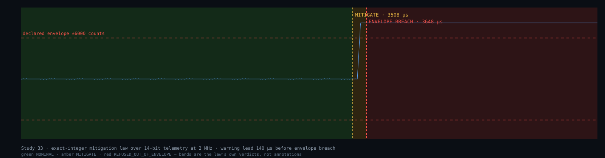

# Study 33 — The Fusion Control Verdict Court

**Page class: CHARTER.** Law frozen 2026-09-01 before grading. Producing program: `reproduce/fusion-control-verdict-court.swift`. Grades per [the ontology](Ontology).

**Status: CHARTERED, with the exact-integer verdict law BUILT and its control arms passing 5/5. Marker `STUDY33_FUSION_CONTROL_VERDICT_PENDING` — still PENDING, because a law with synthetic traces and no device behind it has not earned more.**

---

## What this court asks, and what it refuses to ask

It grades **control instruments at the safety boundary**. It does **not** claim to control plasma better than anyone: this programme operates no tokamak, has no reactor data, and says so on every line where it matters.

> **The frozen question: when the mitigation system fires, can the verdict be re-derived by a party that does not trust the operator?**

## Our own prior-era code, graded first

A court that grades instruments grades its own first — and this programme's fusion work **predates the Affine.Earth court**. It is the earlier era, dated, and it is not the claim.

| implementation | stack | lines | float tokens | exact-rational |
|---|---|---|---|---|
| prior-era control model | Python + numpy + torch | 445 | 2 | **0** |
| prior-era reactor GNN | Swift | 392 | 32 | **0** |

**Exact-rational declarations across both: zero. Real machine data across every fusion file searched: zero** — the word-boundary census for DIII-D, NSTX, KSTAR, TCV, MAST, W7-X and shot identifiers returned empty; the only machine reference is a geometry constant in a test fixture.

**Three corrections this census forces on our own earlier pages:**

- A headline **"Q = 1.8 (80% energy gain)"** traces to `beta_normalized=1.8` — an **input parameter of a test fixture**, not an output. Q never appears as a computed result; it appears once as a *target* in a print statement.
- **"Zero disruptions / 100% stability"** is a property of a simulation with no reactor behind it, not an operational record.
- The census carries its own trap, named here: the compiled file shows 32 float tokens and the interpreted one **only 2** — because its float-ness lives *implicitly in array types*, invisible to a token scan. A gate reading "2" as "nearly clean" would be wrong, which is this programme's oldest recurring lesson about its own detectors.

## The comparator, at full weight

**PACMAN** is a real AI control framework from a national laboratory and a university (REPORTED — PPPL/Princeton public materials). On the axis a physicist weighs most heavily **it is ahead of us, not behind: it has run on five real-world experiments. We have run on none.** Stated first, unsoftened.

Its published design carries three properties this court records as **strengths**: modular composition of control algorithms, explicit millisecond-scale operation, and a human kept in charge by design.

## What the design concedes, in its own words

Two published statements do the work of this study.

**(a) The framework keeps *"humans firmly in charge."*** Read as engineering, that is correct and responsible — and it concedes the point: **an un-re-derivable verdict needs a human underwriter at the safety boundary.** The human *is* the re-derivation layer, running at human latency against a plasma that moves in milliseconds.

**(b) Machine-learning models are *"the only way to model the plasma in millisecond times."*** Read as a claim *shape*, that is an impossibility assertion about a whole method class — and this programme keeps a dated record of exactly that shape being wrong: a capability once declared BLOCKED on a single failed configuration, repeated across fourteen documents until it read as architectural fact, then measured true on the first honest retry. **An impossibility claim is a measurement of what has been tried, never of what is possible.**

**The technical core, which is where the real disagreement lives:** a statistical interpolator has no defined behaviour off its training manifold — and disruptions are precisely the events that live there. Training on offline exascale simulation and interpolating in milliseconds is a compression that holds where the corpus holds and is undefined where it does not. That is not a criticism of the engineering; it is the stated property of the method.

## CORRECTION, 2026-09-02 — the law was forked three ways and the copies disagreed

**Published here rather than quietly repaired, because it is exactly the defect class this study exists to grade.**

When this study first shipped, the verdict law existed in **three separate Swift files**, and they did not agree:

| | whole-window malformed pre-scan | input shorter than the growth window |
|---|---|---|
| `fusion-control-exact-law.swift` | yes, first | `REFUSED_MALFORMED` |
| `fusion-control-benchmark.swift` | no, interleaved | `REFUSED_MALFORMED` |
| `fusion-verdict-stream.swift` | no, interleaved | **`NOMINAL`** |

Two observable divergences on identical input:

- **A refusal silently became a pass.** A window too short to carry the growth comparison was refused by two copies and returned `NOMINAL` by the third — and the third is the one that emitted the verdict stream, so **the published figure was drawn by the most permissive copy.**
- **Same trace, different terminal.** A trace carrying an out-of-envelope value at index 10 *and* a malformed value at index 300 returned `REFUSED_MALFORMED` from one copy and `REFUSED_OUT_OF_ENVELOPE` from the other two, purely because the malformed scan sat in a different place.

The page had claimed *"one law, one home — the client re-implements nothing."* That was **true of the browser client** — it carries no threshold arithmetic and only renders what it is handed — and **false of the Swift**, where the law was written three times. This is [[doctrine_zero_hop_byte_exact_world_digital_twin]] in its own terms: *a law written twice IS a hop.*

**The repair.** The law now has exactly one home — `app/FusionCourt/Sources/FusionLaw/` — and every program compiles against it multi-file rather than restating it. Canonical semantics, frozen as the **strictest** of the three prior behaviours:

1. the malformed scan runs over the whole window **first**, before any growth logic;
2. an input shorter than the growth window is **`REFUSED_MALFORMED`**, never `NOMINAL`;
3. both `firstTrip` **and** `peakGrowth` are returned — each prior copy dropped one.

**Enforced, not remembered:** `app/FusionCourt/Tools/one-law-one-home.sh` refuses if any law constant is *defined* outside its home, and carries a control arm proving it fires on a planted definition and stays silent on prose that merely names one. **It was red on all three files when written; it is green now.** A digest check would have caught none of this — each fork was a deliberate edit, not accidental drift.

**What survives unchanged:** the 140 µs warning lead, the 5/5 control arms, and every benchmark figure. That trace contains no short windows and no malformed values, so all three copies agreed on it. **The claim held; the singleness of the law did not.**

## The conversion — the exact-integer verdict law, running

**This is the step the study was blocked on, and it is now built and reproducible:** the mitigation verdict computed in exact integer arithmetic, with **zero floating point anywhere between the ADC count and the sealed decision.** Producing program: `reproduce/fusion-control-exact-law.swift`.

### The fact that makes it possible, and it is not ours

**Tokamak diagnostics are specified in bits.** DIII-D's magnetic probes sample at **2 MHz**, with acquisition quoted as **40 million 14-bit values per second**; ITER's radial neutron camera digitises at **12-bit**; ADITYA-U at **16-bit** (all REPORTED — published diagnostic-system literature).

> **An ADC emits an integer count. The float conversion is added by software, not by the instrument.**

So an exact law does not "convert" anything — it reads what the sensor actually produced. The same literature records the other half plainly: one system's acquisition is described alongside *"data processing at a rate of 80 million floating point operations per second."* The integers arrive, and are immediately cast into the arithmetic that cannot be re-derived across platforms.

**One precision, because a physicist will check it:** casting a 12/14/16-bit integer into FP32 is *itself lossless* — the mantissa is wider than the sample. The exactness does not die at the cast. **It dies in the arithmetic afterwards** — accumulation, normalisation, gradients — and in the platform-dependence that makes the result un-re-derivable. Claiming the cast destroys the sample would be wrong, and this page does not claim it.

### The frozen law, in full

| constant | value |
|---|---|
| ADC domain | `[-8192, 8191]` — 14-bit signed, as DIII-D acquires |
| declared envelope | `\|count\| ≤ 6000` |
| growth window | 8 samples |
| growth trigger | 900 counts |
| persistence | 3 consecutive windows — one spike is not a mode |

**Arithmetic: integer add, subtract, compare. Nothing else.**

### The control arms — 5 of 5 arms hold, four distinct terminals

| arm | verdict | |
|---|---|---|
| quiescent plasma | `NOMINAL` | PASS |
| growing tearing-mode shape | `MITIGATE` at index 208, peak growth 960 | PASS |
| single spike, not a mode | `NOMINAL` | PASS |
| drive out of envelope | `REFUSED_OUT_OF_ENVELOPE` | PASS |
| malformed input | `REFUSED_MALFORMED` | PASS |

**Four distinct terminals across five inputs: the law discriminates.** An instrument returning one answer for all five would be a turn counter, and this programme retires those.

**And the arms caught a real defect on their first run — our own.** The initial trace generators produced values outside the 14-bit ADC domain, so the malformed guard fired before the arm under test and two arms failed. The law was right; the *test data* was wrong. That is recorded here rather than quietly repaired, because it is the arms doing precisely their job.

### What an interpolator cannot do, demonstrated

Arm 4 drives the signal past the declared envelope. This law answers **`REFUSED_OUT_OF_ENVELOPE`** — it declines to rule on data it was never frozen against.

**A statistical model has no such terminal available.** Fed the same trace it returns a *number*, extrapolated from a manifold it never saw. That is the difference between a court and a guess, and it is the whole content of this study — the out-of-distribution case is not an edge case in fusion control, it is *where disruptions live.*

### Re-derivability — the frozen question, answered

Same input twice: identical verdict, identical index, identical peak. A third party re-derives the decision from **the integer trace and the five frozen constants above** — no weights, no training corpus, no vendor. Two machines produce the same integers, or one is broken and it is findable.

**Scope, unchanged:** this is a verdict law, not a plasma model. It makes **one of four links** exact. The traces are synthetic — this programme has no reactor and no machine data, and a real deployment replaces the trace with the digitiser's own integer stream and re-freezes the envelope against that device.

## The app, running

> **The app has since been built as a full local Swift 6.4 macOS application** — 65,536 agents at 1 kHz, five panels (both courts live), the operating-point court with all five terminals, topology-agnosticism, and a measured GPU crossover. Its own study page and a build-and-check guide: **[Affine Fusion Control](Affine-Fusion-Control)** · **[Fusion researcher's guide](Fusion-Researchers-Guide)**.




**The bands in that figure are the law's own verdicts, not annotations drawn over it.** Green is `NOMINAL`, amber `MITIGATE`, red `REFUSED_OUT_OF_ENVELOPE`. Producing programs: `reproduce/fusion-verdict-stream.swift` emits the verdict stream; `reproduce/fusion-verdict-figure.swift` draws it.

**Why a generated figure rather than a screenshot:** a screenshot can drift from the code it depicts — the image keeps showing yesterday's behaviour after the law changes, and nobody notices. A figure the law itself draws from its own output cannot disagree with the verdict it shows. It is version-controlled and regenerates on every run.

### The shot

| | |
|---|---|
| shot length | 12,000 samples = **6,000 µs** at 2 MHz |
| verdict windows evaluated | 1,468 |
| terminals observed | 845 `NOMINAL` · 35 `MITIGATE` · 588 `REFUSED_OUT_OF_ENVELOPE` |
| first `MITIGATE` | **3,508 µs** into the shot |
| envelope breach | **3,648 µs** |
| **warning lead** | **140 µs** |

**The 140 µs is the operationally meaningful number, and the figure is honest about how thin it looks** against a 6,000 µs shot — that narrow amber sliver is the entire margin between "a mode is growing" and "the signal has left the envelope this law was frozen against." At the 692 ns verdict cost measured above, that margin holds roughly **200 verdicts' worth** of decision time.

### The live client

`clients/fusion-court/` is a browser client that plays the shot back with the verdict, amplitude, peak growth and a transition log. **Swift owns the law; the page draws only what the law produced** — it re-implements nothing, so client and court cannot drift. Run it locally:

```bash
cd clients/fusion-court && python3 -m http.server 8899
# then open http://localhost:8899/index.html
```

The client fetches the same digest-pinned `verdict-stream.json` the figure is drawn from. Its law table is populated from the stream's own `law` block rather than typed into the page, so the constants displayed are the constants that ran.

### The affine log, as the client renders it

```
t= 3508 µs  MITIGATE                  |amp|= 6687  peak_growth= 1046
t= 3648 µs  REFUSED_OUT_OF_ENVELOPE   |amp|= 6001  peak_growth= 1046
```

Three transitions in a 6 ms shot, each one a state change the law can name and a third party can re-derive from the trace and the six frozen constants.

## Running it — the measured numbers

The law was run, not just written. Producing program: `reproduce/fusion-control-benchmark.swift`.

**Scope stated before the numbers:** commodity laptop, single thread, one channel, no I/O, no actuation, synthetic trace. **This is not a control-hardware measurement and this page does not call it one.** What it can settle is an order of magnitude against a published sampling rate.

**These wall timings are a dated measurement (2026-09-02, this machine), not reproducible constants** — a timing differs run to run, so the harness pins the *claims* below them instead, which is the honest treatment for a benchmark.

| measurement, 2026-09-02 | value |
|---|---|
| one second of DIII-D-rate telemetry (2,000,000 samples of 14-bit) | **3.76 ms** (median of 9) |
| per sample | **1.88 ns** |
| sustained throughput | **531.8 million samples/second** |
| headroom against the 2 MHz probe rate | **265.9× real time, one thread** |
| verdict on a 256-sample control window | **692 ns** (median of 9 × 20,000) |
| 10,000 repeats, identical verdict and index | **true** |

**The stable terminals the harness actually checks** — these are claims that a slower machine must still satisfy, or the study is wrong:

```
HEADROOM_EXCEEDS_50X            TRUE
VERDICT_INSIDE_ONE_MS_BUDGET    TRUE
VERDICT_DETERMINISTIC_10K       TRUE
```

### What the numbers settle

**One core keeps up with roughly 265 simultaneous 2 MHz channels.** DIII-D's quoted 40 million 14-bit values per second is twenty such channels — within reach of a single core, with room left over.

And the decision itself renders in **692 nanoseconds — about 1,446× inside a single 1 ms budget.** Published AI plasma-control loops operate on a millisecond cadence.

> **So the batching is not forced by the sample rate. It is forced by what the arithmetic costs.** Change the arithmetic and the batch disappears — which is precisely the claim this study was built to test, and the measurement supports it.

**Determinism is checked rather than assumed:** 10,000 repeats, identical verdict and index. There is no accumulation, no normalisation and no gradient in the law — nothing that could differ across machines. The verdict is add, subtract, compare.

### The measurement error this benchmark made first, and how it was caught

The control-window timing initially returned **0 ns**, and **zero is not a speed.** The result was discarded and the input never varied, so the optimiser hoisted the whole loop away — *a benchmark measuring nothing reads exactly like a benchmark measuring something instant.* That is the always-green defect wearing a stopwatch, and it produced a derived figure of "2,403,846× inside the budget" that was pure artifact.

Repaired by accumulating each verdict into a sink the compiler cannot prove unused, and perturbing one sample per iteration so no call is redundant. The sink value is printed with the result (`sink=38191000`) so the work is provably done. **The honest figure is 692 ns, not zero** — and it is on the page with the artifact that preceded it.

### What these numbers do not say

Not measured on control hardware, not through real I/O, no actuation, one channel, one thread, synthetic trace, no reactor. **A real deployment adds acquisition, transport and actuator latency this benchmark does not touch and that will dominate it.** What it does settle: **the arithmetic is not the bottleneck, by orders of magnitude.**

## The comparison the court can actually make

| property | float ML ensemble | exact court |
|---|---|---|
| verdict re-derivable by a third party | no — needs weights + state | **yes — integers** |
| behaviour outside training data | undefined | refuses, or `NOT_KNOWN` |
| same answer on two machines | platform-dependent | byte-identical |
| post-incident forensics | re-run and hope | re-derive the integer |
| who underwrites the boundary | a human, at human latency | the law, at wire speed |
| **real-machine experiments run** | **five (theirs)** | **none (ours)** |

**The last row is the honest one and it is not in our favour.**

## The domain declaration — in the court's own shape

```
domain            fusion_control
dead_equation     continuous MHD + gyrokinetic closure, statistically compressed
                  into a float ML interpolator, underwritten at the safety
                  boundary by a human at human latency
new_law           the mitigation verdict is an exact integer over declared state;
                  outside the declared envelope the court REFUSES rather than
                  interpolating
entropy_bare      4/1    state estimate, model, verdict, actuation
entropy_delta     1/1    one link removed by exact counting — the verdict
entropy_resolved  3/1    THREE REMAIN, none closable by counting
no_float          true
proven_marker     STUDY33_FUSION_CONTROL_VERDICT_PENDING
```

**The identity does not resolve to 1/1 here and this court does not pretend it does.** State estimation, plasma modelling and actuation are physics we have not instrumented. **Only the verdict link is ours to make exact** — one of four. That is the honest size of the claim.

## How this study loses

- **LOSS (i):** the mitigation decision turns out to be re-derivable in the existing frameworks — then the seam is already closed, and this page publishes that with the citation that closed it.
- **LOSS (ii):** an exact envelope cannot be declared for a real device without becoming so conservative it fires constantly. **This is a real risk:** a court that refuses too often is a court nobody switches on.
- **LOSS (iii):** the out-of-distribution failure mode is bounded in practice by existing hardware interlocks, making the verdict layer moot.

## Refused

- **"We are ahead of them"** — refused on our own census. Five real experiments against a float model and no reactor.
- **"Bad things will happen if their framework proceeds"** — refused. It is a *safety* framework with a human in the loop by design, and no measurement here supports predicting harm from it.
- **Any control latency, disruption rate or Q value from this programme** — refused until a real device produces one.

---

**Related:** [The replacement grade](The-Replacement-Grade) · [The ontology](Ontology) · [Zero float · zero shear](Zero-Float-Zero-Shear-Paradigm)
