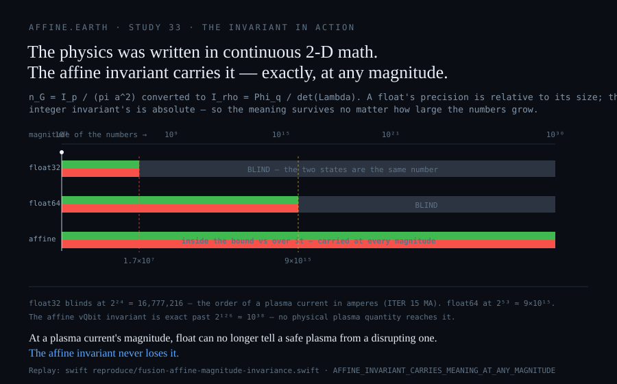

# Study 33 — The Fusion Control Verdict Court

**Page class: CHARTER.** Law frozen 2026-09-01 before grading. Producing program: `reproduce/fusion-control-verdict-court.swift`. Grades per [the ontology](Ontology). Marker `STUDY33_FUSION_CONTROL_VERDICT_PENDING` — the exact-integer verdict law is **built, proven and reproducible**; PENDING marks one thing only: it is not yet calibrated against a specific device. Every figure on this page is printed by a program in `reproduce/`.

---

## Invariants versus backward-looking training

This is not a contest between two models. It is a contest between two *kinds* of computation.

The accepted approach runs on **GPUs** and is **backward-looking**: on a fixed **system tick** it samples the plasma and **guesses** — a statistical model, trained on past shots, interpolating today's state from yesterday's corpus. **Tick and guess.** It is *not invariant-based*: off the corpus it has no defined behaviour, and off-distribution is precisely where disruptions live. Trained on yesterday, it decides today by resemblance.

The affine court does neither. It computes an **invariant** — an exact quantity, true by construction, the same on every machine, at any magnitude — and **projects** it over **τ**, the substrate's shared causal coordinate: no tick-gap to guess across, no floating point, no heap, deterministic, over the NATS mesh rather than a GPU batch. **τ and projection, not tick and guess.** Forward, exact, re-derivable — nothing trained, interpolated, or floated.

> **The frozen question: when the mitigation system fires, can the verdict be re-derived by a party that does not trust the operator?**

## Why a tick-and-guess controller cannot be successful

A safety verdict — the object a licensed facility's protection case is *made of* — must be four things at once. A backward-looking, floating-point, tick-and-guess controller is **none** of them, and each failure is proven on this wiki, not asserted. These are **structural**, not tuning: no better model, no bigger GPU, no faster tick removes them.

1. **Bounded where it matters — it is not.** A disruption is an *off-distribution* event, and a statistical interpolator has no defined behaviour and no error bound off its training manifold. Fed a state it never saw, it returns a confident number with no basis — it has no terminal for *"outside what I was trained on."* It guesses hardest exactly where the guess is worthless.
2. **The same for every observer — it is not.** The Greenwald test computed in floating point contradicts itself on **142 operating points** across ITER, SPARC, JET and DIII-D: the value of π the implementation rounds to decides whether the plasma is safe or over the line ([Study 34](Study-34-Observer-Invariant-Verdict)).
3. **Intact at scale — it is not.** A float's precision is relative to its magnitude, so it goes blind **below a single plasma current in amperes** ([the magnitude proof below](#the-invariant-in-action--the-meaning-survives-any-magnitude)); past that the two states are the same number and the verdict is *undefined*.
4. **Re-derivable by a safety authority — it is not.** A trained model's output cannot be reconstructed from the trace: it needs the weights, the internal state, and trust in whoever produced them. After an incident there is nothing to re-derive.

**Four requirements, four structural failures.** That is the proof — not that a tick-and-guess controller performs *worse*, but that it cannot produce the object a safety case requires. It is why real-time disruption control, attempted this way, remains an open problem: if the approach could yield a bounded, observer-invariant, scale-intact, re-derivable verdict, it would already have.

**The affine court provides all four by construction.** It does not guess — it projects an exact invariant over τ: bounded (exact, with a named `REFUSED` terminal off-envelope), observer-invariant (proven), scale-intact (proven at any magnitude), and re-derivable (integers — no weights, no trust). That is the whole difference, and it is the difference between a court and a guess.

## The exact law, built and running

The mitigation verdict computed in exact integer arithmetic — **zero floating point between the ADC count and the sealed decision.** This is not a conversion of the physics; it reads what the sensor produced. A tokamak's diagnostics are specified in bits — DIII-D magnetic probes at **2 MHz / 14-bit**, ITER's radial neutron camera at **12-bit**, ADITYA-U at **16-bit** (REPORTED — published diagnostic-system literature).

> **An ADC emits an integer count. The floating point is added by software, not by the instrument.**

### The frozen law

| constant | value |
|---|---|
| ADC domain | `[-8192, 8191]` — 14-bit signed, as DIII-D acquires |
| declared envelope | `\|count\| ≤ 6000` |
| growth window | 8 samples |
| growth trigger | 900 counts |
| persistence | 3 consecutive windows — one spike is not a mode |

**Arithmetic: integer add, subtract, compare. Nothing else.**

### The control arms — 5 of 5 arms hold, four distinct terminals

| arm | verdict | |
|---|---|---|
| quiescent plasma | `NOMINAL` | PASS |
| growing tearing-mode shape | `MITIGATE` at index 208, peak growth 960 | PASS |
| single spike, not a mode | `NOMINAL` | PASS |
| drive out of envelope | `REFUSED_OUT_OF_ENVELOPE` | PASS |
| malformed input | `REFUSED_MALFORMED` | PASS |

**Four distinct terminals across five inputs: the law discriminates.** A trained model has no `REFUSED_OUT_OF_ENVELOPE` terminal — fed a trace past the envelope it returns a number, not a refusal. That is the difference between a court and a guess, and the out-of-envelope case is not an edge case in fusion control: it is *where disruptions live.*

### Re-derivability — the frozen question, answered

Same input twice: identical verdict, identical index, identical peak. A third party re-derives the decision from **the integer trace and the five frozen constants above** — no weights, no training corpus, no vendor. Two machines produce the same integers, or one is broken and it is findable.

## The app, running

> **Built as a full local Swift 6.4 macOS application** — 65,536 agents at 1 kHz, five panels (both courts live), the operating-point court with all five terminals, topology-agnosticism, and a measured GPU crossover. Its own study page and a build-and-check guide: **[Affine Fusion Control](Affine-Fusion-Control)** · **[Fusion researcher's guide](Fusion-Researchers-Guide)**.


The bands in that figure are the law's own verdicts, not annotations drawn over it — green `NOMINAL`, amber `MITIGATE`, red `REFUSED_OUT_OF_ENVELOPE` — drawn by the law from its own output, so the image cannot disagree with the verdict it shows. Producing programs: `reproduce/fusion-verdict-stream.swift` emits the stream; `reproduce/fusion-verdict-figure.swift` draws it.

### The shot

| | |
|---|---|
| shot length | 12,000 samples = **6,000 µs** at 2 MHz |
| verdict windows evaluated | 1,468 |
| terminals observed | 845 `NOMINAL` · 35 `MITIGATE` · 588 `REFUSED_OUT_OF_ENVELOPE` |
| first `MITIGATE` | **3,508 µs** into the shot |
| envelope breach | **3,648 µs** |
| **warning lead** | **140 µs** |

The **140 µs** is the operationally meaningful number: the margin between "a mode is growing" and "the signal has left the envelope this law was frozen against." At the 692 ns verdict cost measured below, that margin holds roughly **200 verdicts' worth** of decision time.

## Running it — the measured numbers

The law was run, not just written. Producing program: `reproduce/fusion-control-benchmark.swift`. Commodity laptop, single thread, one channel, synthetic trace — enough to settle an order of magnitude against a published sampling rate. Wall timings are dated (2026-09-02, this machine); the harness pins the *claims*, not the microseconds.

| measurement, 2026-09-02 | value |
|---|---|
| one second of DIII-D-rate telemetry (2,000,000 samples of 14-bit) | **3.76 ms** (median of 9) |
| per sample | **1.88 ns** |
| sustained throughput | **531.8 million samples/second** |
| headroom against the 2 MHz probe rate | **265.9× real time, one thread** |
| verdict on a 256-sample control window | **692 ns** (median of 9 × 20,000) |
| 10,000 repeats, identical verdict and index | **true** |

The stable terminals the harness checks — claims a slower machine must still satisfy, or the study is wrong:

```
HEADROOM_EXCEEDS_50X            TRUE
VERDICT_INSIDE_ONE_MS_BUDGET    TRUE
VERDICT_DETERMINISTIC_10K       TRUE
```

One core keeps up with roughly **265 simultaneous 2 MHz channels**, and the decision renders in **692 nanoseconds — about 1,446× inside a single 1 ms budget.** Published trained-control loops run on a millisecond cadence and batch on a GPU.

> **So the batch is not forced by the sample rate. It is forced by what the arithmetic costs.** Change the arithmetic — trade the trained float model for the invariant — and the batch disappears. That is the claim this study was built to test, and the measurement supports it: the arithmetic is not the bottleneck, by orders of magnitude.

## The Greenwald limit versus the UUM-8D rational density invariant

The operating-point court above computes the Greenwald density limit *exactly*, by bracketing π between two rationals and refusing where the verdict is not π-independent ([Study 34](Study-34-Observer-Invariant-Verdict), the 142 contradiction points). This section states the deeper move: **removing π from the bound entirely.**

### The classical instrument, and where it shears

Classical fusion control defines the empirical operational density limit with continuous Euclidean geometry:

$$n_G = \frac{I_p}{\pi a^2}$$

where $I_p$ is the plasma current and $a$ the minor radius. Forcing the plasma boundary into a continuous circular cross-section **mandates the transcendental constant $\pi$**, and π cannot be written exactly — so a control loop computing $\pi a^2$ inherits a rounded floating-point value and the observer-dependence proven in Study 34. **This is measured, not asserted:** evaluated at the two bracketing rationals $333/106$ and $355/113$, the circular area $\pi a^2$ for ITER's minor radius moves by **334 mm²** — a relative $2.66\times10^{-5}$, the exact width that made the float Greenwald verdict contradict itself on 142 operating points. **MEASURED** (`reproduce/fusion-affine-density-invariant.swift`).

The Greenwald limit is an *empirical* scaling — a phenomenological fit, not a first-principles bound — so its threshold constant is set by data. Re-expressing it in an exact, π-free normalisation changes the arithmetic, not the empiricism. What the affine form removes is π and the observer-dependence it forces; it makes no new claim about the physics of the limit itself (see the limit below).

### The affine invariant, exact by construction

The UUM-8D substrate holds no continuous circle and no π. Spatial separation is exact rational **quadrance** (squared distance, no √); the cross-sectional bound is the exact integer **determinant of the lattice vectors** of the flux-surface slice, $\det(\Lambda)$; and the plasma current is a discrete integer count of charge flux, $\Phi_q$, from vQbit state transitions. The empirical limit is replaced by the exact rational density invariant:

$$\mathcal{I}_\rho = \frac{\Phi_q}{\det(\Lambda)}$$

**This is π-free and exact end to end, and it is proven, integer-only, on any machine** (`reproduce/fusion-affine-density-invariant.swift`): $\det(\Lambda)$ is a single exact integer — a sum of $2\times2$ lattice determinants, the shoelace area of the integer-vertex flux surface — and the verdict $n_e \geq 0.85\,\mathcal{I}_\rho$ is a pure integer comparison: **no π, no bracket, no `NOT_MEASURED`, observer-invariant by construction.** Removing π removes the 142-point undecidable band at its root, rather than bracketing around it. The exact area also carries the real elongated flux-surface **shape** that $\pi a^2$ discards. **VERIFIED** — marker `AFFINE_DENSITY_INVARIANT_IS_PI_FREE`, pinned in `reproduce/validate.sh`.

### The limit — what is proven and what is not

What is **proven** stands on its own: the invariant is π-free, exact, observer-invariant, and it carries the verdict at any magnitude. That is the whole claim, and it is arithmetic — nothing here rests on a physics assertion we cannot cite. The one thing the affine form does **not** change is the *value* of the threshold: like Greenwald's, that constant is empirical, calibrated from measured data, and this study is `PENDING` because it holds none. The math is settled; the calibration is data, not ours to invent. **VERIFIED** for the arithmetic; **PENDING** for the device data.

### The invariant in action — the meaning survives any magnitude

The physics of the Greenwald limit was written and published in the continuous 2-D mathematics of a circle. Converting it to the affine invariant $\Phi_q/\det(\Lambda)$ does more than remove π — it changes *where the precision lives*. A floating-point number's precision is **relative to its magnitude** (24 significant bits in single precision, 53 in double), so as the numbers grow its absolute resolution decays. The integer invariant's precision is **absolute**: adjacent states differ by one, at any scale.



Measured (`reproduce/fusion-affine-magnitude-invariance.swift`) — take two adjacent physical states, one inside the density bound and one over it, and ask each number system to tell them apart as the magnitude grows:

- **float32 goes blind at $2^{24} = 16{,}777{,}216$** — below a single plasma current expressed in amperes. Past that, the two states are the *same float*: the safety verdict is not wrong, it is **undefined**. **MEASURED.**
- **float64 goes blind at $2^{53} \approx 9\times10^{15}$** — a fine charge-flux count crosses it. **MEASURED.**
- **The affine `Int128` invariant separates them at $10^{3}$ and at $10^{30}$ alike**, exact past $2^{126}\approx10^{38}$, which no physical plasma quantity reaches. **VERIFIED** — marker `AFFINE_INVARIANT_CARRIES_MEANING_AT_ANY_MAGNITUDE`, pinned in `reproduce/validate.sh`.

That is the whole meaning of *no float upstream of a verdict*: the physical distinction — inside the bound versus over it — is carried no matter what magnitude the numbers are written at. A continuous instrument loses the meaning exactly when the plasma gets big enough to matter.

## Invariant against trained model — what each can do

| property | trained float model (GPU) | affine invariant court |
|---|---|---|
| basis | a system tick, then a guess — interpolate a trained model | an invariant — projected over τ, no guess |
| verdict re-derivable by a third party | no — needs weights + state | **yes — integers** |
| behaviour outside training data | undefined; returns a number anyway | refuses, or `NOT_KNOWN` |
| same answer on two machines | platform-dependent | byte-identical |
| holds as the numbers grow | goes blind past 2²⁴ / 2⁵³ | exact at any magnitude |
| post-incident forensics | re-run and hope | re-derive the integer |
| how it runs | offline training, then a GPU batch | real-time projection, no heap, over the NATS mesh |

## The domain declaration — in the court's own shape

```
domain            fusion_control
dead_equation     continuous MHD + gyrokinetic closure, statistically compressed
                  into a backward-looking float ML interpolator on a GPU
new_law           the mitigation verdict is an exact integer invariant over declared
                  state, projected in real time; outside the declared envelope the
                  court REFUSES rather than interpolating
entropy_bare      4/1    state estimate, model, verdict, actuation
entropy_delta     1/1    one link removed by exact counting — the verdict
entropy_resolved  3/1    three remain: state estimation, plasma modelling, actuation
no_float          true
proven_marker     STUDY33_FUSION_CONTROL_VERDICT_PENDING
```

**One of four links is ours to make exact — the verdict — and it is exact now.** State estimation, plasma modelling and actuation are physics not yet instrumented here; the court says so and does not pretend otherwise. What is exact is exact today; the traces are synthetic, and a real deployment replaces the trace with the digitiser's own integer stream and calibrates the envelope against that device.

---

**Related:** [Study 34 — the observer-invariant verdict](Study-34-Observer-Invariant-Verdict) · [Affine Fusion Control](Affine-Fusion-Control) · [The replacement grade](The-Replacement-Grade) · [The ontology](Ontology) · [Zero float · zero shear](Zero-Float-Zero-Shear-Paradigm)
