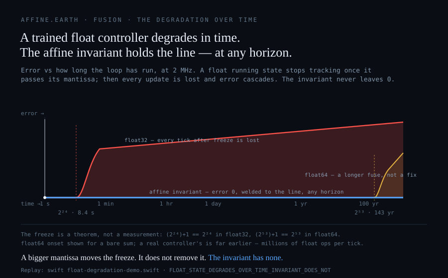

# Study 35 — The safety brain that forgets

Fusion is the closest thing we have to clean, limitless power — enough to carry billions without burning the planet to get it. Whether we ever reach it turns, in part, on one decision a reactor makes thousands of times a second: *is the plasma about to tear itself apart?* Get it right and the machine runs. Get it wrong and the plasma quenches and can wreck the reactor. That decision is the machine's **safety brain** — and the field is building it out of floating-point, trained AI, a system that learns from past shots and guesses on the next. This study proves, in arithmetic anyone can re-run, that a brain built that way cannot become what a safety case requires. Not *is behind*. **Cannot.**

**It goes deaf, and never knows.** A floating-point running memory stops taking in new information after a fixed count of updates — about **eight seconds** at a fast diagnostic's rate. Not slows: stops, and goes on reporting the last number it heard as if it were live, with no alarm. That is not a bug to be patched in the next release; it is a theorem of the number system itself. A bigger, 64-bit brain pushes the moment out — years instead of seconds — but never removes it. A safety brain with a deafness it cannot see past is not a safety brain, at any size.

**It forgets the moment you move it.** Fusion is a field of one-of-a-kind machines — ITER is not SPARC is not a stellarator — and of events no one has recorded yet. A brain trained on one reactor scores well there, drops to a **coin toss** on a reactor it has never seen, and *forgets the first* the instant you retrain it on the second. It is only ever right where it has already been — precisely the wrong shape for a machine whose most dangerous moments are the ones nobody has in the training set. It guesses hardest exactly where the guess is worthless.

**It will not even agree with itself.** Ask the same safety question in floating point and the answer flips between *safe* and *over the line* on **142** real operating points — decided not by the plasma but by which rounding of π the program happened to use. Two honest engineers run the identical test and reach opposite conclusions about the same plasma, and neither can show the other who is right, because in that arithmetic there is no fact of the matter. A verdict that changes with who computes it cannot be audited, cannot be licensed, and cannot be handed to a public that has to trust it.

**And no bigger computer fixes any of it — that is what makes it doomed.** All three failures share one root: the arithmetic is not exact. So scaling does not cure the disease, it feeds it. More precision buys a longer fuse, not a fix. A larger model fits the old shots more tightly and still knows nothing off them. A larger fleet does not reconcile a verdict that changes per machine — it *multiplies* the disagreement, at the rate the fleet grows. Every dollar and research-year poured into the floating-point path widens the crack it was meant to close. And the history rhymes with the math: stochastic and machine-learned control has been chased for tokamak plasmas for decades, and the control problem is still open. If throwing compute and training at floating-point control could produce a trustworthy safety brain, decades of doing exactly that would already have produced one.

Here is the stake and the hope in the same breath: **this was never the hard physics.** The safety verdict is software — and the exact version already exists. It never drifts, never deafens, never forgets; it gives every machine on Earth the same answer; and any regulator can re-derive it after the fact, from the raw trace and a handful of fixed rules, without trusting whoever built it. It runs on a laptop. So the doom is not fate — it is a *choice*: to keep spending the clean-energy window on arithmetic that provably cannot hold, when the arithmetic that can is already here, in the open, checkable by anyone. Get this one piece right and fusion becomes something a society can trust and adopt. Keep getting it wrong and we lose the window not to physics — but to a mistake we already know how to fix.



---

## How we know — the three failures, in full

### It goes deaf

A safety brain carries a running memory of the plasma. In 32-bit floating point that memory stops taking in new information after **16,777,216 updates** — **8.4 seconds** at a 2 MHz diagnostic, under **5 hours** at a 1 kHz control loop. Every reading after that moment is silently dropped, and the brain reports a stale number as if it were live. Inside a single 6-millisecond shot you would never see it; across a campaign — a day, a month, a reactor-year — the brain is deaf almost the whole time and confidently wrong. A 64-bit brain lasts far longer before it goes deaf, long enough that people mistake it for solved — a longer fuse, not a fix. The exact integer brain never goes deaf: there is nothing to fill up, at any horizon a reactor will ever run.

*The deaf point is a one-line fact of the number system — in 32-bit, sixteen-million-and-one rounds back down to sixteen million (**VERIFIED**); the "confidently wrong" figures — 99.8% of the count lost after one hour — are printed by a program you can run (**MEASURED**, `float-degradation-demo.swift`).*

### It forgets

Train the AI brain on one reactor and it does well *there* — 96.5% on shots from its own machine. Move it to a reactor it has never seen and it collapses to a **coin toss** — 49.6%. Teach it the new reactor and it **forgets the first** — back to 50.3% on the machine it used to know. That is the treadmill every trained brain is on. The exact brain has nothing to forget: it was never trained, and a reactor it has never seen is just new numbers it computes exactly — 100%, every machine, first time.

*Measured on a small stand-in model on synthetic data, naming no company (**MEASURED**, `drift-barrier-demo.swift`); that a full-scale AI brain inherits the same failure is reasoning from how training works (**ARGUMENT**).*

### It will not agree with itself

Ask the same density-limit question in floating point and the answer flips between *safe* and *over the line* on **142 operating points** across four real machines (ITER, SPARC, JET, DIII-D) — decided only by which rounding of π the program used. The exact brain gives one answer every machine on Earth reproduces to the last digit, and the affine form of the law removes π *entirely* — it measures the plasma's cross-section as an exact integer area instead of forcing it through a circle and a rounded π — so the disagreement has nowhere left to live, and it can describe a real elongated plasma a circle never could.

*The 142 flips are deterministic program output (**MEASURED**, `fusion-exact-vs-float.swift`); the π-free exact law is proven integer-only on any machine (**VERIFIED**, `fusion-affine-density-invariant.swift`). This axis is proven in full in [Study 34 — The Observer-Invariant Verdict](Study-34-Observer-Invariant-Verdict).*

## What this means for you

**If you build reactors** — one exact answer composes across a fleet, a shared database, a decade of shots, because there is one answer, not one per platform. A floating-point verdict accumulates disagreement you can never reconcile, faster the more you scale. The exact one is the only kind you can build a fleet on.

**If you regulate them** — *"the model was confident"* is not a safety case. *"Here is an exact integer, and here is the trace and the handful of fixed rules; re-derive it yourself after the incident"* is. The exact brain puts the check in the hands of the safety authority, not the vendor. Accountability lives in the mathematics, where nobody owns it.

**If you are just hoping** — the block here was never a missing machine or a bigger budget. It was a layer of software, and the honest version already exists, runs with no network and no accelerator on a commodity laptop, decides in well under a microsecond, and a stranger who runs it gets the same integer you do. Fusion being hard is not the same as fusion being out of reach. The part that was ever software is answered — here, in the open, checkable by anyone.

---

## The evidence, graded

**Page class: RESULTS — extends [Study 33](Study-33-Fusion-Control-Verdict-Court) along the axis of *time*, sibling to [Study 34](Study-34-Observer-Invariant-Verdict) (the axis of *observer*).** Grades per [the ontology](Ontology). Producing programs: `reproduce/float-degradation-demo.swift`, `reproduce/drift-barrier-demo.swift`. Markers `FLOAT_STATE_DEGRADES_OVER_TIME_INVARIANT_DOES_NOT`, `DRIFT_BARRIER_TRAINED_MODEL_STALE_INVARIANT_FIXED`. The subject under grading is the *arithmetic*; this study names no vendor.

This wiki does not ask to be believed. Every claim above carries a grade, and every number is printed by a program you can run.

| what | grade | how |
|---|---|---|
| the brain goes deaf at a fixed count (2²⁴ in 32-bit, 2⁵³ in 64-bit) | **VERIFIED** | a one-line theorem of IEEE-754: `(2^24)+1 == 2^24` is true; no loop, holds on any machine |
| deaf at 8.4 s (2 MHz) / 4.7 hr (1 kHz); 99.8% of the count lost after one hour | **MEASURED** | `float-degradation-demo.swift`, deterministic |
| forgets: 96.5% at home → 49.6% on an unseen machine → 50.3% back home after retraining | **MEASURED** | `drift-barrier-demo.swift`, a synthetic stand-in naming no vendor |
| the exact invariant: 100% on every machine, no training, no drift, no deaf point | **VERIFIED** | it is the exact truth the float is scored against |
| disagrees with itself on 142 operating points, decided by rounded π | **MEASURED** | `fusion-exact-vs-float.swift` ([Study 34](Study-34-Observer-Invariant-Verdict)) |
| the affine density law removes π entirely — one exact integer, same on every machine | **VERIFIED** | `fusion-affine-density-invariant.swift` |
| a real AI brain inherits all three failures; no bigger computer removes them; the decades argument | **ARGUMENT** | reasoning from how the arithmetic and the training work — labelled, not smuggled in as measurement |

The control law itself is [Study 33](Study-33-Fusion-Control-Verdict-Court); its peer grade is `PENDING`, and the math is proven now. This study proves a property of the *verdict over time* — that the exact one does not decay and the float one does — not a fusion result. **The clean-energy stakes and the "doomed" reading are interpretation (ARGUMENT) resting on the proven results above; fusion is gated by magnets, materials and plasma physics too, so this frames the math, it does not replace it, and it does not claim to solve fusion.**

## Run it yourself

No account, no key, no dependency on us.

```bash
git clone https://github.com/gaiaftcl-sudo/uum8dSolarResearch.git
cd uum8dSolarResearch
swift reproduce/float-degradation-demo.swift    # the deaf point, and how wrong it gets
swift reproduce/drift-barrier-demo.swift         # trained on one machine, lost on the next
```

The deaf point needs no trust in us at all: `(2^24)+1 == 2^24` is either true on your machine or it is not, and it is. The demos are deterministic and print their own verdicts. On publication both are pinned in `reproduce/validate.sh` beside every other figure on this wiki.

## Rights

This page, its programs, and the [Affine Fusion Control](Affine-Fusion-Control) app are **source-available**: the source is visible so anyone can inspect it and re-derive every figure. That visibility grants no rights. The repository carries no LICENSE, which under default copyright means **all rights are reserved**. No right is given or intended to use, run, or deploy any of it for any purpose beyond re-deriving the published figures, nor to build derivative works from it. **Any other use requires a separate written licensing agreement with the authors.**
