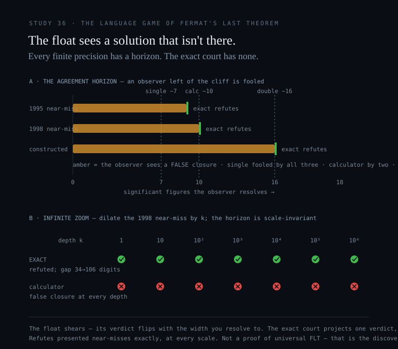

# Study 36 — Guess, or Project

*A probability engine stumbled into Fermat's Last Theorem in eleven days and six billion tokens. An exact-integer court measures the same class of truth deterministically, in microseconds, and seals it to one digest that reads the same on every machine. This study grades the **method** — never the theorem, and never the people who proved it.*

## The consensus that surrendered to a blur

**ARGUMENT** — the framing below is this study's thesis, not a measurement; the measurements are further down and graded.

Two habits have quietly become the whole industry's defaults, and both accept an illusion in exchange for speed.

The first is **guessing**. The sector is racing to build exascale clusters running trillion-parameter models that do not *know* anything — they sample at high speed and let a checker catch the misses. When dozens of Claude agents threw six billion tokens at Fermat's Last Theorem, it was called a triumph of AI. Read as architecture, it is a stochastic machine feeling its way through a dark room, needing a bolted-on state coordinator and a classical kernel just to keep from losing its own place.

The second is **rounding**. The world's financial, scientific, and cryptographic infrastructure runs on IEEE-754 floating point — hardware designed to *truncate reality* when the numbers get long. It is fast, and it is blurred: past a precision horizon the silicon quietly reports a number that is not the number.

Affine.Earth is the refusal of both. A machine that **will not guess, and will not round.** Study 36 puts the two habits on one board — Fermat — and reads the difference straight off the hardware.

## The probability engine — guessing to a discrete truth

In September 2026, Anthropic reported that **dozens of Claude agents** produced the first end-to-end, computer-checked Lean proof of Fermat's Last Theorem, in **eleven days**. It is a real achievement, standing on thirty years of human blueprint, and this study takes nothing from it. It is also a clean specimen of the guessing method, and the bill is on the record:

- **six billion tokens** of output, across several dozen parallel agents;
- **thirteen million lines of Lean** — over five times the whole of Mathlib (~2M lines);
- the first multi-agent attempt **lost track of its own state and stopped collaborating**, and had to be rescued by an external **directed-acyclic-graph coordinator** (the third-party Prove2Me) bolted on to hold the threads together;
- and a separate classical **Lean kernel** re-checking all thirteen million lines — there to catch the misses, which exist because the generator guesses.

Two classical crutches — a DAG to hold the state the model kept dropping, a kernel to catch the errors it kept making — wrapped around an engine that samples. **The eleven days are the fingerprint of search.** A machine that *knew* would need neither. This is the DISCOVER move, hunting a discrete truth through a probability field, and it is exactly the move the substrate refuses to fake. **REPORTED** — [Anthropic, *Formalizing Fermat's Last Theorem* (2026)](https://www.anthropic.com/research/formalizing-fermats-last-theorem); [Prove2Me, arXiv:2608.28433](https://arxiv.org/abs/2608.28433).

## The float that reports a solution that isn't there

Feed a machine the near-miss `1782¹² + 1841¹² = 1922¹²` — a trap the *Simpsons* writers planted to look like it breaks Fermat. A single-precision floating-point unit truncates the least-significant digits, rounds the error to zero, and returns **True**: it reports a counterexample to Fermat that does not exist. The 1998 sequel, `3987¹² + 4365¹² = 4472¹²`, fools a ten-digit calculator the same way.

`reproduce/flt-nearmiss-fractal-shear.swift` compiles to a native AArch64 binary and **never touches the floating-point ALUs.** It carries the operands as exact base-10⁹ integers, computes both sides in full, measures the absolute gap, and returns **REFUTED** — deterministically, and identically on every machine. Every figure below is cross-checked against an independent arbitrary-precision oracle.

| presented near-miss | integer court | single-precision (~7 figures) | calculator (~10 figures) | double-precision (~16 figures) |
|---|---|---|---|---|
| 1782¹² + 1841¹² vs 1922¹² *(Simpsons, 1995)* | **REFUTED** | **True — fooled** | refuted | refuted |
| 3987¹² + 4365¹² vs 4472¹² *(Simpsons, 1998)* | **REFUTED** | **True — fooled** | **True — fooled** | refuted |
| (10¹⁷)³ + (10¹⁷)³ vs c³ *(constructed)* | **REFUTED** | **True — fooled** | **True — fooled** | **True — fooled** |

The 1998 near-miss agrees with a true cube to **ten significant figures**, then parts — the exact gap is the thirty-four-digit integer `1211886809373872630985912112862690`. The 1995 near-miss parts after nine figures, at the exact gap `700212234530608691501223040959`. The constructed one agrees to *sixteen* figures — deep enough to make a double-precision unit report True as well — and the integer court still measures the gap and refutes it. **MEASURED.**

That is the death of the horizon. **A float's verdict is observer-dependent** — it flips with the precision the silicon happens to carry: single precision is fooled by the 1995 trap, a calculator by the 1998 one, double by the constructed one. Every finite width has a horizon past which it hallucinates a solution to Fermat. **The integer court has no horizon.** It refutes every one, and returns the identical verdict on every machine — sealed to a hash a stranger re-derives without trusting anyone:

```
FLT_NEARMISS_FRACTAL_SHEAR__EXACT_IS_OBSERVER_INVARIANT
sha256 = 1bba2839c16677070a986d49eb978dcd8a822c7dee30c769500d67544e861998
```



And the trap is **fractal**: apply the substrate's integer dilation — scale the near-miss by k, the exact "infinite zoom" — and the float's false True persists at *every* depth, because its horizon is scale-invariant, while the exact gap grows as kⁿ and never vanishes: REFUTED from thirty-four digits at k=1 to one hundred and six digits at k=10⁶. The float thrashes at every scale; the integer court measures the gap at every scale.

## The Law of the Substrate — it will not guess, and it will not round

This is the line the whole architecture is built on, and it has two edges.

**It will not round.** There is no floating point in the substrate path: the float gates return `REFUSED_FLOAT`, and the live nine-cell court reports `no_float: true` across all forty-nine domains — exact integers and rationals in place of any truncation step, which is why the court has no precision horizon for reality to blur through. The law here is realized in Swift 6.4: as the reproduce script above (cross-checked byte-for-byte against arbitrary precision), and, where a live instrument is wanted, as a dedicated Swift 6.4 client the way [Affine Fusion Control](Affine-Fusion-Control) already runs the fusion court on one machine — the same zero-float discipline, the same re-derivable seal.

**It will not guess.** The court executes two moves and refuses a third:

- **REFUTE** and **VERIFY** — a *presented* configuration, checked exactly. Deterministic, observer-invariant, sealed. These the substrate plays, and wins.
- **DISCOVER** — hunt a truth through an open space with no bounding constraint. This it **will not fake.** Asked to search, it returns `NOT KNOWN` / `projection_did_not_close` rather than sample toward an answer and dress the result as confidence.

That refusal is the integrity, not a limitation — and it is the *same law* everywhere on the substrate. It is why the court verifies a presented `(k, Q)` pair exactly but returns *not known* when asked to derive an unknown scalar from a bare public key, instead of grinding a probabilistic search and reporting a confident wrong answer. A machine that refuses to guess cannot be fooled, cannot shear, and cannot hallucinate a proof. It can only measure what is presented — and seal it.

## What this does not claim — and why that is the point

It does **not** prove the universal Fermat's Last Theorem, and the program says so in its own output. Refuting a presented near-miss, at every zoom depth, is the REFUTE move; it is not a search over all triples, and dilation only ever visits the one ray k·(a, b, c). Proving the universal is the DISCOVER move, and the substrate returns **NOT KNOWN** on it by law. A verifier that will not counterfeit a search is worth more than a guesser that will — because every verdict it *does* emit can be trusted, and re-derived, by anyone.

## Why it matters

**ARGUMENT.** The lesson runs against the era. Absolute computational certainty does not come from scaling up the noise — from a bigger cluster guessing faster, or a wider float rounding later. It comes from **eliminating the shear.** While the rest of the field builds larger data centres to guess at mathematics and larger registers to blur it more slowly, this is a distributed manifold that cannot hold a sheared state at all: it refuses to guess, refuses to round, and yields one observer-invariant digest on every machine in the fleet. Not an AI that sounds certain — a deterministic truth engine that *is*. Study 36 is its charter.

## Evidence, graded

| claim | grade |
|---|---|
| The integer court refutes every presented near-miss, byte-identical on every machine, sealed to one digest; a finite-precision unit returns a false True below its horizon and keeps it at every zoom depth. | **MEASURED** — `reproduce/flt-nearmiss-fractal-shear.swift`, cross-checked against arbitrary precision |
| Anthropic's Claude produced an end-to-end Lean proof of FLT in 11 days / ~6B tokens / ~13M lines (>5× Mathlib), after an initial multi-agent run lost coherence and was coordinated by the third-party Prove2Me DAG. | **REPORTED** — Anthropic (2026); arXiv:2608.28433 |
| Guessing-and-checking is a categorically more expensive and less re-derivable way to reach a verdict than deterministic projection; the substrate's refusal to fake a search is architectural integrity, not incapacity. | **ARGUMENT** — this study's reading of the two methods |
| The universal Fermat's Last Theorem, discovered by the substrate. | **NOT KNOWN** — the DISCOVER move; refused by law, never claimed |

## Reproduce

```bash
git clone https://github.com/gaiaftcl-sudo/uum8dSolarResearch.git
cd uum8dSolarResearch
swiftc -O reproduce/flt-nearmiss-fractal-shear.swift -o /tmp/flt && /tmp/flt
```

No account, no key, and no floating point in the exact path. A different digest on your machine would mean the arithmetic diverged — which exact integers make impossible.

## Rights — source-available, not open-source

This wiki and its programs are published **source-available**: the source is visible so anyone can inspect it and re-derive every figure. That visibility grants no rights. The repository carries no LICENSE, which under default copyright means **all rights are reserved**. Any other use requires a separate written licensing agreement with the authors.
