# The first treatment for Alexander disease — and the safety question that should be exact

*A shear study on zilganersen (Zanvastro) for Alexander disease. The subject under grading is the safety **instrument** — never the medicine, the company, or a child.*

## A disease that had nothing

For a family, Alexander disease often begins as a question no one can answer: a head growing too fast, seizures, a delay in sitting or walking, a slow unlearning of skills already won. It is an *astrocytopathy* — a disease of the astrocyte, the brain's support cell — caused almost always by a new, dominant mutation in a single gene, *GFAP*. Most affected children are the only person in their family who ever will be; the variant arises fresh. The mutant protein does not merely fail, it poisons, jamming the astrocyte's scaffolding into aggregates called Rosenthal fibers, and the white matter unravels downstream. It is the one leukodystrophy that begins in an astrocyte protein rather than in myelin.

Prognosis depends heavily on age at onset, and the range is wide enough that no single lifespan is honest across it. The infantile form is often fatal within the first decade; a pediatric natural-history cohort of mixed onset put the mean age at death near 18.6 years, with loss of independent walking as the hinge after which decline accelerates. Later-onset disease can run into adulthood, sometimes decades. It is ultra-rare — a frequency often cited near one in 2.7 million, a few hundred known U.S. patients. Until this year, medicine could name the disease precisely and change its course not at all: seizure medicine, a feeding tube, a wheelchair, and time.

## The breakthrough

On September 3, 2026, the FDA approved Zanvastro (zilganersen, Ionis) — the first disease-modifying therapy for Alexander disease, in children and adults. It is not a cure and does not undo damage. What it does is mechanistically rational: it lowers the toxic protein at its source. Zilganersen is an antisense oligonucleotide built as a *gapmer* — a central DNA core flanked by 2′-*O*-methoxyethyl RNA wings — whose sequence is the reverse complement of a stretch of *GFAP* messenger RNA. It pairs with that transcript by Watson–Crick base pairing, forming a duplex the cell's own enzyme RNase H1 recognizes and cleaves, destroying the message before more of the poisoning protein is made; the oligonucleotide is released and recycles. It is given intrathecally — into the spinal fluid — at 50 mg once every twelve weeks.

In the pivotal Phase 1–3 study (NCT04849741; roughly 49–54 participants across eight countries, randomized 2:1 against control), the dose met its primary endpoint: at Week 61, treated patients aged five and older held walking speed roughly steady while controls declined — a **33.3% least-squares-mean difference on the 10-Meter Walk Test, p = 0.041** (a small cohort, a borderline margin, one motor measure with a real floor). The honest word is *stabilization*: it slows the loss, it does not give back what is gone. It carries Orphan Drug, Fast Track, Breakthrough Therapy, and Rare Pediatric Disease designations, and an aseptic-meningitis warning in its label; ex-U.S. rights were licensed to Recordati.

**This is real hope.** The rest of this study is not about the medicine. It is about which safety question a computer can answer *exactly*, why that is worth money and lives, and where the exact answer stops.



## What we ran — the off-target screen, both ways

An antisense drug carries one safety-relevant risk that is, unusually, a matter of exact arithmetic. An ASO can bind and trigger cleavage not only of its intended target but of any transcript its sequence partly matches — *hybridization-dependent off-target*, a documented driver of ASO toxicity. Asking "where else can it bind?" is a question about Watson–Crick base pairing: A with U, G with C. That is counting, not estimating.

We ran the same off-target screen two ways on representative sequences (`reproduce/aso-offtarget-exact-vs-float.swift`, deterministic). The **exact** way counts complementary positions — a window is a candidate when it pairs closely enough (here, ≥ 18 of 20). The **floating-point** way scores each window with a binding free energy and calls it a candidate below a cutoff. The result *is* the finding:

- **Exact returns one off-target set** — the same on every machine, with no parameter to choose, re-derivable byte-for-byte by a regulator years later. **MEASURED.**
- **Float returns a set that disagrees with itself.** A borderline site — 17 of 20 matches — is *flagged* under one defensible thermodynamic parameter set and *cleared* under another equally defensible one. The classification turns on which constants the program rounded to, not on the biology. **MEASURED** — marker `ASO_OFFTARGET_EXACT_IS_OBSERVER_INVARIANT`.

This is the sequence-safety analogue of the shear this wiki measured on the reactor floor, where the same density-limit verdict flipped on which rational value of π the program used ([Study 34](Study-34-Observer-Invariant-Verdict)); on the time axis, a floating-point running memory goes deaf while the exact invariant never drifts ([Study 35](Study-35-The-Safety-Brain-That-Forgets)). It is a synthetic, representative screen — it shows the *kind* of divergence; it did not screen zilganersen or any real GFAP sequence. But the kind is the point: for this class of drug, the safety-relevant off-target question is discrete, and answered exactly it is observer-invariant.

## This is the drug class the exact method was built for

Say it plainly, because the timid version would give away the real thing. For most of pharmacology the instrument for "will this molecule misbehave" is a floating-point one — molecular dynamics, a thermodynamic estimate, a learned fold — and its verdict moves with the force field, the parameters, the rounding, and the platform. An antisense oligonucleotide is different: the safety-relevant question of *where else its sequence strikes* is not a continuous energy at all, it is a discrete search over an alphabet of four letters and a pairing rule. Exact enumeration of that search up to a chosen number of mismatches is complete and re-derivable; the heuristic sequence tools in common use (BLAST/Bowtie-class) trade completeness for speed, can miss real sites, and disagree between tools. The affine, exact-integer approach does not merely characterize that computation — it makes it **auditable**: one off-target set, re-derivable by a safety authority without trusting whoever produced it. For an oligonucleotide, that is not a someday capability. It is the right tool, and it is a better one for this question.

## Where it goes silent

Honesty is the credibility, so the boundary is drawn as loudly as the claim. **A match is not a cut:** the discrete search returns the complete candidate universe; it does not decide which candidates RNase H1 actually cleaves — enzyme tolerance and hybridization energetics settle that, and that layer is not in the exact count. And **the larger half of ASO safety is not a sequence match at all:** the phosphorothioate chemistry that makes these drugs durable binds proteins sequence-*independently*, and complement activation, low platelets, nephro- and a chemistry route to hepatotoxicity, and this label's most visible signal — aseptic (chemical) meningitis, a recognized intrathecal-ASO effect — are governed by chemistry, dose, length, and route. No base search predicts or removes them. The exact method answers **one** question exactly; it does not answer "is this drug safe."

## The two questions, answered

**Can the substrate speak to this drug's safety?** To one sub-question, exactly and better than any floating-point tool: the hybridization-dependent off-target map is a discrete, observer-invariant, re-derivable computation — and that property is worth most precisely here, where a child may be dosed into the CSF four times a year for decades and the real long-term readout is post-marketing surveillance, not a 61-week trial. On the whole-drug question, honestly: the molecular court that would score a *real* GFAP sequence is a charter, not a running product ([Study 14](Study-14-Protein-Lattice-Manifold)) — nothing here screened zilganersen, and no such number exists to report. Inventing one would be fabrication.

**Are there better options?** No — and that is a finding, not a gap. Zilganersen is the only approved and only clinical-stage therapy; the honest comparator is the disease's own natural history — relentless and usually fatal — not a rival drug. It would be wrong to invent one, and wrong to say no one is trying: an early preclinical AAV gene-therapy program (UMass Chan / Astellas, 2024) and the ASO's own preclinical *Gfap* rat validation exist, but none has reached a patient. The forward gift is the real prize: an exact off-target court, once built, could **design and rank** the next oligonucleotide by minimizing its near-complementary sites across the transcriptome — an auditable screen at the design stage, before a molecule reaches a child's spinal fluid.

## Why pharma should reset — and what it is worth

The economics of drug safety are brutal and one-directional: a failure found late, in a patient, costs the most in both currencies that matter. A late-stage program that collapses burns the hundreds of millions already spent, and when the failure is a safety signal, it can cost lives before it is caught. Against that, an exact, auditable safety screen at the *design* stage is the cheapest insurance a pipeline can buy — and for the one ASO question that is genuinely discrete, that screen is available and provably observer-invariant today.

The reset is small to state and large in consequence: **move the safety verdict from a number that moves with your parameters to one an authority can re-derive.** For the sequence-safety layer of an oligonucleotide, that is not aspiration; it is arithmetic. Affine.Earth licenses the exact method, and it is priced against what it saves — lives, and the lost work of a failure that need not have happened. That is the offer, stated plainly: not a better guess, an auditable answer, at the stage where changing your mind is still cheap.

---

> ### What we claim, and what we do not
>
> **We claim:** Alexander disease is a devastating, usually fatal childhood astrocyte disease that until 2026 had no disease-modifying treatment, and zilganersen is a genuine first-in-class breakthrough that stabilizes walking speed against a declining natural course. For an antisense drug, hybridization-dependent off-target identification is a discrete, exact, re-derivable computation — measured here to be observer-invariant where a floating-point binding-energy screen reclassifies a borderline site on the parameter set it rounds to — and that is a real, better instrument for this one question, at the design stage. The exact-versus-float advantage is also measured out-of-domain on the fusion court (Studies 34 and 35).
>
> **We do not claim:** that any simulation was run on zilganersen, or that any binding energy, off-target hit, occupancy, or whole-drug safety verdict was computed for it — the molecular court for a real sequence is a charter (Study 14). We do not claim the exact method answers whether the drug is safe: it covers hybridization-dependent off-target candidates only, does not decide which are actually cut, and is silent on the chemistry, immune, route, and aseptic-meningitis risks that dominate this drug's long-haul profile. We do not claim a better therapy exists — none is approved or in late-stage trials. The honest edge word on anything unbound is: *not known.*

## Run it yourself

```bash
git clone https://github.com/gaiaftcl-sudo/uum8dSolarResearch.git
cd uum8dSolarResearch
swift reproduce/aso-offtarget-exact-vs-float.swift   # exact off-target set vs the float set that reclassifies
```

## Sources

- FDA approval, mechanism, dose, designations, label warning, Recordati license: [Ionis / BioSpace release](https://www.biospace.com/press-releases/zanvastro-zilganersen-approved-by-the-fda-as-the-first-and-only-disease-modifying-treatment-for-alexander-disease-axd-in-pediatric-and-adult-patients); [NeurologyLive](https://www.neurologylive.com/view/fda-approves-zilganersen-first-treatment-alexander-disease); [Pharmacy Times](https://www.pharmacytimes.com/view/fda-approves-zilganersen-injection-first-drug-for-alexander-disease). The FDA prescribing information is the definitive adverse-event source.
- Pivotal trial: [ClinicalTrials.gov NCT04849741](https://clinicaltrials.gov/study/NCT04849741).
- Disease genetics, pathology, natural history: [GeneReviews NBK1172](https://www.ncbi.nlm.nih.gov/books/NBK1172/); [StatPearls NBK562242](https://www.ncbi.nlm.nih.gov/books/NBK562242/); Prust et al., *Neurology* 2011.
- ASO hybridization-dependent off-target as discrete search: Yoshida et al. 2018 (*Genes to Cells* [gtc.12587](https://onlinelibrary.wiley.com/doi/10.1111/gtc.12587)); [NAR 46(11):5366](https://academic.oup.com/nar/article/46/11/5366/5001158). Chemistry/class toxicity: Frazier 2015 (*Toxicol Pathol*).
- Preclinical pipeline: [Astellas / UMass Chan](https://www.umassmed.edu/news/news-archives/2024/06/umass-chan-medical-school-joins-sponsored-research-agreement-with-astellas-pharma/); [*Sci Transl Med* 2021 rat ASO model](https://www.science.org/doi/10.1126/scitranslmed.abg4711).
- Exact-vs-float principle: `reproduce/aso-offtarget-exact-vs-float.swift`; [Study 34](Study-34-Observer-Invariant-Verdict), [Study 35](Study-35-The-Safety-Brain-That-Forgets), [Study 14](Study-14-Protein-Lattice-Manifold).

*Grades: VERIFIED / REPORTED / MEASURED / ARGUMENT / NOT_KNOWN. This study extends — never contradicts — Study 14 and the fusion anchor; its molecular court for a real drug is a charter, and it says so.*
