# This would have been flagged

### An Affine.Earth Shear-Studies deep dive — 4 September 2026 · for the pharma and research industries

*This is not blame, and it is not hindsight. It is hope, and a case for change. A therapy engineered to expand without a bound is the exact class of system a bounded safety verdict flags — and that verdict is proven today and buildable now. Written for drug-safety scientists, computational chemists, cell-therapy developers and regulators, and meant to be read adversarially: the result is stated plainly, then defended, with our own limits named first.*

**The result, stated first.** The Affine.Earth shear studies prove that a safety verdict can carry a declared envelope and *refuse* a system it cannot bound — returning `REFUSED_OUT_OF_ENVELOPE` instead of a confident number ([Study 33](Study-33-Fusion-Control-Verdict-Court), control arms 5 of 5) — while a statistical model pushed off that envelope collapses to a coin toss and stays confident anyway ([Study 35](Study-35-The-Safety-Brain-That-Forgets): 96.5% on the regime it learned, 49.6% on one it never saw). Applied to the events of August 2026, the result is unambiguous. A CAR-T therapy engineered to expand *without a brake* is exactly such an off-envelope system, and an instrument built on this principle flags it at the design stage — before a Phase 1 trial enrols a single patient. A system with no bounded terminal is refused, not certified; by the logic of the study, this therapy does not clear that gate in the form it was built. Instead it advanced through years of development and a multi-arm clinical program — cell-therapy trials of this scale run to hundreds of millions of dollars, against an industry Phase-1-to-approval rate near one in ten (BIO/Biomedtracker 2016; median development cost ≈ $1B, Wouters, *JAMA* 2020) — and it cost three lives before the sponsors' own surveillance stopped it. That expenditure of money and of life is the price of a safety instrument that returns a number where a refusal belongs. **The instrument that returns the refusal is proven today and buildable now — and everything after this could be done differently.**

## Three people

In August 2026, three people who were not dying of cancer entered clinical trials meant to free them from a lifetime of immune disease, and did not come home.

On 24 August, Novartis paused eight autoimmune-disease trials of the CD19-directed CAR-T therapy rapcabtagene autoleucel (rap-cel) after three patient deaths, attributed to immune effector cell-associated hemophagocytic syndrome (IEC-HS): the infused, engineered T-cells expanded and set off a runaway hyperinflammatory reaction that damaged the patients' own organs. The paused indications span lupus, systemic sclerosis, myositis, ANCA-associated vasculitis, Sjögren's, rheumatoid arthritis, myasthenia gravis and multiple sclerosis. Days later, Bristol Myers Squibb voluntarily paused enrolment in its own autoimmune trials of zolacabtagene autoleucel (zola-cel) after transient, reversible inflammatory events surfaced in routine safety surveillance. Novartis's oncology trials of the same molecule were not paused.

Two things must be said with equal weight. CAR-T is a genuine breakthrough — it has produced durable remissions in blood cancers nothing else reached — and both companies paused on their own surveillance data, exactly as a safety system is supposed to work. This is not a story about a bad drug or a reckless company. It is a story about the instrument the whole field uses to decide what is safe before a person is dosed — and about the one property that instrument does not have.

## What killed them was a system with no brake

IEC-HS is an ASTCT-defined (2023 consensus) hyperinflammatory syndrome with the biology of macrophage activation / hemophagocytic lymphohistiocytosis: rising ferritin, worsening cytopenias, coagulopathy, transaminitis, hemophagocytosis on histology. What separates it from cytokine release syndrome (CRS) is timing and independence — it emerges late, during or after CRS resolves, driven by sustained interferon-γ–mediated macrophage activation rather than the early IL-6 storm, which is why it is frequently tocilizumab-refractory and is managed with anakinra, then ruxolitinib or emapalumab.

Underneath the clinical name is a single dynamical fact: **the engineered cells expanded without a bound the body could impose.** CAR-T cells are living drugs — antigen engagement can drive more than 1000-fold expansion in one to two weeks, amplified by lymphodepleting preconditioning. And rap-cel and zola-cel are not ordinary CAR-T: they are made on fast-manufacturing platforms — Novartis's **T-Charge**, BMS's **NEX-T** — engineered *specifically to preserve T-cell stemness and enhance in-vivo expansion*. The design intent, stated in the companies' own presentations, is a more potent, more durable, more proliferative cell. A William Blair analyst, reported by BioPharma Dive, hypothesised that this faster process could be driving the increased expansion and the toxicities; preclinical work shows rapidly generated CAR-T induce earlier, stronger CRS in mice.

This matters for one reason. **The property that produced the runaway — a cell built to expand harder and resist its own natural brakes — is not a hidden statistical fluke discovered in a patient. It is a declared design choice, on the record, before the first dose.**

The per-case toxicology of the three deaths — onset timing, peak expansion, cytokine profiles — has not been published, and autoimmune patients (lupus, myositis) carry a baseline predisposition to macrophage activation that may compound the risk. We do not go past the reported attribution. But the shape of the failure is not in doubt: an unbounded expansion, in a system whose safety was certified by an instrument that does not require a bound.

## The result: this would have been flagged

Here is the result, stated as the study states it. A therapy engineered to expand without a bound is an *off-envelope* system — and the answer an invariant instrument gives to an off-envelope system is not a probability. It is a refusal.

This is measured, not asserted. The exact fusion court carries a declared safety envelope and, fed a state outside it, returns **`REFUSED_OUT_OF_ENVELOPE`** — it does not emit a confident number for a system it cannot bound ([Study 33](Study-33-Fusion-Control-Verdict-Court), control arms 5 of 5). And a statistical model off its training envelope is provably worse than a guess — 96.5% accuracy on the regime it learned, a **coin toss (49.6%)** on one it never saw ([Study 35](Study-35-The-Safety-Brain-That-Forgets), measured) — most confident exactly where it has no basis. rap-cel and zola-cel were built, on the record, to expand harder and resist their own brakes. To any safety model, that is the off-envelope case: the one place a statistical instrument is confident and wrong, and the one place an invariant instrument refuses.

So the logic runs one way only. A bounded verdict flags a system with no bounded terminal. A flagged therapy does not clear certification in that form. A therapy that does not clear is not administered to a patient in that form. **With this instrument in the loop, that design does not reach those three people as it did** — not by luck and not by a better probability, but by what refusing the unbounded means. That is the result of the study, carried into biology.

And this is where the meaning turns to hope. The instrument that returns that refusal is not a someday: its principle is proven and reproducible on a laptop today, and carrying it to a cellular therapy is engineering, not a missing discovery. The three deaths belong to the era of a safety instrument that returns a number where it should return a refusal. **The change that ends that era is available now — and that, not the loss, is the point of writing this down.**

## Why the instruments in use could not raise it

The blindness is structural, and worth stating precisely so the claim above is not mistaken for hindsight.

Animal models under-represent these syndromes by construction — key human cytokines are not faithfully cross-reactive across species, and xenograft mice lack the human myeloid compartment that executes the storm. The load-bearing precedent is TGN1412 (2006): cynomolgus monkeys tolerated roughly 500× the first human dose with no cytokine release, yet six healthy volunteers suffered near-fatal storms — a miss later traced to a human-specific biology (down-regulated CD28 on macaque effector-memory T cells) that no animal study had captured.

In-silico screening is blind in two further ways. **Scope:** molecular docking, molecular dynamics, free-energy perturbation and AlphaFold are one-interaction-at-a-time — you must name the target and hold its structure — so an emergent, systemic, whole-body property like runaway expansion sits entirely outside the field of view. **Arithmetic:** docking scores correlate weakly with measured affinity; force fields are empirical and version-dependent; classical MD integrates a chaotic system, so two runs on different GPUs, math libraries or compiler flags diverge within picoseconds — because floating-point addition is non-associative, `(a+b)+c ≠ a+(b+c)`, and parallel sums reduce in hardware-dependent order. AlphaFold returns one static shape where safety often turns on the alternatives it does not show. Even FEP+, the most rigorous production method, carries a ~1 kcal/mol accuracy ceiling. None of these instruments is built to return "unbounded — refuse." They are built to return a number.

## The exact-versus-float proof, without exaggeration

The discipline matters here, because the tempting version of the argument is wrong. The shear studies did not measure that floating point is inaccurate. On the fusion substrate ([Study 34](Study-34-Observer-Invariant-Verdict), reproducible on a laptop with no account or network), the same Greenwald density-limit safety question flips between *safe* and *over the line* on **142 operating points** across four machines — decided only by which rational approximation of π (333/106 vs 355/113) the program used — while single-precision float32 produced **zero** flips against the exact court. The defect is not imprecision; it is the free choice of an unstandardized constant and the absence of a single re-derivable rule. What exactness buys is not a better π but a verdict that can be **sealed** — one identical sha256 over a fixed corpus of 2,992 verdicts, in well under a microsecond — and re-derived by an auditor on any machine. On the time axis, a 32-bit floating-point running memory goes deaf after 2²⁴ = 16,777,216 updates, silently reporting stale numbers as live (the theorem `(2^24)+1 == 2^24` is checkable anywhere); 64-bit is a longer fuse, not a fix. *(Two honesty rails: the π-bracket is 0.0007%–0.0023% of the limit — a demonstration of kind, not a claim that disruptions turn on the sixth digit of π; and reproducibility is not accuracy — a method can be exact and wrong.)*

The through-line to biology is not the π arithmetic. It is the **terminal**: an exact court can carry a bounded envelope and refuse what falls outside it, and that refusal is re-derivable by an authority instead of trusted from a vendor. A statistical instrument has no such terminal, which is why "the model was confident" keeps arriving after the harm instead of before it.

## What we are building, and what we are not

Said plainly, because this audience dismisses overclaim on sight. There is no running exact molecular fold-and-occupancy court on this substrate today — it is a charter to build, and nothing here screened rap-cel, zola-cel or any drug. We do not claim a product ran.

What we claim is the impact, and it is heavier than a product demo: **the failure that killed these three people is the exact class of failure an invariant safety instrument is built to refuse — an unbounded system with no certifiable terminal — and the design property that drove it was on the record before dosing.** The principle that flags it is measured today on the fusion substrate. Building the instrument that carries that principle for a cellular therapy is engineering, not a missing scientific discovery — and building it is how the next therapy engineered past its own brakes is stopped at a screen instead of in a patient. That is the change on offer: not a better guess, but a safety verdict that returns a refusal where the instruments in use return a number.

## What the field can act on now

For the immediate toxicology, the mechanism is known and the moves are concrete: run HLH/IEC-HS surveillance — serial ferritin, fibrinogen, triglycerides, CBC, liver enzymes — with pre-specified thresholds that continue *past* CRS resolution; protocolise early escalation to anakinra, then ruxolitinib or emapalumab, written in before dosing; re-optimise dose and lymphodepletion for a younger, lower-target-burden population rather than importing oncology regimens; stratify lupus, Still's and myositis patients for baseline macrophage-activation risk; and pool cross-sponsor, regulator-shared pharmacovigilance, because a syndrome this rare and delayed will not reach significance in any one trial.

For the computational layer, the demand is sharper than "more AI." It is: **make the safety verdict bounded, and make it re-derivable.** A model that cannot say *"this system is outside the envelope I can certify — refused"* is not a safety case, however confident it is. A verdict an authority can reconstruct after an incident — from the same trace and the same rules, to the same answer, on any machine — is. Position this as de-risking under the 3Rs and the FDA Modernization Act 2.0, not as a replacement for regulated testing, which no in-silico method has earned. The gap these deaths expose — a safety judgment resting on a number no one can re-derive, for a system engineered past its own brakes — is the argument for demanding auditable, bounded arithmetic beneath safety decisions now.

---

### What we claim, and what we do not

**We claim**
- The three deaths were *attributed to* IEC-HS — an unbounded hyperinflammatory runaway; both companies paused responsibly, and per-case data are pending.
- The design property that drives that runaway — manufacturing (T-Charge, NEX-T) built to enhance in-vivo expansion — is a declared, on-the-record choice, knowable before dosing.
- The result: an invariant instrument refuses a system it cannot bound rather than certifying it (measured on fusion — `REFUSED_OUT_OF_ENVELOPE`, Study 33; the off-envelope collapse, Study 35). A therapy engineered to expand without a brake is that off-envelope system, so by that logic it is flagged — and a flagged therapy is not administered in that form. Carrying the instrument to a cellular therapy is engineering; the principle is proven now.
- Across heterogeneous hardware, production molecular methods are not bitwise-reproducible — provably for chaotic MD, generally wherever parallel float reductions run in hardware-dependent order — so their verdicts cannot be sealed and re-derived. An exact verdict can (142 π-flips; one sha256 over 2,992 verdicts).

**We do not claim**
- That any exact molecular fold / occupancy / docking court exists or ran, or that a product screened these therapies. The court is a charter; the principle it runs on is proven.
- That floating point is "inaccurate." On the fusion points float32 was exactly right; the defect is non-invariance and an unstandardized constant, not imprecision.
- That an exact single-interaction method escapes systemic-immune blindness. The flag here is boundedness, not a docking geometry; a molecular pose court would inherit the same scope limit.
- That Novartis or BMS erred, or that fusion or drug safety is "solved." Both paused responsibly; the fusion court operates no reactor and frames only the verdict layer.

### Sources

**Event & toxicology:** FierceBiotech; Endpoints News; BioPharma Dive (829218) — trial halts, William Blair analyst hypothesis. ASTCT / *Transplantation and Cellular Therapy* 2023 consensus; ASH Hematology.org — IEC-HS definition, IFN-γ/macrophage biology, timing vs CRS/ICANS. *Blood* 141(20):2430; Wiley *Hematological Oncology* (10.1002/hon.70157) — emapalumab. Springer in-vivo CAR-T review (10.1007/s44466-026-00050-4); Rongvaux/Turtle preclinical rapid-CAR-T (PMC11018744); ASH T-Charge/YTB323 abstracts (Blood 140/Suppl1/1056, 146/Suppl1/670). PMC4784892; ScienceDirect S0022175915001477 — TGN1412. J Rheumatology 52/Suppl_1/206.1; PMC8592789 — MAS in SLE.

**In-silico limits & regulation:** arXiv:2410.00709 (docking affinity); arXiv:2408.05148 (FP non-associativity); arXiv:hep-lat/9606004 (MD chaos); PMC9549959 (force-field variance); bioRxiv 2025.04.07.647682 (AlphaFold3 assessment); Nature *Sci Rep* s41598-019-53133-1, *Commun Chem* s42004-023-01019-9 (FEP+ ~1 kcal/mol). FDA/ICH M7(R2); FDA Modernization Act 2.0 (PMC10617761).

**Affine.Earth shear studies (reproducible):** [Study 14](Study-14-Protein-Lattice-Manifold), [Study 33](Study-33-Fusion-Control-Verdict-Court), [Study 34](Study-34-Observer-Invariant-Verdict), [Study 35](Study-35-The-Safety-Brain-That-Forgets), [Ontology](Ontology); programs `fusion-exact-vs-float.swift`, `float-degradation-demo.swift`, `drift-barrier-demo.swift` in `uum8dSolarResearch`.

*The honest edge word on any unbound fold or binding claim is: not known. The claim here is not about a fold — it is about a system with no bound, and a verdict that refuses one.*
