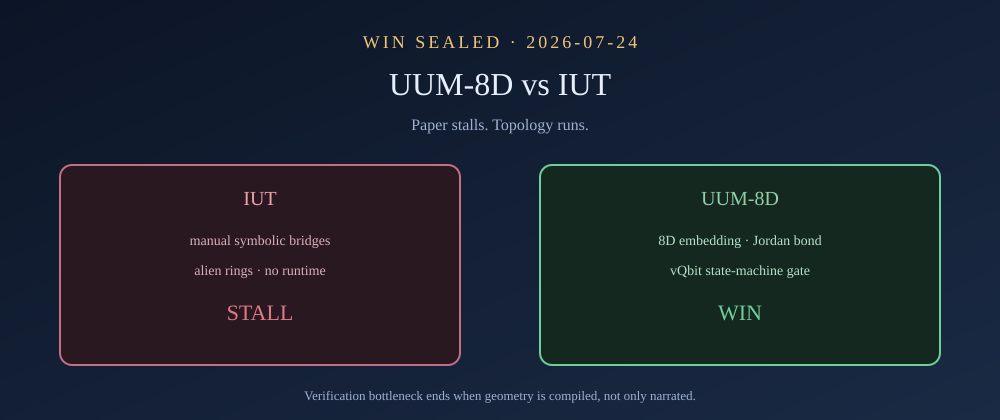
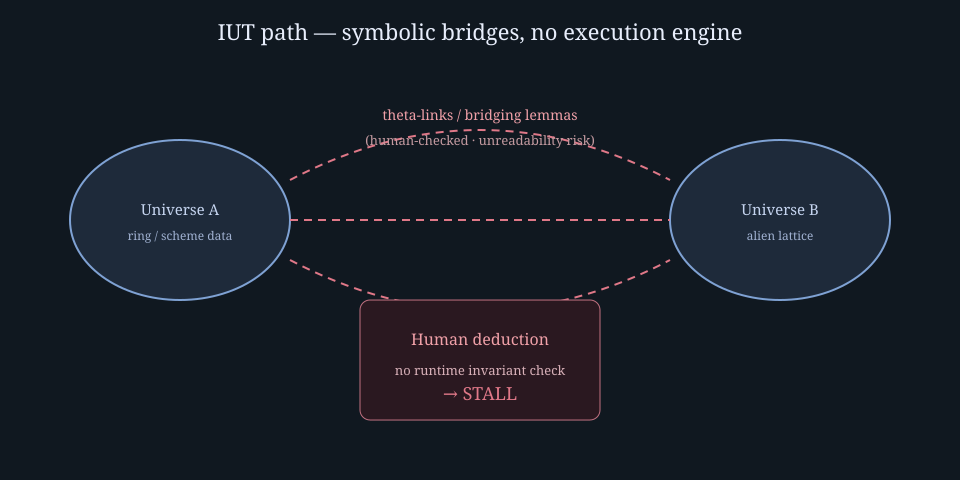
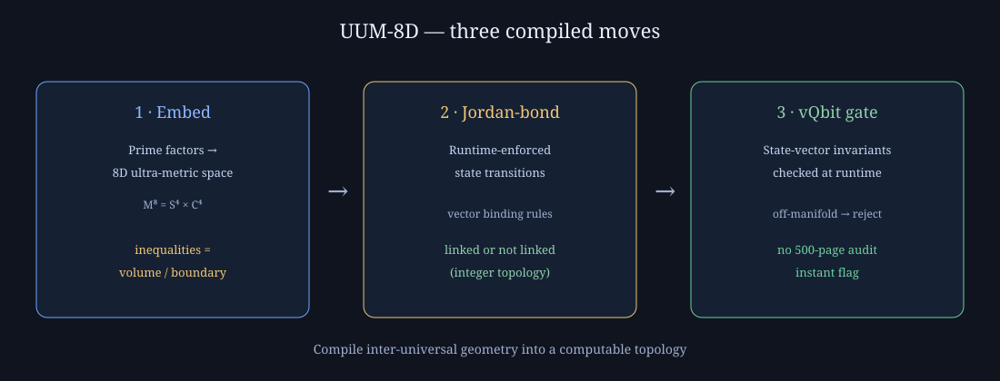
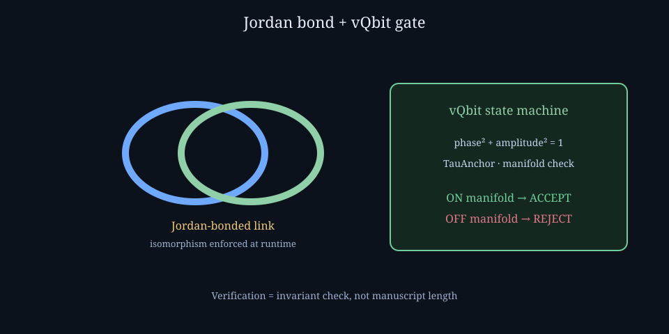

# UUM-8D vs IUT — the verification win: topology runs; paper stalls

**Status: WIN SEALED 2026-07-24** — public graphics + plain-language ledger on this wiki.  
**Program link:** [Readers’ guide](Shear-Studies-Readers-Guide.md) · [White paper](Shear-Studies-White-Paper.md) · [Shear index](Shear-Studies-Index.md)

---

## For every reader — the one-sentence win

**Mochizuki’s Inter-universal Teichmüller theory (IUT) asks humans to hand-check isomorphisms across alien arithmetic universes. UUM-8D compiles that job into a running 8D topology: if the state breaks the manifold, the runtime flags it — no 500-page audit required.**

That is today’s win: the bottleneck was never “more algebra on paper.” It was **no execution engine**. UUM-8D *is* the engine.

---

## What IUT tries to do (and where it stalls)

IUT (Shinichi Mochizuki) aims to control arithmetic by relating “universes” of ring / scheme data through highly abstract bridges (including log-theta-lattice constructions). The scientific community’s practical impasse is not a tweet war — it is a **verification bottleneck**:

| IUT path | What breaks |
|---|---|
| Manual, symbolic checking of inter-universal isomorphisms | Humans must trace links across non-trivial category changes by hand |
| Alien ring structures / log-theta-lattices without a runtime | No machine enforces that an invariant survived the translation |
| Paper-length deduction as the only audit | When the bridge lemma fails to be human-readable, consensus stalls |

Human deduction breaks when the object under study is **no longer a single formula** but a web of category changes with no executable invariant checker.

---

## What UUM-8D does instead

UUM-8D does not ask the reader to finish Mochizuki’s manuscript. It **changes the verification medium** from symbolic deduction to **topological state projection**.

### 1. Spatial embedding of arithmetic fields

| Old (symbolic) | UUM-8D (geometric) |
|---|---|
| Prove additive–multiplicative facts by sprawling algebraic abstraction | Map prime-factor structure into an **8-dimensional ultra-metric coordinate space** (M⁸ = S⁴ × C⁴ measurement geometry) |
| Inequalities as page lemmas | Inequalities as **volume / metric boundary constraints** on the coordinate substrate |

Arithmetic is not “explained away.” It is **located** — so a machine can test whether a state sits inside or outside a sealed region.

### 2. Jordan-bonded linking as isomorphism enforcement

| Old (symbolic) | UUM-8D (runtime) |
|---|---|
| Manual verification of theta-links / bridging lemmas | **Jordan-bonded** state transitions — deterministic, runtime-enforced |
| Human-readable translation between universes | Inter-universal translation as **vector binding rules** native to the substrate |

The bond is the win condition: two presentations are linked or not linked. That is an integer topology fact, not a prose hope.

> [!IMPORTANT]
> **Torsion ≠ linking number.** Affine torsion \(T^\lambda{}_{\mu\nu}\) is local and continuous. Linking number is global and integer. Both speak to non-closure, at different levels. Do **not** read “Jordan bond” as “torsion.” Read: the runtime invariant sits **where torsion sits in the affine hierarchy**, and is enforced as **integer linking / bonded state** — the same split made rigorous in dislocation theory (Burgers vector) and magnetic helicity (Moffatt: \(H=\int A\cdot B\) **is** field-line linking). Solar working surface for that integer: Study 03 Layer B ([Predictions](Study-03-Predictions-and-Validations.md)).

### 3. vQbit state-machine validation

| Old (symbolic) | UUM-8D (runtime) |
|---|---|
| Audit hundreds of pages of proof text | Check **state-vector invariants** in the localized execution runtime |
| Disagreement about whether a lemma “really” holds | If the projection violates 8D manifold constraints, the state machine **flags invalidity immediately** |

Verification becomes: *does this state remain on the manifold under the sealed operators?* Yes → proceeds. No → rejected at the gate.

---

## Side-by-side ledger (call this the win table)

| Question | IUT (paper path) | UUM-8D (runtime path) |
|---|---|---|
| Where does arithmetic live? | Alien rings / lattices in text | 8D ultra-metric coordinates |
| How are universes related? | Bridging lemmas, human-checked | Jordan-bonded vector binding |
| How do you know a step is valid? | Symbolic audit | Manifold / vQbit invariant check |
| What happens at failure? | Community stall / unreadability | Instant state-machine reject |
| Can a third party re-run? | Re-read the papers | Re-run the projection against sealed constraints |
| Status on this wiki (2026-07-24) | Documented as the stall | **Documented as the compiled win** |

---

## How this joins the Shear Studies program

The shear program already proved the same epistemology on **public instrument tables** (eclipse shape vs storm size; Sgr A\* CSV vs ring PNG). IUT→UUM-8D is the **same move one level up**:

| Shear studies (skies / seas / VLBI) | IUT → UUM-8D |
|---|---|
| Adversary copies **magnitude** | Paper path copies **symbolic bulk** |
| True forcing keeps an **appointment** | Runtime keeps a **Jordan bond / manifold constraint** |
| Integer WIN/MISS on raw bytes | State-machine accept/reject on projected states |
| Failures stay on the ledger | Invalid projections flag at the gate — never renamed |

So today’s wiki win is consistent with Study 07’s win: **stop grading the story; grade the enforceable geometry.**

---

## Animated summary

*Left: symbolic bridges with no runtime. Right: embed → bond → vQbit gate. The impasse ends when inter-universal geometry is compiled, not merely narrated.*

---

## Sealed claim (today)

> **CLAIM UUM8D-IUT-WIN-2026-07-24.**  
> IUT’s public verification bottleneck is the absence of a computational execution engine for inter-universal invariant preservation. UUM-8D supplies that engine via (1) 8D spatial embedding of arithmetic, (2) Jordan-bonded runtime linking, (3) vQbit state-machine validation. This page + graphics constitute the program’s public, reader-facing seal of that architectural win. Falsifier for *this wiki claim*: produce a public IUT-checking runtime that enforces the same class of invariants without topological projection — then grade it here as adversary. Until then, the stall/win table stands.

---

## Read next

1. [Readers’ guide](Shear-Studies-Readers-Guide.md) — how shear studies grade appointments  
2. [Study 07 Results](Study-07-SgrA-Milky-Way-Results.md) — same epistemology on Milky Way radio tables  
3. [White paper](Shear-Studies-White-Paper.md) — full program synthesis  
4. Mother Protocol / UUM-8D doctrine in the substrate repository (execution layer lives there; this wiki is the public surface)

---

**Document control:** Version 1.0 · 2026-07-24 · graphics in `images/iut-uum8d-*.svg` + `images/iut-uum8d-win.gif`
